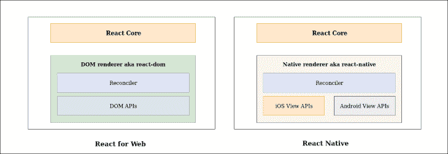

# Fela:为 React 和 React Native - LogRocket 博客编写状态驱动的样式

> 原文：<https://blog.logrocket.com/fela-state-driven-styles-react-react-native/>

React 最初可能是为 web 设计的，但它通常在 web 和 HTML 及 CSS 领域之外使用。React 是作为独立于框架的渲染引擎构建的，这意味着最终渲染的内容取决于您使用的渲染器。

有许多渲染器可以用来提供各种结果。最受欢迎的渲染器之一是 [React Native Renderer](https://reactnative.dev/docs/intro-react) ，它为 Android 或 iOS 生成原生移动元素。

在下图中，您可以看到 React 和 React Native 中各部分的结构以及两者的异同。



[Source](https://blog.atulr.com/static/cc397bd7316079f477f29f36fd058a80/6774c/common-reconciler.png)

在本文中，我们将介绍 [Fela](https://fela.js.org) ，React 的一个新的样式框架，它将帮助您避免样式不一致和繁琐的代码。

*向前跳转:*

## React 的样式

除了呈现器因 React 代码运行的平台而异之外，创建样式本身也会因代码呈现的位置而异。例如，通常不可能在 React 和 React Native 之间共享样式。

出于这个原因，用于 web 的样式库，如 styled-components、Emotion 和 Tailwind CSS，不能在 React Native 中工作。相反，我们必须[创建在 React 本地应用](https://blog.logrocket.com/react-native-styling-tutorial-with-examples/)中工作的样式表。

但是这样做最终会使你的设计系统变得麻烦，并导致样式和代码的不一致，你需要保持这两种风格。这就是新的样式框架 Fela 的用武之地。

## 什么是 Fela？

[Fela](https://fela.js.org/) 是一个独立于任何 JavaScript 框架的样式框架。Fela 渲染器可以注入到你想要的用例中，生成你需要的样式。

本质上，您定义您的样式，为您希望在其上使用样式的每个平台安装和配置特定的渲染器，然后注入样式。

## 为什么您应该使用 Fela

Fela 希望解决三个核心问题，这些正是 Fela 的独特之处。

### 1.默认情况下使样式动态化

风格通常是静态的。这是有意义的，因为定义不会经常改变。然而，与其改变应该使用的定义，为什么不把样式本身变成动态的，这样当状态改变时它们也会改变？

根据 [Fela 文档，](https://fela.js.org/docs/latest/intro/principles)“如果视图是状态的函数，你的 CSS 也应该是，因为它是视图的一部分。”这指的是这样一个事实，即 Fela 中的所有样式定义都是动态的，并且是从组件的状态中派生出来的。

### 2.Fela 是框架不可知的

这大概是图书馆最大的优势。不用考虑 JavaScript 框架也可以编写 Fela 样式。我们将在后面看到这是如何可能的。

### 3.费拉是高性能的

呈现样式和加载样式永远不会成为应用程序的瓶颈。这就是为什么[费拉速度超快的原因](https://fela.js.org/docs/latest/intro/benefits#high-performance)。为什么？因为原子样式很容易被缓存和重用。这个原则，[结合 CSS-in-JS](https://blog.logrocket.com/atomic-css-in-js-vs-utility-first-frameworks/) 的一般优势，意味着 Fela 拥有最佳的速度组合。

让我们探索一下如何实际使用这个库。我们将为一个按钮创建一个样式，既可以在 web 上使用，也可以在 React 本地应用程序中使用。

## 设置 React 项目和 Fela

我们的目标是创建一个网站和一个移动应用程序，使用一个样式源来呈现具有相同外观和感觉的按钮。这个项目由三部分组成，看起来像这样:

```
-- mobile_app
-- web_app
-- shared

```

## 写作基本风格

让我们从在你的`shared`文件夹中写风格开始，这样你就不需要安装包了。我们可以用 JavaScript 编写和定义我们的样式，因为它们被定义为简单的对象或函数。

```
// shared/index.js

export const buttonStyles = (props) => {
    width: props.size,
    padding: '10px',
    backgroundColor: 'black',
    color: 'white',
}

```

如果您想使用伪类为按钮添加一些元素或交互性，可以通过嵌套另一个对象来实现，如下所示:

```
// shared/index.js

export const buttonStyles = (props) => {
    width: props.size,
    padding: '10px',
    backgroundColor: 'black',
    color: 'white',

    ':hover': {
      opacity: '0.8'
    }

    ':before': {
      content: '" "',
      height: '10px',
      width: '10px',
    }
}

```

最后，当我们在一个更小的设备上使用它时，我们也应该给我们的按钮一点改变。为此，我们还可以在媒体查询下添加一些样式，如下所示:

```
// shared/index.js

export const buttonStyles = (props) => {
    // ... previous styles
    '@media (min-height: 540px)': {
      padding: '5px',
    },
}

```

如果你想了解更多关于如何用 Fela 编写样式，以及如何使用高级 CSS 特性，比如选择器、伪元素等。，你可以在 Fela 官方网站上阅读[文章和指南](https://fela.js.org/docs/latest/basics/rules)，它解释了如何通过编写 Fela 样式来实现任何 CSS 特性。

## 在 React web 应用程序中使用样式

要在 React 应用程序中使用定义的样式，您需要在 React 项目中安装以下内容:

```
yarn add fela React-fela

```

我们需要安装特定的渲染器来渲染我们的样式，以便在 web 应用程序中使用。接下来，您需要使用特定的 Fela 提供程序来打包 React 应用程序，该提供程序允许将样式呈现为 CSS:

```
// web_app/App.jsx

import { createRenderer } from 'fela'
import { RendererProvider } from 'react-fela'
import MyApp from './MyApp'

const renderer = createRenderer()

export default () => (
    <RendererProvider renderer={renderer}>
        <MyApp />
    </RendererProvider>
)

```

如果这是在您的 web React 应用程序的根目录中定义的，那么您现在可以在您的组件中使用您的共享样式，如下所示:

```
// web_app/components/App.jsx
import { buttonStyles } from '../../shared'

function Button({ children, size = 16 }) {
    const { css } = useFela({ size })

    return <button className={css(buttonStyles)}>{children}</button>
}

```

就是这样！这将生成通用样式，以便 web 浏览器能够理解它们。

## 在 React 本机应用程序中使用样式

类似于 web，让我们在 react 原生项目中安装 Fela 和 react-fela。此外，还需要安装 React Native 专用的 Fela 包。

```
yarn add fela React-fela fela-native

```

与我们在 React web 应用程序中所做的类似，您需要使用一个专用的渲染器提供程序来打包整个应用程序，如下所示:

```
// mobile_app/App.js
import React from 'react'
import { AppRegistry } from 'react-native'
import { createRenderer } from 'fela-native'
import { RendererProvider } from 'react-fela'
import MyApp from './MyApp'

const renderer = createRenderer()

const App = (props) => (
    <RendererProvider renderer={renderer}>
        <App /> 
    </RendererProvider>
)

AppRegistry.registerComponent('FelaNative', () => App)

```

为了使用我们在 web 应用程序中用于按钮的相同样式，用法非常相似。唯一的区别是样式被附加到按钮组件的 React Native `style`标签，而不是`className`。

```
// mobile_app/components/App.js
import { buttonStyles } from '../../shared'
import { Button } from 'react-native'
import { useFela } from 'react-fela'

function Button({ children, size = 16 }) {
    const { style } = useFela({ size })

    return <Button style={style(buttonStyles)}>{children}</button>
}

```

这将使相同的样式定义不仅反映 web 按钮的样式，还反映 React 本机移动按钮的样式。这只是一个简单的例子，但当涉及到设计系统中复杂的风格定义时，可以跨平台共享并提供一致的品牌外观和感觉，Fela 是强大的。

## 结论

由于不同设备显示内容的方式不同，我们编写应用程序的方式也发生了变化。现在，为不同平台编写应用程序的需求变得更加重要。

幸运的是，技术也已经适应了，所以我们不必为每个平台从头开始开发每个应用程序。使用 Fela 跨多个平台创建样式节省了时间，防止了错误，并提供了一致的品牌。

尽管 Fella 有一些小警告，但我是这个图书馆的忠实粉丝。请在下面的评论中告诉我你的想法！

## [LogRocket](https://lp.logrocket.com/blg/react-native-signup) :即时重现 React 原生应用中的问题。

[](https://lp.logrocket.com/blg/react-native-signup)

[LogRocket](https://lp.logrocket.com/blg/react-native-signup) 是一款 React 原生监控解决方案，可帮助您即时重现问题、确定 bug 的优先级并了解 React 原生应用的性能。

LogRocket 还可以向你展示用户是如何与你的应用程序互动的，从而帮助你提高转化率和产品使用率。LogRocket 的产品分析功能揭示了用户不完成特定流程或不采用新功能的原因。

开始主动监控您的 React 原生应用— [免费试用 LogRocket】。](https://lp.logrocket.com/blg/react-native-signup)