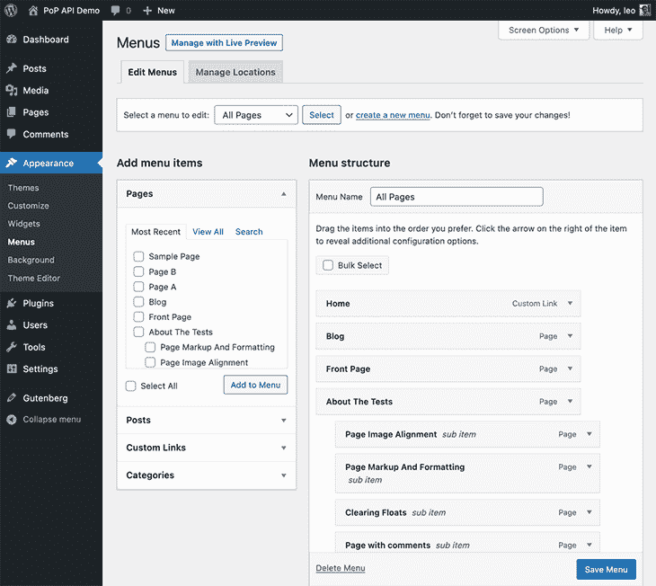
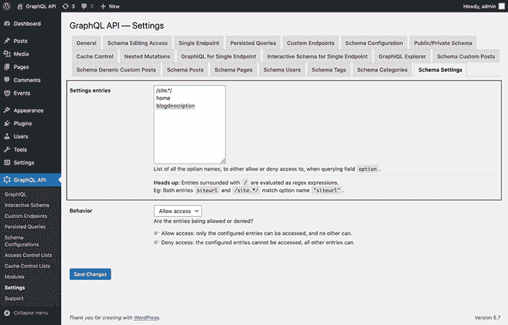
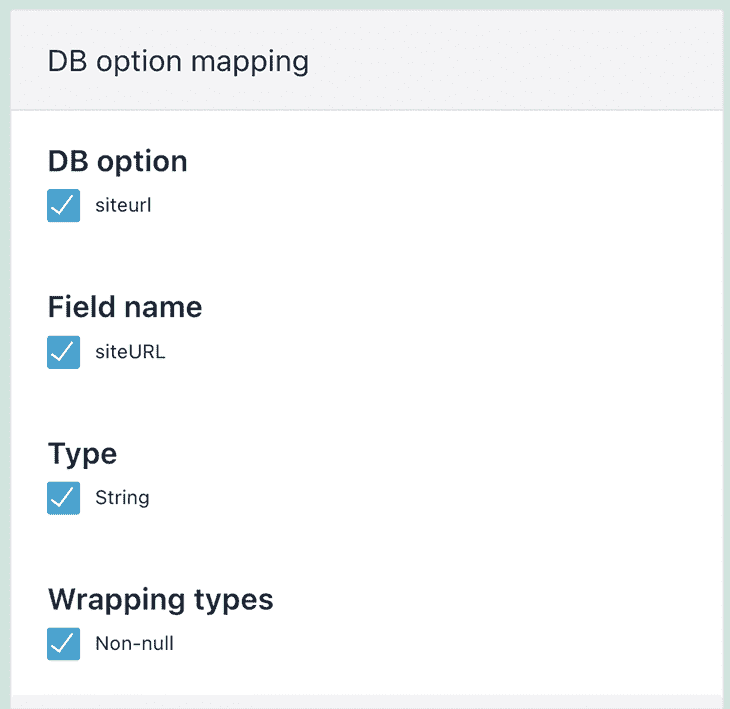

# 用 GraphQL - LogRocket Blog 获取 CMS 中的动态结构化数据

> 原文：<https://blog.logrocket.com/fetching-dynamically-structured-data-cms-graphql/>

GraphQL 是向应用程序提供数据的层，因此它必须服务于应用程序的需求。但是有时 GraphQL 强加了它自己的工作方式，应用程序必须适应 GraphQL 的工作方式。

这种情况在对 CMS 使用 GraphQL 时最为明显，因为 CMS 天生固执己见，GraphQL 可能会覆盖它们的行为。如果我们不依赖于 CMS，而是从头开始构建一个网站，那么我们应该完全控制网站的架构，我们可能愿意为 GraphQL 修改它——这种冲突就不会发生。

在本文中，我们将探索 GraphQL 在数据获取过程中强加其自身前提条件的方式，为什么会发生这种情况，以及我们有哪些选项来解决它。我们将使用 WordPress 作为 CMS 的例子。

## 提取嵌套级别的数据

任何应用程序都可以有包含相同类型子项的实体。例如，一个菜单包含项目，项目可以有子项目，子项目本身可以包含子项目，依此类推。类似地，评论可以有回应，而回应本身也可以有回应。

让我们看看如何在 GraphQL 中使用多级菜单。获取 GraphQL 中的菜单数据包括查询菜单中所有不同级别的项目。

例如，在[这个查询](https://newapi.getpop.org/graphiql/?query=query%20GetMenu%20%7B%0A%20%20menu(id%3A176)%20%7B%0A%20%20%20%20id%0A%20%20%20%20items%20%7B%0A%20%20%20%20%20%20...MenuItemProps%0A%20%20%20%20%20%20children%20%7B%0A%20%20%20%20%20%20%20%20...MenuItemProps%0A%20%20%20%20%20%20%20%20children%20%7B%0A%20%20%20%20%20%20%20%20%20%20...MenuItemProps%0A%20%20%20%20%20%20%20%20%7D%0A%20%20%20%20%20%20%7D%0A%20%20%20%20%7D%0A%20%20%7D%0A%7D%0A%0Afragment%20MenuItemProps%20on%20MenuItem%20%7B%0A%20%20id%0A%20%20label%0A%20%20url%0A%7D)中，菜单有三个级别，我们使用片段`MenuItemProps`为所有级别的所有菜单项获取相同的字段(`id`、`label`和`url`):

```
query GetMenu {
  menu(id: 176) {
    id
    items {
      ...MenuItemProps
      children {
        ...MenuItemProps
        children {
          ...MenuItemProps
        }
      }
    }
  }
}

fragment MenuItemProps on MenuItem {
  id
  label
  url
}

```

可以理解，级别的数量反映在 GraphQL 查询中。因为应用程序中的菜单有三层，所以 GraphQL 查询有三层嵌套。

然而，在 WordPress 中，菜单的创建不是由主题或任何插件预先决定的——相反，它是由网站管理员通过**菜单**屏幕配置的，并存储在数据库中:



这带来了一个问题:当站点管理员通过用户界面向菜单添加额外的级别时，如果这个新级别没有反映在 GraphQL 查询中，它将不会出现在站点中。开发人员必须参与修改代码——向 GraphQL 查询添加额外的级别，重新生成主题的。zip 文件，并在网站上重新安装它。只有这样，新的级别才会显示在查询中。

你可能会猜测，由于不得不做所有这些事情，使用 CMS 的优势几乎消失了。

事实上，WordPress 不仅被开发人员使用，也被非开发人员使用，这些人可能没有意识到为了更新菜单，他们的站点主题需要更新。这违背了直觉，也违背了 CMS 的理念，所以 GraphQL 会在它的主机 WordPress 上强加它自己的工作方式。

让我们来看看解决这个问题的三种可能的方法。

### 创建更大的初始 GraphQL 查询结构

解决这个问题的一个简单方法是最初构建 GraphQL 查询，使它获取比所需更多的级别，这样网站管理员就有空间在以后继续添加级别，而不需要开发人员。

例如，如果应用程序需要三个级别，GraphQL 查询仍然可以提取六个级别的数据:

```
query GetMenu {
  menu(id:176) {
    id
    items {
      ...MenuItemProps
      children {
        ...MenuItemProps
        children {
          ...MenuItemProps
          children {
            ...MenuItemProps
            children {
              ...MenuItemProps
              children {
                ...MenuItemProps
              }
            }
          }
        }
      }
    }
  }
}

fragment MenuItemProps on MenuItem {
  id
  label
  url
}

```

这种解决方案并不是非常完美，但是在大多数情况下都行得通。

### 告诉 GraphQL 迭代子层

更好的解决方案是告诉 GraphQL 继续向下迭代子层，直到不再有子层，也就是说，直到字段`children`为`null`。例如，在使用 PHP 时，函数可以递归地调用自己，直到输入成为基本元素:

```
function filterFieldArgsWithNullValues(array $fieldArgs): array
{
  return array_filter(
    $fieldArgs,
    function (mixed $elem): bool {
      if (is_array($elem)) {
        $filteredElem = $this->filterFieldArgsWithNullValues($elem);
        return count($elem) === count($filteredElem);
      }
      return $elem !== null;
    }
  );
}

```

将这种策略移植到 GraphQL 需要一个递归片段，该片段再次应用于`children`元素:

```
fragment MenuItemProps on MenuItem {
  id
  label
  url
  children {
    ...MenuItemProps
  }
}

```

然而，GraphQL 规范[禁止片段递归](http://spec.graphql.org/June2018/#sec-Fragment-spreads-must-not-form-cycles)，所以这种策略是不可能的。

### 创建自定义指令

另一个解决方案是创建一个自定义指令`@recursive`，它递归地将一个片段应用于一个字段的连接及其子连接，直到到达图中的叶节点:

```
query GetMenu {
  menu(id:176) {
    id
    items @recursive(field: "children") {
      ...MenuItemProps
    }
  }
}

fragment MenuItemProps on MenuItem {
  id
  label
  url
}

```

但是这种解决方案也被 GraphQL 规范所禁止，因为响应的[形状必须与查询的](https://spec.graphql.org/draft/#sec-Overview)形状相匹配，而这将受到`@recursive`指令的影响。

### 放宽查询中嵌套的使用

想到的最后一个解决方案是放松查询中嵌套的使用，创建一个单独的字段`itemDataEntries`，产生一个包含所有菜单数据的结构化`JSONObject`，包括所有级别和子级别，就像在[查询](https://newapi.getpop.org/graphiql/?operationName=GetMenu&query=query%20GetMenu%20%7B%0A%20%20menu(id%3A176)%20%7B%0A%20%20%20%20id%0A%20%20%20%20itemDataEntries%0A%20%20%7D%0A%7D)中所做的那样:

```
query GetMenu {
  menu(id:176) {
    id
    itemDataEntries
  }
}

```

对此查询的响应如下所示:

```
{
  "data": {
    "menu": {
      "id": 176,
      "itemDataEntries": [
        {
          "id": 735,
          "objectID": "6",
          "parentID": null,
          "label": "About The Tests",
          "url": "https://newapi.getpop.org/about/",
          "children": [
            {
              "id": 1451,
              "objectID": "1133",
              "parentID": "735",
              "label": "Page Image Alignment",
              "url": "https://newapi.getpop.org/about/page-image-alignment/",
              "children": []
            },
            {
              "id": 1452,
              "objectID": "1134",
              "parentID": "735",
              "label": "Page Markup And Formatting",
              "url": "https://newapi.getpop.org/about/page-markup-and-formatting/",
              "children": []
            }
          ]
        },
        {
          "id": 739,
          "objectID": "174",
          "parentID": null,
          "label": "Level 1",
          "url": "https://newapi.getpop.org/level-1/",
          "children": [
            {
              "id": 740,
              "objectID": "173",
              "parentID": "739",
              "label": "Level 2",
              "url": "https://newapi.getpop.org/level-1/level-2/",
              "children": [
                {
                  "id": 741,
                  "objectID": "172",
                  "parentID": "740",
                  "label": "Level 3",
                  "url": "https://newapi.getpop.org/level-1/level-2/level-3/",
                  "children": []
                },
                {
                  "id": 1453,
                  "objectID": "747",
                  "parentID": "740",
                  "label": "Level 3a",
                  "url": "https://newapi.getpop.org/level-1/level-2/level-3a/",
                  "children": []
                },
                {
                  "id": 1454,
                  "objectID": "748",
                  "parentID": "740",
                  "label": "Level 3b",
                  "url": "https://newapi.getpop.org/level-1/level-2/level-3b/",
                  "children": []
                }
              ]
            }
          ]
        },
        {
          "id": 742,
          "objectID": "146",
          "parentID": null,
          "label": "Lorem Ipsum",
          "url": "https://newapi.getpop.org/lorem-ipsum/",
          "children": []
        }
      ]
    }
  }
}

```

这种方法具有以下优点:

*   检索的数据完全由用户界面驱动，反映了存储在数据库中的内容
*   因此，在用户向菜单添加任何数量的附加级别后，应用程序都不需要更新

然而，这种方法也有一个明显的缺点:我们失去了 GraphQL 的强类型。我们得到的不是一个带有强类型字段的菜单项——比如将`url`作为`URL`、`label`作为`String`、`objectID`作为`ID`等等——而是一个 GraphQL 工具和客户端无法理解的普通对象，比如 Apollo 或 Relay。因此，我们不会真正充分利用 GraphQL 的优势。

## 将动态元素映射到模式

当我们需要获取由用户界面驱动并存储在数据库中的实体时，我们会遇到另一个问题。例如，WordPress 允许动态创建选项名称的设置菜单，以及由站点管理员或他们选择的主题和插件动态创建的元值。这意味着这些菜单选项和元值不为 GraphQL 服务器所知，也不与 graph QL 服务器共享。

在这一节中，我们将探索两个 GraphQL 服务器如何为 WordPress 传递设置， [WPGraphQL](https://www.wpgraphql.com/) 和 [GraphQL API for WordPress](https://graphql-api.com) 。

### 在 WPGraphQL 中传递设置

WPGraphQL 将设置映射到一个特殊类型`GeneralSettings`下，该类型包含以下字段:

```
# The general setting type
type GeneralSettings {
  # A date format for all date strings.
  dateFormat: String
  # Site tagline.
  description: String
  # This address is used for admin purposes, like new user notification.
  email: String
  # WordPress locale code.
  language: String
  # A day number of the week that the week should start on.
  startOfWeek: Int
  # A time format for all time strings.
  timeFormat: String
  # A city in the same timezone as you.
  timezone: String
  # Site title.
  title: String
  # Site URL.
  url: String
}

```

在这种情况下，WPGraphQL 是固执己见的，已经预先决定了哪些选项足够重要，已经包含在其模式中。如果应用程序需要一个选项，但它不存在—比如说，`homeurl`，它不同于站点 URL —那么开发人员必须扩展模式。

### 用 GraphQL API 为 WordPress 提供设置

WordPress 的 GraphQL API 采用了一种不同的方法:选项本身并没有硬编码在模式中，而是通过一个接收选项名称的`option`字段来访问:

```
type Root {
  option(name: String): AnyScalar
}

```

并非所有选项都要通过 API 公开；网站管理员必须在插件设置中明确地将它们列入安全列表，或者通过它们的全名或者正则表达式:



现在，查询可以获取安全列表中的选项:

```
{
  siteURL: option(name: "home")
  siteName: option(name: "blogname")
  siteDescription: option(name: "blogdescription")
}

```

这种方法不是事先固执己见的。如果应用程序需要额外的选项，它可以作为配置提供给 API，并存储在数据库中，因此不需要修改代码来扩展 GraphQL 模式。

这种方法的缺点是仍然丢失了严格的类型。在 WPGraphQL 的方法中，字段`description`具有类型`String`,`startOfWeek`具有类型`Int`，但是在 WP 方法的 GraphQL API 中，`option`字段总是类型`AnyScalar`，这是一个自定义类型，用于表示所有内置类型(`String`、`Int`、`Float`、`Boolean`和`ID`)。

## 一个可能的解决方案:自动生成 GraphQL API

到目前为止，我们已经看到了上述两种不同用例的解决方案有几个缺点:

*   需要产生一个更大的查询，以便为将来做计划
*   GraphQL 模式是固执己见的，预先决定哪些字段是可用的
*   GraphQL 模式没有强类型

避免这些缺点的解决方案是从不同的输入中自动生成 GraphQL API，包括站点管理员输入到 CMS 中的数据。有了这样的方法，就不需要雇佣开发人员来扩展模式，我们也不会失去 GraphQL 严格类型化的好处。

这会是什么样子？关于暴露设置的例子，GraphQL 服务器将允许我们通过一些配置页面选择必须在 API 中暴露的选项，并请求定义它们的类型。有了这个输入，GraphQL 服务器就可以生成 GraphQL API 模式，为每个选择的选项添加一个字段，这将是预期的类型。



然而，这种解决方案不容易实现。

### SDL 第一 GraphQL 服务器

特别是当使用 [SDL 优先的 GraphQL 服务器](https://blog.logrocket.com/code-first-vs-schema-first-development-graphql/)时，我们必须通过 SDL 提供 GraphQL 模式，这与让服务器自动生成模式的想法相冲突。对于代码优先的服务器来说，不存在固有的冲突，但是实现可能并不简单，因为我们需要满足我们正在使用的 CMS 的特性。

我们的最佳选择是 GraphQL 服务器已经实现了这种方法，为特定的 CMS 进行了定制。例如，因为 WPGraphQL 和用于 WordPress 的 GraphQL API 都是为 WordPress 定制的，它们可以很好地自动生成模式，考虑来自 CMS 的所有输入，包括用户提供的菜单和来自 DB 的选项。

### 基于 JavaScript 的服务器

对于基于 JS 的服务器，已经有自动生成 GraphQL 模式的服务，比如 [PostGraphile](https://www.graphile.org/postgraphile/) 和 [Hasura](https://hasura.io/) 。但是，这些服务使用 DB 作为输入来生成 GraphQL 模式(PostgreSQL 用于 PostGraphilePostgreSQL 和一些其他的 Hasura)，而不是 CMS。因此，一些特定 CMS 提供的定制特性，比如配置暴露什么选项，或者嵌套注释可以跨越多少层，将需要定制开发。

当 API 打算由第三方使用时，那么自动生成 GraphQL 模式应该小心谨慎，一次处理一个特定的特性。这是因为这种方法[可能不会产生一个设计良好的 API](https://wundergraph.com/blog/tight_coupling_as_a_service#on-good-api-design) ，这可能会让你的用户感到困惑，更重要的是，会暴露使 API 不安全的信息。我们必须确保包含管理端信息(比如表列名)的输入数据不会泄露给面向公众的层。

## 结论

我们研究了两种不同的情况，在这两种情况下，GraphQL 强加了一种可能与应用程序的工作方式相反的工作方式，特别是那些基于 CMS(如 WordPress)的应用程序。

第一种情况涉及菜单项和注释的嵌套。最好的处理方法是为菜单项和注释的 GraphQL 查询添加额外的嵌套层，即使最初并不需要这些额外的层，以便允许站点的管理员从用户界面中增加这个数量，而不必雇用开发人员来更新代码和部署更改。

第二种情况涉及查询动态创建的数据，就像设置和元值一样。我们探讨了 WPGraphQL 和 WP 的 GraphQL API 实现的两种方法，这两种方法都有缺点。最好的解决方案是将它们结合起来，让 GraphQL 模式从站点管理员通过用户界面提供的配置中动态生成。

## 监控生产中失败和缓慢的 GraphQL 请求

虽然 GraphQL 有一些调试请求和响应的特性，但确保 GraphQL 可靠地为您的生产应用程序提供资源是一件比较困难的事情。如果您对确保对后端或第三方服务的网络请求成功感兴趣，

[try LogRocket](https://lp.logrocket.com/blg/graphql-signup)

.

[](https://lp.logrocket.com/blg/graphql-signup)[https://logrocket.com/signup/](https://lp.logrocket.com/blg/graphql-signup)

LogRocket 就像是网络和移动应用的 DVR，记录下你网站上发生的每一件事。您可以汇总并报告有问题的 GraphQL 请求，以快速了解根本原因，而不是猜测问题发生的原因。此外，您可以跟踪 Apollo 客户机状态并检查 GraphQL 查询的键值对。

LogRocket 检测您的应用程序以记录基线性能计时，如页面加载时间、到达第一个字节的时间、慢速网络请求，还记录 Redux、NgRx 和 Vuex 操作/状态。

[Start monitoring for free](https://lp.logrocket.com/blg/graphql-signup)

.