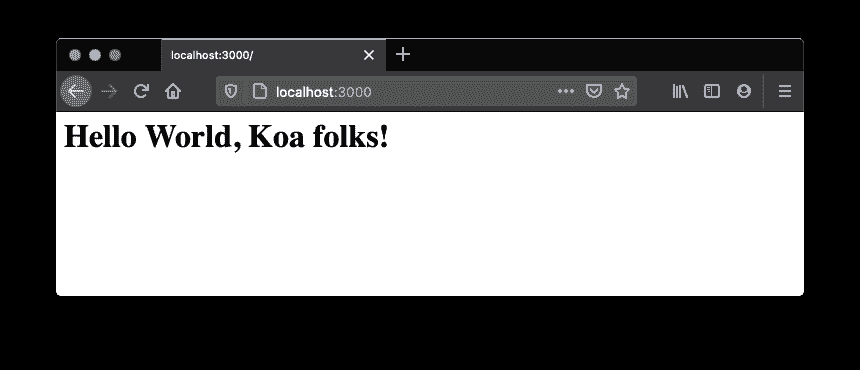
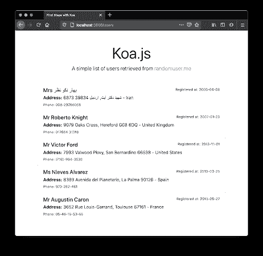

# Koa.js - LogRocket 博客的第一步

> 原文：<https://blog.logrocket.com/first-steps-with-koa-js/>

说到 web 开发，您可能会选择一个框架来启动和运行您的后端 API。除了 Node 具有用于构建 web 服务器的良好内置机制之外，另一方面，框架通过提供良好的特性(如中间件、路由机制等)来促进这项工作。

在 Node.js 领域的网络开发方面，Express 是目前为止[的领导者](https://www.npmtrends.com/express-vs-koa-vs-restify-vs-fastify-vs-hapi-vs-sails)。它也是最古老的，创建于 2009 年，这可能是它成熟到如此受社区喜爱的原因之一。

Koa.js 是另一个获得越来越多空间的伟大选择。但他们实际上不是竞争对手。Koa 是由 Express 后面的同一个团队设计的，这是前端社区的普遍趋势，就拿 [Deno](https://deno.land/) 来说吧，它的创作者就是 Node 后面的同一个 mind。

就编码而言，Koa 被创建得更小、更快、更有表现力。谈到 web APIs 的开发，Express 很棒，但是它缺乏一点表现力，仍然会导致我们提交一些可以避免的样板代码，正如我们几分钟后将在实践中看到的那样。

它的设计重点是异步函数，使它们更简单，这样您就可以更容易地操纵回调和处理代码流中的错误。

在这篇文章的最后，我们将有一个应用程序，使用框架的一些好的特性从基于 Koa 的 API 中检索信息。模拟数据将从名为[https://randomuser.me/](https://randomuser.me/)的虚假数据生成网站中检索。所以，让我们开始吧！

## 设置和配置

像 Node universe 中的其他东西一样，设置起来既快又容易。确保您已经安装了[节点](https://nodejs.org/en/)，选择一个您喜欢的文件夹来开发这个示例，并在其中运行以下命令:

```
npm init
npm i koa koa-router koa-ejs axios

```

填写命令行将向您询问的有关节点项目的信息。我把它们都留为空白，但是你想说什么都可以。

前三个依赖项与 Koa 相关，是框架核心的第一个依赖项。

koa 路由器相当于快速路由系统。是的，它包含在需要单独添加到 package.json 的第二个包中。

Koa-ejs 是额外奖励。它是一个 Koa 中间件，增加了对 [ejs](https://github.com/mde/ejs) 项目所有特性的支持。这样，我们可以在后端 web 应用程序中嵌入 JavaScript 模板，而不需要客户端项目。换句话说，它呈现了我们网页的 HTML 输出。

最后，著名的 Axios 库在这里，因为我们需要调用一个外部 API，randomuser.me。

现在，在项目的根目录下创建一个新的 index.js 文件。将以下代码放入其中:

```
const koa = require("koa");
const path = require("path");
const render = require("koa-ejs");
const koaRouter = require("koa-router");
const axios = require("axios");

const app = new koa();
const router = new koaRouter();

render(app, {
    root: path.join(__dirname, "views"),
    layout: "index",
    viewExt: "html",
});

router.get("hello", "/", (ctx) => {
    ctx.body = "<h1>Hello World, Koa folks!</h1>";
});

router.get("users", "/users", async (ctx) => {
    const result = await axios.get("https://randomuser.me/api?results=5");

    return ctx.render("index", {
        users: result.data.results,
    });
});

app.use(router.routes()).use(router.allowedMethods());

const PORT = process.env.PORT || 3000;
app.listen(PORT, () => console.log(`running on port ${PORT}`));

```

清单的前几行与我们刚刚安装的依赖项的导入相关。主 Koa 及其路由器对象都需要通过 new 操作符进行实例化。

来自 koa-ejs 的 render 函数在这里描述了我们的 ejs 模板系统的参数(仍有待构建)。它接收的第一个参数是最近创建的 Koa app 对象，第二个参数是另一个对象，其中包含的信息包括放置 ejs 模板的根文件夹、布局主文件以及这些文件的扩展名(HTML)。这是最基本的配置，但是您可以在这里找到其他可用的参数。

接下来，我们创建两个端点。第一个只是映射到根端点的简单 Hello World，而第二个稍微复杂一点，返回附加到模板输入的随机用户列表。

注意在 Koa 和 Express 上路由端点是多么的相似。第一个参数要求端点的规范名称，第二个参数要求映射到该端点的路径字符串。主要区别在于处理响应处理的回调函数(第三个参数),它由 ctx 对象 Koa 上下文操纵。

与 Express 不同，Koa 上下文将节点的请求和响应对象包含在一个单独的对象中，这简化了方法。由于它们被如此频繁地使用，树袋熊的创造者们发现最好是粘在一起:

```
app.use(async ctx => {
  ctx; // This is the context
  ctx.request; // This is a Koa request
  ctx.response; // This is a Koa response
});
```

但是，没有必要总是单独调用请求或响应对象来访问它们的属性。例如，如果您想要访问请求的正文，只需直接这样做:

```
ctx.body; // It delegates to Koa’s ctx.request
```

为了方便起见，Koa 神奇地将任何属性的访问委托给它们各自的对等物。

Koa 还允许您决定是否要使用异步函数。我们以第二个端点为例。注意，我们在回调函数中调用一个外部 URL 来获取随机用户数组，并将其直接发送到我们的 koa-ejs 模板(我们将在几分钟内构建它)。

与基于承诺的 Express 方法相比，这是一种更干净的方法。对于 Express，我们会有这样的内容:

```
app.get('/users', (req, res, next) => {
  axios.get("https://randomuser.me/api?results=5").then((result) => {
    res.status(200).json(result.data.results);
  }).catch((err) => next(err));
});
```

乍一看可能没问题，因为这个例子很简单。然而，如果您的开发变得更加复杂，比如添加了从数据库中检索数据的功能，事情就会变得棘手:

```
app.get('/users', (req, res, next) => {
  MyDatabaseObj.findByPk(myPk).then(data => 
    if (!data) {
      return res.status(404).send({});
    }

    axios.get("https://randomuser.me/api?results=5&id=" + data.id).then((result) => {
      res.status(200).json(result.data.results);
    }).catch((err) => next(err));    
  );
});

```

这种风格会导致开发人员嵌套许多代码块，很难维护。

回到 index.js 代码，它的其余部分与您使用 Express 所做的非常相似。Koa 中间件必须通过`use()`方法进行陈述。要启动并运行服务器，只需通过`listen()`方法启动它。很像吧？

## 模板

现在我们已经完成了 API 的创建，让我们继续学习 ejs 模板。首先，您需要在项目的根目录下创建一个名为 views 的新文件夹。并在其中创建名为 index.html 的主文件。

由于将模板系统分解成最小部分不是本文的重点，我们将坚持使用单个文件作为模板。这是您应该添加到其中的代码:

```
<html>
    <head>
        <title>First Steps with Koa</title>
        <link
            rel="stylesheet"
            href="https://stackpath.bootstrapcdn.com/bootstrap/4.5.2/css/bootstrap.min.css"
        />
    </head>
    <body>
        <div class="container">
            <div class="pricing-header px-3 py-3 pt-md-5 pb-md-4 mx-auto text-center">
                <h1 class="display-4">Koa.js</h1>
                <p class="lead">
                    A simple list of users retrieved from
                    <a href="https://randomuser.me/">randomuser.me</a>
                </p>
            </div>

            <div class="list-group">
                <% users.forEach( function(user) { %>
                <div class="list-group-item">
                    <div class="d-flex w-100 justify-content-between">
                        <h5 class="mb-1">
                            <%= user.name.title %> <%= user.name.first %> <%= user.name.last
                            %>
                        </h5>
                        <small
                            >Registered at: <%= new
                            Date(user.registered.date).toISOString().split('T')[0] %></small
                        >
                    </div>
                    <p class="mb-1">
                        <strong>Address:</strong>
                        <%= user.location.street.number %> <%= user.location.street.name
                        %>, <%= user.location.city %> <%= user.location.postcode %> - <%=
                        user.location.country %>
                    </p>
                    <small>Phone: <%= user.phone %></small>
                </div>
                <% }); %>
            </div>
        </div>
    </body>
</html>

```

请注意，这是普通的 HTML，所以这里没有什么新内容。就在开头，在 head 标签中，我们添加了 [Bootstrap 的](https://www.bootstrapcdn.com/) CSS 样式表。这将有助于在我们的示例页面中输入样式。

koa-ejs 库利用表达式来区分 HTML 和 JavaScript 代码。

每当您想要打开一个新的 JavaScript 代码块时，用`<% ... %>`操作符包装代码。否则，如果您想将一些值直接打印到 HTML 中，请使用`<%= … %>`操作符。请记住，像任何其他 JavaScript 代码块一样，您的代码块需要正确地打开和关闭，就像您通常在 JavaScript 代码文件中所做的那样。

继续下去，看看我们正在做的迭代。这是普通的 JavaScript 代码，非常简单。

现在，让我们来测试一下。在控制台上发出`node index.js`命令运行应用程序，并在浏览器上键入 [http://localhost:3000/](http://localhost:3000/) 地址。这将产生以下输出:



然后，将地址改为[http://localhost:3000/users](http://localhost:3000/users)。每次刷新浏览器时，您都会看到用户列表发生变化。

## 
那错误呢？

错误是 web 应用程序中非常重要的一部分。尽管您可以在每个端点上单独处理它们，就像 Express 一样，Koa 也允许您创建一个集中式中间件来处理您的应用程序错误。

请看下面的代码片段:

```
app.use(async (ctx, next) => {
    try {
        await next();
    } catch (err) {
        console.error(err);
        ctx.body = "Ops, something wrong happened:<br>" + err.message;
    }
});
```

这个中间件必须放在所有其他中间件之前，这样您就可以获取并记录您的应用程序可能面临的任何类型的错误，包括与其他中间件相关的错误。

如果您有多个 JavaScript 文件，其中映射了端点，那么您可以将这个中间件集中在一个地方，并将其导出到所有这些文件。

## 日志呢？

是的，Koa 还有另一个包，它为开发和调试处理更细粒度的日志机制。

为此，您需要首先安装适当的依赖项:

```
npm i koa-logger
```

并将以下内容添加到 index.js 中:

```
// At the beginning of the file
const Logger = require("koa-logger");

...

app.use(Logger())
    .use(router.routes())
    .use(router.allowedMethods());
```

确保`Logger`中间件也是第一个添加的，否则，Koa 不会监听来自您的路由和 HTTP 调用的日志。

当您重新启动应用程序并再次访问端点时，您可能会看到类似以下内容的日志:


## 结论

这只是简单介绍了 Koa.js 的强大功能，以及它如何让代码组织变得更加清晰。要了解它的更多好处，可以使用常见的框架，如用于数据库处理的 Sequelize、用于测试的 Jasmine 等。是必须的，或者你可以测试它是否包含在你当前的项目中。只要创造一个岔口，并去争取它！

Koa 还提供了对一系列附加特性的支持，比如 CSRF 和 JWT (JSON Web Tokens)、访问日志、字符集转换、缓存、缩小器和压缩器等等。请务必参考官方的 [GitHub 项目](https://github.com/koajs)以获得更多相关信息。祝你好运！

## 您是否添加了新的 JS 库来提高性能或构建新特性？如果他们反其道而行之呢？

毫无疑问，前端变得越来越复杂。当您向应用程序添加新的 JavaScript 库和其他依赖项时，您将需要更多的可见性，以确保您的用户不会遇到未知的问题。

LogRocket 是一个前端应用程序监控解决方案，可以让您回放 JavaScript 错误，就像它们发生在您自己的浏览器中一样，这样您就可以更有效地对错误做出反应。

[](https://lp.logrocket.com/blg/javascript-signup)[https://logrocket.com/signup/](https://lp.logrocket.com/blg/javascript-signup)

[LogRocket](https://lp.logrocket.com/blg/javascript-signup) 可以与任何应用程序完美配合，不管是什么框架，并且有插件可以记录来自 Redux、Vuex 和@ngrx/store 的额外上下文。您可以汇总并报告问题发生时应用程序的状态，而不是猜测问题发生的原因。LogRocket 还可以监控应用的性能，报告客户端 CPU 负载、客户端内存使用等指标。

自信地构建— [开始免费监控](https://lp.logrocket.com/blg/javascript-signup)。