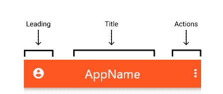
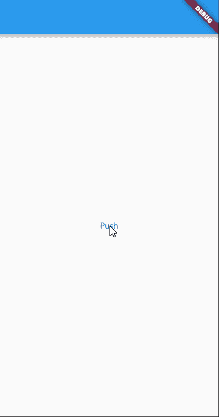

# 在 Flutter 中定制 AppBar:示例概述

> 原文：<https://blog.logrocket.com/flutter-appbar-tutorial/>

应用程序栏是各种应用程序中最常用的组件之一。它可以用来放置搜索字段、在页面间导航的按钮，或者只是页面的标题。由于它是一个如此常用的组件，Flutter 为此功能提供了一个专用的小部件，名为 [AppBar](https://api.flutter.dev/flutter/material/AppBar-class.html) 。

在本教程中，我们将通过一些实际例子向您展示如何在 Flutter 应用程序中自定义 AppBar。

以下是我们将要介绍的内容:

## Flutter 中的 AppBar 是什么？

Flutter AppBar 是根据[材料设计](https://flutter.dev/docs/development/ui/widgets/material)指南构建的 app 组件。它通常放置在屏幕的顶部，并且能够在其布局中包含其他小部件。应用程序栏通常显示商标信息，如徽标和标题，并且通常包含按钮或其他用户交互点。

下面是默认 AppBar 在 Flutter 中的样子:

```
// Mostly, AppBar is used inside a Scaffold widget.
Scaffold(
  appBar: AppBar(),
),

```


很空白，对吧？让我们根据自己的喜好进行定制。

## 应用程序栏布局

在 Flutter 中，AppBar 的布局主要由三个组件组成:`leading`、`title`和`actions`。`leading`放在 AppBar 最左边的位置；`title`和`actions`出现在它的右边。



### `leading`

接受一个小部件，可以分配任何东西——文本、图标，甚至一行中的多个小部件。

```
AppBar(
  leading: Icon(Icons.account_circle_rounded),
),

```


您可以控制`leading`的宽度:

```
AppBar(
  leading: Icon(Icons.account_circle_rounded),
  leadingWidth: 100, // default is 56
),

```


如果没有提供`leading`，AppBar 会自动为我们暗示。示例包括返回上一页的导航箭头或打开抽屉的菜单图标。

当前一条路线可用时，导航箭头会自动出现。

```
class HomePage extends StatelessWidget {
  @override
  Widget build(BuildContext context) {
    return Scaffold(
      body: Center(
        child: TextButton(
          child: Text('Push'),
          onPressed: () => Navigator.push(context, MaterialPageRoute(
            builder: (context) {
              return SecondPage();
            },
          )),
        ),
      ),
    );
  }
}

class SecondPage extends StatelessWidget {
  @override
  Widget build(BuildContext context) {
    return Scaffold(
      appBar: AppBar(),
    );
  }
}

```



当我们给`Scaffold`添加一个`Drawer`时，一个菜单图标被分配给`leading`来打开抽屉。

```
class HomePage extends StatelessWidget {
  @override
  Widget build(BuildContext context) {
    return Scaffold(
      appBar: AppBar(),
      drawer: Drawer(),
    );
  }
}

```


如果需要，可以通过将`automaticallyImplyLeading`设为假来防止这种行为。

```
AppBar(
  automaticallyImplyLeading: false, // simple as that!
),

```

### `title`

顾名思义，它主要用于显示标题，如应用程序标题或页面标题。

```
AppBar(
  title: Text('Profile Page'),
),

```


但是您并不局限于此，因为`title`也使用了一个小部件。你可以用它来显示图标、图像、形状，或者使用布局小部件如`row`和`column`来显示它们的任意组合。

这里有一个例子:

```
AppBar(
  title: Container(
    width: 40,
    child: Image.network(url),
  ),
),

```


根据材质指南，默认情况下，`title`与应用栏左侧对齐。您可以将其更改为居中对齐:

```
AppBar(
  title: Container(
    width: 40,
    child: Image.network(url),
  ),
  centerTitle: true, // like this!
),

```


### `actions`

`actions`是排列在 AppBar 右侧的小部件列表。我们通常在应用程序中看到它们被用作触发下拉菜单、个人资料头像等的按钮。

```
AppBar(
  actions: [
    Icon(Icons.more_vert),
  ],
),

```


让我们向列表中再添加一个小部件:

```
AppBar(
  actions: [
    Container(
      width: 30,
      child: Image.asset(
        'assets/images/profile_pic.png', 
      ),
    ),
    Icon(Icons.more_vert),
  ],
),

```

## 在 Flutter 中自定义 AppBar

现在我们已经熟悉了 AppBar 的布局，让我们通过使用主题化选项将定制提升到一个新的层次。AppBar 包含各种属性，包括颜色、大小、图标主题、文本主题等等。

### 背景颜色

下面的代码将 AppBar 的背景色更改为深橙色。添加`500`以访问颜色的特定色调，`900`为最暗，`50`为最亮。

```
AppBar(
  backgroundColor: Colors.deepOrange[500],
),

```


### 图标主题

下面的代码将图标的颜色改为绿色，大小改为`36`:

```
AppBar(
  actionsIconTheme: IconThemeData(color: Colors.green, size: 36),
),

```


### 文本主题

假设您想要将文本颜色更改为琥珀色，带有较浅的阴影`200`，并将字体大小设置为`24`:

```
AppBar(
  textTheme: TextTheme(
    headline6: TextStyle( // headline6 is used for setting title's theme
      color: Colors.amber[200],
      fontSize: 24,
    ),
  ),
),

```


### 海拔

如果你想给 AppBar 一点提升，可以用`elevation`。下面的代码将 AppBar 的高度增加到`15`。

```
AppBar(
  elevation: 15,
),

```


请注意，AppBar 被抬起，阴影跨越了更大的区域。

### 阴影颜色

你甚至可以改变阴影的颜色。下面的代码将 AppBar 的阴影颜色改为`orangeAccent`。

```
AppBar(
  shadowColor: Colors.orangeAccent,
),

```


很酷，对吧？

### 工具栏高度和不透明度

最后，我们有工具栏属性。工具栏由文本、图标、按钮和前景中的任何东西组成，除了像`Container`和`Image`这样的小部件。

若要更改 AppBar 工具栏项目的高度和不透明度:

```
AppBar(
  toolbarHeight: 100, // default is 56
  toolbarOpacity: 0.5,
),

```


## 结论

如果你已经做到了这一步，你现在应该明白:

*   AppBar 是什么以及如何在 Flutter 中使用它
*   AppBar 的布局(`leading`、`title`、`actions`)
*   如何自定义 AppBar 的布局和添加小部件
*   如何主题化 AppBar 的图标、文本、背景、高度、阴影颜色和工具栏

所以现在我们有了！关于 Flutter 的 AppBar 所提供的一切的完整演练。我希望这篇文章能帮助你在未来所有的 Flutter 应用程序中创建漂亮的 AppBars。

## 使用 [LogRocket](https://lp.logrocket.com/blg/signup) 消除传统错误报告的干扰

[](https://lp.logrocket.com/blg/signup)

[LogRocket](https://lp.logrocket.com/blg/signup) 是一个数字体验分析解决方案，它可以保护您免受数百个假阳性错误警报的影响，只针对几个真正重要的项目。LogRocket 会告诉您应用程序中实际影响用户的最具影响力的 bug 和 UX 问题。

然后，使用具有深层技术遥测的会话重放来确切地查看用户看到了什么以及是什么导致了问题，就像你在他们身后看一样。

LogRocket 自动聚合客户端错误、JS 异常、前端性能指标和用户交互。然后 LogRocket 使用机器学习来告诉你哪些问题正在影响大多数用户，并提供你需要修复它的上下文。

关注重要的 bug—[今天就试试 LogRocket】。](https://lp.logrocket.com/blg/signup-issue-free)