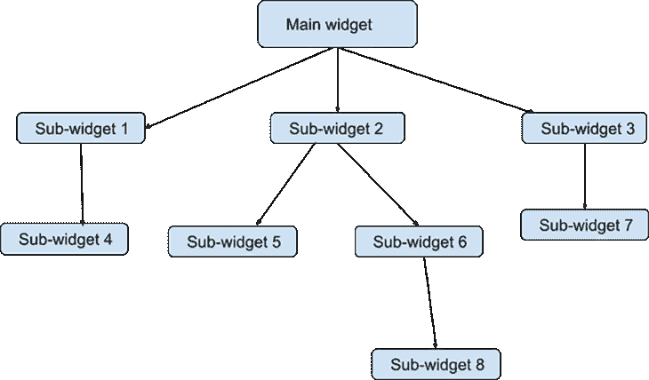
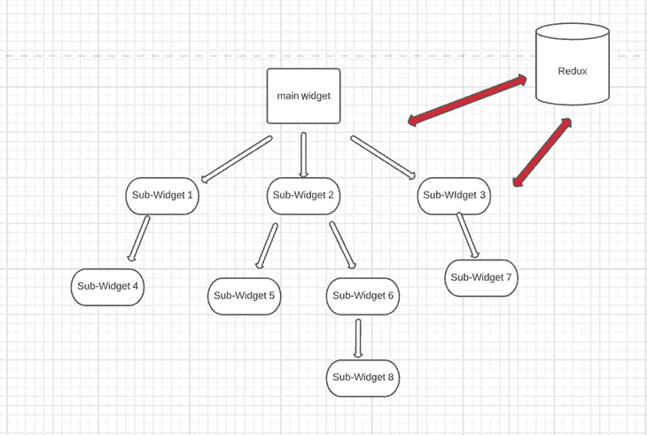
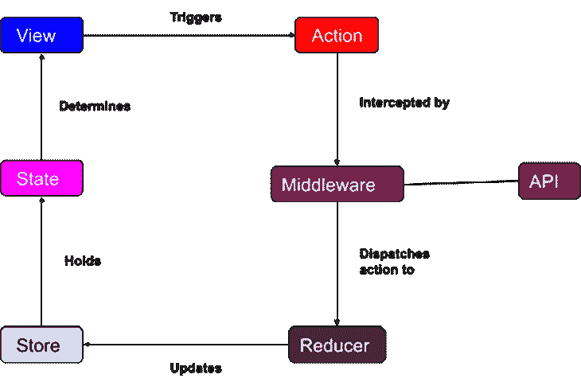

# Flutter Redux:带示例的完整教程

> 原文：<https://blog.logrocket.com/flutter-redux-complete-tutorial-with-examples/>

在任何典型的应用程序中，包括 Flutter 应用程序，在一个类内或多个类之间总是有数据传输。一个类或函数生成数据供自己或另一个类或函数使用。数据很可能通过构造函数从一个小部件传递到另一个小部件。

有时，在数据最终到达目的地部件之前，您可能必须跨越几层部件来传递数据。在这种情况下，中间的小部件层不需要这些数据，而是充当将数据传输到需要数据的小部件的工具。

这是一种在应用程序中管理数据的非常低效的技术，尤其是在大规模的情况下。它会产生大量的样板代码，并可能导致应用程序的性能下降。

本文将探讨颤振应用程序状态管理及其一些技术。我们还将深入探讨如何使用 Redux 在我们的 Flutter 应用程序中有效地管理数据。

## Redux 是什么？

[Redux](https://blog.logrocket.com/redux-isnt-dead/) 是一个状态管理架构库，它成功地以重复的方式跨小部件分发数据。它通过单向数据流管理应用程序的状态。让我们来看看下图:



在这个例子中，在子窗口小部件 8 中需要在主窗口小部件中生成的数据。通常，该数据通过子窗口小部件 2 传递到子窗口小部件 6，然后最终到达子窗口小部件 8。对于需要在层次结构中更高层的任何小部件的状态中生成或保存数据的小部件来说，情况也是如此。

使用 Redux，您可以构建您的应用程序，以便在位于中央的存储中提取状态。任何需要数据的小部件都可以访问这个集中存储中的数据，而不需要通过树中的其他小部件链。



任何需要在 Redux store 管理的状态下添加、修改或检索数据的小部件都必须使用适当的参数来请求它。

同样，对于状态的每一次更改，依赖的小部件通过用户界面或任何其他配置的方式对更改做出响应。

## 为什么状态管理很重要？

在有许多小部件的中型或大型应用程序中，当一个子小部件需要数据时，通常从`main.dart`文件中管理数据。

这些数据可以作为参数通过小部件的构造器分发，直到数据到达接收小部件，但是正如我们在介绍中讨论的，这可能会导致通过不需要这些数据的小部件的数据传输链变长。

通过构造函数传递数据不仅麻烦而且困难，还会影响应用程序的性能。这是因为当您管理主小部件(或任何根小部件)中的数据时，只要它的任何子小部件发生变化，整个小部件树就会重新构建。您只想在需要更改数据的小部件中运行`build`方法。

## 作为真理单一来源的还原

在您的应用程序中应该只有一个信息存储。这不仅有助于调试，而且每次应用程序中的数据发生变化时，您都能够更容易地检测到数据在哪里发生了变化以及发生变化的原因。

### 不变

应用程序的状态应该是不可变的，并且只能通过读取来访问。这部分意味着，如果您想要更改一个状态中的值，您必须用包含新值的新状态完全替换该状态。

这有助于保护存储，并且只允许通过动作来改变状态。它还支持应用程序中的透明性，因为您总是可以检测到状态变化的原因以及导致这些变化的对象。

### 功能应该是状态变化

状态的改变只能通过函数来实现。这些函数称为 reducers，是唯一允许对应用程序状态进行更改的实体。

* * *

### 更多来自 LogRocket 的精彩文章:

* * *

```
@immutable
class AppState{
  final value;
  AppState(this.value);
}

enum Actions {Add, Subtract};

AppState reducer(AppState previousState, action){
  if(action == Actions.Add){
    return new AppState(previousState.value +  1);
  }
  if(action == Actions.Subtract){
    return new AppState(previousState.value -  1);
  }
  return previousState;
}
```

在上面的代码中，`AppState`是一个不可变的类，它保存了`value`变量的状态。

该状态下允许的动作是`Add`和`Subtract`。

对状态的修改是通过`reducer`函数完成的，该函数接收状态，并对状态执行动作。

## 颤振 Redux 架构

### 商店

这是应用程序状态存在的中心位置。该存储在每个给定的时间保存关于整个应用程序状态或任何其他单个状态的信息。

```
final Store<AppState> store = Store<AppState>(
reducer, initialState: AppState.initialState()
);
```

`reducer`是一个用新状态更新存储的函数。它接收状态和动作作为参数，并根据动作更新状态。

回想一下，状态是不可变的，并且通过创建新的状态来更新。reducer 是对状态进行更新的唯一方式。

Flutter 使用继承的小部件来操作商店。这些继承的小部件包括:

*   `StoreProvider`:这个小部件将商店注入到应用程序的小部件树中

    ```
    class MyApp extends StatelessWidget {   @override  Widget build(BuildContext context) {       ...     return StoreProvider<AppState>(      store: store,      child: MaterialApp(        title: 'Flutter Demo',        theme: ThemeData.dark(),        home: StoreBuilder<AppState>(         ...        ),       ),    );  } }
    ```

*   `StoreBuilder`:这监听整个商店，并在每次更新时重建整个部件树；它从`StoreProvider`和`StoreConnector`T3 接收存储
*   `StoreConnector`:这是一个用来代替`StoreBuilder`的小工具。它从`StoreProvider`接收存储，从我们的存储中读取数据，然后将其发送给它的`builder`函数。然后，`builder`函数会在数据发生变化时重新构建小部件

    ```
    class MyHomePage extends StatelessWidget{  final Store<AppState> store;   MyHomePage(this.store);   @override  Widget build(BuildContext context){     return Scaffold(      appBar: AppBar(        title: Text('Redux Items'),      ),      body: StoreConnector<AppState, Model>(        builder: (BuildContext context, Model model) {    ...   }  } }
    ```

### 什么是 Redux 动作？

通常，当存储一个状态时，应用程序周围会有一些小部件和子小部件来监视这个状态及其当前值。动作是确定在状态上执行什么事件的对象。

在此状态上执行事件之后，这些跟踪状态重建中的数据的小部件以及它们呈现的数据被更新为状态中的当前值。动作包括传递给商店以更新应用程序状态的任何事件。

当任何小部件想要使用一个动作对状态进行更改时，它使用商店的`dispatch`方法向状态传达这个动作——商店调用这个动作。

```
final Store<AppState> store = Store<AppState>(
reducer, initialState: AppState.initialState()
);

store.dispatch(Action());
```

### 状态的变化如何影响用户界面？

对状态的更新反映在 UI 上——每次状态更新时，它都会触发在`StoreConnector`小部件中重建 UI 的逻辑，该逻辑会随着状态的每次变化重建小部件树。


假设屏幕上有一个弹出窗口，要求用户以单击或点击按钮的形式做出响应。我们将这个弹出窗口视为上图中的**视图**。

点击按钮的效果就是**动作**。该动作被打包并发送到**减速器**，减速器处理该动作并更新**存储器**中的数据。然后，存储保存应用程序的**状态**，该状态检测数据值的变化。

由于呈现在屏幕上的数据是由状态管理的，数据的这种变化反映在**视图**中，并且循环继续。

## Redux 中间件

[中间件是一个冗余组件](https://redux.js.org/understanding/history-and-design/middleware)，它在`reducer`函数接收到动作之前对其进行处理。它接收应用程序的状态和调度的动作，然后用该动作执行定制的行为。

假设您想要执行一个异步操作，比如从外部 API 加载数据。中间件拦截该动作，然后执行异步任务，并记录可能发生的任何副作用或显示的任何其他自定义行为。

这是中间件的 Redux 流的样子:



## 把所有的放在一起

让我们将目前所学的一切放在一起，构建一个在 Flutter 中实现 Redux 的基本应用程序。

我们的演示应用程序将包含一个带有按钮的界面，该按钮在每次点击时获取一个位置的当前时间。应用程序向[世界时间 API](https://worldtimeapi.org/) 发送请求，以获取启用该功能所需的时间和位置数据。

### 颤振冗余依赖性

在您的终端上运行命令:

```
flutter create time_app
```

将以下依赖项添加到您的`pubspec.yaml`文件中，然后运行`flutter pub get`。

*   [Redux](https://pub.dev/packages/redux) :包含并提供在颤振应用中使用 Redux 所需的基本工具，包括:
    *   将用于定义存储初始状态的存储
    *   `reducer`功能
    *   中间件
*   [flutter _ Redux](https://pub.dev/packages/flutter_redux):Redux 包的补充，它安装了一组额外的实用小部件，包括:
    *   `StoreProvider`
    *   `StoreBuilder`
    *   `StoreConnector`
*   [flutter_redux_dev_tools](https://pub.dev/packages/flutter_redux_dev_tools) :这个包的功能类似于 Flutter Redux 包，但是包含了更多的工具，您可以使用这些工具来跟踪所涉及的状态和动作的变化
*   [redux_thunk](https://pub.dev/packages/redux_thunk) :用于中间件注入
*   [http](https://pub.dev/packages/http) :通过中间件启用外部 API 调用
*   [Intl](https://pub.dev/packages/intl) :启用从 API 接收的时间数据的格式

接下来，为`AppState`添加以下代码:

```
class AppState {
  final String _location;
  final String _time;

  String get location => _location;
  String get time => _time;

  AppState(this._location, this._time);

  AppState.initialState() : _location = "", _time = "00:00";

}
```

这里的应用程序状态有显示位置和时间的字段。这些字段最初设置为空值。我们还为每个字段提供了一个 getter 方法来检索它们各自的值。

接下来，我们将编写我们的动作类，`FetchTimeAction`:

```
class FetchTimeAction {
  final String _location;
  final String _time;

  String get location => _location;
  String get time => _time;

  FetchTimeAction(this._location, this._time);
}
```

`action`类也有与`AppState`相同的字段。当这个动作被调用时，我们将使用字段中的值来更新状态。

现在我们将编写`AppState reducer`函数:

```
AppState reducer(AppState prev, dynamic action) {
  if (action is FetchTimeAction) {
    return AppState(action.location, action.time);
  } else {
    return prev;
  }
}
```

`reducer`函数接收状态和动作。如果动作是一个`FetchTimeAction`，它使用动作字段中的值返回一个新的状态。否则，它返回到以前的状态。

中间件的代码如下:

```
ThunkAction<AppState> fetchTime = (Store<AppState> store) async {

  List<dynamic> locations;

  try {
    Response response = await get(
        Uri.parse('http://worldtimeapi.org/api/timezone/'));
    locations = jsonDecode(response.body);
  }catch(e){
    print('caught error: $e');
    return;
  }

  String time;
  String location = locations[Random().nextInt(locations.length)] as String;
  try {
    Response response = await get(
        Uri.parse('http://worldtimeapi.org/api/timezone/$location'));
    Map data = jsonDecode(response.body);

    String dateTime = data['datetime'];
    String offset = data['utc_offset'].substring(1, 3);

    DateTime date = DateTime.parse(dateTime);
    date = date.add(Duration(hours: int.parse(offset)));
    time = DateFormat.jm().format(date);
  }catch(e){
    print('caught error: $e');
    time = "could not fetch time data";
    return;
  }

  List<String> val = location.split("/");
  location = "${val[1]}, ${val[0]}";

  store.dispatch(FetchTimeAction(location, time));

};
```

`fetchTime`是一个异步函数，它接收`store`作为唯一的参数。在这个函数中，我们向 API 发出一个异步请求，以获取可用位置的列表。

然后，我们使用 Dart `Random()`函数在列表中选择一个随机位置，并发出另一个异步请求来获取所选位置的时间。我们还格式化了从 API 接收的日期和位置值，以适应我们的应用程序。

最后，我们向商店发送了一个`FetchTimeAction`，这样我们就可以更新新的状态。

现在，让我们构建应用程序的其余部分:

```
import 'package:flutter/material.dart';
import 'package:redux/redux.dart';
import 'package:flutter_redux/flutter_redux.dart';
import 'package:redux_thunk/redux_thunk.dart';
import 'package:time_app/reducer.dart';

import 'app_state.dart';
import 'middleware.dart';

void main() => runApp(MyApp());

typedef FetchTime = void Function();

class MyApp extends StatelessWidget {

  final store = Store(reducer,
      initialState: AppState.initialState(),
      middleware: [thunkMiddleware]);

// root widget
  @override
  Widget build(BuildContext context) {
    return StoreProvider(
      store: store,
      child: MaterialApp(
        title: 'Flutter Redux Demo',
        theme: ThemeData(
          primarySwatch: Colors.blue,
        ),
        home: MyHomePage(),
      ),
    );
  }
}

class MyHomePage extends StatefulWidget {

  @override
  _MyHomePageState createState() => _MyHomePageState();
}

class _MyHomePageState extends State {

  @override
  Widget build(BuildContext context) {
    return Scaffold(
      appBar: AppBar(
        title:   const Text("Flutter Redux demo"),
      ),
      body:   Center(
        child:   Container(
          height: 400.0,
          child: Column(
            mainAxisAlignment: MainAxisAlignment.spaceBetween,
            children: [

              // display time and location
              StoreConnector<AppState, AppState>(
                converter: (store) => store.state,
                builder: (_, state) {
                  return  Text(
                    'The time in ${state.location} is ${state.time}',
                    textAlign: TextAlign.center,
                    style: const TextStyle(fontSize: 40.0, fontWeight: FontWeight.bold),
                  );
                },
              ),

              // fetch time button
              StoreConnector<AppState, FetchTime>(
                converter: (store) => () => store.dispatch(fetchTime),
                builder: (_, fetchTimeCallback) {
                  return   SizedBox(
                    width: 250,
                    height: 50,
                    child: ElevatedButton(
                      style: ButtonStyle(
                        backgroundColor: MaterialStateProperty.all(Colors.amber),
                        textStyle: MaterialStateProperty.all(
                          TextStyle(
                            color: Colors.brown,
                          ),
                        )
                      ),
                        onPressed: fetchTimeCallback,
                        child:   const Text(
                            "Click to fetch time",
                          style: TextStyle(
                            color: Colors.brown,
                            fontWeight: FontWeight.w600,
                            fontSize: 25
                          ),
                        )
                    ),
                  );
                },
              )
            ],
          ),
        ),
      ),
    );
  }
}

```

我们首先分配一个`Store<AppState>`的实例。然后，我们将`MaterialApp`包装在`StoreProvider<AppState>`中。这是因为它是一个基本部件，将给定的 Redux 存储传递给所有请求它的后代。

呈现位置和时间的`Text`小部件是依赖于商店的派生小部件之一，因此我们将它包装在一个`StoreConnector`中，以实现商店和这个小部件之间的通信。

`ElevatedButton`小部件是依赖于商店的第二个小部件。我们也把它包在`StoreConnector`里。每次点击都会触发中间件运行其功能，从而更新应用程序的状态。

这是我们最终的应用程序:


结论

## 在 Flutter 应用程序中，或者一般的前端应用程序中，关键是[管理你的数据](https://blog.logrocket.com/flutter-datatable-widget-guide-displaying-data/)和反映它的用户界面。

数据是一个相当宽泛的术语。它可以指应用程序上显示的任何值，其重要性可以是确定用户是否登录，也可以是应用程序用户生成的任何形式的交互的结果。

在构建您的下一个应用程序时，我希望这篇文章能够提供一个全面的指南，告诉您如何使用 Flutter Redux 架构高效地构建它。

When building your next application, I hope this article provides a comprehensive guide to how you can efficiently build it using the Flutter Redux architecture.