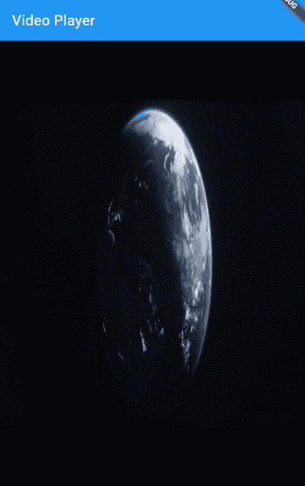
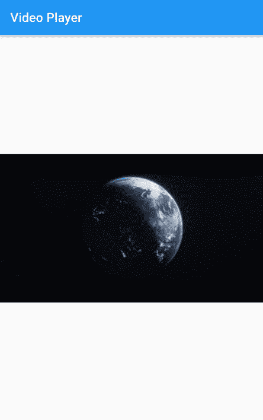
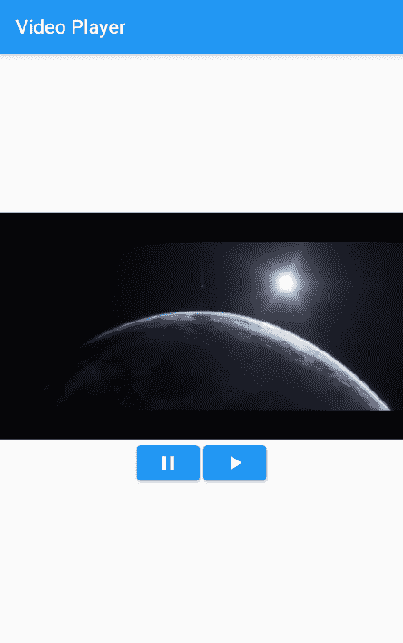
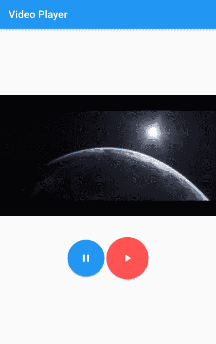
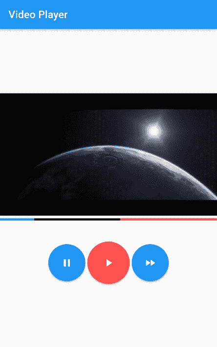
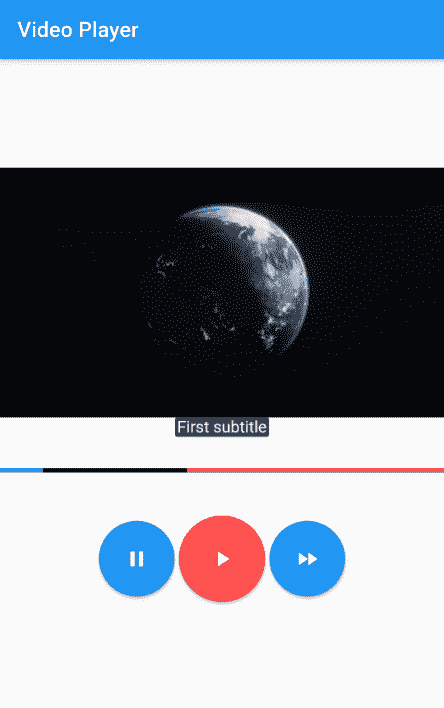
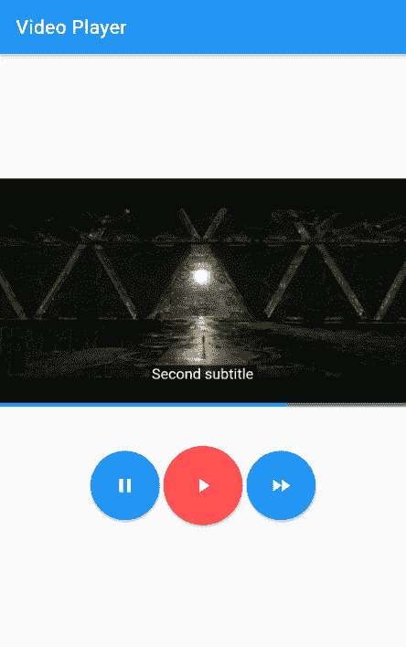

# 构建一个颤动的视频播放器- LogRocket 博客

> 原文：<https://blog.logrocket.com/flutter-video-player/>

你已经看到了许多包含视频内容的应用程序，如包含视频教程的食谱应用程序、电影应用程序和体育相关应用程序。你想知道如何将视频内容添加到你的下一个 Flutter 应用程序中吗？

从头开始实现视频功能将是一项繁重的任务。但是很少有插件可以让开发者的生活变得轻松。视频播放器插件是 Flutter 能够满足这一需求的最好的插件之一。

在这篇文章中，你将学习如何应用视频播放器插件以及控制视频播放器的不同功能。我们将讨论这些话题:

## 创建新的视频播放器

在使用视频播放器插件之前，你应该把它添加到你的`pubspec.yaml`文件中。当您打开`pubspec.yaml`文件时，您可以看到运行应用程序所需的一些配置和依赖关系。我们的视频播放器插件应该被添加到`dependencies`块下:

```
dependencies:
  flutter:
    sdk: flutter
  cupertino_icons: ^1.0.2
  video_player: 2.1.15  //video player

```

插件的当前版本是`2.1.15`，但是你可以通过查看[插件页面](https://pub.dev/packages/video_player)在这里添加最新版本。如果你在 VS 代码中保存文件，它会自动下载插件。如果没有，打开终端，写`flutter pub get`下载插件。

转到您想要添加插件的文件并导入`video_player.dart`文件:

```
import 'package:video_player/video_player.dart';

```

现在你可以在你的项目中使用视频播放器插件了。

加载视频的方法很少。让我们从资产中加载我们的示例。在项目的根级别创建一个资产/视频文件夹，并在该文件夹中添加一个视频。然后在`pubspec.yaml`中的`assets`部分下，指定文件路径如下:

```
assets:
    - assets/video/video.mp4

```

让我们创建一个名为`VideoPlayerWidget`的独立的有状态小部件来插入我们的视频播放器相关的实现。

你可以像下面这样在`initState`方法中初始化视频播放器。还有，别忘了`dispose`视频播放器做清理工作:

```
class _VideoPlayerState extends State<VideoPlayerWidget> {
  late VideoPlayerController _videoPlayerController;
  @override
  void initState() {
    super.initState();
    _videoPlayerController = VideoPlayerController.asset(
        'assets/video/video.mp4')
      ..initialize().then((_) {
        setState(() {});
        _videoPlayerController.play();
      });
  }

  @override
  void dispose() {
    _videoPlayerController.dispose();
    super.dispose();
  }

  @override
  Widget build(BuildContext context) {
    return Center(
      child: VideoPlayer(_videoPlayerController),
    );
  }
}

```

`VideoPlayerController`必须用`late`关键字指定，因为我们还没有在那一行中定义视频播放器控制器，我们以后会这样做。在`initState`内部，`videoPlayerController`已经随着资产的路径被初始化。

初始化完成后，它会改变状态并重新构建小部件。初始化后，您可以开始播放视频。

可以用视频网址代替`assets`。要访问网络，您应该在 Android 和 iOS 上添加互联网权限配置。

从根目录，转到`ios/Runner`并打开`info.plist`文件。然后，将以下配置添加到该文件中:

```
<key>NSAppTransportSecurity</key>
<dict>
  <key>NSAllowsArbitraryLoads</key>
  <true/>
</dict>

```

接下来，转到`android/app/src/main`并打开`AndroidManifest.xml`。然后，向其中添加以下代码:

```
<uses-permission android:name="android.permission.INTERNET"/>

```

现在，您可以将`asset`更改为`network`，并在那里添加视频 URL:

```
  @override
  void initState() {
    super.initState();
    _videoPlayerController =
        VideoPlayerController.network('video_url_here')
          ..initialize().then((_) {
            setState(() {});
            _videoPlayerController.play();
          });
  }

```

即使初始化已经完成，也应该有办法在 UI 中显示播放器。可以使用`VideoPlayer`小部件来完成这项工作。为了让它工作，您应该将控制器作为第一个参数传递给`VideoPlayer`小部件。

最好在显示`VideoPlayer`小部件之前检查初始化是否成功:

```
 @override
  Widget build(BuildContext context) {
    return Center(
      child: _videoPlayerController.value.isInitialized ? VideoPlayer(_videoPlayerController) : Container(),
    );
  } 
```



现在你可以在屏幕上看到视频。但是有一个小问题:它的长宽比不合适。这可以通过使用`AspectRatio`小部件来解决。视频播放器提供了合适的视频纵横比，您可以使用该值设置一个`AspectRatio`小部件:

```
  @override
  Widget build(BuildContext context) {
    return Center(
      child: _videoPlayerController.value.isInitialized ? AspectRatio(aspectRatio: 
      _videoPlayerController.value.aspectRatio,
      child: VideoPlayer(_videoPlayerController)
      ) : Container(),
    );
  }

```

现在，您可以看到具有适当纵横比的视频。



## 添加播放和暂停按钮

首先，让我们将视频播放器小部件包装在一个列小部件中，因为我们应该将播放和暂停按钮放在播放器下面。在播放器窗口小部件之后的列中，让我们在一个`Row`窗口小部件中添加两个`ElevatedButton`窗口小部件，在这些按钮之间，让我们添加一个`Padding`窗口小部件以保持一些喘息空间。

对于每个`ElevatedButton`，添加相关的`Icons`作为子部件。然后在播放按钮`onPressed`回调里面，可以引用`_videoPlayerController`并调用`play`方法开始播放视频。在暂停按钮里面，用`pause`的方法代替播放。

现在您可以删除之前在`initState`方法中添加的游戏:

```
  @override
  Widget build(BuildContext context) {
    return Column(
      mainAxisAlignment: MainAxisAlignment.center,
      children: [
        _videoPlayerController.value.isInitialized ? AspectRatio(aspectRatio: 
        _videoPlayerController.value.aspectRatio,
        child: VideoPlayer(_videoPlayerController)
        ) : Container(),
        Row(
          mainAxisAlignment: MainAxisAlignment.center, 
          children: [

            ElevatedButton(onPressed: (){
              _videoPlayerController.pause();
            }, child: Icon(Icons.pause)),
              Padding(padding: EdgeInsets.all(2)),
             ElevatedButton(onPressed: (){
              _videoPlayerController.play();
            }, child: Icon(Icons.play_arrow))
          ],
        )
      ],
    );
  }

```



此外，您可以为按钮添加样式，以获得圆形按钮，这通常在视频播放器中:

```
 @override
  Widget build(BuildContext context) {
    return Column(
      mainAxisAlignment: MainAxisAlignment.center,
      children: [
        _videoPlayerController.value.isInitialized
            ? AspectRatio(
                aspectRatio: _videoPlayerController.value.aspectRatio,
                child: VideoPlayer(_videoPlayerController))
            : Container(),
        Padding(
          padding: EdgeInsets.all(20),
        ),
        Row(
          mainAxisAlignment: MainAxisAlignment.center,
          children: [
            ElevatedButton(
                style: ButtonStyle(
                    backgroundColor: MaterialStateProperty.all<Color>(Colors.blue),
                    fixedSize: MaterialStateProperty.all(Size(70, 70)),
                    shape: MaterialStateProperty.all(RoundedRectangleBorder(
                        borderRadius: BorderRadius.circular(100)))),
                onPressed: () {
                  _videoPlayerController.pause();
                },
                child: Icon(Icons.pause)),
            Padding(padding: EdgeInsets.all(2)),
            ElevatedButton(
                style: ButtonStyle(
                    backgroundColor: MaterialStateProperty.all<Color>(Colors.redAccent),
                    fixedSize: MaterialStateProperty.all<Size>(Size(80, 80)),
                    shape: MaterialStateProperty.all(RoundedRectangleBorder(
                        borderRadius: BorderRadius.circular(100)))),
                onPressed: () {
                  _videoPlayerController.play();
                },
                child: Icon(Icons.play_arrow))
          ],
        )
      ],
    );
  }

```



## 创建快进

在实施快进之前，我们先想想我们需要什么。首先，应该有访问当前视频位置/时间的方法和设置新值的方法。控制器的`seekTo`方法允许我们设置视频的持续时间。

您可以通过视频播放器`value`属性访问当前视频位置，如下所示:

```
ElevatedButton(
       style: ButtonStyle(
          backgroundColor: MaterialStateProperty.all<Color>(Colors.blue),
          fixedSize: MaterialStateProperty.all(Size(70, 70)),
          shape: MaterialStateProperty.all(RoundedRectangleBorder(
              borderRadius: BorderRadius.circular(100)))),
                onPressed: () {
                  _videoPlayerController.seekTo(Duration(
                   seconds: _videoPlayerController.value.position.inSeconds + 10));
                },
                child: Icon(Icons.fast_forward)) 
```

像这样，你也可以通过减少用户点击按钮时的`10`秒来实现倒回。

## 添加视频进度指示器

视频播放器插件提供了内置的功能来添加一个进度条和一些控件。您可以使用`VideoProgressIndicator`小部件来实现这一点。

作为第一个参数，您必须传递控制器并设置`allowScrubbing`属性。属性将允许用户通过触摸小部件来滑动进度。通过启用此功能，用户可以跳转到视频的不同时间戳。此外，您可以单独控制搜索栏的背景颜色、缓冲颜色和播放区域颜色:

```
VideoProgressIndicator(
          _videoPlayerController,
          allowScrubbing: true,
          colors: VideoProgressColors(
              backgroundColor: Colors.red,
              bufferedColor: Colors.black,
              playedColor: Colors.blueAccent),
        )

```



## 为视频应用字幕

你的应用程序需要两个东西:第一个是不同时期的段落/单词列表，第二个是视频播放时显示这些标题的方式。为此，应该有一种方法为时间变化添加一个监听器。

视频播放器包含一个每秒执行一次的`addListener`方法。您可以使用这个监听器根据不同的时间段为视频播放器提供字幕。

首先，让我们创建一个包含时间作为键和字幕文本作为值的`Map`。在`Map`上，时间将以秒为单位:

```
Map<int,String> captions = {
    5:"First subtitle",
    20:"Second subtitle"
  };

```

接下来，在初始化视频播放器时注册一个`Listener`。在回调函数中，您可以检查视频是否正在播放，如果视频正在播放，则以秒为单位获取当前时间。然后，如果当前值包含在`captions`映射中，我们可以将该值设置为一个选定的标题，如下所示:

```
void initState() {
    super.initState();
    _videoPlayerController =
        VideoPlayerController.asset('assets/video/video.mp4')
        ..addListener(() {
            if(_videoPlayerController.value.isPlaying){
              setState(() { 
                if(captions.containsKey(_videoPlayerController.value.position.inSeconds)){
              selectedCaption = captions[_videoPlayerController.value.position.inSeconds];                
                }
              });
            }
        })
          ..initialize().then((_) {
            setState(() {});
            _videoPlayerController.play();
          });
  }

```

现在您可以使用`ClosedCaption`来设置所选标题。您可以为标题文本添加一些样式以获得更好的可视性:

```
 ClosedCaption(
     text: selectedCaption,textStyle: TextStyle(fontSize: 15,color: Colors.white),)

```



但是每次标题改变时都构建主要的小部件并不是好的做法。因此，我们应该将标题逻辑提取到一个单独的小部件中。

要注册一个监听器，您应该将视频控制器传递给一个新创建的子部件。从那里，您可以在子小部件中注册监听器:

```
class VCaption extends StatefulWidget {
  const VCaption(
     this.videoPlayerController,
  );
  final VideoPlayerController videoPlayerController;
  @override
  _VCaptionState createState() => _VCaptionState();
}
class _VCaptionState extends State<VCaption> {
  String? selectedCaption = "";
  Map<int,String> captions = {
    5:"First subtitle",
    20:"Second subtitle"
  };

  @override
  void initState() {
    widget.videoPlayerController.addListener(() {
      if(widget.videoPlayerController.value.isPlaying){
              print("Time ${widget.videoPlayerController.value.position.inSeconds}");
              setState(() { 
                if(captions.containsKey(widget.videoPlayerController.value.position.inSeconds)){
              selectedCaption = captions[widget.videoPlayerController.value.position.inSeconds];                
                }
              });
            }
    });
    super.initState();
  }
  @override
  Widget build(BuildContext context) {
    return ClosedCaption(
      text: selectedCaption,textStyle: TextStyle(fontSize: 15,color: Colors.white),);
  }
}

```

现在我们可以将这个小部件添加到之前创建的列中，并将`_videoPlayerController`作为参数传递。在将小部件添加到树之前，您可以检查视频播放器是否已经初始化，如下所示:

```
 _videoPlayerController.value.isInitialized ? VCaption(_videoPlayerController) : Container(),

```

您可以使用`Stack`小部件在视频上方显示字幕，而不是在视频下方显示字幕。标题和进度指示器被移到了`Stack`小部件的内部，显示在视频的顶部:

```
 Stack(
          children: [
            _videoPlayerController.value.isInitialized
                ? AspectRatio(
                    aspectRatio: _videoPlayerController.value.aspectRatio,
                    child: VideoPlayer(_videoPlayerController))
                : Container(),
            Positioned(
              bottom: 2,
              width: MediaQuery.of(context).size.width,
              child: _videoPlayerController.value.isInitialized
                  ? VCaption(_videoPlayerController)
                  : Container(),
            ),
            Positioned(
                bottom: 0,
                width: MediaQuery.of(context).size.width,
                child: VideoProgressIndicator(
                  _videoPlayerController,
                  allowScrubbing: false,
                  colors: VideoProgressColors(
                      backgroundColor: Colors.blueGrey,
                      bufferedColor: Colors.blueGrey,
                      playedColor: Colors.blueAccent),
                ))
          ],
        )

```



## 结论

使用视频播放器插件而不是从头开始实现视频播放器节省了大量的开发时间，并提供了开箱即用的所有所需功能。

如果你想超越这些定制，实现一个好看的视频播放器，具有材料和 Cupertino 启发的设计，你可以选择 [chewie Flutter 插件](https://pub.dev/packages/chewie)。

## 使用 [LogRocket](https://lp.logrocket.com/blg/signup) 消除传统错误报告的干扰

[](https://lp.logrocket.com/blg/signup)

[LogRocket](https://lp.logrocket.com/blg/signup) 是一个数字体验分析解决方案，它可以保护您免受数百个假阳性错误警报的影响，只针对几个真正重要的项目。LogRocket 会告诉您应用程序中实际影响用户的最具影响力的 bug 和 UX 问题。

然后，使用具有深层技术遥测的会话重放来确切地查看用户看到了什么以及是什么导致了问题，就像你在他们身后看一样。

LogRocket 自动聚合客户端错误、JS 异常、前端性能指标和用户交互。然后 LogRocket 使用机器学习来告诉你哪些问题正在影响大多数用户，并提供你需要修复它的上下文。

关注重要的 bug—[今天就试试 LogRocket】。](https://lp.logrocket.com/blg/signup-issue-free)