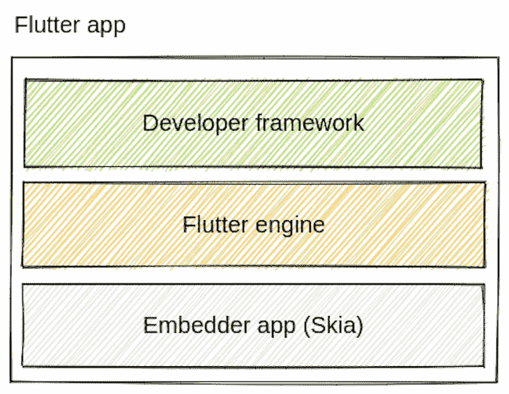
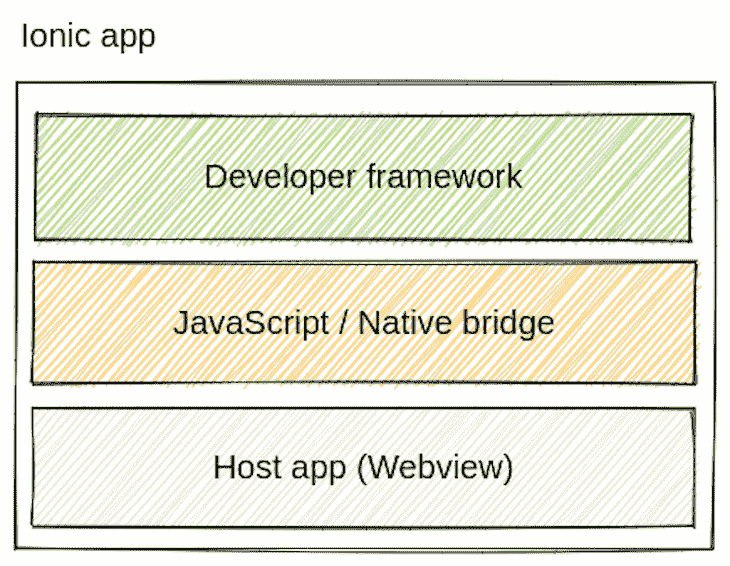
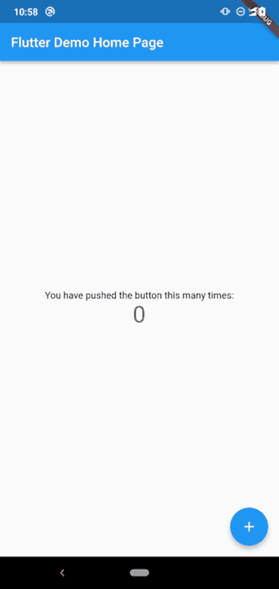
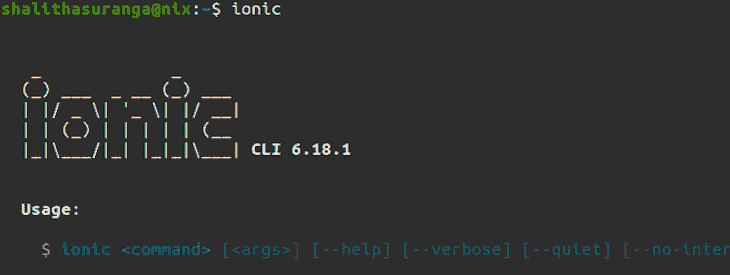
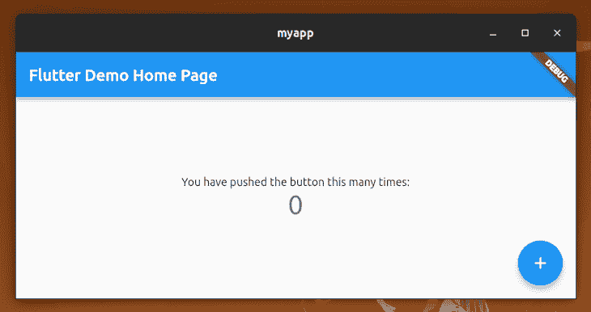
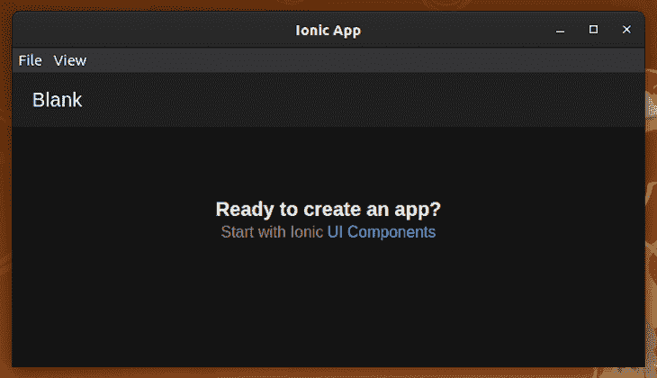

# 跨平台开发的 Flutter 与 Ionic

> 原文：<https://blog.logrocket.com/flutter-vs-ionic-cross-platform-development/>

现代移动应用程序开发团队倾向于使用特定于移动应用程序的框架来构建他们的应用程序，这有几个有利的原因:用于开发 Android 和 iOS 应用程序的单一代码库；开发人员友好的工具；独立于平台的抽象本机 APIs 和社区支持。

有两种不同的移动框架类型:混合和本地。

混合移动框架，如 Ionic 和 Apache Cordova(以前的 PhoneGap)，允许开发人员通过将 web 资源加载到本地 webview 组件来构建混合移动应用程序。另一方面，像 Flutter 和 Kivy 这样的原生移动框架通过提供平台无关的 UI 工具包，让开发人员构建原生移动应用。与此同时，React Native 提供了一种不同的方式来利用 headless-webview 概念构建本地应用程序。

在本文中，我将对 Flutter 和 Ionic 进行详细而实用的比较，以便选择最佳框架来构建您的下一个移动应用程序。

## 什么是颤振？

Flutter 是 Google 开发的跨平台软件开发工具包。Flutter 框架允许开发人员使用基于 widgets 树的布局在 Dart 中构建应用程序，最初是一个跨平台的移动应用程序开发框架，为 Android 和 iOS 生成应用程序包。最近，Flutter 团队通过支持桌面(Linux、macOS、Windows 和 Fuchsia)和 web 目标扩展了该框架。

Flutter 不使用基于 web 或特定于平台的 UI 元素。它使用内置的 UI 工具包，并通过 [Skia](https://github.com/google/skia) 跨平台图形库渲染图形。

## 什么是爱奥尼亚？

Ionic 是由 Max Lynch 和 Ben Sperry 开发的混合移动应用开发框架。Ionic 最初建立在 Apache Cordova 框架之上，但 Ionic 团队制作了 [Capacitor.js](https://github.com/ionic-team/capacitor) 作为 Apache Cordova 基础层的替代。

Ionic 不使用原生的特定于平台的 UI 元素。它使用类似本机的、基于 web 组件的 UI 元素，并在 webview 组件中呈现它们。Ionic 允许开发人员使用 Angular、React、Vue.js 和 Stencil 前端库构建移动应用程序。

Ionic 官方支持 Android、iOS 和 web 目标。开发人员社区还创建了基于电子的桌面应用程序生成支持。

## 颤振与离子:受欢迎程度和市场份额

让我们看看 Flutter 和 Ionic 令人印象深刻的使用统计。

流行度和市场份额统计数据通常会让我们了解开发人员对框架的了解程度、每个框架营销策略的成功程度以及开发人员对每个特定框架的满意程度。这些统计数据不会向我们展示清晰的用户体验因素、性能因素以及我们项目中用于技术决策的特性。例如，最流行的框架可能无法解决您的主要技术需求。

为此，让我们继续下一节，比较每个框架的架构以及它如何适合不同的环境。

## 颤振与离子:内部框架架构

在为你的下一个移动应用选择框架之前，学习框架内部无疑是你能做的最好的技术决策活动。框架的内部架构为我们提供了每个框架产品的可行性和未来的清晰、透明的概述。

### Flutter 如何在内部工作



Flutter’s high-level architecture

颤振有三个主要层:

1.  基于 Dart 的框架:实现开发人员经常访问的所有小部件、动画和基础构建块
2.  基于 C++的引擎:借助 Dart 运行时和 Dart 到本机的通信通道，将基于 Dart 的框架层与嵌入式应用程序层连接起来
3.  特定于平台的嵌入式应用(也称为主机应用)

Flutter 架构类似于 [SDL 图形库](https://en.wikipedia.org/wiki/Simple_DirectMedia_Layer)，允许 API 呈现平台无关的 UI 元素。Flutter 使用一个无 JavaScript 的二进制协议来调用本地操作系统级 API。

#### 摘要

请记住上述技术综述中关于颤振的以下要点:

*   Flutter 不使用 webview 或特定于平台的 UI 工具包(例如，Cocoa 和 Android UI)——它呈现由 Flutter 构建的小部件
*   Flutter 用二进制消息协议调用 OS 层 API
*   Flutter 应用程序是通用的和独立于平台的
*   Flutter 应用程序可以在任何可以运行 Flutter 引擎和 Skia graphics 的平台上本地运行，因为它通过自定义渲染画布(如游戏引擎)提升了本地 GUI 性能

### 爱奥尼亚内部如何工作



*Ionic’s high-level architecture*

离子框架有三个主要层:

1.  基于 Web 组件的 widgets 框架
2.  JavaScript 到本地的桥梁
3.  宿主应用程序

Ionic 的 widgets 工具包是用[模版](https://github.com/ionic-team/stencil) web 组件库编写的。基于模板的组件可以很容易地移植到任何前端框架，Ionic 团队正式提供了 React、Vue.js 和 Angular 的包装器。JavaScript-to-Native bridge(也称为 Capacitor.js)将每个本机 API 调用转换为 JSON 消息，并将其发送到主机应用程序的 webview 接口。主机应用程序也可以通过 JavaScript 桥调用 web 应用层。

Ionic 使用类似 React Native 的方法，通过 JavaScript 桥与操作系统的原生 SDK 进行对话。

#### 摘要

请记住上述技术评论中关于 Ionic 的以下要点:

*   Ionic 使用 webview 组件来呈现基于 HTML 的 UI 元素，我们可以使用我们最喜欢的 web 前端框架来创建这些元素
*   Ionic 提供预建的、原生的基于 web 组件的小部件
*   Ionic 通过 JSON 有效负载与 OS 层(主机应用程序)通信(它使用 [base64](https://en.wikipedia.org/wiki/Base64) 编码作为参数)
*   整个框架核心的很大一部分是用 web 技术编写的，所以 Ionic 生态系统倾向于 web 开发文化——而不是本地开发文化

## Flutter 与 Ionic:开发工作流程比较

开发工作流是一个至关重要的比较因素——因为它直接影响开发人员的生产力。

现在我们已经了解了每个框架的主要构建模块，让我们从每个环境设置中开发一个简单的应用程序，并在真实的移动设备上运行它，以研究学习曲线、开发人员工具和开发人员环境。

### **创建颤振应用**

如果你以前开发过一个 Flutter 应用程序，你可以跳到 Flutter 教程的末尾。

Flutter 应用程序开发需要设置两个组件:Flutter CLI 和特定于平台的 SDK。只有移动平台才需要特定于平台的 SDK 安装，因为大多数桌面平台在默认情况下已经包含了所需的开发人员库。

#### **开发者环境设置**

首先，根据[官方指南](https://docs.flutter.dev/get-started/install)安装颤振 CLI。如果你在 Linux 上，可以使用下面的 Snapcraft 命令(用`sudo`运行)快速安装。

```
>snap install flutter --classic

```

接下来，您必须设置移动 SDK 工具。如果您计划在 Android 设备上测试该应用程序，您可以使用以下命令来安装 Android Studio。

```
snap install android-studio --classic

```

Flutter CLI 提供了一个名为`doctor`的有用诊断命令来查找配置问题。如果`flutter doctor`命令没有显示任何关键错误，您可以开始创建一个 Flutter 应用程序，如下所示。


*The `flutter doctor` command output on Linux*

#### **创建新应用**

您可以使用以下命令创建新的 Flutter 应用程序:

```
flutter create myapp

```

上面的命令将非常快地生成一个最小的样本 Flutter 应用程序，因为没有像 Node.js 模块那样的外部依赖。

您可以使用以下命令在 Android 设备上运行该应用程序:

```
cd myapp
flutter run

```

上面的命令创建了一个具有 Flutter 热重装支持的 Android embedder 应用程序的调试版本，并在连接的物理设备或虚拟设备上运行。



A sample Flutter app runs on an Android device

#### **开发颤振应用**

您可以从`lib/main.dart`文件中浏览示例应用程序的源代码。您可能已经注意到，Flutter 附带了一个基于窗口小部件树的布局系统，这是其他流行的跨平台移动框架所没有使用的。基于窗口小部件树的布局为以前从事过本地应用程序开发的开发人员提供了一个友好的开发环境，但对于前端和 web 开发人员来说，这是一个新的、有点令人困惑的概念。

尽管 Dart 对于大多数开发人员来说是一种新的开发技术，但是开发人员仍然可以使用熟悉的通用项目架构模式来构建大型应用程序。例如，我们可以用[存储库模式](https://blog.logrocket.com/implementing-repository-pattern-flutter/)、MVC 模式、服务、DAO 模式和状态管理模式来构建我们的 Flutter 代码库，就像 [BLoC](https://blog.logrocket.com/introduction-flutter-bloc-8/) 一样，通过将大型 UI 分解成多个小部件。

#### **发布颤振应用**

Flutter CLI 提供了`build`命令来生成应用程序包。Flutter 生成提前(AOT)编译的 Dart 代码段，以便通过生产版本更快地启动应用程序。

让我们生成示例应用程序的 APK。您可以使用以下命令为多个 CPU 架构生成一个[胖 APK](https://en.wikipedia.org/wiki/Fat_binary) :

```
flutter build apk --release

```

上述命令生成一个 15.8MB 大小的单个 APK。但是，我们可以使用以下命令为特定的 CPU 架构生成 APK:

```
flutter build apk --split-per-abi

```

上面的命令为我的 [arm64-v8a](https://developer.android.com/ndk/guides/abis#arm64-v8a) Android 设备生成了一个 5.2MB 大小、依赖于 CPU 的 APK，以及另外两个针对不同 CPU 架构的 apk。Flutter 提供了这个 CLI 特性来减少应用程序包，因为它使用了 Android NDK 生成的、依赖于 CPU 的动态库。

#### **总结**

请记住上面对 Flutter 应用程序开发工作流程的实践回顾中的以下几点:

*   Flutter CLI 提供了使用全功能诊断工具创建、运行、调试和构建 Flutter 应用程序的功能
*   我们不能在 Flutter 中使用传统的类似 XML 的布局语法——它附带了一个基于小部件树的语法
*   我们可以使用任何通用的架构模式来构建 Flutter 代码库

### **创建离子应用**

如果您以前开发过 Ionic 应用程序，可以跳到 Ionic 教程部分的末尾。

Ionic 应用程序开发需要设置三个软件组件:

1.  Node.js 与您选择的[包管理器](https://blog.logrocket.com/javascript-package-managers-compared)
2.  离子 CLI
3.  特定于平台的 SDK

#### **开发者环境设置**

首先，确保您已经安装了最新的 Node.js LTS 版本。接下来，使用以下命令安装 Ionic CLI 程序。

```
npm i -g @ionic/cli

```

上述命令全局激活`ionic`命令；您可以通过在终端上输入`ionic`来验证它。



#### **创建新的 Ionic 应用**

您可以使用以下命令创建一个新的 Ionic 应用程序。

```
ionic start myapp

```

上面的命令显示一个项目创建向导，并要求您选择一个前端库和应用程序模板。在这个例子中，我选择了 React 和空白模板。与 Flutter CLI 相比，项目创建需要一些时间，因为我们必须安装 Node.js 模块。

您可以使用以下命令在 Android 设备上运行 Ionic 应用程序。

```
ionic capacitor run android
```


A sample Ionic app runs on an Android device

上述命令触发 React 生产构建，并且不会启用热重装(HMR)特性。但是，Ionic CLI 提供了以下命令来使用前端框架开发工具激活热重装:

```
ionic capacitor run android -l --host=<your_ip_address>

```

请注意，在执行此命令之前，您需要将移动设备和计算机连接到同一个网络。Ionic 文档建议在用真实设备或仿真器预览之前，用`ionic serve`命令在网络浏览器上预览应用程序。

#### **开发离子应用**

Ionic 通过特定于平台的 webview 组件呈现基于网络的应用程序 UI。因此，它允许您使用最流行的前端框架，如 React、Angular 和 Vue 来开发 UI 组件。

每个流行的前端框架通常都带有类似 XML 的模板语法，这意味着前端开发人员不需要学习像 Flutter 的小部件树这样的特殊布局语法。

Ionic 框架和 Capacitor.js 由松散耦合的框架组件组成。因此，您可以轻松地仅使用 Capacitor，将您现有的 web 应用程序或 PWA 转变为没有 Ionic 组件的混合移动应用程序。与 Flutter 一样，您可以使用任何想要的架构模式来组织大规模应用程序的代码。

#### **发布离子应用**

Ionic 也有一个`build`命令，但是它不直接为基于电容的项目生成发布包。`ionic build`命令将 web 资源打包到主机应用程序，并打开移动开发 IDE 以手动编译移动平台二进制文件。

例如，以下命令使用 web 资源更新主机应用程序，并自动打开 Android Studio。

```
ionic build

```

Android Studio 使用 Gradle 发布版本配置生成了一个 3.6MB 大小的 APK。

Ionic 团队正计划扩展 CLI 以生成发布二进制文件，正如 Flutter 通过[这个 GitHub 问题](https://github.com/ionic-team/capacitor/issues/324)所做的那样。

#### **总结**

请记住上面对 Ionic 应用程序开发工作流程的实践回顾中的以下几点。

*   Ionic CLI 提供了创建、运行和调试 Ionic 应用程序的特性，但是您必须使用标准的移动 IDE 来生成发布二进制文件
*   Ionic 使用基于 web 的 UI 小部件，因此前端开发人员可以轻松学习 Ionic 开发，但我们可以使用 Capacitor.js 将 web 应用程序转换为混合移动应用程序
*   我们可以使用任何通用的架构模式来构建离子代码库

## 颤振与离子:用户体验

既然我们对每个框架如何用工具支持开发人员有了一个概念，让我们考虑一下 UX。开发人员为最终用户创建应用，因此用户体验因素也有助于移动应用取得成功。

### Flutter 提供了原生的 UI 体验

Flutter 不使用操作系统内置库中的 UI 元素——它在每个平台上都使用一致的原生 UI 元素——但你可以在 iOS 上应用 [Cupertino UI 主题](https://docs.flutter.dev/development/ui/widgets/cupertino)来制作类似 iOS 的 UI 元素。Flutter UI 的主要目标是在不同的操作系统之间提供一致的用户体验。

由于 AOT 编译和高性能 Skia 库，Flutter 即使在低端设备上也能如此高效地渲染窗口小部件。

### Ionic 提供了原生的用户界面体验

Ionic 通过 web 组件技术提供了预构建的、类似本机的 UI 元素。您的混合 Ionic 应用程序将在每个平台上自动呈现不同的 CSS 样式，以匹配原生 UI 样式。例如， [Ionic button](https://ionicframework.com/docs/api/button) 组件在 Android 设备上会看起来像一个 Android 按钮，在苹果设备上看起来像一个 iOS 按钮。

Ionic 的 UI 渲染性能取决于平台特定的 webview HTML 渲染性能。由于 HTML 渲染缓慢和 web 资源加载延迟，如果用户在低端设备上运行复杂的 HTML 屏幕，他们可能会感觉该应用程序是一个 web 应用程序。

## 颤振与离子:性能和资源使用

无论是 Flutter 还是 Ionic 都没有直接调用原生平台 SDK。相反，每个框架运行时使用不同的方法与本地 SDK 通信。让我们讨论一下框架是如何影响性能和资源使用的。

### **颤振性能**

Flutter 使用一个名为[平台通道](https://docs.flutter.dev/development/platform-integration/platform-channels#architecture)的二进制消息协议与原生 SDK 通信，因此它在处理平台 API 时提供了接近原生的性能。AOT 编译的二进制文件还消除了生产应用程序的 Dart 代码解析和编译步骤，从而大幅降低了 TTI(交互时间)系数。

### **离子性能**

Ionic 使用 JavaScript 桥概念与 React Native 等平台 SDK 进行通信。由于桥的性能缺陷，React Native 的新架构实现用新的 [JSI 通信概念](https://blog.logrocket.com/should-you-keep-faith-react-native/)替换了桥组件。

如果选择 Ionic 写一个经常调用原生 SDK 的手机 app，我们要三思。然而，Ionic 框架的这些性能缺陷只发生在低端或嵌入式设备上，因为现代移动设备通常都带有强大的硬件。

在大多数情况下，包的大小通常取决于应用程序资源，而与框架无关。然而，Ionic 提供了最轻的框架二进制文件，因为它只在主机应用程序中使用了原生闪屏和 webview 组件。相比之下，由于依赖于平台的 Flutter 引擎库，Flutter 的框架二进制文件要大一些。

## Flutter 与 Ionic:桌面应用生成支持

### 颤动桌面

Flutter 官方支持 Linux、macOS、Windows 和 Fuchsia 桌面平台。所以，你可以把你的 Flutter app 变成桌面 app，不需要第三方工具或者框架。尝试一下，看看将上面的示例 Flutter 应用程序作为原生桌面应用程序运行是多么容易。

我们需要启用桌面支持，输入`flutter run`打开桌面应用。

```
flutter config --enable-linux-desktop
flutter create --platforms=linux .
flutter run -d linux

```

上面的命令构建并运行扑动应用程序作为一个本地的 GTK 窗口应用程序，如下所示。



*A sample Flutter app runs as a native desktop app on Linux.*

### 离子桌面

Ionic 没有正式支持桌面平台，但 Ionic 社区创建了一个项目，通过电子框架将 Ionic 应用程序转变为混合桌面应用程序。这种桌面应用程序生成工作流也像 Flutter 的桌面应用程序生成支持一样简单。

您可以使用以下命令将 Ionic 应用程序作为混合桌面运行。这些命令将比 Flutter 桌面应用程序执行命令工作得更快，因为 [Electron 通常带有预构建的二进制文件](https://blog.logrocket.com/advanced-electron-js-architecture/)。

```
npm i @capacitor-community/electron
npx cap add @capacitor-community/electron
npx cap open @capacitor-community/electron

```

以上命令将 Ionic 应用程序作为电子桌面应用程序打开，如下所示。



*A sample Ionic app runs as a hybrid desktop app on Linux.*

## Flutter 与 Ionic: Web 应用程序生成支持

你不需要付出任何额外的努力来将 Ionic 应用程序转换为 web 应用程序，因为 Ionic 应用程序已经是 web 应用程序了。例如，如果您使用 React 构建您的 Ionic 应用程序，您可以触发生产构建并获得可部署的 web 应用程序。Ionic 组件可以在任何 web 浏览器上工作，不会有任何性能问题，因为它们是 HTML 元素。

Flutter 还支持通过两种不同的呈现器生成 web 应用程序:HTML 呈现器和 CanvasKit。HTML 渲染器使用 HTML 元素和 canvas 元素的混合在浏览器上渲染 Flutter 应用程序。它的下载大小比 CanvasKit 小。

CanvasKit 渲染器试图在浏览器上提供类似本机的性能，但下载量有点大。然而，两种 web 呈现器都使用 canvas 元素，而不是原生 HTML 元素。

## Flutter vs. Ionic:哪个框架更好？

我们已经讨论了框架的内部结构、开发工作流、桌面支持、web 支持、用户体验以及两个框架的性能。现在，我们可以将所有对比数据汇总到一个表中，以研究利弊。

但首先，你需要明白，没有一个移动框架能像原生应用一样产生技术上很棒的应用——我们使用框架主要是为了减少开发时间。

Flutter 和 Ionic 都提供了令人印象深刻的功能，但也有一些缺点，所以我们需要根据项目的主要需求仔细选择一个框架。

查看总结的扑动和离子的优缺点。

颤振与离子:用例

## 我们可以根据以上利弊来决定什么时候用颤振和离子。根据您的需求仔细选择最合适的框架，而不是只考虑当前的趋势。

在以下情况下使用颤振:

你的主要产品是一个有点复杂的移动应用

*   您同时关心性能和漂亮的用户界面
*   您的应用最终用户希望从低端移动设备、嵌入式设备和/或桌面设备上使用您的应用
*   您的工程师(或您)希望使用一种新的语言工作(或者您可以调整预算来雇佣新的 Dart 工程师)
*   在以下情况下使用离子型:

你的主要产品是一个不太复杂的移动应用

*   您需要将 web 应用程序转换为混合移动应用程序
*   与漂亮的用户界面相比，性能没有那么重要
*   您的工程师(或您)不会喜欢通过改变技术栈来从 web 开发环境切换到本地应用程序开发环境
*   结论

## 在本文中，我们从不同的角度比较了颤振和离子框架。框架变化很快，所以一个特定的框架可以在任何时候引入一个特性，使特定的开发工作流更加高效。

底层架构比向开发人员宣传特定框架产品的方式更能说明框架的可行性和稳定性。这就是为什么我们在进行评估之前讨论了每个框架的内部结构。

Flutter 和 Ionic 都是很好的移动框架，受到数百万人的喜爱，但从性能角度来看，Flutter 无疑是赢家，而 Ionic 是公认的 web 开发人员构建混合移动应用程序的最高效工具。

通过仔细研究你的需求来选择一个框架——没有简单的方法可以从 Ionic 切换到 Flutter 或 Flutter 到 Ionic，而不是重写整个应用程序。

使用 [LogRocket](https://lp.logrocket.com/blg/signup) 消除传统错误报告的干扰

## [LogRocket](https://lp.logrocket.com/blg/signup) 是一个数字体验分析解决方案，它可以保护您免受数百个假阳性错误警报的影响，只针对几个真正重要的项目。LogRocket 会告诉您应用程序中实际影响用户的最具影响力的 bug 和 UX 问题。

[](https://lp.logrocket.com/blg/signup)

然后，使用具有深层技术遥测的会话重放来确切地查看用户看到了什么以及是什么导致了问题，就像你在他们身后看一样。

LogRocket 自动聚合客户端错误、JS 异常、前端性能指标和用户交互。然后 LogRocket 使用机器学习来告诉你哪些问题正在影响大多数用户，并提供你需要修复它的上下文。

关注重要的 bug—[今天就试试 LogRocket】。](https://lp.logrocket.com/blg/signup-issue-free)

Focus on the bugs that matter — [try LogRocket today](https://lp.logrocket.com/blg/signup-issue-free).