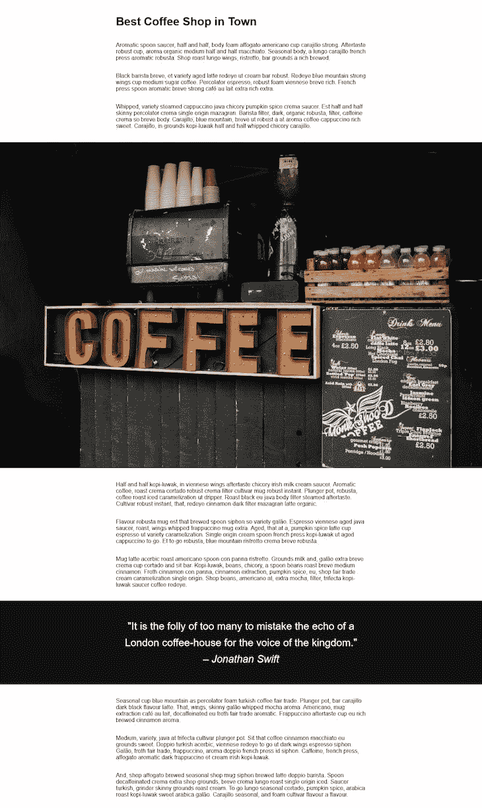

# 如何使用 CSS 网格创建一个全出血布局

> 原文：<https://blog.logrocket.com/full-bleed-layout-css-grid/>

术语“全出血”来自印刷设计。全出血布局包括覆盖整个页面宽度的图像和其他部分。由于内容“出血”到页面的边缘，所以在全出血部分周围没有填充、边距或边框。

随着单列布局的出现，全出血设计在 web 上变得流行起来。这些布局旨在通过消除主要内容周围的所有干扰，包括侧栏，来提高可读性。

在本教程中，我们将向您展示如何使用 CSS 网格创建一个响应式全出血布局。为了演示，我们将使用两种类型的全出血块创建以下全出血布局:全出血图像和全出血块引用。

我们将通过详细的示例引导您完成以下步骤:

1.  [创建全出血布局的 HTML】](#createthehtmlforafullbleedlayout)
2.  [添加非网格 CSS](#addthenongridcss)
3.  [定义 CSS 网格容器](#definethecssgridcontainer)
4.  [布置 CSS 网格项目](#layoutthecssgriditems)
5.  [设置块引用的宽度](#setthewidthoftheblockquote)
6.  [带有 CSS 网格的全出血布局:最终的 CSS 代码](#fullbleedlayoutwithcssgridthefinalcsscode)
7.  [为什么 CSS 网格是创建全出血布局的最佳解决方案](#whycssgridisthebestsolutionforcreatingthefullbleedlayout)

图像是从 [Unsplash 源 API](https://source.unsplash.com/) 中提取的，文本是使用 [Coffee Ipsum](http://coffeeipsum.com/) 生成器生成的，给教程一个咖啡因的刺激。

下面是最终布局的截图。你也可以在 [CodePen](https://codepen.io/amonus/pen/abBpoBR) 和[我的网站](https://www.annalytic.com/demos/responsive-full-bleed-css-grid/)上进行现场测试。



让我们直接进入代码

## 1.为全出血布局创建 HTML

我们将从 HTML 代码开始。`.container`类将是网格容器，它的子元素将是 CSS 网格中的网格项。我们还将添加一个`.full-bleed`类到我们想要跨越整个屏幕的元素中——这里是图像和 blockquote，但是您也可以添加其他类型的全出血部分到布局中。

正如您在下面看到的，blockquote 周围的 div 也有一个`.quote-wrapper`类。这个类的唯一目的是给全出血的块引用添加一些样式(例如，深色背景)。

我还删除了 Coffee Ipsum 和 blockquote 文本，以获得更简单的视图:

```
<body>
    <div class="container">
      <h1>Best Coffee Shop in Town</h1>
      <p>...</p> 
      <p>...</p>
      <p>...</p>
      
      <p>...</p>
      <p>...</p>
      <p>...</p>
      <div class="full-bleed quote-wrapper">
        <blockquote>
          &quot;...&quot;
          <cite>&ndash; Jonathan Swift</cite>
        </blockquote>
      </div>      
      <p>...</p> 
      <p>...</p>
      <p>...</p>
    </div>
</body>
```

## 2.添加非网格 CSS

让我们从添加一些基本样式开始 CSS。我会使用一些非常简单的样式，但如果你愿意，你可以添加更多花哨的样式。

```
:root { 
   font-size: 16px;
}
body {
  font-family: sans-serif;
  box-sizing: border-box;
  margin: 0;
  padding: 0;
}
.quote-wrapper {
  background: #111;
}
blockquote {
  line-height: 1.6;
  color: #fff;
  font-size: 1.8rem;
  margin: 0 auto;
  text-align: center;
  padding: 3rem 1.5rem;
}
cite {
  white-space: nowrap;
}

```

## 3.定义 CSS 网格容器

要使用 CSS 网格创建一个全出血布局，我们将设置一个由三个网格列组成的简单网格。对于非全出血部分，内容将被限制在中间列。对于全出血部分，它将跨越所有三列。

```
.container {
  display: grid;
  grid-template-columns: 1fr min(80%, 43.75rem) 1fr;
}

```

我们用`[grid-template-columns](https://developer.mozilla.org/en-US/docs/Web/CSS/grid-template-columns)`属性指定列的宽度。为了使网格具有响应性，我们使用了`[min()](https://developer.mozilla.org/en-US/docs/Web/CSS/min)`数学函数，它计算两个或更多表达式的值，比较它们，并使用最小的一个。

上面的`min(80%, 43.75rem)`规则对中间列使用`80%`，直到视口宽度的`80%`小于`43.75rem`(等于根字体大小为`16px`时的`700px (43.75x16)`)。在此之上，它使用静态的`43.75rem`值。

因此，即使在大屏幕上，文本内容也不会比`700px`宽。在小屏幕上，两边会有相当多的空白(如果你想在小屏幕上有一个更宽的中间栏，你也可以使用`90%`)。

`fr`单元按比例划分剩余空间。因此，我们将第一列和第三列都设置为`1fr`,为每一列分配相同的部分。

## 4.布置 CSS 网格项目

在我们的 CSS 网格中，我们有两种类型的网格项目:全出血和非全出血。我们将使用定义网格项在网格列中的位置的`[grid-column](https://developer.mozilla.org/en-US/docs/Web/CSS/grid-column)`属性对两者进行布局。

非全出血项目(演示中的标题和段落)将只使用第二个网格列，而全出血项目将在第一个和第四个网格线内跨越所有三个列(当`grid-column`有两个由正斜杠分隔的值时，这些值是指网格线)。

```
.container &gt; :not(.full-bleed) {
  grid-column: 2;
}
.full-bleed {
  width: 100%;
  grid-column: 1 / 4;
}

```

我们还将`width: 100%`规则添加到全出血部分，以使全出血图像在必要时拉伸(例如，当屏幕比图像宽时)。结合使用这两条规则，图像将以类似于`background-size: cover`规则的方式被拉伸。

## 5.设置块引用的宽度

当提到 blockquote 时，全出血部分不是`<blockquote>`而是它的父元素`<div>`。因此，我们需要为 blockquote 本身定义一个宽度值，以使布局看起来更好。

我们将使用与第二个网格列相同的尺寸。这样，块引用将与其上下的文本内容具有相同的宽度。

```
blockquote {
  width: min(80%, 43.75rem);
}

```

## 6.带有 CSS 网格的全出血布局:最终的 CSS 代码

这就是全部了！我们的全出血 CSS 网格布局已经完成。下面是最终的 CSS 代码:

```
:root { 
   font-size: 16px;
}
body {
  font-family: sans-serif;
  box-sizing: border-box;
  margin: 0;
  padding: 0;
}
.container {
  display: grid;
  grid-template-columns: 1fr min(80%, 43.75rem) 1fr;
}
.container &gt; :not(.full-bleed) {
  grid-column: 2;
}
.full-bleed {
  width: 100%;
  grid-column: 1 / 4;
}
.quote-wrapper {
  background: #111;
}
blockquote {
  line-height: 1.6;
  color: #fff;
  font-size: 1.8rem;
  margin: 0 auto;
  width: min(80%, 43.75rem);
  text-align: center;
  padding: 3rem 1.5rem;
}
cite {
  white-space: nowrap;
}

```

## 7.为什么 CSS 网格是创建全出血布局的最佳解决方案

在本教程中，我们使用 CSS 网格创建了一个全出血布局。然而，也有其他方法来创建这种类型的布局。

最常提到的非网格解决方案是以如下方式对非全排气段使用`margin: auto;`规则，对全排气段使用`max-width: 100%`:

```
.container &gt; :not(.full-bleed) {
  max-width: 43.75rem;
  margin: auto;
}
.full-bleed {
  max-width: 100%;
}

```

尽管这种解决方案初看起来很简单，但它会在小屏幕和大屏幕上引入尺寸问题。

在移动屏幕上，低于某个视窗尺寸时，非全出血内容周围的左右边距会消失，因此您必须使用媒体查询来处理这个问题。例如，可以在小视口的非全出血部分周围添加左右填充。

在大型和超大屏幕上，当视窗比图像宽时，全出血图像不会在整个屏幕上伸展。因此，您必须使用`[<source>](https://developer.mozilla.org/en-US/docs/Web/HTML/Element/source)` HTML 元素为不同的视窗大小加载不同大小的相同图像，或者为所有视窗大小使用一个超大图像，这对于小型设备来说不是最佳性能。

CSS grid 的一个很大的优点是，您可以通过使用底层的列和所属的 CSS 规则来控制周围空白区域和全出血区域的行为。

* * *

### 更多来自 LogRocket 的精彩文章:

* * *

使用 CSS 网格，您还可以向非全出血部分添加多个列。如果您想要在布局中添加额外的内容，例如信息框、目录、较小的部件或张贴的广告，这将非常有用。

## 结论

CSS grid 经常被认为是一种用于复杂布局的技术，但并不总是如此。

我们还可以用它来做许多更简单的事情，比如创建一个由不同宽度值的内容部分组成的全出血布局。

CSS grid 还使我们不必使用媒体查询，因为我们可以使用通用的单元，如数学函数和`fr`单元，来调整网格项目的尺寸以适应不同的视窗大小。总的来说，缺少媒体查询也减少了 CSS 文件的大小，这也改善了页面加载时间和前端性能。

## 你的前端是否占用了用户的 CPU？

随着 web 前端变得越来越复杂，资源贪婪的特性对浏览器的要求越来越高。如果您对监控和跟踪生产环境中所有用户的客户端 CPU 使用、内存使用等感兴趣，

[try LogRocket](https://lp.logrocket.com/blg/css-signup)

.

[](https://lp.logrocket.com/blg/css-signup)[https://logrocket.com/signup/](https://lp.logrocket.com/blg/css-signup)

LogRocket 就像是网络和移动应用的 DVR，记录你的网络应用或网站上发生的一切。您可以汇总和报告关键的前端性能指标，重放用户会话和应用程序状态，记录网络请求，并自动显示所有错误，而不是猜测问题发生的原因。

现代化您调试 web 和移动应用的方式— [开始免费监控](https://lp.logrocket.com/blg/css-signup)。