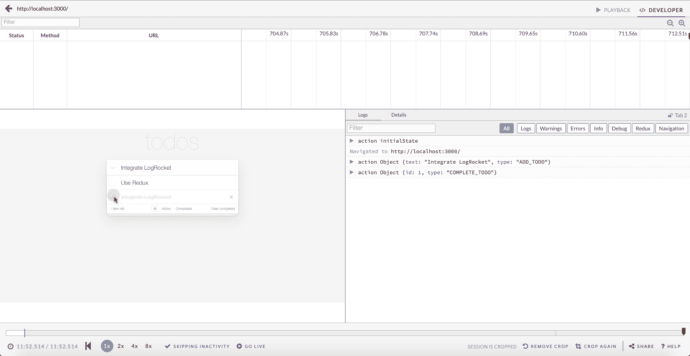
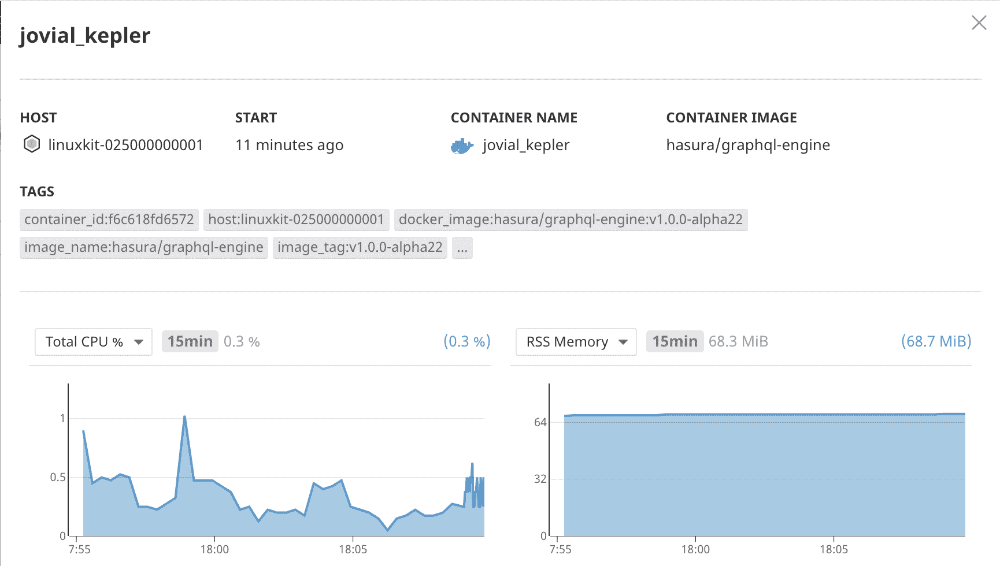
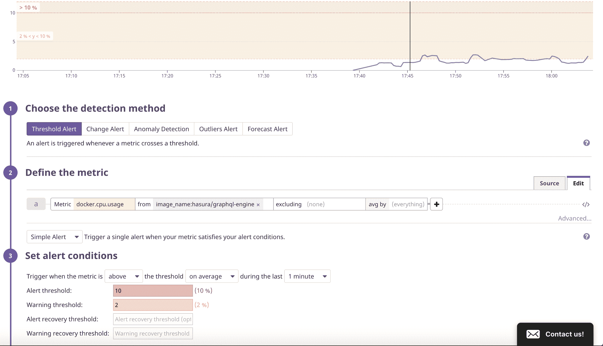
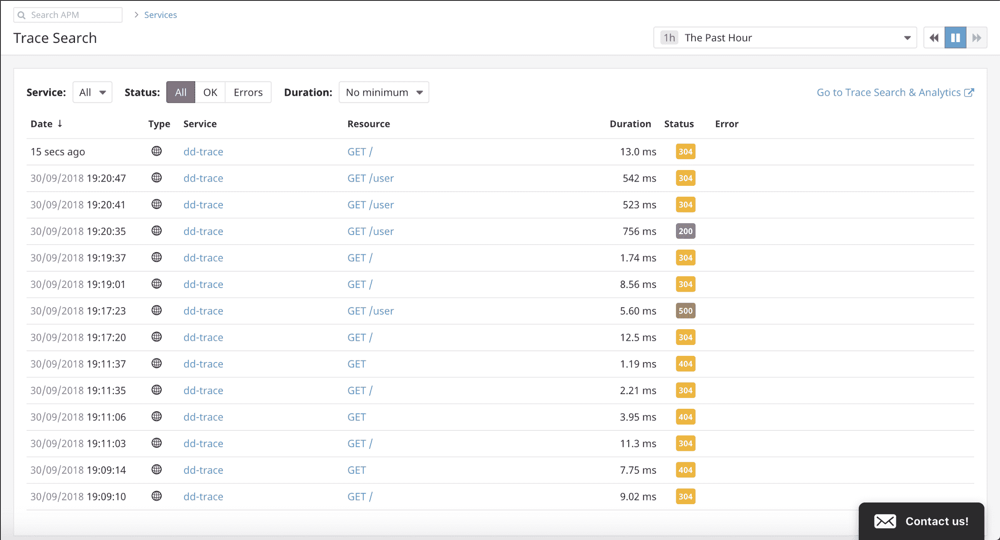
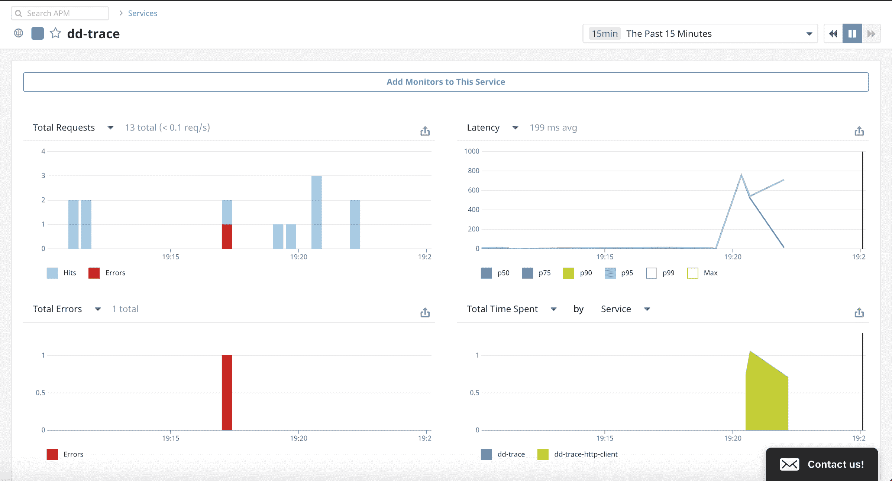
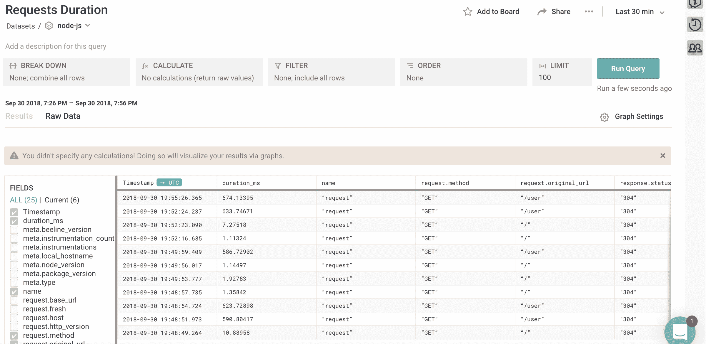
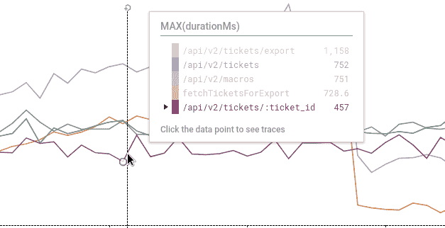

# 全栈可观测性:LogRocket，DataDog，Honeycomb - LogRocket 博客

> 原文：<https://blog.logrocket.com/fullstack-observability-logrocket-datadog-honeycomb-5f5a327af817/>

在这篇文章中，我们将为 React/Redux 应用程序和 Node.js 后端设置一个可观察的系统，并跨堆栈部署 Docker，看看它如何帮助我们识别和修复问题。

我们将涵盖:

*   LogRocket 集成了 React/Redux 来跟踪前端应用程序
*   DataDog 与 Docker 集成，用于监控正常运行时间/基于阈值的警报和 Node.js APM
*   蜂窝与后端服务器日志集成，用于错误响应

## 可观察性入门

可观察性是衡量我们从一个系统所做的工作中了解它的程度。这也有助于解释为什么一个系统会以某种方式运行。

> 可观察性经常与监控相混淆。**监控**是识别已知问题的一种方式，而**可观察性**让你知道为什么问题首先会出现。

传统上，应用程序是在服务器端呈现的，服务器或多或少由应用程序开发人员设置和控制。因此，监控集中在服务器上。现在有了客户端 javascript 应用(React、Vue、Angular 等。)和无服务器后端，在如何识别和处理错误方面，情况正在发生变化。

我们无法预测应用程序的哪个部分会在何时失败。因此，在任何时候，我们都需要一种方法来快速了解应用程序是如何执行和处理错误的。

### 对背景的需求

我们需要整个堆栈的上下文—前端、后端和基础架构。这不仅仅是我们写的代码的问题，也是底层基础设施的问题。它也可能在许多方面出错。肯定有快速的解决方法。

为了确定某个应用出了什么问题，我们需要尽可能多的关于*整个堆栈*的数据来最终确定解决方案。根据设计，一个可观察的系统应该发出度量/日志/踪迹。

## 与 LogRocket 反应

[LogRocket](https://logrocket.com/) 通过从应用程序中捕获日志和会话记录，帮助您了解用户行为。

### 误差跟踪

尽管所有的端到端测试都进入了产品构建，错误跟踪仍然很重要。发布错误跟踪，您需要有一个简单的方法来:

*   确定它影响了哪部分用户
*   在开发设置中重现相同的错误
*   过滤掉噪音，快速浏览正在发生的事情

LogRocket 帮你轻松做到以上所有。

### 反应积分

LogRocket 为 Redux、MobX 和 Vuex 等流行的状态管理库提供了内置集成。在这个例子中，我将使用 Redux 集成。设置过程非常简单。从在[https://app.logrocket.com](https://app.logrocket.com/)报名开始

*   使用 npm 安装:`npm install — save logrocket`
*   在您的应用程序中初始化 log rocket:

    ```
    import LogRocket from 'logrocket'; // Initialize LogRocket with your app ID LogRocket.init(<your_application_id>);
    ```

*   添加 Redux 中间件:

    ```
    import { applyMiddleware, createStore } from 'redux'; const store = createStore(   reducer, // your app reducer   applyMiddleware(middlewares, LogRocket.reduxMiddleware()), );
    ```

一旦设置好集成，LogRocket 将开始接收事件，您可以在仪表板上重放它们。



LogRocket Redux Replay

### 身份用户

我们还需要为用户标记每个事件。因此，一旦用户通过身份验证，就只需要触发 identify 方法了。

```
LogRocket.identify('<user_id>', {
  name: '<name>',
  email: '<email>',

  // Add your own custom user variables here, ie:
  <custom_type>: '<custom_value'
});
```

太好了！现在，我们已经启动并运行了从前端应用程序收集数据的基本系统。

### 跟踪不良部署

对于 React 应用程序(或任何 JavaScript 框架)，除非与 TypeScript 一起使用，否则在运行时应用程序中出现未捕获异常的可能性很高。

举例来说，让我们看看一个坏的访问列表的情况。

```
fetch('http://example.com/todos')
  .then(function(response) {
    // some data processing
    const first_todo = response.todos[0].text;
    return first_todo;
  })
  .then(function(myJson) {
    console.log(JSON.stringify(myJson));
  });
```


LogRocket capturing uncaught exceptions

在上面的例子中，编写了一些代码，假设来自后端的响应将总是返回一个 todos 列表及其相应的元数据。

在这种情况下，服务器返回一个空数组并导致错误。

任何假设都可能出错。部署后识别异常的能力对于快速恢复至关重要。现在，操作是添加一个 try catch 块，并小心处理空响应的情况。

## 使用 DataDog 监控和跟踪正常运行时间

[DataDog](https://www.datadoghq.com/) 无缝聚合整个 DevOps 堆栈的指标和事件。假设一个典型的微服务架构，React 应用程序可以在任何云提供商中部署。

除了云提供商对正常运行时间的保证之外，您的 Docker 容器在内部运行可能会有自己的停机时间，原因有很多。

这可能简单到一个编码糟糕的服务器导致崩溃，也可能复杂到 CPU/RAM 的高使用率导致响应缓慢。在这些情况下，DataDog 会通过收集尽可能多的关于您的部署的信息来提供帮助。

### Docker 集成

与 LogRocket 类似，DataDog 为 DevOps 堆栈提供了内置集成。在本帖中，我们将介绍一个典型的 Docker 部署。查看 Docker 上 DataDog 代理的[安装说明](https://app.datadoghq.com/account/settings#agent/docker)。

```
docker run -d --name dd-agent -v /var/run/docker.sock:/var/run/docker.sock:ro -v /proc/:/host/proc/:ro -v /sys/fs/cgroup/:/host/sys/fs/cgroup:ro -e DD_API_KEY=<your-api-key> datadog/agent:latest

```

**注意:**用你的 DataDog API 密匙替换`<api-key>`。

使用`docker ps`跟踪服务器是否启动。

现在，我们可以设置一个仪表板来观察运行应用程序 docker 容器的底层云集群的不同指标。


DataDog metrics dashboard

### 阈值警报

我们必须测量一些指标来跟踪 Docker 容器是否按照它应该的方式运行。要收集的一些指标包括:

*   CPU 使用率
*   RAM 使用
*   码头集装箱运行状态
*   系统正常运行时间

还有很多其他指标可以收集。但是以上可以让我们对正在发生的事情有一个很好的认识。



DataDog CPU RAM Usage Metrics

### 班长

DataDog 使您能够创建主动检查指标、集成可用性、网络端点等的监视器。创建监视器后，当达到阈值条件时会通知您。

您可以设置监视器，当某个指标(如响应时间、CPU/RAM 使用量)超过阈值时，可以使用监视器向您和您的团队触发警报。

这些监视器的实际使用情况是，例如，当您正在进行一个未优化的数据库查询时。这需要大量的 CPU 来处理，并成为同一个集群中其他微服务的瓶颈。



DataDog Monitor Alerts

### APM — `dd-trace`

当应用程序堆栈发展成微服务架构中的多容器设置时，跟踪带来了可见性的好处。web/mobile 客户端为不同的用例联系不同的服务，处理起来很快变得复杂。

让我们来看一个简单的 Node.js express 与`dd-trace`的集成，看看它有什么帮助。

在与 Node.js Docker 容器运行在同一主机上的 DataDog 代理中启用 APM。

```
docker run -d -v /var/run/docker.sock:/var/run/docker.sock:ro \
              -v /proc/:/host/proc/:ro \
              -v /sys/fs/cgroup/:/host/sys/fs/cgroup:ro \
              -e DD_API_KEY=<YOUR_API_KEY> \
              -e DD_APM_ENABLED=true \
              datadog/agent:latest
```

将下面的代码放在 Node.js 服务器的顶部，开始检测代码。

```
var tracer = require('dd-trace').init({
  hostname: '<host-name>',
  port: 8126,
  debug: true
});
tracer.use('express');
```

有了这个设置，您现在可以在后端服务器上跟踪请求/响应。



DataDog APM Trace

我们还可以查看请求数、延迟、错误、总花费时间等的图表。这告诉我们，如果这些指标中的任何一个突然增加，我们可以跟踪单个请求，看看哪里出错了。

一个很好的例子是跟踪对数据库的调用以获取大量数据，或者跟踪一个异步 API 调用以查看响应需要多长时间。

如果在一个端点上有多个分支请求，您可以唯一地标识每个请求。跟踪数据可以指导您优化部分代码库的开发。当您扩展应用程序时，在这几毫秒内进行优化时，对流程的可见性会产生相当大的影响。



DataDog Trace Metrics

## 用蜂巢形象化

当有如此多的数据需要分析时，缩小范围并获得应用程序运行情况的可视化表示通常是好的。虽然 LogRocket 可以帮助您在前端捕获错误，但是可以设置 [Honeycomb](https://honeycomb.io/) 来从后端捕获指标。

蜂巢式集成速度很快，因为它是环境不可知的，它抛出 JSON 并允许用 JSON 进行处理。

### Node.js 集成

从安装 Honeycomb 的 Node.js 集成开始:

```
npm install honeycomb-beeline — save
```

然后，将下面的代码片段放在 Node.js 服务器代码的顶部。

```
require("honeycomb-beeline")({
    writeKey: "<your-write-key>",
    dataset: "node-js"
    // ... additional optional configuration ...
});
```

Node 应用有几个端点。Honeycomb 自动将这些请求元数据解析成一个很好的模式，然后可以在包含有效负载的情况下对其进行查询。我们还可以应用过滤器，根据不同的参数分解数据。

例如，如果我们希望根据发送到特定 URL 的请求数量进行分组，我们可以对该参数进行细分并运行查询。



Honeycomb Dashboard

### 灵活模式

大多数工具通常都有一个严格的模式，限制开发人员问更多的问题。Honeycomb 有一个灵活的模式，允许您放置任意数据，只要它的 JSON。

**Pro 提示:** Honeycomb 让您管理模式。这允许您将特定的数据类型分配给特定的列(当然，如果允许类型转换的话)，因此您可以应用一系列比较运算符，如>、<、> =、< =和=。

### 协作数据分析

通过基于团队的方法，Honeycomb 允许团队中的开发人员分析他们的应用程序是否运行良好。团队中的任何人都可以根据响应时间和状态代码来查询他们最近的部署是否工作正常。

通过细粒度的数据，基于时间的图形可视化帮助开发人员不断询问不同的问题，直到他们找到最初的问题。

蜂窝数据是实时的，在读取时聚合数据。

最近，Honeycomb 还引入了[跟踪](https://www.honeycomb.io/blog/2018/06/get-deeper-insights-with-honeycomb-tracing/)以获得更深入的见解，如哪些方法速度较慢的概述、API 请求结构以及并行化某些请求的同步与异步决策。这里有一个来自 Honeycomb 的请求跟踪示例。



Honeycomb request tracing

## 添加安全措施

我们可以最大限度地遵循整个堆栈的最佳实践，以最大限度地减少生产中可能出现的问题。基本上谨慎的错误处理，稳定的基础设施提供商和最新的工具将确保您的应用程序的基本保障。这将是一个持续的过程，因为库/工具会不断更新，所以必须将这些更新一致地部署到应用程序中。

## 摘要

这个想法是利用所有工具的内置集成。在上面的工具集中，跨堆栈的通用框架/库的插件集成非常好。

在一个复杂的分布式系统中，必须有高度的可观测性。显然，有些决策是可以自动化的，比如因为云供应商停机而重启 Docker 容器，或者在前端客户端处理错误。

诚然，可观察性是有代价的，但随着应用程序/业务的扩展，它有助于以更快的速度解决任务关键型业务问题。

## 使用 LogRocket 消除传统反应错误报告的噪音

[LogRocket](https://lp.logrocket.com/blg/react-signup-issue-free)

是一款 React analytics 解决方案，可保护您免受数百个误报错误警报的影响，只针对少数真正重要的项目。LogRocket 告诉您 React 应用程序中实际影响用户的最具影响力的 bug 和 UX 问题。

[ ](https://lp.logrocket.com/blg/react-signup-general) [  ](https://lp.logrocket.com/blg/react-signup-general) [LogRocket](https://lp.logrocket.com/blg/react-signup-issue-free)

自动聚合客户端错误、反应错误边界、还原状态、缓慢的组件加载时间、JS 异常、前端性能指标和用户交互。然后，LogRocket 使用机器学习来通知您影响大多数用户的最具影响力的问题，并提供您修复它所需的上下文。

关注重要的 React bug—[今天就试试 LogRocket】。](https://lp.logrocket.com/blg/react-signup-issue-free)