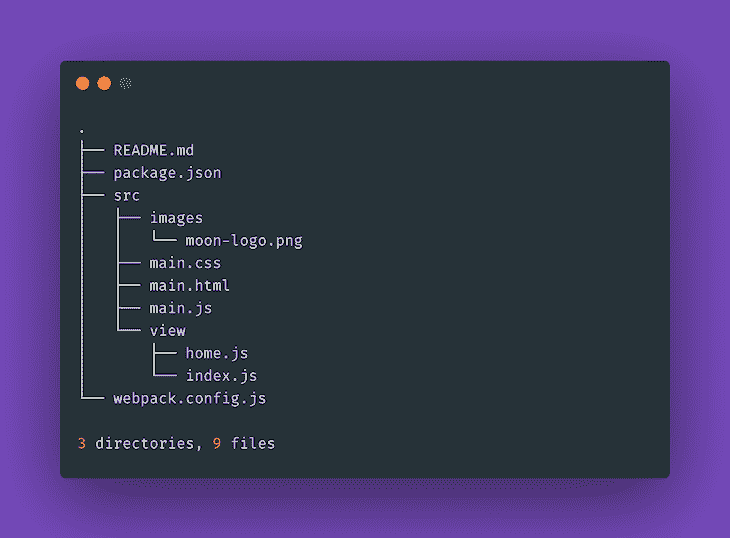
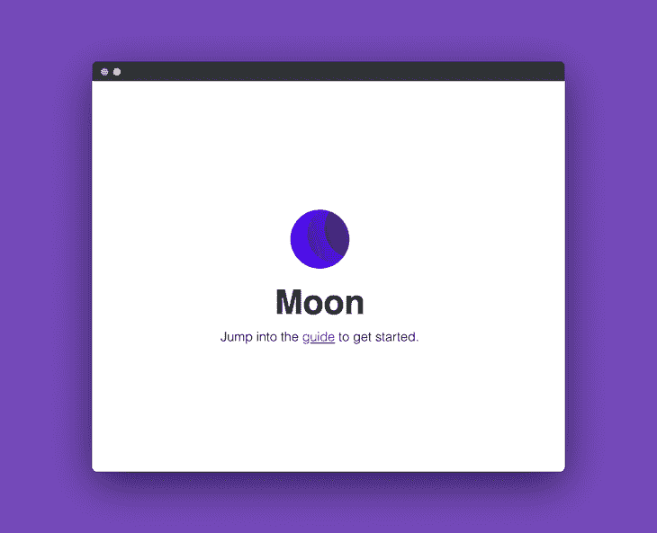
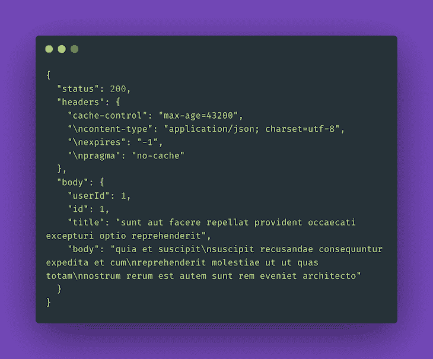
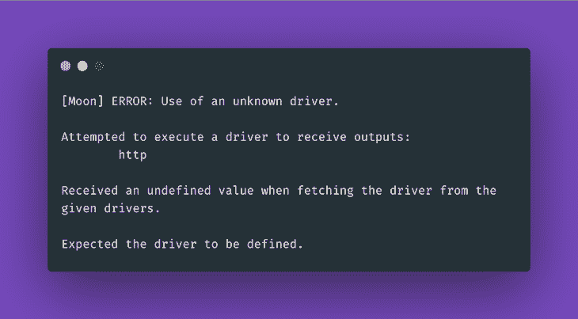
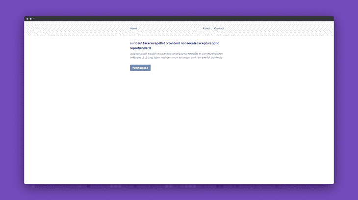
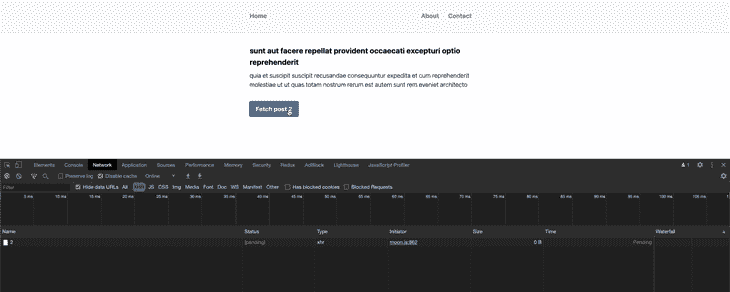

# Moon.js 的功能用户界面

> 原文：<https://blog.logrocket.com/functional-uis-moon-js/>

在本教程中，我们将通过理解什么是 Moon.js 以及为什么创建它来介绍它。然后，我们将通过构建一个使用 JSONPlaceholder API 的博客应用程序来使用这些知识。

## Moon.js 是什么，解决什么问题？

Moon.js 是一个很小的(2KB)，功能性的，声明性的，最小的，快速的功能用户界面库。它基于这样一种想法，即现代应用程序是复杂的，除了更新视图之外，它们很可能需要第三方库来实现任何效果。

为了解决这个问题，Moon 基于纯函数，它可以从驱动程序获取输入并将输出返回给驱动程序。驱动负责视图、状态、HTTP 请求、路由等。

Moon 具有一系列开箱即用的功能:

1.  [时间](https://moonjs.org/time):时间驱动程序提供当前时间，允许我们安排应用程序功能在特定时间后运行
2.  [存储](https://moonjs.org/storage):存储驱动程序提供对`localStorage`的访问，以在浏览器中保存数据
3.  [HTTP](https://moonjs.org/HTTP):HTTP 驱动允许发送和接收 HTTP 请求和响应
4.  [路由](https://moonjs.org/route):路由驱动程序提供了在浏览器中访问路由路径名的方法

在本教程中，我们将使用 HTTP 驱动程序使用 [JSONPlaceholder API](https://jsonplaceholder.typicode.com/) 获取 API。

## 在我们的应用程序中安装 Moon.js

我们可以使用[命令行界面](https://moonjs.org/installation)来[安装](https://moonjs.org/installation)月球:

```
npm install -g moon-cli
```

上述命令将在我们的系统上全局安装 moon。关于全局安装软件包的更多信息可以在 [npm 文档](https://docs.npmjs.com/downloading-and-installing-packages-globally)中找到。

一旦上述步骤完成，我们可以使用以下命令引导一个 Moon 项目:

```
moon create introduction-to-moon.js
```


Bootstrapping a Moon application.

上述命令将创建以下目录结构:



Directory structure of a generic Moon app.

现在，我们可以运行以下命令来安装所有必需的依赖项并启动应用程序:

```
cd introduction-to-moon.js && npm install && npm run dev
```

此时，我们的应用程序应该在`[http://localhost:8080/](http://localhost:8080/)`启动并运行:



Welcome screen of a Moon application.

Moon 默认给我们两个脚本:

1.  `dev`–该命令将使用实时重新加载启动 webpack 服务器
2.  这个命令将生成我们的应用程序的生产版本

## 向我们的应用程序添加 Tailwind CSS

接下来，我们将把 [Tailwind CSS](https://tailwindcss.com/) 添加到我们的应用程序中，以提供一些默认样式。我们可以通过将下面一行添加到我们的`src/index.html`文件中来实现:

```
<link href="https://unpkg.com/[email protected]^1.0/dist/tailwind.min.css" rel="stylesheet">
```

> **注意**:这不是安装顺风 CSS 的推荐方法。更多选项在顺风 CSS [文档](https://tailwindcss.com/docs/installation/)中提供。

## 从 JSONPlaceholder 获取数据

接下来，我们将添加一个特性，通过这个特性，我们可以从 JSONPlaceholder 这样的 API 中获取数据，并在浏览器上显示出来。这个 API 将被分页，所以我们最初将只获取第一篇文章，然后，单击一个按钮，我们将获取后续的文章。

JSONPlaceholder 是一个非常容易使用的 API。它是免费的，可以使用下面的代码获取:

```
fetch('https://jsonplaceholder.typicode.com/posts/1')
  .then(response => response.json())
  .then(json => console.log(json))
```

这将返回如下所示的 JSON 响应:

```
{
  userId: 1,
  id: 1,
  title: "sunt aut facere repellat provident occaecati excepturi optio reprehenderit",
  body: "quia et suscipit suscipit recusandae consequuntur expedita et cum reprehenderit molestiae ut ut quas totam nostrum rerum est autem sunt rem eveniet architecto"
}
```

为了开始使用我们的应用程序，让我们首先定义布局的 HTML 结构。我们可以创建一个新文件`src/view/home/index.js`，内容如下:

```
// src/view/home/index.js

import Moon from "moon";
import navbar from "../components/navbar";
import post from "../components/post";

const { section, div } = Moon.view.m;

export default ({ data }) => {
  return (
    <div>
      <section>
        <navbar />
      </section>
      <section>
        <post data=data />
      </section>
    </div>
  );
};
```

接下来我们将创建`navbar`和`post`组件。`navbar`组件负责显示一个虚拟的导航栏。我们可以创建一个新文件`src/view/components/navbar/index.js`，其内容如下:

```
// src/view/components/navbar/index.js

import Moon from "moon";

const { div, ul, li, a } = Moon.view.m;

export default () => {
  return (
    <div className="bg-gray-100 border-b">
      <div className="max-w-2xl mx-auto p-8 flex justify-between">
        <div>
          <ul class="flex">
            <li class="mr-6 font-bold">
              <a class="text-blue-500 hover:text-blue-800" href="#">
                Home
              </a>
            </li>
          </ul>
        </div>
        <div>
          <ul class="flex">
            <li class="mr-6 font-bold">
              <a class="text-blue-500 hover:text-blue-800" href="#">
                About
              </a>
            </li>
            <li class="mr-6 font-bold">
              <a class="text-blue-500 hover:text-blue-800" href="#">
                Contact
              </a>
            </li>
          </ul>
        </div>
      </div>
    </div>
  );
};
```

接下来，我们将创建我们的`post`组件。`post`组件负责显示从 API 获取的文章，以及从 API 获取下一篇文章并将其呈现在浏览器上的按钮。所以让我们用以下内容创建一个新文件`src/view/components/post/index.js`:

```
// src/view/components/post/index.js

import Moon from "moon";
import home from "../../home";

const { div, h2, p, button } = Moon.view.m;

const post = ({ data }) => {
  return (
    <div className="bg-white">
      <div className="max-w-2xl mx-auto p-8">
        <div className="mb-8">
          <h2 className="font-bold text-xl mb-2">{data.title}</h2>
          <p className="font-light">{data.body}</p>
        </div>
      </div>
    </div>
  )
}

export default post
```

这将显示帖子。但是，让我们添加一个按钮来获取后续的帖子:

```
// src/view/components/post/index.js

const post = ({ data }) => {
  const handleClick = () => {
    Moon.run(() => {
      const postCount = data.postCount + 1

      return({
        http: [
          {
            method: "GET",
            url: `https://jsonplaceholder.typicode.com/posts/${postCount}`,
            headers: {
              "Content-type": "application/json"
          },
            onLoad: ({ http }) => {
              const response = {...JSON.parse(http.body), postCount}

              return {
                view: <home data=response />
              };
            },
          }
        ]
      })}
    );
  };

  return (

    ....

    <button
      class="bg-blue-500 hover:bg-blue-700 text-white font-bold py-2 px-4 rounded"
      @click=handleClick
    >
      Fetch post {data.postCount + 1}
    </button>

    ....

  )
}
```

如果我们现在点击按钮，将会调用`handleClick`功能。`handleClick`函数将从 API 中获取下一篇文章，并将其呈现在浏览器上。当 API 请求完成时，`home`组件将在浏览器上呈现，并带有 API 响应。

因为这个 HTTP 请求是特定于 Moon 如何工作的，所以让我们了解更多一点。根据 Moon [文档](https://moonjs.org/HTTP)，HTTP 驱动程序接受一列 HTTP 请求作为输出。每个请求可以有一个`method`、`url`、`headers`、`body`、`responseType`、`onLoad`和`onError`属性。只有`url`属性是必需的。

```
Moon.use({
    http: Moon.http.driver
});

Moon.run(() => ({
  http: [{
      method: "GET",  // GET, POST, PUT, DELETE, etc.
      url: "https://jsonplaceholder.typicode.com/posts/1",
      headers: {
        "Content-Type": "application/json" // Any type
      },
      body: "HTTP driver test", // If we need to send a body, we can use this. However, this data type must match the "headers"
      responseType: "json",
      onLoad: ({ http }) => {
        console.log(http);

        return {};
      },
      onError: ({ http }) => {
        console.error(http);

        return {};
      }
  }
]}));
```

上述函数将在我们的浏览器控制台中记录以下内容:



Sample API response using Moon’s HTTP driver.

Moon 的调试器也很有帮助。如果我们没有定义 HTTP 驱动程序，它会在我们的浏览器控制台上抛出一条有用的消息:



Error when a Moon driver is used without defining it.

接下来，我们需要用以下内容更新我们的`src/main.js`文件:

```
// src/main.js

import Moon from "moon";
import home from "./view/home"

// Define all the drivers that we'll need
Moon.use({
  data: Moon.data.driver,
  http: Moon.http.driver,
  view: Moon.view.driver("#root")
});

Moon.run(() => {
  const postCount = 1 // Fetch the first post initially

  return({
    http: [{
      method: "GET",
      url: `https://jsonplaceholder.typicode.com/posts/${postCount}`,
      headers: {
        "Content-type": "application/json"
      },
      onLoad: ({ http }) => {
        const data = {...JSON.parse(http.body), postCount}
        return {
          view: <home data=data />
        };
      },
    }]
  })}
);
```

一旦获取第一个 post 的 API 请求完成，上面的代码将呈现`home`组件。

现在，如果我们访问`[http://localhost:8080/](http://localhost:8080/)`，我们应该能够看到以下屏幕:



Our initial application interface.

我们可以查看第一个帖子。如果我们单击按钮，下一篇文章将从 API 中获取并呈现在浏览器上:



Fetching and rendering the next set of posts.

## 结论

在本教程中，我们学习了什么是 Moon.js，以及如何用它来构建应用程序。我们在本教程中构建的应用程序的源代码可以在 [Github](https://github.com/ghoshnirmalya/moon.js-tailwind-css) 上获得，托管在 [Vercel](https://moon-js-tailwind-css.ghoshnirmalya.vercel.app/) 上。

如果你想继续探索月球，请查看[示例](https://moonjs.org/examples)。你也可以通过月亮游乐场或[导游](https://moonjs.org/guide)来了解月亮。

## 您是否添加了新的 JS 库来提高性能或构建新特性？如果他们反其道而行之呢？

毫无疑问，前端变得越来越复杂。当您向应用程序添加新的 JavaScript 库和其他依赖项时，您将需要更多的可见性，以确保您的用户不会遇到未知的问题。

LogRocket 是一个前端应用程序监控解决方案，可以让您回放 JavaScript 错误，就像它们发生在您自己的浏览器中一样，这样您就可以更有效地对错误做出反应。

[](https://lp.logrocket.com/blg/javascript-signup)[https://logrocket.com/signup/](https://lp.logrocket.com/blg/javascript-signup)

[LogRocket](https://lp.logrocket.com/blg/javascript-signup) 可以与任何应用程序完美配合，不管是什么框架，并且有插件可以记录来自 Redux、Vuex 和@ngrx/store 的额外上下文。您可以汇总并报告问题发生时应用程序的状态，而不是猜测问题发生的原因。LogRocket 还可以监控应用的性能，报告客户端 CPU 负载、客户端内存使用等指标。

自信地构建— [开始免费监控](https://lp.logrocket.com/blg/javascript-signup)。