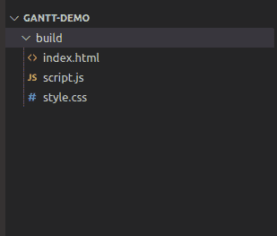
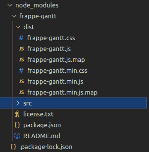
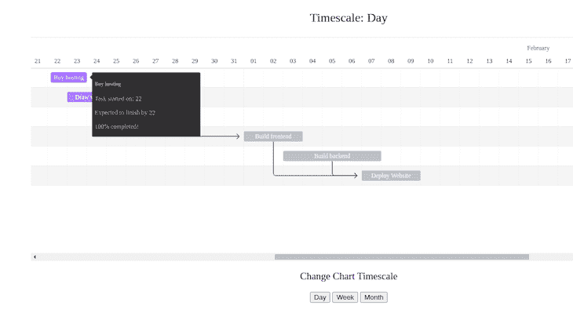
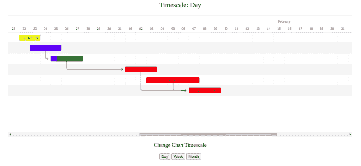
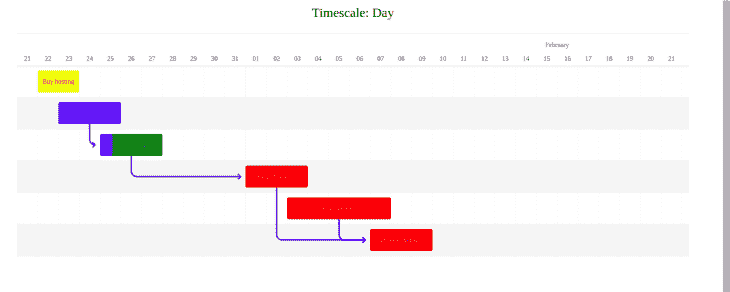

# 如何用 JavaScript 构建甘特图

> 原文：<https://blog.logrocket.com/gantt-chart-javascript-frappe-gantt/>

甘特图是一种流行的、无价的项目管理工具，自 20 世纪以来一直在使用。甘特图是一种特殊类型的条形图，通过将组成项目的每项任务表示为水平条来显示项目的时间线，水平条的长度与分配给该任务的时间成比例。

甘特图还显示了项目中任务之间的关系。项目日程表中较靠后的任务总是位于日程表中较早任务的右侧，依赖于前一个任务的任务用箭头连接到该任务。

根据维基百科的记载，我们所知道的甘特图是由亨利·甘特在 1910 年到 1915 年间创建并推广的。他最初设计这个工具是为了帮助衡量员工的生产力水平，但随着时间的推移，甘特图在许多行业变得越来越普遍。甘特图甚至在第一次世界大战中使用过！

在本文中，我们将指导您使用名为 [Frappe Gantt](https://github.com/frappe/gantt) 的 JavaScript 库为您的 web 应用程序构建甘特图。

要跟随本教程，您需要以下内容:

*   文本编辑器
*   本地安装的 Node.js
*   HTML、CSS 和 JavaScript 的工作知识

## 目录

## 什么是 Frappe 甘特图？

Frappe Gantt 是一个免费的开源 JavaScript 库，由 Frappe 团队创建并[维护。Frappe Gantt 让你用 JavaScript 构建交互式的、容易定制的甘特图变得极其容易。](https://frappe.io/about)

Frappe Gantt 为甘特图提供了以下功能:

*   可调进度指示器
*   可调任务持续时间
*   可变时间刻度，包括半天、一天、一周和一个月
*   单击任务时，每个任务的详细信息会出现在弹出窗口中

## 计划评估方法

在本教程中，您将构建一个甘特图来管理网站的开发。我们将按照以下顺序执行这些步骤:

*   项目设置
*   用任务初始化图表
*   向图表添加多个时间刻度
*   将事件侦听器添加到图表中
*   自定义任务弹出窗口

## 构建图表

让我们为我们的项目创建一个结构，并安装 Frappe 甘特图。首先为项目创建一个目录，并称之为`gantt-demo`。在`gantt-demo`里面，创建一个名为`build`的文件夹。在`build`、`index.html`、`style.css`和`script.js`中创建三个文件。

您的文件结构应该如下所示:



接下来，我们将为甘特图编写一些基础标记。将以下代码粘贴到`build/index.html`中:

```
&lt;!DOCTYPE html>
<html lang="en">
<head>
    <meta charset="UTF-8">
    <meta http-equiv="X-UA-Compatible" content="IE=edge">
    <meta name="viewport" content="width=device-width, initial-scale=1.0">
    <link rel="stylesheet" href="style.css">
    <title>Gantt</title>
</head>
<body>
    <div>
        <svg id="gantt">
        </svg>
    </div>

    <script src="script.js"></script>
</body>
</html>

```

## 包括 Frappe 甘特图

有几种方法可以将 Frappe 甘特图包含在您的项目中。首先，你可以使用来自 [CDN](https://cdnjs.com/libraries/frappe-gantt) 的库，或者你可以用 npm 在本地安装它[。建议用 npm 安装它，所以我们将使用这种方法。](https://www.npmjs.com/package/frappe-gantt)

## 使用 npm 安装 Frappe 甘特图

打开您的终端并导航到`gantt-demo`目录，然后运行以下命令:

```
npm install frappe-gantt

```

上面的代码将在`gantt-demo`中创建一个名为`node_modules`的文件夹，其中包含一个名为`frappe-gantt`的子文件夹。您的`node_modules`文件夹的结构应该如下所示:



从`node_modules/frappe-gantt`中复制`dist`文件夹并粘贴到`build`中。之后，将以下代码添加到您的`build/index.html`文件的头部:

```
&lt;script src="dist/frappe-gantt.min.js"></script>
<link rel="stylesheet" href="dist/frappe-gantt.min.css"> 

```

如果您在已经设置了捆绑器的项目中使用 Frappe Gantt，如 Vue 或 React 项目，您不需要复制`dist`文件夹。只需转到您希望在其中使用 Frappe Gantt 的 JavaScript 文件，并将以下代码添加到您的导入语句中:

```
import Gantt from 'frappe-gantt'

```

## 用任务初始化图表

现在我们的设置已经完成，我们的下一项工作是创建包含一组初始任务的图表。由于该图表用于网站开发项目，因此您将创建包含以下任务的图表:

*   购买主机服务(1 月 22 日至 1 月 23 日)
*   绘制线框(1 月 23 日至 1 月 25 日)
*   视觉设计(1 月 25 日至 1 月 27 日)
*   构建前端(2 月 1 日至 2 月 3 日)
*   构建后端(2 月 3 日至 2 月 7 日)
*   部署网站(2 月 7 日至 2 月 9 日)

网站设计任务依赖于线框任务，前端任务依赖于视觉设计任务，部署任务同时依赖于前端任务和后端任务。让我们假设主机和线框任务已经完成。

如何将这些任务表示为图表的条形？在 Frappe 甘特图中，任务由具有以下结构的 JavaScript 对象表示:

```
 {
    id: '', // a string that represents the id of a task
    name: '',// the label the task will have on the chart
    start: '',// the start date of the task in year-month-day-time format. The time is optional, but should be specified in 24-hour format if provided 
    end: '',// the end date of the task
    progress: 50,// optional property, the percentage completion of the task
    dependencies: 'Task a, Task b',//optional, comma-separated ids of the task(s) this task depends on
    custom_class: 'special-task' // optional property to control the appearance of the task with a CSS class
}

```

要将任务添加到甘特图中，需要为每个任务创建一个这样的对象，然后将所有任务放在一个数组中。将以下代码复制到您的`build/script.js`中:

```
let tasks = [
    {
        id: 'Task 1',
        name: 'Buy hosting',
        start: '2022-01-22',
        end: '2022-01-23',
        progress: 100,
    },
    {
        id: 'Task 2',
        name: 'Draw wireframes',
        start: '2022-01-23',
        end: '2022-01-25',
        progress: 100,
    },
    {
        id: 'Task 3',
        name: 'Visual Design',
        start: '2022-01-25',
        end: '2022-01-27',
        progress: 20,
        dependencies: 'Task 2'
    },
    {
        id: 'Task 4',
        name: 'Build frontend',
        start: '2022-02-01',
        end: '2022-02-03',
        progress: 0,
        dependencies: 'Task 3'
    },
    {
        id: 'Task 5',
        name: 'Build backend',
        start: '2022-02-03',
        end: '2022-02-07',
        progress: 0,
    },
    {
        id: 'Task 6',
        name: 'Deploy Website',
        start: '2022-02-07',
        end: '2022-02-09',
        progress: 0,
        dependencies: 'Task 4, Task 5'
    },
]

```

然后，为了呈现图表，将以下 JavaScript 代码添加到您的`script.js`中:

```
let ganttChart = new Gantt("#gantt", tasks, {});

```

上面的代码使用`Gantt`构造函数从您的任务列表中创建一个甘特图。`Gantt`构造函数的第一个参数要么是描述 DOM 中元素的字符串 CSS 选择器，要么是对 HTML 元素的直接 JavaScript 引用。第二个参数是任务对象的数组。

构造函数的最后一个参数是一个`options`对象，它允许您进一步定制图表。您将在本教程的后面部分填写它，但现在让它为空。

接下来，通过将以下代码粘贴到您的`build/style.css`文件中，为您的图表添加一些样式:

```
.gantt-container {
    width: 90vw; 
    margin: 0 auto;
}

```

此时，如果您在浏览器中打开`build/index.html`文件，您的网页应该如下图所示:


## 向图表添加多个时间刻度

接下来，我们将为用户实现更改图表时间刻度的功能。图表的时间刻度是图表用来显示任务的时间单位。

默认情况下，图表上的时间以天为单位，但 Frappe Gantt 允许您更改这一点。Frappe Gantt 为您的图表提供了季度日、半天、日、周和月作为时间单位选项。

让我们实现图表以周、月和天显示时间的能力。要为您的图表构建一些按钮，首先将以下标记添加到您的`index.html`文件中，就在 body 标签中的`script`之前:

```
<div class="chart-controls">
    <p>Change Chart Timescale</p>
    <div class="button-cont">
        <button id="day-btn">
            Day
        </button>

        <button id="week-btn">
            Week
        </button>

        <button id="month-btn">
            Month
        </button>
    </div>
</div>

```

接下来，通过将下面的代码添加到您的`style.css`文件中来样式化这个标记:

```
.chart-controls {
    text-align: center;
}
.chart-controls > p {
    font-size: 1.2rem;
    font-weight: 500;
}

```

最后，将以下 JavaScript 代码添加到您的`script.js`文件的末尾:

```
document.querySelector(".chart-controls #day-btn").addEventListener("click", () => {
    ganttChart.change_view_mode("Day");
})
document.querySelector(".chart-controls #week-btn").addEventListener("click", () => {
    ganttChart.change_view_mode("Week");
})
document.querySelector(".chart-controls #month-btn").addEventListener("click", () => {
    ganttChart.change_view_mode("Month");
})

```

上面的 JavaScript 代码为标记中的每个按钮创建 click 事件侦听器，然后调用`change_view_mode()`方法，将所需的时间单位作为参数来更改甘特图的时间刻度。

## 将事件侦听器添加到图表中

Frappe 甘特图允许您指定当用户在您的图表上执行某些操作时要运行的代码。

Frappe Gantt 提供了四个事件监听器。`on_click`监听器接受一个当用户双击图表中的任务时执行的函数，传递给它的函数接收一个任务选项作为参数。`on_date_change`监听器接受图表日期改变时运行的函数。传递给它的函数接收任务对象，以及任务的新开始和结束日期。

`on_progress_change`监听器接受一个函数，该函数在图表上的任务进度改变时运行。accepted 函数接收任务对象和新的进度值作为参数。`on_view_change`监听器接受图表时间刻度改变时运行的函数。accepted 函数接收任务对象和新的进度值作为参数。

在本教程中，您将使用`on_view_change`监听器创建一个显示甘特图当前时间刻度的动态标签。首先将标记添加到包含 SVG 的 div 上方的`index.html`:

```
<p class="chart-label">
        Timescale: <span id="current-timescale">Day</span>
</p> 

```

将以下样式添加到您的`style.css`中:

```
.chart-label {
    font-size: 1.5rem;
    text-align: center;
    font-weight: 500;
}

```

现在，我们将使标签动态化。通过将事件侦听器作为第三个参数的属性进行传递，将它添加到您的构造函数中，如下所示:

```
let ganttChart = new Gantt("#gantt", tasks, {  
    on_view_change: function(mode) {
        document.getElementById("current-timescale").innerText = mode;
    },
});

```

图表时间刻度标签现在是完全动态的。

使用 Frappe Gantt，您可以通过为每个任务返回自定义 HTML 来确定当用户单击图表中的任务时弹出窗口的内容。

首先，您将为构造函数的第三个参数提供一个属性，名为`custom_popup_html`。该属性的值是一个接受任务对象作为参数的函数。

将以下 JavaScript 代码添加到构造函数的第三个参数中:

```
custom_popup_html: function(task) {
        return `
          <div class="details-container">
            <h5>${task.name}</h5>
            <p>Task started on: ${task._start.getDate()}</p>
            <p>Expected to finish by ${task._start.getDate()}</p>
            <p>${task.progress}% completed!</p>
          </div>
        `;
}

```

接下来，将以下样式添加到您的`styles.css`文件中:

```
gantt-container .popup-wrapper {
    width: 200px;
    padding: 0 5px;
}

```

现在，每个任务都应该有一个自定义弹出窗口，如下所示:



## 自定义任务栏

“甘特图”允许您更改图表中任务栏的外观。该库允许您调整两个方面:条形的颜色和条形的高度。

要更改条形的颜色，您有两种选择，这取决于您是要更改所有条形的颜色，还是只更改其中一些条形的颜色。这两个选项都需要您编写自定义 CSS 来覆盖默认样式。

甘特图 Frappe Gantt 构造是一个 SVG，因此改变颜色涉及到改变条形图的`fill`和`stroke`属性，而不是像您所期望的`color`或`background-color`。要更改所有条形的颜色，您需要覆盖以下 CSS 类:

*   `.bar`为每个条形的背景色
*   `.bar-progress`用于条形图的进度指示器
*   `.bar-label`为任务的文本标签

这里有一个例子。将以下代码添加到您的`style.css`文件中:

```
.gantt .bar {
    fill: red !important;
}
.gantt .bar-progress {
    fill: yellow !important;
}

.gantt .bar-label {
    fill: rebeccapurple !important;
}

```

这段代码会给你所有的任务栏一个红色的背景，一个黄色的进度指示器和紫色的文本。以下是更改后图表的外观:


如果您只想改变一些条的外观，您可以使用相同的策略，只需稍加修改。您将使用每个 task 对象的`custom_class`属性(在您的 JavaScript 中)来指定一个应该应用于任务栏的类，然后根据自定义类来设置图表元素的样式。

举例来说，假设第二个和第三个任务的优先级非常高，我们希望这些任务栏有绿色背景而不是红色背景，以及蓝色进度条。下面是代码的样子。将以下内容添加到您的`style.css`:

```
.special .bar {
    fill: green !important;
}
.special .bar-progress {
    fill: blue !important;
}

```

现在已经准备好了，您所要做的就是在特殊任务中添加`special`作为`custom_property`的值。在声明了`tasks`变量之后，将以下内容添加到您的`script.js`文件中:

```
tasks[1]['custom_class'] = 'special'

tasks[2]['custom_class'] = 'special'

```

现在，第二个和第三个任务将有不同的外观:



你最后可以调整的是任务栏的高度，这样做很容易。Frappe 甘特图任务栏是`rect` SVG 元素，默认`height`值为`20`，Frappe 甘特图允许您通过将一个选项传递给名为`bar_height`的甘特图构造器来编辑该默认值。

例如，让我们将任务栏的高度加倍。将第三个参数中的这一行添加到甘特图构造函数(options 对象)中:

```
bar_height: 40,

```

现在，每个任务栏应该明显变大:


## 自定义从属箭头

与条形图非常相似，Frappe Gantt 允许您自定义相关性箭头的外观。通过重写 CSS 类可以做到这一点。假设你希望箭头是蓝色的，并且厚度加倍。下面是您要编写的 CSS:

```
.gantt .arrow {
    stroke: royalblue !important;
    stroke-width: 2.8px !important;
}

```

Frappe Gantt 还允许您通过向构造函数传递一个名为`arrow_curve`的属性来调整箭头弯曲的程度。该属性的默认值为 5。为了说明，我们将它加倍。将以下内容添加到甘特图构造函数的选项对象中:

```
arrow_curve: 10,

```

您的任务箭头现在应该是这样的:



## 自定义默认时间刻度

Frappe Gantt 不允许您为图表创建新的时间刻度，但它允许您指定图表应该从哪个时间刻度开始。同样，解决方案是`options`对象。让我们假设你想让你的图表从周视图开始，而不是日视图。您可以将下面一行添加到 options 对象中:

```
view_mode: "Week",

```

在页面加载时，图表将从周视图开始。

## 结论

在本文中，我们介绍了如何使用 Frappe Gantt 构建甘特图，这是一个有趣的开源库，极大地简化了甘特图的生成。甘特图是管理团队的一个很好的工具，我们学会了轻松地定制我们的甘特图来最大限度地满足我们的需求。

您可以查看 Frappe Gantt 的现场演示[，以及](https://gantt-demo.vercel.app/)[收集的有用示例](https://codesandbox.io/examples/package/frappe-gantt)。感谢阅读！

## 您是否添加了新的 JS 库来提高性能或构建新特性？如果他们反其道而行之呢？

毫无疑问，前端变得越来越复杂。当您向应用程序添加新的 JavaScript 库和其他依赖项时，您将需要更多的可见性，以确保您的用户不会遇到未知的问题。

LogRocket 是一个前端应用程序监控解决方案，可以让您回放 JavaScript 错误，就像它们发生在您自己的浏览器中一样，这样您就可以更有效地对错误做出反应。

[](https://lp.logrocket.com/blg/javascript-signup)[https://logrocket.com/signup/](https://lp.logrocket.com/blg/javascript-signup)

[LogRocket](https://lp.logrocket.com/blg/javascript-signup) 可以与任何应用程序完美配合，不管是什么框架，并且有插件可以记录来自 Redux、Vuex 和@ngrx/store 的额外上下文。您可以汇总并报告问题发生时应用程序的状态，而不是猜测问题发生的原因。LogRocket 还可以监控应用的性能，报告客户端 CPU 负载、客户端内存使用等指标。

自信地构建— [开始免费监控](https://lp.logrocket.com/blg/javascript-signup)。