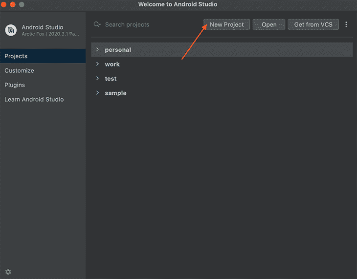

# Android 中使用 Jetpack 数据存储的通用持久数据存储

> 原文：<https://blog.logrocket.com/generic-persistent-data-storage-android-using-jetpack-datastore/>

## 介绍

无论如何，任何现代 Android 应用程序都会在设备上本地存储一些用户或配置数据。过去，开发人员依赖于 [SharedPreferences API](https://developer.android.com/reference/android/content/SharedPreferences) 以键值对的形式存储简单数据。

SharedPreferences API 的不足之处在于其读写操作的同步 API。由于 Android 不赞成在主线程上执行非 UI 工作，所以使用起来不安全。

在本文中，您将了解如何将[数据存储 API](https://developer.android.com/topic/libraries/architecture/datastore) 用于通用持久存储。这种方法将允许我们创建一个存储类，我们可以在其中指定任何我们希望保存为设备的键值对的数据类型。

我们将讨论以下主题:

## 使用 Jetpack 数据存储的优势

*   数据存储是完全异步的，使用 [Kotlin 协程](https://blog.logrocket.com/understanding-kotlin-coroutines/)
*   读写操作在后台完成，不用担心阻塞 UI
*   有了协程，就有了在使用数据存储时发出错误信号的机制

## 设置一个示例 Android 应用程序

在本演示中，我们将创建一个示例应用程序，从内存源获取应用程序的配置，并使用数据存储将它们保存在设备上。

在我们开始之前，有几个先决条件:

*   Android 移动开发和 Kotlin 的基础知识
*   安装在您电脑上的 Android Studio

让我们从创建一个空的 Android Studio 项目开始。



Click **New Project**


Select **Empty Activity**, then click **Next**


Specify the project and package names, then click **Finish**

将以下依赖项复制并粘贴到您的应用程序级`build.gradle`文件中。

```
implementation "androidx.datastore:datastore-preferences:1.0.0"
implementation "io.insert-koin:koin-android:3.1.4"
implementation 'com.google.code.gson:gson:2.8.7'

```

除了数据存储的依赖关系，还有额外的`koin`和`gson`依赖关系，它们分别用于依赖注入和序列化/反序列化。

插入这些依赖项后，Android Studio 会提示你同步项目。这通常需要几秒钟。

## 创建 Kotlin 存储接口

创建一个 Kotlin 接口文件，如下所示。

```
interface Storage<T> {

    fun insert(data: T): Flow<Int>

    fun insert(data: List<T>): Flow<Int>

    fun get(where: (T) -> Boolean): Flow<T>

    fun getAll(): Flow<List<T>>

    fun clearAll(): Flow<Int
}

```

我们使用存储接口来定义持久数据存储的操作。换句话说，这是一个持久存储将履行的契约。我们打算与接口关联的任何数据类型都应该能够在我们创建的接口中执行所有四种操作。

## 创建存储接口的具体实现

`PersistentStorage`是我们上一步定义的`Storage`接口的具体实现。

```
class PersistentStorage<T> constructor(
    private val gson: Gson,
    private val type: Type,
    private val dataStore: DataStore<Preferences>,
    private val preferenceKey: Preferences.Key<String>
) : Storage<T>

```

到现在为止，你会发现我们正在利用`Storage`和`PersistentStorage`中的泛型。这样做是为了实现类型安全。如果您的代码依赖通用持久存储来存储数据，那么只有一种数据类型会与特定的`Storage`实例相关联。

还需要许多对象依赖关系:

1.  如前所述，这将用于序列化/反序列化
2.  我们的实现为用户提供了保存多份相同类型数据的灵活性——能力越大，责任越大。用 GSON 读写列表会导致数据损坏或丢失，因为 Java 还没有提供表示泛型类型的方法，而且 GSON 不能识别在运行时使用哪种类型进行转换，所以我们使用类型标记来有效地将我们的对象转换成 JSON 字符串，反之亦然，没有任何复杂性
3.  Preference Key:这是一个 Android Jetpack 数据存储特定的对象；它基本上是从`DataStore`保存和检索数据的一个键
4.  `DataStore`:这将为写入和读取首选项提供 API

## 执行`getAll`操作

```
...
fun getAll(): Flow<List> {
    return dataStore.data.map { preferences ->
        val jsonString = preferences[preferenceKey] ?: EMPTY_JSON_STRING
        val elements = gson.fromJson<List>(jsonString, typeToken)
        elements
    }
}
...
```

`DataStore.data`用`Flow<Preferences>`返回一个首选项流，可以使用`map`操作符将其转换成一个`Flow<List<T>>`。在 map 块内部，我们首先尝试用 preference 键检索 JSON 字符串。

在值为`null`的情况下，我们将`EMPTY_JSON_STRING`分配给`jsonString`。`EMPTY_JSON_STRING`实际上是一个常量变量，定义如下:

```
private const val EMPTY_JSON_STRING = "[]"

```

GSON 会很方便地将它识别为有效的 JSON 字符串，它表示指定类型的空列表。这种方法更符合逻辑，而不是抛出一些可能导致应用程序崩溃的异常。我确信我们不希望这种情况发生在我们的应用程序中🙂

## 执行`insert`操作

```
fun insert(data: List<T>): Flow<Int> {
    return flow {
        val cachedDataClone = getAll().first().toMutableList()
        cachedDataClone.addAll(data)
        dataStore.edit {
            val jsonString = gson.toJson(cachedDataClone, type)
            it[preferenceKey] = jsonString
            emit(OPERATION_SUCCESS)
        }
    }
}

```

为了将数据写入数据存储，我们在`Datastore`上调用 edit。在 transform 块中，我们编辑了`MutablePreferences`，如上面的代码块所示。

为了避免用新数据覆盖旧数据，在用新创建的列表修改`MutablePreferences`之前，我们创建了一个包含旧数据和新数据的列表。

注意，我选择使用方法重载在 vararg 参数上插入单个或一个数据列表，因为 Kotlin 中的 vararg 在将数据列表复制到数组时需要额外的内存。

## 执行`get`操作

```
fun get(where: (T) -> Boolean): Flow {
    return getAll().map { cachedData ->
        cachedData.first(where)
    }
}
```

在这个操作中，我们希望从存储中获取与谓词`where`匹配的单个数据。这个谓词将在客户端实现。

## 执行`clearAll`操作

```
fun clearAll(): Flow<Int> {
    return flow {
        dataStore.edit {
            it.remove(preferenceKey)
            emit(OPERATION_SUCCESS)
        }
    }
}

```

顾名思义，我们希望擦除与`preference`键相关的数据。`emit(OPERATION_SUCCESS)`是我们通知客户操作成功的方式。

* * *

### 更多来自 LogRocket 的精彩文章:

* * *

至此，我们已经对通用存储 API 进行了公正的评价。接下来，我们将设置模型类和内存中的数据源。

## 创建`model`类和内存中的数据源

创建一个`Config`数据类，像这样:

```
data class Config(val type: String, val enable: Boolean)

```

为了简单起见，这个数据类只捕获一个配置类型及其相应的切换值。根据您的用例，您的 config 类可以描述更多的动作。

```
class DataSource {

    private val _configs = listOf(
        Config("in_app_billing", true),
        Config("log_in_required", false),
    )

    fun getConfigs(): Flow<List<Config>> {
        return flow {
            delay(500) // mock network delay
            emit(_configs)
        }
    }
}

```

由于缺少实际的服务器来连接，我们将配置存储在内存中，并在需要时进行检索。我们还包括了一个模拟实际网络调用的延迟。

## 如何用 Koin 注入依赖关系

虽然本文的重点是创建一个极简的演示 Android 应用程序，但采用一些现代实践也是可以的。我们将通过`ViewModel`实现获取配置的代码，并在必要时使用 [koin](https://insert-koin.io/) 提供对对象的依赖。

### 什么是 Koin？

Koin 是一个强大的 Kotlin 依赖注入框架。它有简单的 API，并且相对容易设置。

### 创建一个`ViewModel`类

```
class MainViewModel(
    private val dataSource: DataSource,
    private val configStorage: Storage<Config>
) : ViewModel() {

    init {
        loadConfigs()
    }

    private fun loadConfigs() = viewModelScope.launch {
        dataSource
            .getConfigs()
            .flatMapConcat(configStorage::insert)
            .collect()
    }
}

```

这里，我们从数据源获取配置，并将它们保存到我们的数据存储首选项中。目的是能够在本地检索这些配置，而不必对服务器进行额外的网络调用。发起这个请求最明显的地方是在应用程序启动时。

像这样定义你的 koin 模块:

```
private val Context.dataStore: DataStore<Preferences> by preferencesDataStore(name = "com.enyason.androiddatastoreexample.shared.preferences")

val dataAccessModule = module {

    single<Storage<Config>> {
        PersistentStorage(
            gson = get(),
            type = object : TypeToken<List<Config>>() {}.type,
            preferenceKey = stringPreferencesKey("config"),
            dataStore = androidContext().dataStore
        )
    }

    single { Gson() }

    viewModel {
        MainViewModel(
            dataSource = DataSource(),
            configStorage = get()
        )
    }

}

```

我们现在把重任委托给了 Koin。我们不再需要担心对象是如何被创建的——Koin 为我们处理所有的事情。

`single`定义告诉 Koin 在应用程序的整个生命周期中只创建一个指定类型的实例。`viewModel`定义告诉 Koin 只创建扩展 Android `ViewModel`类的对象类型。

## 初始化 Koin 以准备依赖关系

我们需要初始化 Koin，以便在应用程序请求之前准备好依赖项。创建一个`Application`类，如下所示:

```
class App : Application() {

    override fun onCreate() {
        super.onCreate()
        startKoin {
            androidContext([email protected])
            modules(dataAccessModule)
        }
    }
}

```

我们最终将所有的部分连接在一起，我们的项目现在应该可以像预期的那样工作了。请查看[GitHub repo](https://github.com/enyason/AndroidDataStoreExample)了解完整的项目设置。

## 采用 Android 数据存储的通用持久存储的优势

*   与 SharedPreferences API 不同，DataStore APIs 由 Kotlin 协同例程提供支持，这使得通用持久存储线程是安全的
*   对于任何对象类型，读写逻辑只编写一次
*   类型安全保证:`Storage<Config>`确定只检索`Config`类型的数据
*   旨在管理应用偏好的类通常会导致整体类，这是一种糟糕的软件工程实践。使用本文中讨论的通用方法，您可以用更少的代码完成更多的工作
*   我们可以有效地进行单元测试`PersistentStorage<T>`

## 结论

实现通用持久存储是使用 Android DataStore 管理数据的一种优雅方式。我上面讨论的收益超过了 Android 上使用 SharedPreference 的传统方法。我希望你喜欢这个教程😊

## 使用 [LogRocket](https://lp.logrocket.com/blg/signup) 消除传统错误报告的干扰

[](https://lp.logrocket.com/blg/signup)

[LogRocket](https://lp.logrocket.com/blg/signup) 是一个数字体验分析解决方案，它可以保护您免受数百个假阳性错误警报的影响，只针对几个真正重要的项目。LogRocket 会告诉您应用程序中实际影响用户的最具影响力的 bug 和 UX 问题。

然后，使用具有深层技术遥测的会话重放来确切地查看用户看到了什么以及是什么导致了问题，就像你在他们身后看一样。

LogRocket 自动聚合客户端错误、JS 异常、前端性能指标和用户交互。然后 LogRocket 使用机器学习来告诉你哪些问题正在影响大多数用户，并提供你需要修复它的上下文。

关注重要的 bug—[今天就试试 LogRocket】。](https://lp.logrocket.com/blg/signup-issue-free)

## LogRocket :即时重现你的安卓应用中的问题。

[](https://lp.logrocket.com/blg/kotlin-signup)

[LogRocket](https://lp.logrocket.com/blg/kotlin-signup) 是一款 Android 监控解决方案，可以帮助您即时重现问题，确定 bug 的优先级，并了解您的 Android 应用程序的性能。

LogRocket 还可以向你展示用户是如何与你的应用程序互动的，从而帮助你提高转化率和产品使用率。LogRocket 的产品分析功能揭示了用户不完成特定流程或不采用新功能的原因。

开始主动监控您的 Android 应用程序— [免费试用 LogRocket】。](hhttps://lp.logrocket.com/blg/kotlin-signup)