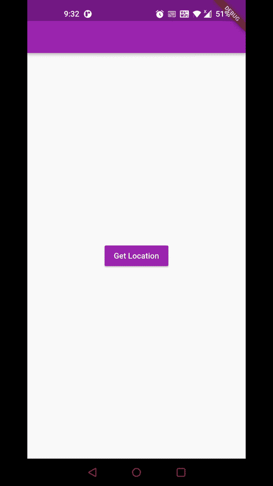

# Flutter - LogRocket 博客中的地理定位和地理编码

> 原文：<https://blog.logrocket.com/geolocation-geocoding-flutter/>

如今，发现用户位置对于移动应用程序来说是一个非常常见和强大的用例。如果您曾经尝试过在 Android 中实现位置，您就会知道样板代码会变得多么复杂和令人困惑。

然而，这与 Flutter 不一样——它有许多令人惊叹的包，为您抽象出样板代码，并使实现地理定位成为一个梦想。另一个好的方面是，你可以在 Android 和 iOS 上获得该功能。

让我们快速看一下我们今天正在构建什么来收集位置数据:



本文将带您了解两个最流行、最易用的地理定位 Flutter 包。

先说[地点](https://pub.dev/packages/location)，一个[扑最喜欢的](https://pub.dev/flutter/favorites)包。这个再简单不过了。只需三个简单的步骤，您就可以获得当前用户位置以及处理位置权限。

## 先决条件

在开始之前，让我们快速检查一下我们需要的东西:

*   [颤振 SDK](https://flutter.io/get-started/install/)
*   一个编辑；你可以使用 Visual Code 或者 Android Studio
*   至少初级的颤振知识

差不多就是这样！

## 使用颤振定位包

### 建立

将依赖项添加到您的`pubspec.yaml`文件中:

```
dependencies:
    location: ^4.2.0

```

由于 Android 和 iOS 对权限的处理不同，我们必须在每个平台上分别添加权限。

#### 适用于 Android

将以下位置权限添加到`AndroidManifest.xml`:

```
<uses-permission android:name="android.permission.ACCESS_COARSE_LOCATION" />
<uses-permission android:name="android.permission.ACCESS_FINE_LOCATION" />

```

如果您还想在后台访问用户的位置，请在后台访问位置之前使用`enableBackgroundMode({bool enable})` API，并在清单文件中添加后台权限:

```
<uses-permission android:name="android.permission.ACCESS_BACKGROUND_LOCATION"/>

```

#### 适用于 iOS

将以下位置权限添加到`Info.plist`:

```
<key>NSLocationWhenInUseUsageDescription</key>
<string>This app needs to access your location</string>

```

是你唯一需要的许可。这也允许你访问后台位置，唯一的警告是，当应用程序在后台访问位置时，状态栏中会显示一个蓝色的徽章。不像 Android，我们在后台添加了访问用户位置的单独权限。

### 位置权限

在请求用户定位之前，我们需要检查定位服务状态和许可状态，使用下面几行代码就可以轻松完成:

```
Location location = new Location();

bool _serviceEnabled;
PermissionStatus _permissionGranted;

_serviceEnabled = await location.serviceEnabled();
if (!_serviceEnabled) {
 _serviceEnabled = await location.requestService();
 if (!_serviceEnabled) {
   return null;
 }
}

_permissionGranted = await location.hasPermission();
if (_permissionGranted == PermissionStatus.denied) {
 _permissionGranted = await location.requestPermission();
 if (_permissionGranted != PermissionStatus.granted) {
   return null;
 }
}

```

首先，我们创建一个由`location`包提供的`Location()`对象，它反过来为我们提供了两个有用的方法。`serviceEnabled()`检查设备位置是否已启用或用户已手动禁用。

对于后者，我们显示一个本机提示，允许用户通过调用`requestService()`快速启用定位，然后我们再检查一次他们是否从提示中启用了定位。

一旦我们确定位置服务已启用，下一步就是通过调用`hasPermission()` that 来检查我们的应用程序是否有使用它的必要权限，它将返回`PermissionStatus`。

`PermissionStatus` 是一个枚举，可以有以下三个值之一:

*   `PermissionStatus.granted`:位置服务的许可已经被授予
*   `PermissionStatus.denied`:位置服务的许可被拒绝
*   `PermissionStatus.deniedForever`:位置服务的权限被用户永久拒绝。这仅适用于 iOS。在这种情况下，`requestPermission()`上不会显示任何对话框

如果状态为`denied,`，我们可以通过调用`requestPermission()`显示请求位置许可的系统提示。对于状态`granted`，我们可以马上访问位置，所以我们返回一个`null`。

如果您也想在后台访问用户位置，请使用`location.enableBackgroundMode(enable: **true**)`。

### 获取当前位置

如果定位服务可用，并且用户已经授予了定位权限，那么我们只需两行代码就可以获得用户位置——不，我不是在开玩笑:

```
LocationData _locationData;
_locationData = await location.getLocation();

```

`LocationData`类提供了以下位置信息:

```
class LocationData {
  final double latitude; // Latitude, in degrees
  final double longitude; // Longitude, in degrees
  final double accuracy; // Estimated horizontal accuracy of this location, radial, in meters
  final double altitude; // In meters above the WGS 84 reference ellipsoid
  final double speed; // In meters/second
  final double speedAccuracy; // In meters/second, always 0 on iOS
  final double heading; // Heading is the horizontal direction of travel of this device, in degrees
  final double time; // timestamp of the LocationData
  final bool isMock; // Is the location currently mocked
}

```

您还可以通过添加`onLocationChanged`监听器来获得持续的回调，以便在用户位置发生变化时监听位置更新，这是出租车应用程序、司机/乘客应用程序等的一个非常好的用例:

```
location.onLocationChanged.listen((LocationData currentLocation) {
  // current user location
});

```

*注意，如果您想停止收听更新，请不要忘记取消流媒体订阅。*

瞧啊。现在我们有了用户位置的当前纬度和经度值。

让我们利用这些纬度和经度值来获取用户的完整地址或[反向地理编码](https://en.wikipedia.org/wiki/Reverse_geocoding)。

为此，我们将使用另一个惊人的 Flutter 包: [geocode](https://pub.dev/packages/geocode) 。

## 使用 Flutter 地理编码包

### 建立

将依赖项添加到您的`pubspec.yaml`文件中:

```
dependencies:
    geocode: 1.0.1

```

### 获取地址

获取地址再简单不过了。就叫`reverseGeocoding(latitude: lat, longitude: lang)`。就是这样！带有空检查的完整函数如下所示:

```
Future<String> _getAddress(double? lat, double? lang) async {
 if (lat == null || lang == null) return "";
 GeoCode geoCode = GeoCode();
 Address address =
     await geoCode.reverseGeocoding(latitude: lat, longitude: lang);
 return "${address.streetAddress}, ${address.city}, ${address.countryName}, ${address.postal}";
}

```

没那么简单！

完整的代码如下所示:

```
class GetUserLocation extends StatefulWidget {
 GetUserLocation({Key? key, required this.title}) : super(key: key);
 final String title;

 @override
 _GetUserLocationState createState() => _GetUserLocationState();
}

class _GetUserLocationState extends State<GetUserLocation> {
 LocationData? currentLocation;
 String address = "";

 @override
 Widget build(BuildContext context) {
   return Scaffold(
     appBar: AppBar(),
     body: Center(
       child: Padding(
         padding: EdgeInsets.all(16.0),
         child: Column(
           mainAxisAlignment: MainAxisAlignment.center,
           children: <Widget>[
             if (currentLocation != null)
               Text(
                   "Location: ${currentLocation?.latitude}, ${currentLocation?.longitude}"),
             if (currentLocation != null) Text("Address: $address"),
             MaterialButton(
               onPressed: () {
                 _getLocation().then((value) {
                   LocationData? location = value;
                   _getAddress(location?.latitude, location?.longitude)
                       .then((value) {
                     setState(() {
                       currentLocation = location;
                       address = value;
                     });
                   });
                 });
               },
               color: Colors.purple,
               child: Text(
                 "Get Location",
                 style: TextStyle(color: Colors.white),
               ),
             ),
           ],
         ),
       ),
     ),
   );
 }

 Future<LocationData?> _getLocation() async {
   Location location = new Location();
   LocationData _locationData;

   bool _serviceEnabled;
   PermissionStatus _permissionGranted;

   _serviceEnabled = await location.serviceEnabled();
   if (!_serviceEnabled) {
     _serviceEnabled = await location.requestService();
     if (!_serviceEnabled) {
       return null;
     }
   }

   _permissionGranted = await location.hasPermission();
   if (_permissionGranted == PermissionStatus.denied) {
     _permissionGranted = await location.requestPermission();
     if (_permissionGranted != PermissionStatus.granted) {
       return null;
     }
   }

   _locationData = await location.getLocation();

   return _locationData;
 }

 Future<String> _getAddress(double? lat, double? lang) async {
   if (lat == null || lang == null) return "";
   GeoCode geoCode = GeoCode();
   Address address =
       await geoCode.reverseGeocoding(latitude: lat, longitude: lang);
   return "${address.streetAddress}, ${address.city}, ${address.countryName}, ${address.postal}";
 }
}

```

## 常见陷阱

尽管这些软件包让我们的生活变得更加轻松，我们也不必处理在 Android 和 iOS 中访问本地位置的复杂过程，但您可能会面临很多问题。让我们来看看它们以及可以帮助您解决这些问题的步骤:

*   应用程序泄漏内存:如果您正在连续收听位置更新，一旦您想要停止收听更新，请确保取消流订阅
*   用户必须接受位置许可以总是允许使用后台位置。Android 11 的“总是允许”选项没有出现在位置许可对话框提示中。用户必须从应用程序设置中手动启用它
*   用户可能在 iOS 上永远拒绝定位，因此`requestPermisssions()`不会显示要求定位权限的本机提示。确保处理这种边缘情况
*   用户可能会随时从应用程序设置中撤销位置权限，因此在访问位置数据之前，请确保在应用程序恢复时检查这些权限

## 结论

因为 Flutter 简化了访问位置的过程，所以作为开发者，我们可能很想马上把它添加到我们的应用程序中。但与此同时，我们需要确保我们的应用程序实际上适合请求用户位置并利用它为用户增加一些价值的用例，而不仅仅是向服务器发送位置数据。

随着即将推出的 Android 和 iOS 操作系统版本的安全性和隐私性的提高，访问位置数据而不向用户提供价值可能会导致你的应用被商店拒绝。有很多很好的使用案例可以使用用户位置，例如，根据用户位置对食品/送货应用程序的主屏幕进行个性化设置，显示根据用户当前位置的邻近程度订购的餐馆。取货/送货应用是最常见的用例。

你也可以在一个特定的屏幕上询问用户实际想要使用它的位置，而不是马上在主屏幕上询问。这让用户更清楚，他们不太可能拒绝位置许可。

谢谢你留下来，快乐的程序员！你可以在 [GitHub](https://github.com/BhavyaRattan/flutter_location_tutorial) 上访问本文中使用的示例应用程序。

## 使用 [LogRocket](https://lp.logrocket.com/blg/signup) 消除传统错误报告的干扰

[](https://lp.logrocket.com/blg/signup)

[LogRocket](https://lp.logrocket.com/blg/signup) 是一个数字体验分析解决方案，它可以保护您免受数百个假阳性错误警报的影响，只针对几个真正重要的项目。LogRocket 会告诉您应用程序中实际影响用户的最具影响力的 bug 和 UX 问题。

然后，使用具有深层技术遥测的会话重放来确切地查看用户看到了什么以及是什么导致了问题，就像你在他们身后看一样。

LogRocket 自动聚合客户端错误、JS 异常、前端性能指标和用户交互。然后 LogRocket 使用机器学习来告诉你哪些问题正在影响大多数用户，并提供你需要修复它的上下文。

关注重要的 bug—[今天就试试 LogRocket】。](https://lp.logrocket.com/blg/signup-issue-free)