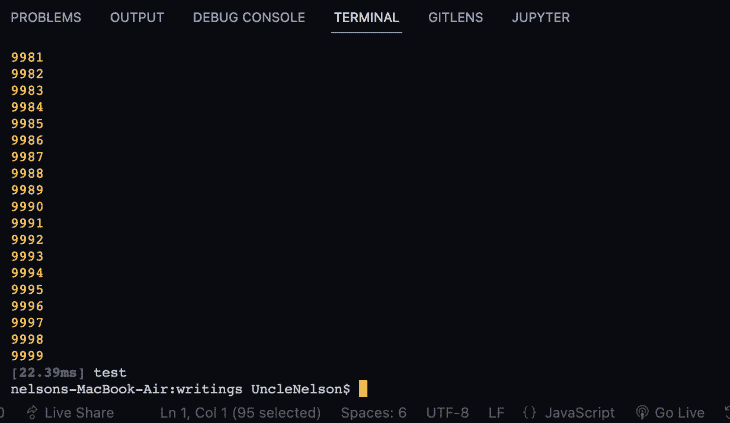
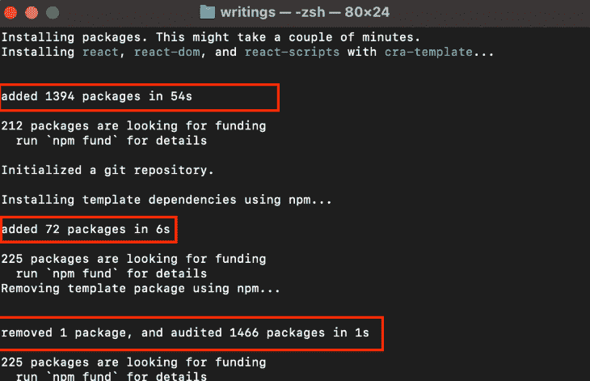

# Bun 和 React 入门

> 原文：<https://blog.logrocket.com/getting-started-bun-react/>

JavaScript 运行时环境通过提供对内置库和对象的访问，允许程序与外部世界进行交互。简单地说，运行时环境就是你的程序可以在其中执行的环境。

Bun 是一个相对较新的、快速的一体化 JavaScript 运行时。在本文中，我们将了解一些关于 Bun 的有趣事实，评估它与其他 JavaScript 运行时的比较，并了解如何使用 Bun 引导 React 项目。最后，我们将运行一些速度测试，看看 Bun 是否真的像其网站宣称的那样快！

*向前跳转:*

## Bun 是什么？

Bun 是一个新的轻量级 JavaScript 运行时，包括一个本地 bundler、transpiler、task runner 和 npm 客户端。它允许您捆绑、传输、安装和运行 JavaScript 和 TypeScript 项目。

Bun 是这个街区的新人。速度是最重要的，现在它是 JavaScript 运行时领域的有力竞争者。号称比 Node.js 和 Deno 功能更丰富，速度更快。贾里德·萨姆纳创作了 Bun，于 2021 年向公众发布。此后，它在 Github 上迅速积累了超过 30k 颗星星。

Bun 有很多特性:

*   包括 web APIs，如 Fetch、WebSocket 和 ReadableStream
*   传输每个文件，所以打字稿和 JSX 都工作
*   实现 Node.js 模块解析算法，这意味着可以使用 npm 包
*   包括一个快如闪电的 SQLite3 客户端
*   实现了 Node.js API 的大部分功能，这意味着许多本机节点模块可以简单地工作

## 我能用面包做什么？

Bun 的网站将其称为“[快速一体化 JavaScript 运行时。](https://bun.sh)“那我们还能用 Bun 做什么呢？让我们来看看。

### 运输文件

Bun 的 transpiler 是一个很棒的特性，可以转换类型脚本、JSX，甚至普通的 JavaScript。毕竟，为什么需要传输普通的 JavaScript 呢？

这是一个很好的问题。这就是 Bun 的性能增强特性发挥作用的地方。Bun 会在 JavaScript 执行之前自动优化它。

transpiling 特性仍在开发中，但开发人员打算在未来为 JavaScript 加入一个优化的二进制格式。这些优化可能会对 edge 应用和其他短命进程产生重大影响。

### 任务运行

Bun 的任务运行器类似于 Node.js 的任务运行器，但速度明显更快。您可以在节点项目中使用 Bun 的任务管理器来利用它的速度。任务运行器是一个必要的工具；默认情况下，Node/npm 和 Deno 都包含一个。此外，Bun 的任务管理器可以运行几乎任何脚本，而不需要 run 子命令，而 npm 只能对少数脚本名称这样做。

### 包装管理

Bun 的包管理器在性能方面更胜一筹。事实上，Bun 应该比 pnpm 或 Yarn 更快，原因如下:

*   因为 Bun 使用了符号链接，所以每个项目的包都被链接到一个集中的位置。这意味着后续项目中使用的模块不必再次下载
*   **二进制锁文件** : Bun 使用二进制锁文件；二进制文件通常被更快地序列化和反序列化，从而减少了包管理器所需的总时间
*   **Zig** : Bun 的包管理器是用 Zig 写的。这是一种非常快的语言；比大多数其他 JavaScript 包管理器使用的 JavaScript 快得多

## Bun 与 Node.js 和 Deno 相比如何？

Node.js 和 Deno 是两种最流行、最广泛使用的服务器端 JavaScript 运行时环境。让我们看看[和小圆面包](https://blog.logrocket.com/bun-javascript-runtime-taking-node-js-deno/)相比如何。

### 速度

根据 Bun 的创建者执行的[基准测试，Bun 在 I/O 密集型操作(如 HTTP 服务器和 SQL)中的性能优于 Node.js 和 Deno。Bun 的启动和运行速度比 Node.js 或 Deno 都要快。它还声称比两种服务器端 JavaScript 运行时都快得多，因为它使用了](https://github.com/oven-sh/bun) [JavaScriptCore](https://developer.apple.com/documentation/javascriptcore) 而不是 JavaScript V8，它使用 Zig 进行 API 编写，以及广泛的调优和基准测试。

这些说法可能看起来很奇怪——毕竟，这都是 JavaScript，而且 JavaScript V8 非常高效。然而，还记得我提到的 Bun 处理 I/O 密集型任务的速度吗？很大一部分执行时间花在了运行时的 API 上，而不是 JavaScript 引擎本身。在这些情况下，Bun 要快得多，因为它的 I/O 实现比 Node.js 或 Deno 快得多。

Bun 不仅仅是一个 JavaScript 运行时，它还附带了许多额外的特性，使它成为 web 开发人员的一个多功能和强大的工具。这些特性包括一个 bundler、一个 TypeScript transpiler 和一个 test runner，它们类似于 Deno 中的那些特性。

Bun 还包括一个 CSS-in-JS 工具、一个模板构建器和一个环境变量加载器。Bun 没有 web 库那样的代码重量限制，这使它能够提供性能优化和令人印象深刻的一系列特性。

### 和睦相处

Bun 是为节点兼容而构建的。它完全支持 CommonJS、Node-API 和一些 Node.js 模块。这个特性非常有用，因为它允许您访问庞大的 Node.js 生态系统。

## 使用 Bun 创建 React 应用程序

现在我们对 Bun 的许多特性有了更好的理解。让我们看看如何在 Bun JavaScript 运行时上创建一个 React 应用程序。

首先，在您的计算机上安装 Bun:

```
curl https://bun.sh/install | bash
```

如果你在 Mac 上，你必须做一些额外的步骤来让 Bun 工作。安装成功后，您将获得两个导出命令。按照以下步骤将这些命令添加到您的`Users`文件夹的`.zprofile`文件中:

1.  导航到您的电脑硬盘
2.  导航到`Users`文件夹
3.  导航到当前登录的用户
4.  找到名为`.zprofile`的文件
5.  在`zprofile`文件中添加命令并保存

使用以下命令检查是否安装了 Bun:

```
bun -v
```

现在，让我们安装 React。在您的终端中，导航到您想要保存 React 项目的位置，然后运行以下命令:

```
bun create react [app name]
```

接下来，导航到您的项目文件夹，然后运行下面的命令来启动本地开发服务器:

```
bun dev
```

如果您想要创建生产版本，请运行以下命令:

```
bun react-scripts build
```

Bun 不会像 Create React App 一样[为我们生成脚本命令，但是你可以通过简单地安装`react-scripts`来完成。这些预配置的 React 脚本运行以编程方式将 React JSX 语法转换为 JavaScript 所需的构建工具:](https://blog.logrocket.com/everything-you-need-know-about-react-scripts/)

```
bun a react-scripts -d
```

现在，只需将脚本添加到您的`package.json`文件中。然后，您可以开始运行脚本，就像在使用 npm 的 Create React App 项目中一样。

将以下脚本添加到您的`package.json`文件中:

```
{
  "scripts":{
    "start": "bun dev",
    "build": "react-scripts build"
  }
}

```

Bun 默认用 JavaScript 创建一个 React app。要使用 TypeScript，只需将文件扩展名从`.jsx`改为`.tsx`。

## 速度测试:Bun vs. Node.js

让我们执行一个简单的速度测试，看看哪个运行时执行代码最快。我们的程序只是一个简单的循环，在程序开始时，我们启动一个计时器，当循环结束时，我们结束计时器。

这是程序的代码:

```
console.time('test');
for (let i = 0; i < 10000; i++) console.log(i)
console.timeEnd("test");

```

让我们进行速度测试:

1.  创建一个文件，想怎么叫就怎么叫，姑且称之为`bun-test.js`。
2.  将上面的代码粘贴到文件中。
3.  打开您的终端并导航到您保存该文件的文件夹。
4.  在终端上运行程序。

要使用 Bun 运行程序，请使用以下命令:

```
bun [file name]
```

以下是用 Bun 运行程序的结果:



Bun `22.39ms`完成了这个循环。

现在，让我们看看 Node.js 完成同样的程序需要多长时间。

要使用 Node 运行程序，请使用以下命令:

```
node [file name]
```

以下是使用 Node 运行程序的结果:


节点`163.225ms`完成了同样的程序！

## 速度测试:Bun 与创建 React 应用程序

现在，让我们进行另一种速度测试。我们来看看 Bun 设置一个 React 应用和创建 React App 相比需要多长时间。

要使用 Bun 设置 React 应用程序，请打开您的终端和 cd，进入要安装 React 项目的文件夹:

```
bun create react [app name]
```

如下所示，Bun `17.78s`完成了一个全新 React 应用程序的所有依赖项的安装:


现在，让我们看看 Create React App 做同样的事情需要多长时间。

再次打开终端，将 cd 放入要安装 React 项目的文件夹:

```
npx create-react-app [app name]
```

如下所示，Create React App `61s`完成了一个新 React 应用程序的所有依赖项的安装:



***注意，*** *网速是上述测试中的一个主要因素，但两次测试使用了相同的网速*

## 结论

Bun 是一个强大的一体化 JavaScript 运行时，它为 web 开发人员提供了丰富的特性和工具。在本文中，我们深入研究了 Bun 的特性，并将它们与其他流行的 JavaScript 运行时进行了比较，比如 Node.js 和 Deno。我们还演示了如何用 Bun 创建一个简单的 React 应用程序，并运行测试来展示它与其他运行时相比有多快多高效。总的来说，Bun 是一个多功能的强大工具，它为希望构建快速、高效和可伸缩的应用程序的 web 开发人员提供了大量的好处。

## 使用 LogRocket 消除传统反应错误报告的噪音

[LogRocket](https://lp.logrocket.com/blg/react-signup-issue-free)

是一款 React analytics 解决方案，可保护您免受数百个误报错误警报的影响，只针对少数真正重要的项目。LogRocket 告诉您 React 应用程序中实际影响用户的最具影响力的 bug 和 UX 问题。

[ ](https://lp.logrocket.com/blg/react-signup-general) [  ](https://lp.logrocket.com/blg/react-signup-general) [LogRocket](https://lp.logrocket.com/blg/react-signup-issue-free)

自动聚合客户端错误、反应错误边界、还原状态、缓慢的组件加载时间、JS 异常、前端性能指标和用户交互。然后，LogRocket 使用机器学习来通知您影响大多数用户的最具影响力的问题，并提供您修复它所需的上下文。

关注重要的 React bug—[今天就试试 LogRocket】。](https://lp.logrocket.com/blg/react-signup-issue-free)