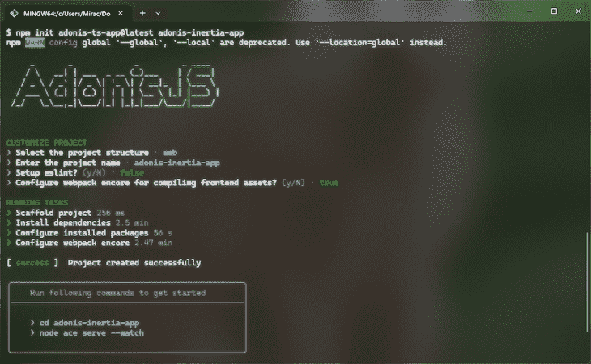
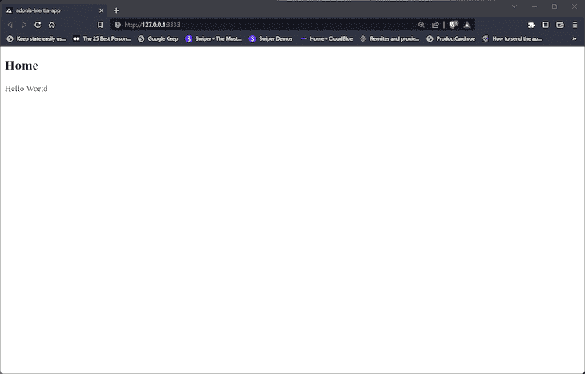
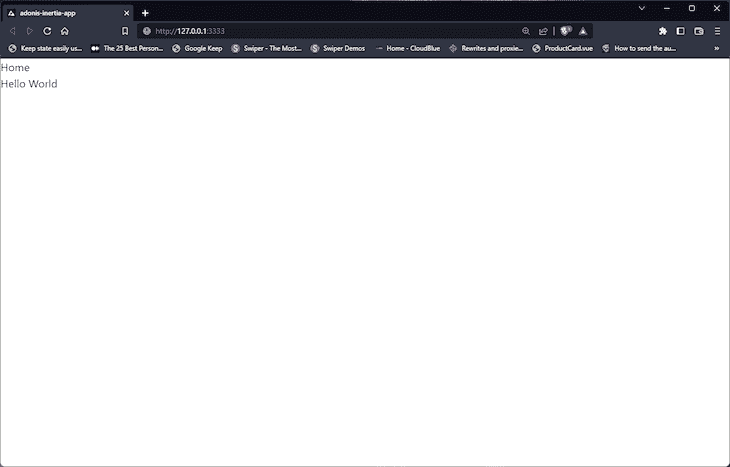
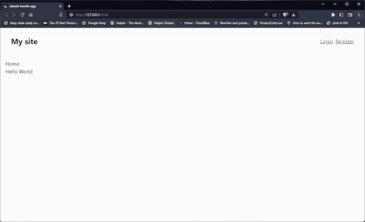
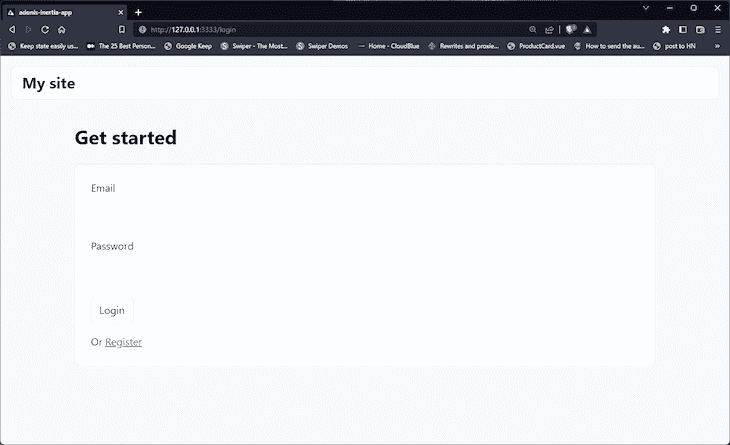
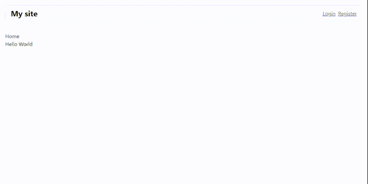
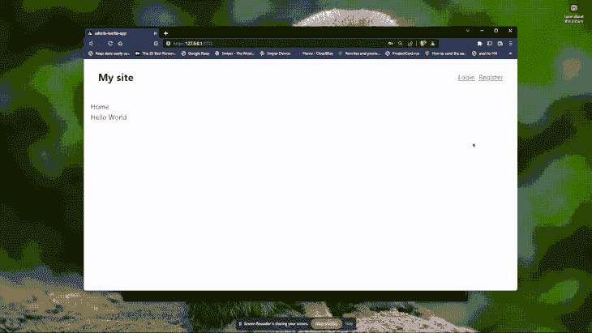

# Inertia.js、Vue.js 和 AdonisJs 入门

> 原文：<https://blog.logrocket.com/getting-started-inertia-js-vue-js-adonisjs/>

当构建 web 应用程序时，我们通常将后端与前端分离，并使用 [GraphQL 或 REST API](https://blog.logrocket.com/graphql-vs-rest-api-why-you-shouldnt-use-graphql/) 在它们之间提供通信。然而，这通常会使我们的应用程序变得复杂，并增加后端和前端的部署和托管责任。

即使在构建非解耦的服务器端 web 应用程序时，我们也会受到服务器端框架提供的前端模板选项的限制。如果有一种方法可以制作一个完全 JavaScript 的单页应用程序来取代服务器端呈现的视图，而不增加构建 API 和独立前端的复杂性，会怎么样？

本文将看看我们如何使用 [Inertia.js](https://inertiajs.com/) 、 [Vue.js](https://vuejs.org/) 和 [AdonisJs](https://adonisjs.com/) 来实现这一点。要继续学习并完成本教程，您需要安装 Node.js 并具备 JavaScript 和 [Vue.js](https://blog.logrocket.com/definitive-guide-vue-3-components/) 的[基础知识。](https://blog.logrocket.com/tag/vanilla-javascript/)

*向前跳转:*

## AdonisJs、Inertia.js 和 Vue.js 入门

### AdonisJs

AdonisJs 是一个流行的 [Node.js web 框架](https://blog.logrocket.com/comparing-top-node-js-frameworks-frontend-developers/)，用于构建 API 和服务器端应用。它以简洁直观的语法著称。AdonisJs 主要在前端使用[边缘模板框架](https://github.com/edge-js/edge)。然而，有了惯性，我们可以使用前端框架，如 [React](https://blog.logrocket.com/tag/react/) 、 [Vue](https://blog.logrocket.com/tag/vue/) 和[svelet](https://blog.logrocket.com/tag/svelte/)。

### 惯性. js

Inertia 是一个流行的库，用于在前端使用受支持的框架如 React、Vue 和 Svelte 构建全栈单页面应用程序(spa)。在后端，惯性通过使用适配器支持 [Laravel](https://blog.logrocket.com/whats-new-laravel-9/) 和其他框架。惯性还允许您创建行为类似于传统服务器呈现的应用程序的 SPA，同时利用 SPA 架构的优势。

### view . js-检视. js

在本文中，我们将使用 Vue.js 作为我们选择的框架。Vue.js 是一个流行的 JavaScript 框架，用于构建用户界面。它以简单和灵活著称，通常用于创建 spa 和渐进式 web 应用程序(pwa)。

## 设置 AdonisJs 和 Inertia.js 项目

要创建 AdonisJs 应用程序，请运行以下命令:

```
npm init [email protected] adonis-inertia-app

```



现在，我们可以使用下面的代码导航到我们的项目:

```
cd adonis-inertia-app

```

一旦完成，我们就可以配置 [inertiajs-adonisjs](https://github.com/eidellev/inertiajs-adonisjs) 适配器来为我们的 adonisjs 项目添加惯性。为此，请使用以下命令安装适配器:

```
npm i @eidellev/inertia-adonisjs

```

安装后，我们可以通过运行以下命令来添加一些配置:

```
$ node ace configure @eidellev/inertia-adonisjs

```

在安装过程中，我们会被问几个问题。我们将做出如下回应:

```
❯ Enter the edge file you would like to use as your entrypoint · app
❯ Would you like to install the Inertia.js client-side adapter? (Y/n) · true
❯ Would you like to use SSR? (y/N) · true
❯ Which client-side adapter would you like to set up? · @inertiajs/inertia-vue3

```

一旦配置完成并且安装了依赖项，我们就可以安装 vue-loader，以便在 webpack 中加载 vue 文件:

```
npm i -D vue-loader

```

现在，我们必须将它添加到`./webpack.config.js`中的 webpack `Encore`配置中:

```
// ./webpack.config.js
// ...
/*
|--------------------------------------------------------------------------
| Enable Vue loader
|--------------------------------------------------------------------------
|
| Uncomment the following lines of code to enable support for vue. Also make
| sure to install the required dependencies.
|
*/
Encore.enableVueLoader(() => {}, {
  version: 3,
  runtimeCompilerBuild: false,
  useJsx: false
})

```

### 配置 inertiajs-adonisjs 适配器中间件

让我们将 [inertiajs-adonisjs](https://github.com/eidellev/inertiajs-adonisjs#installation) 适配器中间件全局注册到我们的项目中，方法是将其添加到我们的`./start/kernel.ts`文件中:

```
// ./start/kernel.ts
// ...
/*
|--------------------------------------------------------------------------
| Global middleware
|--------------------------------------------------------------------------
|
| An array of global middleware, that will be executed in the order they
| are defined for every HTTP requests.
|
*/
Server.middleware.register([
  () => import('@ioc:Adonis/Core/BodyParser'),

  // import the inertia-adonis middleware
  () => import('@ioc:EidelLev/Inertia/Middleware'),
])

```

现在适配器已经在我们的项目中配置好了，我们可以将我们的 Vue 应用程序与 Inertia 连接起来。

### 将 Vue.js 应用程序连接到 Inertia.js

在我们的 Vue `./resources/js/app.js` app 文件中，导入`createInertiaApp`并添加一些配置，如下所示:

```
// ./resources/js/app.js
import { createApp, h } from "vue";
import { createInertiaApp } from "@inertiajs/inertia-vue3";
import '../css/app.css'
createInertiaApp({
  resolve: (name) => require(`./pages/${name}`),
  setup({ el, App, props, plugin }) {
    createApp({ render: () => h(App, props) })
      .use(plugin)
      .mount(el);
  },
});

```

`resolve`功能要求`./resources/js/Pages/`中的`page`组件在服务器端根据设置名称进行渲染。在`setup`函数中，我们调用`createApp()`来渲染带有`props`和`plugins`的 app。

### 如何设置服务器端呈现

为了让[服务器端渲染](https://github.com/eidellev/inertiajs-adonisjs#server-side-rendering)工作，我们将安装一些依赖项:

```
npm install -D @vue/server-renderer @inertiajs/server

```

然后，我们必须在一个新文件中添加一个特定于 SSR 的额外脚本入口点，如下所示:

```
./resources/js/ssr.js
// ./resources/js/ssr.js
import { createSSRApp, h } from "vue";
import { renderToString } from "@vue/server-renderer";
import { createInertiaApp } from "@inertiajs/inertia-vue3";
export default function render(page) {
  return createInertiaApp({
    page,
    render: renderToString,
    resolve: (name) => require(`./Pages/${name}`),
    setup({ app, props, plugin }) {
      return createSSRApp({
        render: () => h(app, props),
      }).use(plugin);
    },
  });
}

```

我们还将在`./webpack.ssr.config.js`中启用 [Vue 加载器](https://blog.logrocket.com/vue-loader-tutorial/):

```
// ./webpack.ssr.config.js
/*
|--------------------------------------------------------------------------
| Enable Vue loader
|--------------------------------------------------------------------------
|
| Uncomment the following lines of code to enable support for vue. Also make
| sure to install the required dependencies.
|
*/
Encore.enableVueLoader(() => {}, {
  version: 3,
  runtimeCompilerBuild: false,
  useJsx: false,
})

```

## 设置路由

设置路线非常简单。为了在我们的惯性和 Vue 应用程序中设置路线，我们将注册路线并使用`inertia.render()`来呈现它们。在这一节中，我们将看到如何创建`homepage`组件并在`routes.ts`文件中设置路线。我们还将看到如何将道具传递给我们的路线。

### 用`/`创建路线的主页

让我们通过创建一个`./resources/js/Pages/Home.vue`页面来为`/`创建一条新路线:

```
<!-- ./resources/js/Pages/Home.vue -->
<template>
  <section>
    <header>
      <h1>Home</h1>
      <p>Home page</p>
    </header>
  </section>
</template>

```

现在我们有了一个用于`Home`的组件，我们可以在`./start/routes.ts`中注册路线:

```
// ./start/routes.ts
import Route from '@ioc:Adonis/Core/Route'
Route.get('/', async ({ inertia }) => {
  return inertia.render('Home')
})

```

### 传递道具

我们还可以从`./start/routes.ts` routes 文件向组件传递道具，如下所示:

```
// ./start/routes.ts
// ...
Route.get("/", async ({ inertia }) => {
  return inertia.render("Home", {
    title: "Home",
    message: "Hello World",
  });
});

```

然后，在`./resources/js/Pages/Home.vue`中，添加以下代码:

```
<!-- ./resources/js/Pages/Home.vue -->
<script>
export default {
  props: {
    // Define props here
    title: String,
    message: String,
  },
};
</script>
<template>
  <section>
    <header>
      <h1>{{ title }}</h1>
      <p>{{ message }}</p>
    </header>
  </section>
</template>

```

通过运行`npm run dev`启动应用程序，并通过在新终端中运行`node ace ssr:watch`启动 SSR 服务器。我们应该有这样的东西:



厉害！

## 如何设置顺风 CSS

要在我们的应用程序中设置 [Tailwind CSS](https://blog.logrocket.com/applying-dynamic-styles-tailwind-css/) ，我们必须安装以下软件包:

```
npm i -D postcss-loader tailwindcss

```

接下来，我们使用下面的命令生成配置文件:

```
npx tailwindcss init

```

这就生成了一个.`/tailwind.config.js`文件，为顺风 CSS 扫描应用顺风案例指定文件，并支持[摇树](https://blog.logrocket.com/tree-shaking-and-code-splitting-in-webpack/)。在`./tailwind.config.js`文件中，添加以下代码:

```
// ./tailwind.config.js
/** @type {import('tailwindcss').Config} */
module.exports = {
  content: ["./resources/**/*.{edge,js,ts,vue,jsx,tsx}"],
  theme: {
    extend: {},
  },
  plugins: [],
};

```

### 配置 PostCSS

现在，我们将配置 [PostCSS](https://blog.logrocket.com/using-postcss-media-queries-level4/) 。首先，启用`./webpack.config.js`中的`PostCSSLoader`:

```
//./webpack.config.js
/*
|--------------------------------------------------------------------------
| CSS loaders
|--------------------------------------------------------------------------
|
| Uncomment one of the following line of code to enable support for
| PostCSS or CSS.
|
*/
Encore.enablePostCssLoader()

```

接下来，我们将创建一个`./postcss.config.js`文件来调用顺风 CSS `plugin`:

```
// ./postcss.config.js
module.exports = {
  plugins: [
    require('tailwindcss')()
  ]
}

```

最后，我们将向`./resources/css/app.css`添加顺风指令:

```
/* ./resources/css/app.css */
@tailwind base;
@tailwind components;
@tailwind utilities;

```

现在，当我们重新启动我们的开发服务器时，我们应该看到所有的默认样式都被重置为 Tailwind CSS 样式:



## 创建 Vue.js 组件

我们可以像普通的 Vue 应用程序一样创建组件并添加到我们的应用程序中。现在，让我们制作`SiteNav`和`SiteHeader`组件。

创建一个新文件`./resources/js/components/SiteNav.vue`，如下图所示:

```
→- ./resources/js/components/SiteNav.vue -->
<template>
  <nav class="site-nav">
    <div class="wrapper">
      <ul class="links">
        <li class="link">
          <Link href="/login">Login</Link>
        </li>
        <li class="link">
          <Link href="/register">Register</Link>
        </li>
      </ul>
    </div>
  </nav>
</template>
<script setup>
import { Link } from "@inertiajs/inertia-vue3";
</script>
<style scoped>
.site-nav .links {
  @apply flex gap-2;
}
.links .link {
  @apply text-gray-600;
}
</style>

```

在上面的代码中，我们使用惯性组件`Link`来链接路线。

### `SiteHeader`组件

现在，为了创建`SiteHeader`组件，创建一个名为`./resources/js/components/SiteHeader.vue`的新文件:

```
<!-- ./resources/js/components/SiteHeader.vue -->
<template>
  <header class="site-header">
    <div class="wrapper">
      <figure class="site-logo">
        <span class="font-bold text-2xl">My site</span>
      </figure>
      <slot />
    </div>
  </header>
</template>
<style scoped>
.site-header {
  @apply sticky top-0 left-0 w-full p-4;
}
.site-header > .wrapper {
  @apply flex justify-between items-center p-4 py-2 bg-white max-w-6xl m-auto rounded-lg shadow-md;
}
</style>

```

在这里，我们创建了一个带有站点徽标的`.site-logo`元素的`header`元素，并用一些基本样式将其放置在页面的顶部。

### 使组件全球化

通过在我们的`./resources/js/app.js`中注册我们的组件，我们可以让它们全球可访问。这使得我们不必将它们导入到每个文件中。将以下代码添加到您的`./resources/js/app.js`文件夹中:

```
// ./resources/js/app.js
import { createApp, h } from "vue";
import { createInertiaApp } from "@inertiajs/inertia-vue3";
import DefaultLayout from "./layouts/Default.vue";
import SiteNav from "./components/SiteNav.vue";
import SiteHeader from "./components/SiteHeader.vue";
import "../css/app.css";
createInertiaApp({
  resolve: (name) => {
    const page = require(`./pages/${name}`).default;
    // If the page doesn't have a layout, use the default layout.
    if (!page.layout) {
      page.layout = DefaultLayout;
    }
    return page;
  },
  setup({ el, App, props, plugin }) {
    createApp({ render: () => h(App, props) })
      .use(plugin)
      .component("site-nav", SiteNav)
      .component("site-header", SiteHeader)
      .mount(el);
  },
});

```

这里，我们导入了`SiteHeader`和`SiteNav`组件，并在`component`方法中注册了它们。在下一节中，我们将把这些组件添加到布局中。

## 设置默认布局和每页布局

首先，我们通过向我们的`./resources/js/layouts/Default.vue`文件添加以下代码来创建一个默认布局文件:

```
<!-- ./resources/js/layouts/Default.vue -->
<template>
  <main>
    <site-header>
      <site-nav />
    </site-header>
    <slot />
  </main>
</template>

```

这里，我们有`<slot />`来呈现被路由页面的视图。

### Inertia.js `DefaultLayout`

在我们的`./resources/js/app.js`中，我们将导入刚刚创建的布局，并将其添加到要呈现的页面的`layout`属性中:

```
// ./resources/js/app.js
import { createApp, h } from "vue";
import { createInertiaApp } from "@inertiajs/inertia-vue3";
import DefaultLayout from "./layouts/Default.vue";
import "../css/app.css";
createInertiaApp({
  resolve: (name) => {
    const page = require(`./pages/${name}`).default;
    // If the page doesn't have a layout, use the default layout.
    if (!page.layout) {
      page.layout = DefaultLayout;
    }
    return page;
  },
  setup({ el, App, props, plugin }) {
    createApp({ render: () => h(App, props) })
      .use(plugin)
      .mount(el);
  },
});

```

这样，每个页面都将使用这种布局呈现。这是我们的主页现在的样子:



### 每页布局

为了定义每个页面的布局，我们将把页面文件中的`layout`组件分配给`layout`属性。例如，如果我们在`./resources/js/layouts/AppLayout.vue`中创建新的布局，我们可以添加要在每条路线上显示的`<site-header />`组件，并且`<slot>`元素将呈现当前路线的内容。这应该是这样的:

```
<!-- ./resources/js/layouts/AppLayout.vue -->
<template>
  <main>
    <site-header />
    <section class="auth-section">
      <header class="auth-header">
        <h1 class="font-bold text-3xl">
          Get started
        </h1>
      </header>
      <div class="wrapper">
        <slot />
      </div>
    </section>
  </main>
</template>
<style scoped>
.auth-section > .auth-header {
  @apply pt-6 max-w-4xl m-auto;
}
.auth-section > .wrapper{
  @apply py-6 max-w-4xl m-auto;
}
</style>

```

接下来，我们可以用一个简单的表单在`./resources/js/pages/Login.vue`中创建一个`Login`页面:

```
<!-- ./resources/js/pages/Login.vue -->
<template>
  <div class="form-cont">
    <form class="auth-form">
      <div class="wrapper">
        <div class="form-control">
          <label for="email">Email</label>
          <input type="email" id="email" class="form-input" />
        </div>
        <div class="form-control">
          <label for="password">Password</label>
          <input type="password" id="password" class="form-input" />
        </div>
        <div class="action-cont">
          <button type="submit" class="cta">Login</button>
        </div>
        <span> Or <Link class="link" href="/register">Register</Link> </span>
      </div>
    </form>
  </div>
</template>
<script>
import { Link } from "@inertiajs/inertia-vue3";
import AuthLayout from "../layouts/Auth.vue";
export default {
  layout: AuthLayout,
  components: {
    Link,
  },
};
</script>
<style scoped>
.auth-form {
  @apply relative p-6 bg-white border border-slate-200 rounded-lg;
}
.auth-form > .wrapper {
  @apply flex flex-col gap-4;
}
</style>

```

在这里，您可以看到我们通过在`layout`属性中导入和定义它来定义这个页面的`Layout`。现在，我们可以将此页面添加到我们在`./start/routes.ts`的路线中:

```
// ./start/routes.ts
import Route from "@ioc:Adonis/Core/Route";
Route.get("/", async ({ inertia }) => {
  return inertia.render("Home", {
    title: "Home",
    message: "Hello World",
  });
});
Route.get("/login", async ({ inertia }) => {
  return inertia.render("Login", {
    title: "Login",
  });
});

```

有了它，我们应该有这样的东西:



在下一节中，我们将看到如何在应用程序中使用 Inertia.js 表单。

## 如何使用 Inertia.js 表单帮助器

惯性支持处理使用[异步 HTTP 请求](https://blog.logrocket.com/axios-vs-fetch-best-http-requests/)的表单提交。这允许我们使用响应来相应地更新我们的页面。这个响应就是 Inertia.js form helper，它使得在 Inertia.js 应用程序中管理表单和执行常见的表单相关任务变得更加容易。让我们回顾一下在应用程序中使用 Inertia.js 表单帮助器管理表单的基本步骤。

### 创建`FormInput`组件

要创建`FormInput`组件，创建一个新的`./resources/js/components/FormInput.vue`文件:

```
<!-- ./resources/js/components/FormInput.vue -->
<template>
  <div class="form-control">
    <label v-if="label" for="password">{{ label }}</label>
    <input
      :type="type"
      v-model="inputVal"
      :placeholder="placeholder"
      class="form-input"
    />
  </div>
</template>
<script setup>
import { computed } from "vue";
const props = defineProps({
  type: {
    type: String,
    default: "text",
  },
  label: String,
  placeholder: String,
  modelValue: String,
});
const emit = defineEmits(["update:modelValue"]);
const inputVal = computed({
  get() {
    return props.modelValue;
  },
  set(value) {
    emit("update:modelValue", value);
  },
});
</script>

```

接下来，我们将在我们的`auth`页面中使用这个组件。现在，让我们创建一个新的`Register`页面。

### 构建`Register`页面

要创建一个`Register`页面，创建一个新的`./resources/js/pages/Register.vue`文件，如下所示:

```
<!-- ./resources/js/pages/Register.vue -->
<template>
  <div class="form-cont">
    <form @submit.prevent="form.post('/register')" class="auth-form">
      <div class="wrapper">
        <FormInput label="Email" type="email" v-model="form.email" />
        <FormInput label="Password" type="password" v-model="form.password" />
        <div class="action-cont">
          <button attr-type="submit" class="cta">Register</button>
        </div>
        <span> Or <Link class="link" href="/login">Login</Link> </span>
      </div>
    </form>
  </div>
</template>
<script>
import { Link } from "@inertiajs/inertia-vue3";
import FormInput from "../components/FormInput.vue";
import AuthLayout from "../layouts/Auth.vue";
import { useForm } from "@inertiajs/inertia-vue3";
export default {
  layout: AuthLayout,
  components: {
    Link,
    FormInput,
  },
  setup() {
    const form = useForm({
      email: "",
      password: "",
    });
    return {
      form,
    };
  },
};
</script>

```

这与我们在`login`页面中看到的非常相似。这里，我们使用我们之前创建的新的`FormInput`组件。我们还使用了来自`"@inertiajs/inertia-vue3"`的`useForm helper: import { useForm }`，我们将其分配给`setup()`中的表单。

这样，当使用`form.post()`提交表单时，我们可以发送一个`POST`请求:

```
<form @submit.prevent="form.post('/register')" class="auth-form">

```

### 更新`Routes`

现在，让我们更新我们的`Register` `GET`和`POST`请求路线。为此，在`./start.routes.ts`文件中输入以下内容:

```
// ./start/routes.ts
Route.get("/register", async ({ inertia }) => {
  return inertia.render("Register", {
    title: "Regsiter",
  });
});
Route.post("/register", async ({ request, response }) => {
  console.log({
    registerBody: request.body(),
  });
  return response.redirect("/");
});

```

在`Route.post`中，我们注销了`request`主体，并将它们重定向到`home`路线:



这样，我们的控制台中应该会有这样的内容:


我们也可以对`Login`页面做同样的事情。让我们将我们的`FormInput`组件添加到`./resources/js/pages/Login.vue`中的`Login`中:

```
<!-- ./resources/js/pages/Login.vue -->
<template>
  <div class="form-cont">
    <form @submit.prevent="form.post('/login')" class="auth-form">
      <div class="wrapper">
        <FormInput label="Email" type="email" v-model="form.email" />
        <FormInput label="Password" type="password" v-model="form.password" />
        <div class="action-cont">
          <button attr-type="submit" class="cta">Login</button>
        </div>
        <span> Or <Link class="link" href="/register">Register</Link> </span>
      </div>
    </form>
  </div>
</template>
<script>
import { Link } from "@inertiajs/inertia-vue3";
import FormInput from "../components/FormInput.vue";
import AuthLayout from "../layouts/Auth.vue";
import { useForm } from "@inertiajs/inertia-vue3";
export default {
  layout: AuthLayout,
  components: {
    Link,
    FormInput,
  },
  setup() {
    const form = useForm({
      email: "",
      password: "",
    });
    return {
      form,
    };
  },
};
</script>

```

然后在我们的`./start/routes.ts`文件中，我们可以添加`POST`路线:

```
// ./start/routes.ts
// ...
Route.post("/login", async ({ request, response }) => {
  console.log({
    registerBody: request.body(),
  });
  return response.redirect("/");
});

```

现在，我们将有一些类似于我们的注册页面:



## 结论

本文介绍了 AdonisJs、Inertia.js 和 Vue.js 的入门知识。这些伟大的技术可以帮助开发人员创建快速、高性能的 web 应用程序。

通过遵循本文中概述的步骤，您可以轻松地设置这些技术并开始构建您的应用程序。由于能够添加服务器端呈现、用于样式化的 Tailwind CSS 和用于表单提交的 Inertia.js 表单助手，这些技术为构建现代 web 应用程序提供了全面的解决方案。

无论你是经验丰富的开发人员还是刚刚入门，AdonisJs、Inertia.js 和 Vue.js 都值得你为下一个项目考虑。

## 像用户一样体验您的 Vue 应用

调试 Vue.js 应用程序可能会很困难，尤其是当用户会话期间有几十个(如果不是几百个)突变时。如果您对监视和跟踪生产中所有用户的 Vue 突变感兴趣，

[try LogRocket](https://lp.logrocket.com/blg/vue-signup)

.

[](https://lp.logrocket.com/blg/vue-signup)[https://logrocket.com/signup/](https://lp.logrocket.com/blg/vue-signup)

LogRocket 就像是网络和移动应用程序的 DVR，记录你的 Vue 应用程序中发生的一切，包括网络请求、JavaScript 错误、性能问题等等。您可以汇总并报告问题发生时应用程序的状态，而不是猜测问题发生的原因。

LogRocket Vuex 插件将 Vuex 突变记录到 LogRocket 控制台，为您提供导致错误的环境，以及出现问题时应用程序的状态。

现代化您调试 Vue 应用的方式- [开始免费监控](https://lp.logrocket.com/blg/vue-signup)。