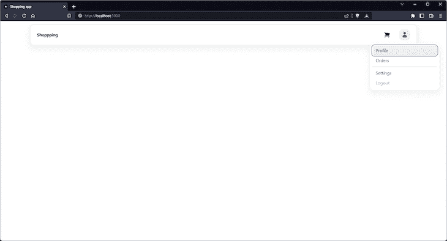
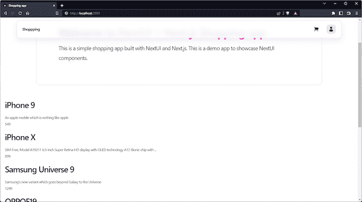
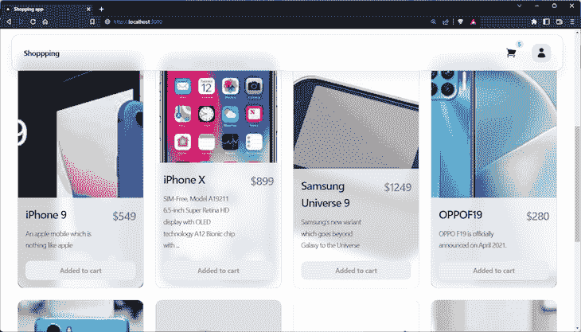
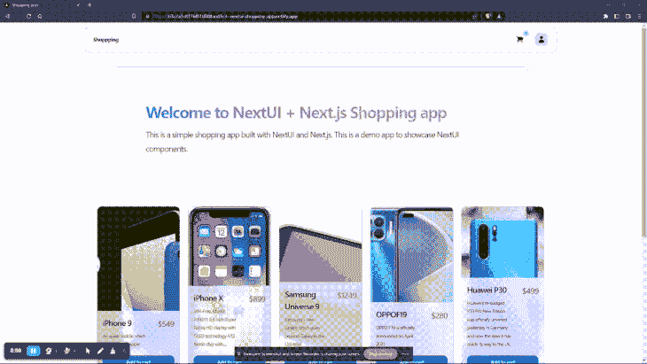

# NextUI 和 Next.js 入门

> 原文：<https://blog.logrocket.com/getting-started-nextui-next-js/>

让你的项目从构思阶段进入开发阶段，然后尽可能快地投入生产，同时保持它们的功能性和美观性是令人生畏的，尤其是当它不涉及专门的开发团队时。

幸运的是，UI 库为开发人员提供了预构建的功能和组件集，可以在应用程序中添加和修改这些功能和组件。这可能非常有用。

在本文中，我们将看看 React 和 Next.js 的新 UI 库， [NextUI](https://nextui.org/docs/guide/getting-started) 。像 [Material-UI](https://blog.logrocket.com/getting-started-with-mui-and-next-js/) (MUI)，一个流行的 UI 或者组件库，NextUI 在很多应用中提供了很多可重用的组件，比如一个`navbar`、`tooltip`、`tab`、`pagination`组件等等。

我们将探索如何使用这个 UI 库来构建一个简单的电子商务应用程序。为了跟上进度，您应该对 [JavaScript](https://blog.logrocket.com/javascript-concepts-before-learning-react/) 、 [React](https://blog.logrocket.com/tag/react/) 和 [Next.js](https://blog.logrocket.com/creating-website-next-js-react/) 有一个基本的了解。你还需要在你的机器上安装 [Node.js LTS v18.13](https://nodejs.org/en/download/) 和 [VS 代码](https://code.visualstudio.com/)。

*向前跳转:*

## 什么是 UI 库？

在大多数情况下，UI 库只是一个预先构建的 UI 组件和元素的集合，可以集成到一个项目中，并在某种程度上进行定制，以促进产品开发。

这些 UI 组件和元素通常包括`Button`、`Navbar`、`Tooltip`、`Tab`组件等等。存在许多 UI 库，包括基于流行的[引导 CSS 库](https://www.youtube.com/watch?v=NlZUtfNVAkI)构建的 [React 引导](https://react-bootstrap.github.io/)，以及 React 的[最流行的 UI 组件库](https://blog.logrocket.com/comparing-popular-react-component-libraries/)之一 [Material-UI](https://material-ui.com/) 。

### 什么是 NextUI？

[根据文档](https://nextui.org/docs/guide/getting-started)，NextUI 是一个 React UI 库，无论你的设计经验如何，它都可以让你制作漂亮、现代、快速的网站/应用程序。它由[反应](https://reactjs.org/)和[缝线](https://stitches.dev/)创造，基于[反应咏叹调](https://react-spectrum.adobe.com/react-aria/index.html)，灵感来自 [Vuesax](https://vuesax.com/) 。

### 为什么选择 NextUI？

出于几个不同的原因，NextUI 是一个很好的选择。NextUI 是一个设计精美的 UI 框架，具有视觉上吸引人的组件风格默认值。NextUI 也有可访问的组件，并遵循 [WAI-ARIA 标准](https://www.w3.org/WAI/standards-guidelines/aria/)，提供键盘支持和逻辑焦点管理。

NextUI 构建在 [CSS-in-JS](https://blog.logrocket.com/css-vs-css-in-js/) 库 [Stitches](https://blog.logrocket.com/stitches-server-rendered-css-in-js/) 之上。您可以使用`css` prop、`styled`函数或本机 [CSS 选择器](https://blog.logrocket.com/level-up-your-css-selector-skills/)以多种方式定制任何组件。

NextUI 还提供了一种简单的方法来[定制默认主题](https://nextui.org/docs/theme/customize-theme)，改变颜色、字体、断点和[等等](https://nextui.org/docs/guide/getting-started)。NextUI 也有一个黑暗主题，你只需要几行代码就可以把它应用到你的应用程序中。

## 设置 Next.js 和 NextUI

我们将探索如何使用 NextUI UI 库中的 UI 组件来构建一个简单的电子商务站点。让我们按照[的步骤来构建一个 Next.js 应用](https://nextjs.org/docs#automatic-setup)。你可以在这里找到完整代码[，在这里](https://github.com/miracleonyenma/nextui-shopping-app)预览最终项目[。让我们开始吧。](https://nextui-shopping-app.netlify.app/)

首先，导航到选择的文件夹并运行命令:

```
npx [email protected]
# or
yarn create next-app
# or
pnpm create next-app

```

安装后，通过运行以下命令之一，导航到新创建的目录以安装 NextUI 包:

```
yarn add @nextui-org/react
# or
npm i @nextui-org/react

```

为了让 NextUI 正常工作，我们需要在应用程序的根目录下设置`NextUIProvider`。我们将转到`pages/_app.js`并添加以下内容:

```
// ./pages/_app.js

// import `NextUIProvider` component
import { NextUIProvider } from "@nextui-org/react";
import "../styles/globals.css";
function MyApp({ Component, pageProps }) {
  return (
    // Use at the root of our app
    <NextUIProvider>
      <Component {...pageProps} />
    </NextUIProvider>
  );
}
export default MyApp;

Next, we'll create a new file ./pages/_document.js and add the following:

// ./pages/_document.js

import Document, { Html, Head, Main, NextScript } from 'next/document';
import { CssBaseline } from '@nextui-org/react';

class MyDocument extends Document {
  static async getInitialProps(ctx) {
    const initialProps = await Document.getInitialProps(ctx);
    return {
      ...initialProps,
      styles: <>{initialProps.styles}</>
    };
  }

  render() {
    return (
      <Html>
        <Head>{CssBaseline.flush()}</Head>
        <body>
          <Main />
          <NextScript />
        </body>
      </Html>
    );
  }
}

export default MyDocument;

```

既然已经安装并设置了 NextUI，我们可以使用任何可用的组件并构建我们的应用程序。

## 构建我们的应用程序

现在，我们将使用 NextUI `Navbar`组件构建我们的`SiteHeader`。首先，创建一个名为`./components/SiteHeader.jsx`的新文件:

```
// ./components/SiteHeader.jsx
import { Avatar, Button, Dropdown, Navbar, Text } from "@nextui-org/react";
import { ShoppingCartIcon, UserIcon } from "@heroicons/react/24/solid";
import Link from "next/link";
const SiteHeader = () => {
  return (
    <Navbar variant="floating" isBordered>
      <Navbar.Brand>
        <Link href="/">
          <Text weight="bold">Shoppping</Text>
        </Link>
      </Navbar.Brand>
      <Navbar.Content>
        <Navbar.Link>
          <Button as={Link} href="/cart" auto css={{ padding: "$4" }} light>
            <ShoppingCartIcon width={24} />
          </Button>
        </Navbar.Link>
        <Navbar.Item>
          <Dropdown>
            <Dropdown.Trigger>
              <Avatar squared icon={<UserIcon width={24} />} />
            </Dropdown.Trigger>
            <Dropdown.Menu>
              <Dropdown.Item key="Profile">Profile</Dropdown.Item>
              <Dropdown.Item key="Orders">Orders</Dropdown.Item>
              <Dropdown.Section>
                <Dropdown.Item key="Settings">Settings</Dropdown.Item>
                <Dropdown.Item key="Logout" color="error">
                  Logout
                </Dropdown.Item>
              </Dropdown.Section>
            </Dropdown.Menu>
          </Dropdown>
        </Navbar.Item>
      </Navbar.Content>
    </Navbar>
  );
};
export default SiteHeader;

```

在这里，我们导入了 [`NextUI Navbar`组件](https://nextui.org/docs/components/navbar)，它包含了我们所有的其他 [`Avatar`](https://nextui.org/docs/components/avatar) 、 [`Button`](https://nextui.org/docs/components/button) 、 [`Dropdown`](https://nextui.org/docs/components/dropdown) 和 [`Text`](https://nextui.org/docs/components/text) 组件。

如果仔细观察，您会注意到主`Navbar`组件由以下子组件组成:

*   `Navbar.Brand`:一个简单灵活的品牌内容包装器
*   `Navbar.Content`:为`navbar`内容项提供状态和变量的包装器
*   `Navbar.Item`:必须是`Navbar.Content`的直接下级的个别项目
*   `Navbar.Link`:必须是`Navbar.Content`的直接下级的`link`项

你可以在这里查看更多关于`Navbar`组件[的解剖。](https://nextui.org/docs/components/navbar#anatomy)

对于购物车按钮，NextUI 允许我们更改哪个`tag`组件输出。我们使用一个具有`Link`的`as`属性的`Button`组件，它允许我们输出 Next.js `Link`组件。

为了实现用户帐户下拉菜单，我们使用了由以下子组件组成的`Dropdown`组件:

*   `Dropdown.Trigger`:用于将引用(或`trigger`)元素换行。类似于`Dropdown.Button`，但没有人字形图标
*   `Dropdown.Menu`:物品的包装。必须是`Dropdown`的直接子级
*   `Dropdown.Section`:分组相关项目的包装器
*   `Dropdown.Item`:个别项目。必须是`Dropdown.Menu`的直接子级

你可以在这里查看更多关于`Button` [的解剖](https://nextui.org/docs/components/dropdown#anatomy)。

我们的`SiteHeader`现在应该是这样的:



### 向主页添加一个`store-hero`

让我们在主页上添加一个`store-hero` /banner，向我们介绍`Container`、`Card`和`Spacer`组件。回到我们的`./pages/index.js`页面，添加以下内容:

```
// ./pages/index.js

import Head from "next/head";
import {
  Card,
  Container,
  Spacer,
  Text,
} from "@nextui-org/react";

export default function Home() {
  return (
    <>
      <Head>
        <title>Shopping app</title>
      </Head>
      <main>
        <header className="store-hero">
          <Spacer y={2} />
          <Container md>
            <Card variant="bordered">
              <Card.Body css={{ padding: "$24" }}>
                <Text h1 css={{ textGradient: "45deg, $blue600 -20%, $pink600 50%" }}>
                  Welcome to NextUI + Next.js Shopping app
                </Text>
                <Text size={24}>
                  This is a simple shopping app built with NextUI and Next.js.
                  This is a demo app to showcase NextUI components.
                </Text>
              </Card.Body>
            </Card>
          </Container>
        </header>
      </main>
    </>
  );
}

```

这里，我们用一个 [`Spacer`](https://nextui.org/docs/layout/spacer) 和一个`y`(垂直)值`2`来给出`SiteHeader`和`store-hero`之间的空间。

接下来，我们给 [`Container`](https://nextui.org/docs/layout/container) 设置一个`md` [断点](https://nextui.org/docs/layout/container#breakpoints)。这确保了 [`fluid`容器将会是](https://nextui.org/docs/layout/container#fluid)。例如，在`960px`之前的所有断点(`<650px`和`>650px`)的宽度为`100%`，此时宽度将固定为`960px`。

我们还介绍了 [`Card`](https://nextui.org/docs/components/card) ，里面包含了我们的`site-hero`内容。`Card`也由一些子组件组成，但是我们只使用了`Card.Body`，它包含了卡的内容。你可以在这里探索`Card`的解剖。

我们还使用`css`道具通过[定制`Card.Body`和`Text`造型。对于`Card`，我们使用`$24`的](https://nextui.org/docs/theme/override-styles#using-the-css-prop) [`spacing token`](https://nextui.org/docs/theme/default-theme#spacing) 来设置填充。

以下是我们最终应该得到的结果:


接下来，我们将从一个演示 API — `[https://dummyjson.com/docs/products](https://dummyjson.com/docs/products)`中获取`getServerSideProps`内的产品数据。

### 获取产品数据

在`./pages/index.js`中，我们将使用[获取 API](https://blog.logrocket.com/fetch-api-node-js/) 在`getServerSideProps`中获取数据，并将数据作为道具返回:

```
// ./pages/index.js

// ...

export const getServerSideProps = async () => {
  try {
    const res = await fetch("https://dummyjson.com/products?limit=8");
    const { products } = await res.json();
    return {
      props: { products },
    };
  } catch (error) {
    console.error(error);
    return {
      props: { products: [] },
    };
  }
};

export default function Home({ products }) {
  return (
    <>
      {/* ... */}
      <main>
        {/* ... */}
        <ul>
          {products.map((product) => (
            <li key={product.id}>
              <h2>{product.title}</h2>
              <p>{product.description}</p>
              <p>{product.price}</p>
            </li>
          ))}
        </ul>
      </main>
    </>
  );
}

```

在`Home`组件中，我们呈现了带有标题、描述和价格的产品列表:



接下来，我们将通过使用`Cards`组件来改进 UI，并用`Grid`构建一个网格布局来显示我们的产品。

### 创建`ProductCard`组件

首先，创建一个名为`./components/ProductCard.jsx`的新文件:

```
// ./components/ProductCard.jsx

import { Button, Card, Col, Row, Spacer, Text } from "@nextui-org/react";
import Link from "next/link";

const ProductCard = ({ product }) => {

  const { id, title, description, price, images } = product;

  return (
    <Card isPressable variant="bordered" css={{ w: "100%", h: "500px" }} as={Link} href={`products/${id}`}>
      <Card.Body css={{ p: 0 }}>
        <Card.Image
          src={images[0]}
          objectFit="cover"
          width="100%"
          height="100%"
          alt={title}
        />
      </Card.Body>
      <Card.Footer
        isBlurred
        css={{
          position: "absolute",
          p: "$8",
          bgBlur: "#ffffffcc",
          borderTop: "$borderWeights$light solid rgba(255, 255, 255, 0.2)",
          bottom: 0,
          zIndex: 1,
        }}
      >
        <Row>
          <Col>
            <Row justify="space-between" align="top">
              <Col>
                <Text h3>{title}</Text>
                <Text
                  size={"$sm"}
                >
                  {description}
                </Text>
              </Col>
              <Col css={{ width: "auto" }}>
                <Text
                  css={{
                    color: "$accents7",
                    fontWeight: "$semibold",
                    fontSize: "$2xl",
                    pl: "$12",
                  }}
                >
                  ${price}
                </Text>
              </Col>
            </Row>
            <Spacer y={1} />
            <Button css={{ w: "100%" }}>Add to cart</Button>
          </Col>
        </Row>
      </Card.Footer>
    </Card>
  );
};
export default ProductCard;

```

这里，我们使用附加的`Card`子组件、`Card.Image`和一些定制的 CSS 来显示产品图像和`Card.Footer`。这包含`Row`和`Col`组件，其中将包含产品标题、描述和价格:


接下来，我们将构建`add-to-cart`功能，为此，我们必须使用[上下文 API](https://blog.logrocket.com/react-context-api-deep-dive-examples/) 在 Next.js 中快速设置全局状态管理。

## 使用上下文 API 的全局状态管理

上下文 API 是一个与 React 库本身捆绑在一起的状态管理工具。在我们的应用程序中设置了`Context`之后，我们将能够在整个应用程序中访问选择的状态。

要进行设置，首先创建一个名为`./modules/AppContext.js`的新文件:

```
// ./modules/AppContext.js
const { createContext, useState, useContext, useReducer } = require("react");
// context data getter
const CartStateContext = createContext();
// context data setter
const CartDispatchContext = createContext();
// get item from cart
const getItem = (cart, product) => {
  return cart.find((item) => item.id === product.id);
};
const cartReducer = (state, action) => {
  // get the product object and the type of action by destructuring
  const { product, type } = action;
  const item = getItem(state, product);
  // if "add"
  // return an array of the previous state and the product object
  if (type === "add") {
    return item
      ? state.map((cartItem) =>
          cartItem.id === product.id
            ? { ...cartItem, quantity: cartItem.quantity + 1 }
            : cartItem
        )
      : [...state, { ...product, quantity: 1 }];
  }
  // if "remove"
  // remove the product object in the previous state
  // that matches the title of the current product object
  if (type === "remove") {
    return item.quantity === 1
      ? state.filter((cartItem) => cartItem.id !== product.id)
      : state.map((cartItem) =>
          cartItem.id === product.id
            ? { ...cartItem, quantity: cartItem.quantity - 1 }
            : cartItem
        );
  }
  // if "delete"
  // remove the product object from the state
  if (type === "delete") {
    return state.filter((cartItem) => cartItem.id !== product.id);
  }
  return state;
};
export const CartProvider = ({ children }) => {
  const [cart, setCart] = useReducer(cartReducer, []);
  return (
    <CartDispatchContext.Provider value={setCart}>
      <CartStateContext.Provider value={cart}>
        {children}
      </CartStateContext.Provider>
    </CartDispatchContext.Provider>
  );
};
export const useDispatchCart = () => useContext(CartDispatchContext);
export const useCart = () => useContext(CartStateContext);

```

这里，我们有`CartStateContext`和`CartDispatchContext`，它们分别作为数据获取器和设置器。`cartReducer`功能根据定义的`type`添加、移除或删除状态。

在`CartProvider`函数中，我们有:`const [cart, setCart] = useReducer(cartReducer, []);`。

这里，使用 [`useReducer`钩子](https://blog.logrocket.com/react-usereducer-hook-ultimate-guide/)，`cart`获取数据，`setCart`使用前面定义的`cartReducer`函数更新数据。

我们还返回了`DispatchContext`和`StateContext`提供者，它们包装了`children`道具。并且，在文件的末尾，使用 [`useContext`钩子](https://blog.logrocket.com/react-hooks-cheat-sheet-unlock-solutions-to-common-problems-af4caf699e70/)导出`context`。

为了让整个应用程序能够访问`context`，我们需要将它包含在我们的`./pages/app.js`文件中:

```
// ./pages/_app.js
// import `NextUIProvider` component
import { NextUIProvider } from "@nextui-org/react";
import DefaultLayout from "../layouts/Default";
import { CartProvider } from "../modules/AppContext";
import "../styles/globals.css";
function MyApp({ Component, pageProps }) {
  return (
    // Use at the root of our app
    <NextUIProvider>
      <CartProvider>
        <DefaultLayout>
          <Component {...pageProps} />
        </DefaultLayout>
      </CartProvider>
    </NextUIProvider>
  );
}
export default MyApp;

```

太好了！现在，让我们在我们的`productcard`组件中添加一个`add-to-cart`函数:

```
// ./components/ProductCard.jsx

import { useState, useEffect } from "react";
import { Button, Card, Col, Row, Spacer, Text } from "@nextui-org/react";
import Link from "next/link";
import { useCart, useDispatchCart } from "../modules/AppContext";
const ProductCard = ({ product }) => {

  const { id, title, description, price, images } = product;

  const cart = useCart();
  const setCart = useDispatchCart();
  const [isAdded, setIsAdded] = useState(false);
  const handleAddToCart = (product) => {
    setCart({ type: "add", product });
    setIsAdded(true);
  };

  const checkIfAdded = (product) => {
    const found = cart.find((item) => item.id === product.id);
    if (found) {
      setIsAdded(true);
    } else {
      setIsAdded(false);
    }
  };
  useEffect(() => {
    checkIfAdded(product);
  }, []);

  return (
    <Card isPressable variant="bordered" css={{ w: "100%", h: "500px" }}>
      <Card.Body css={{ p: 0 }}>
        {/* ... */}
      </Card.Body>
      <Card.Footer>
        <Row>
          <Col>
             {/* ... */}
            <Button
              disabled={isAdded}
              onClick={() => handleAddToCart(product)}
              css={{ w: "100%" }}
            >
              {isAdded ? "Added to cart" : "Add to cart"}
            </Button>
          </Col>
        </Row>
      </Card.Footer>
    </Card>
  );
};

export default ProductCard;

```

这里，我们从我们的`app`上下文中导入`useCart`和`useDispatchCart`。然后我们在`ProductCard`函数中初始化它。

由添加到购物车按钮触发的`handleAddToCart`功能将所选产品添加到`cart`和`checkIfAdded`功能中。这由`useEffect()`触发，当`component`加载时运行，然后根据产品是否处于`cart`状态，将`isAdded`状态设置为`true`或`false`。

现在，状态是全局的，让我们探索另一个有用的 NextUI 组件，`Badges`。

### 添加`Badge`以显示购物车商品的数量

为此，我们转到我们的`SiteHeader`组件`./components/SiteHeader.jsx`:

```
// ./components/SiteHeader.jsx
import {
  Avatar,
  Badge,
  Button,
  Dropdown,
  Navbar,
  Text,
} from "@nextui-org/react";
import { ShoppingCartIcon, UserIcon } from "@heroicons/react/24/solid";
import Link from "next/link";
import { useCart } from "../modules/AppContext";
const SiteHeader = () => {
  const cart = useCart();
  return (
    <Navbar variant="floating" isBordered>
      {/* ... */}
      <Navbar.Content>
        <Navbar.Link>
          <Badge color={"primary"} content={cart.length} variant="flat">
            <Button as={Link} href="/cart" auto css={{ padding: "$4" }} light>
              <ShoppingCartIcon width={24} />
            </Button>
          </Badge>
        </Navbar.Link>
        {/* ... */}
      </Navbar.Content>
    </Navbar>
  );
};
export default SiteHeader;

```

这里，在我们的`SiteHeader`中，我们用`Badge`包装购物车按钮。这允许`badge`内容相对于子元素定位，在本例中是按钮。

然后，我们将`cart.length`传递给`Badge`的`content`道具，如下图所示:



接下来，我们将构建购物车页面。为此，我们将创建一个`CartItem`组件。

## 创建`CartItem`组件

现在，创建一个名为`./components/CartItem.jsx`的新文件:

```
// ./components/CartItem.jsx
import { Button, Card, Col, Grid, Row, Text } from "@nextui-org/react";
import { TrashIcon } from "@heroicons/react/24/solid";
import { useDispatchCart } from "../modules/AppContext";
const CartItem = ({ item }) => {
  const setCart = useDispatchCart();
  return (
    <Grid xs={12}>
      <Card variant={"bordered"}>
        <Card.Body css={{ p: "$10" }}>
          <Row css={{ gap: "$12" }}>
            <Col css={{ width: "200px", height: "200px" }}>
              <Card.Image
                src={item.images[0]}
                objectFit="cover"
                width="100%"
                height="100%"
                alt={item.title}
              />
            </Col>
            <Col>
              <Text h2>{item.title}</Text>
              <Text size={"$xl"}>{item.description}</Text>
            </Col>
            <Col css={{ width: "auto" }}>
              <Text
                css={{
                  color: "$accents7",
                  fontWeight: "$semibold",
                }}
                size={"$2xl"}
              >
                ${item.price}
              </Text>
            </Col>
          </Row>
        </Card.Body>
        <Card.Footer>
          <Row justify={"space-between"}>
            <Col>
              <Button
                color={"error"}
                icon={<TrashIcon width={24} />}
                onClick={() => {
                  setCart({ type: "delete", product: item });
                }}
              >
                Remove
              </Button>
            </Col>
            <Col css={{ width: "auto" }}>
              <Button.Group>
                <Button
                  onClick={() => {
                    setCart({ type: "remove", product: item });
                  }}
                >
                  -
                </Button>
                <Button>{item.quantity}</Button>
                <Button
                  onClick={() => {
                    setCart({ type: "add", product: item });
                  }}
                >
                  +
                </Button>
              </Button.Group>
            </Col>
          </Row>
        </Card.Footer>
      </Card>
    </Grid>
  );
};
export default CartItem;

```

在这个组件中，我们导入`useDispatchCart`以便从每个购物车商品中更新购物车状态。我们可以通过提供动作`type`和`product`来使用`setCart()`添加、移除和删除购物车商品。

### 添加`Carts`页面

要添加`Carts`页面，创建一个名为`./pages/cart.js`的新文件:

```
// ./pages/cart.js
import { Container, Grid, Spacer, Text } from "@nextui-org/react";
import Head from "next/head";
import { useCart } from "../modules/AppContext";
import CartItem from "../components/CartItem";
const Cart = () => {
  const cart = useCart();
  return (
    <>
      <Head>
        <title>Cart | Shopping app</title>
      </Head>
      <main>
        <Spacer y={2} />
        <Container lg>
          <header>
            <Text h1>Cart</Text>
          </header>
          <section className="cart-items">
            <Grid.Container gap={2}>
              {cart.map((item) => (
                <CartItem item={item} key={item.id} />
              ))}
            </Grid.Container>
          </section>
        </Container>
      </main>
    </>
  );
};
export default Cart;

```

有了这个，我们应该有这个:



## 结论

到目前为止，我们已经能够使用 NextUI 作为 UI 框架构建一个简单的电子商务应用程序。我们已经介绍了一些特性，包括一些重要的组件，如`Navbar`、`Button`等等。

我们还介绍了如何使用`css`道具定制单个组件。定制也可以通过[定制主题](https://nextui.org/docs/theme/customize-theme)全球应用。

涵盖了所有这些，我们将能够扩展电子商务应用程序的功能，并使用 NextUI 构建其他应用程序。查看[官方文档](https://nextui.org/docs)以了解更多关于 NextUI 和 React 和 Next.js 的一些很好的例子。

## [LogRocket](https://lp.logrocket.com/blg/nextjs-signup) :全面了解生产 Next.js 应用

调试下一个应用程序可能会很困难，尤其是当用户遇到难以重现的问题时。如果您对监视和跟踪状态、自动显示 JavaScript 错误、跟踪缓慢的网络请求和组件加载时间感兴趣，

[try LogRocket](https://lp.logrocket.com/blg/nextjs-signup)

.

[](https://lp.logrocket.com/blg/nextjs-signup)[](https://lp.logrocket.com/blg/nextjs-signup)

LogRocket 就像是网络和移动应用的 DVR，记录下你的 Next.js 应用上发生的一切。您可以汇总并报告问题发生时应用程序的状态，而不是猜测问题发生的原因。LogRocket 还可以监控应用程序的性能，报告客户端 CPU 负载、客户端内存使用等指标。

LogRocket Redux 中间件包为您的用户会话增加了一层额外的可见性。LogRocket 记录 Redux 存储中的所有操作和状态。

让您调试 Next.js 应用的方式现代化— [开始免费监控](https://lp.logrocket.com/blg/nextjs-signup)。