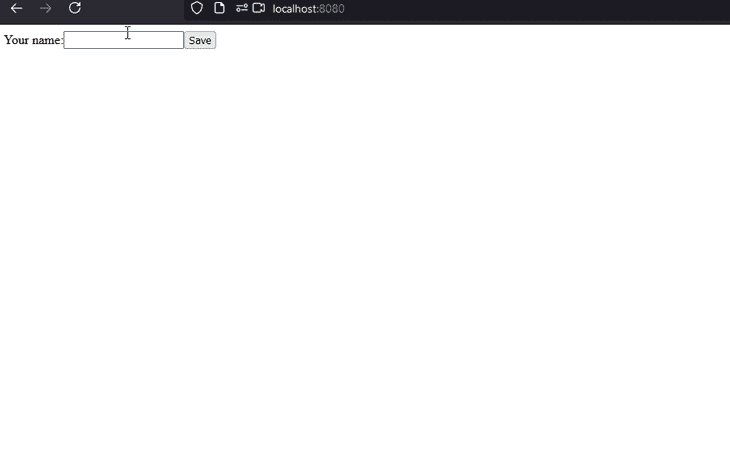

# PeerJS - LogRocket 博客入门

> 原文：<https://blog.logrocket.com/getting-started-peerjs/>

10 年前，谷歌以不到 7000 万美元的价格收购了一家名为 GIPS 的小公司。这标志着谷歌开始努力将实时通信(RTC)引入浏览器。通过开源 GIPS 的初级产品，谷歌建立了一个标准，该标准首先由爱立信实施，然后固化为 W3C 规范。

今天，这个标准被称为 WebRTC，并在所有主流浏览器和平台中得到广泛支持。这项技术使您能够提供一种在页面上的不同用户之间交换视频、音频和其他数据的方式，而与用户的特定浏览器和设备类型无关。

WebRTC 的一个缺点是它非常复杂。幸运的是，我们可以使用[peer js](https://peerjs.com/)——一个简化 WebRTC 并提供完整、可配置且易于使用的对等连接 API 的库。

## 安装对等项

像现在大多数 JS 库一样，你可以通过一个 import 语句在你的捆绑项目中使用 PeerJS，或者直接从一个 CDN(如 [unpkg](https://unpkg.com/) )中包含脚本。

您可以使用如下脚本在页面上包含 PeerJS:

```
<script src="https://unpkg.com/[email protected]/dist/peerjs.min.js"></script>

```

这将使`Peer`类可用，然后允许我们创建一个实例并开始类似聊天的事情:

```
const peer = new Peer({
  host: "0.peerjs.com",
  port: 443,
  path: "/",
  pingInterval: 5000,
});

```

上面，我们已经使用默认设置创建了一个实例。PeerJS 需要一个中央服务器来识别哪些对等点是可用的。

为了完成聊天，我们仍然需要打开与聊天伙伴的连接，并发送和接收消息。让我们看看这是如何在 PeerJS 中实现的:

```
const conn = peer.connect("other-peer-id");
conn.on("open", () => {
  conn.send("Hello World!");
});
conn.on("data", (data) => {
  console.log("Received data", data);
});

```

通常，它不是关于创建连接，而是实际接收或处理连接请求。传入的请求可以由出现在`Peer`实例上的`connection`事件来处理。

```
peer.on("connection", (conn) => {
  conn.on("data", (data) => {
    console.log("Received data", data);
  });
});

```

从这里开始，PeerJS 还允许我们利用数据连接，而不仅仅是文本。结合来自浏览器的`getUserMedia` API，我们可以做到:

```
getUserMedia(
  { video: true, audio: true },
  (stream) => {
    const call = peer.call("other-peer-id", stream);

    call.on("stream", (remoteStream) => {
      // Show stream in some video/canvas element.
    });
  },
  console.error
);

```

同样，接收视频和音频流也是可能的:

```
peer.on("call", (call) => {
  getUserMedia(
    { video: true, audio: true },
    (stream) => {
      call.answer(stream);

      call.on("stream", (remoteStream) => {
        // Show stream in some video/canvas element.
      });
    },
    console.error
  );
});

```

## 用 PeerJS 创建一个简单的聊天应用程序

让我们使用上一节中的代码来构建一个简单的示例，该示例将允许我们拨打和接听一对一的视频电话。我们的示例应该遵循以下工作流程:

1.  你打开一个网站，询问你的名字
2.  输入您的姓名后，屏幕会要求您输入您想呼叫的人的姓名

我们将从初始化一个新项目并添加所有依赖项开始:

```
npm init -y
npm i peerjs react react-dom react-router react-router-dom --save
npm i @types/react @types/react-dom @types/react-router-dom typescript [email protected] --save-dev

```

现在，我们需要创建一个 HTML 文件，作为 Parcel 的入口点。

package 是一个捆绑器，它将把我们用来编写应用程序的所有不同资源转换成网络浏览器可以理解的文件。例如，对于样式，我们使用 SASS，对于脚本，我们使用 TypeScript——这两种格式没有浏览器能理解。

```
<!DOCTYPE html>
<html lang="en">
  <head>
    <meta charset="UTF-8" />
    <meta http-equiv="X-UA-Compatible" content="IE=edge" />
    <meta name="viewport" content="width=device-width, initial-scale=1.0" />
    <title>PeerJS Example</title>
    <link rel="stylesheet" href="./style.scss" />
  </head>
  <body>
    <div id="app"></div>
    <script type="module" src="./app.tsx"></script>
  </body>
</html>

```

我们将从没有任何设计元素开始，而是专注于为两个对等体创建一个基于文本的聊天应用程序。为了方便起见，示例应用程序是使用 React 编写的，但是可以随意选择您喜欢的 UI 库或框架。

本质上，我们要做的是:

```
const App = () => {
  return (
    <BrowserRouter>
      <Switch>
        <Route exact path="/" component={NameInput} />
        <Route exact path="/overview" component={Overview} />
        <Route exact path="/call" component={Call} />
      </Switch>
    </BrowserRouter>
  );
};

render(<App />, document.querySelector("#app"));

```

我们将在应用程序的三个不同领域使用三个组件:

*   `NameInput`让用户选择自己的名字
*   `Overview`允许用户拨打或接听电话
*   `Call`处理正在进行的通话

我们还将通过全局放置`Peer`和`connection`的值来简化事情。它们可能仍然被用在组件中——例如，对于`NameComponent`，我们写道:

```
const NameInput = () => {
  const history = useHistory();
  // use local copy of the global to manage the different behaviors reliably
  const [availablePeer, setAvailablePeer] = React.useState(peer);

  const submit = React.useCallback((ev) => {
    const input = ev.currentTarget.elements.namedItem("name");
    const user = input.value;
    ev.preventDefault();
    // let's set the peer
    setAvailablePeer(new PeerJs(user));
  }, []);

  React.useEffect(() => {
    // apply the local peer to the global variables
    peer = availablePeer;

    // entering the name is only necessary if we don't have a peer yet;
    // if we have then let's show the overview
    if (availablePeer) {
      history.replace("/overview");
    }
  }, [availablePeer]);

  return (
    <form onSubmit={submit}>
      <label>Your name:</label>
      <input name="name" />
      <button>Save</button>
    </form>
  );
};

```

对于`Overview`组件也是如此:

```
const Overview = () => {
  const history = useHistory();
  const [availablePeer] = React.useState(peer);
  // use local copy of the global to manage the different behaviors reliably
  const [availableConnection, setAvailableConnection] =
    React.useState(connection);

  const submit = React.useCallback(
    (ev) => {
      const input = ev.currentTarget.elements.namedItem("name");
      const otherUser = input.value;
      ev.preventDefault();
      // make the call
      setAvailableConnection(availablePeer.connect(otherUser));
    },
    [availablePeer]
  );

  React.useEffect(() => {
    connection = availableConnection;

    if (!availablePeer) {
      // no peer yet? we need to start at the name input
      history.replace("/");
    } else if (availableConnection) {
      // already a connection? then let's show the ongoing call
      history.replace("/call");
    } else {
      // let's wait for a connection to be made
      peer.on("connection", setAvailableConnection);
      return () => peer.off("connection", setAvailableConnection);
    }
  }, [availablePeer, availableConnection]);

  return (
    <div>
      <h1>Hi, {availablePeer?.id}</h1>
      <form onSubmit={submit}>
        <label>Name to call:</label>
        <input name="name" />
        <button>Call</button>
      </form>
    </div>
  );
};

```

对于`Call`，主要归结为使用三个函数:

*   主动结束通话(“断开”)
*   处理消息的发送(“提交”)
*   对来自另一端的断开连接和消息做出反应(使用`useEffect`钩子的副作用)

在代码中，如下所示:

```
React.useEffect(() => {
  connection = availableConnection;

  if (!availableConnection) {
    history.replace('/overview');
  } else {
    const dataHandler = (data: string) => {
      setMessages((msgs) => [...msgs, data]);
    };
    const closeHandler = () => {
      setAvailableConnection(undefined);
    };
    availableConnection.on('data', dataHandler);
    availableConnection.on('close', closeHandler);
    return () => {
      availableConnection.off('data', dataHandler);
      availableConnection.off('close', closeHandler);
    };
  }
}, [availableConnection]);

const submit = React.useCallback(
  (ev) => {
    const input = ev.currentTarget.elements.namedItem('message');
    const message = input.value;
    ev.preventDefault();
    availableConnection.send(message);
    input.value = '';
  },
  [availableConnection],
);

const disconnect = React.useCallback(() => {
  availableConnection.close();
  setAvailableConnection(undefined);
}, [availableConnection]);

```

上面代码的结果应该如下所示。请记住，UX 和整体造型不是我们这部分演示的重点。聊天功能非常好，从功能的角度来看，它满足了需求。


A simple PeerJS chat

现在，是时候通过添加音频和视频功能来让聊天变得更好了。

## 添加音频和视频

PeerJS 通过构建在`getUserMedia`浏览器 API 上来提供音频和视频流。

首先要做的是获得对`getUserMedia`的引用。我们将专门使用“旧的”和更成熟的 API，可以直接从`navigator`访问，即使在`[navigator.mediaDevices](https://developer.mozilla.org/en-US/docs/Web/API/Navigator/mediaDevices)`有一个新的 API 可用。因为它的工作方式略有不同，但更重要的是，它还不像旧的 API 那样广泛和受支持，所以我们现在避免使用它。

考虑到这一点，获得对`getUserMedia`的引用的可靠方法是:

```
const getUserMedia =
  navigator.getUserMedia ||
  navigator["webkitGetUserMedia"] ||
  navigator["mozGetUserMedia"];

```

在我们获得一个工作引用(或者没有——在这种情况下，它实际上应该出错或者有某种回退)之后，我们就可以使用它了。

让我们以前面的聊天消息示例为基础，在`connection`中添加关于谁实际上给谁打了电话的信息:

```
// if we are the ones who called
connection["caller"] = availablePeer.id;

// if the other party called and we received
const handler = (connection) => {
  connection["caller"] = connection.peer;
  setAvailableConnection(connection);
};

```

现在，我们可以将下面的钩子添加到`Call`组件中:

```
React.useEffect(() => {
  if (availableConnection && availablePeer) {
    let dispose = () => {};
    const handler = (call) => {
      getUserMedia(
        { video: true, audio: true },
        (stream) => {
          showVideo(stream, selfVideo.current);
          call.answer(stream);
        },
        (error) => {
          console.log("Failed to get local stream", error);
        }
      );

      dispose = showStream(call, otherVideo.current);
    };

    if (availableConnection["caller"] === availablePeer.id) {
      getUserMedia(
        { video: true, audio: true },
        (stream) => {
          showVideo(stream, selfVideo.current);
          dispose = showStream(
            availablePeer.call(availableConnection.peer, stream),
            otherVideo.current
          );
        },
        (error) => {
          console.log("Failed to get local stream", error);
        }
      );
    } else {
      availablePeer.on("call", handler);
    }

    return () => {
      availablePeer.off("call", handler);
      dispose();
    };
  }
}, [availableConnection, availablePeer]);

```

这里发生了相当多的事情，所以让我们一个一个地检查一下:

*   只有当呼叫处于活动状态时，该挂钩才起作用
*   我们定义了一个处理程序，它将在即将收到呼叫时使用
*   如果我们启动了呼叫，我们也应该启动流
*   不管是谁发起或接收了呼叫，我们都使用`getUserMedia`获取本地流
*   然后，通过调用或被调用来接收远程流

视频元素只是参考，即:

```
// define refs
const otherVideo = React.useRef();
const selfVideo = React.useRef();

// ...
<video ref={otherVideo} width={500} height={500} />
<video ref={selfVideo} width={200} height={200} />

```

太好了，尝试一下可能会产生这样的应用程序:



A simple PeerJS video chat

你可以在我的 GitHub 上找到我们在本文[中构建的例子。](https://github.com/FlorianRappl/peerjs-example-app)

## 实际应用

那么，你能用 PeerJS 做什么呢？很多。你可以考虑自己的替代方案，比如 Teams 或 Slack。当然，您可能会很快得出结论，这些解决方案虽然庞大，但具有一些不错的特性和必要的弹性，这是您希望用于生产级软件的。但是对于简单的事情，除了我们在本文中构建的内容之外，您不需要太多东西。

我用它构建了一个家庭通信网络应用程序。我家里的每台平板电脑和电脑都可以访问一个运行在 Raspberry Pi 上的小型网络服务器，该服务器提供聊天页面和一个对等服务器实例。这允许发现我家里的每个人，并且无需任何中间层就能进行简单、无摩擦的通信。

## 结论

如果您需要驯服 WebRTC 野兽并在 web 应用程序中轻松启用视频和音频呼叫功能，PeerJS 是一个很好的库。它入门方便，并提供了所有必要的手段来帮助您快速做好生产准备。

虽然使用提供的云服务是一个很好的开始，但是提供的开源 Node.js 服务器也可以作为托管您自己的对等代理的样板。

你会用 WebRTC 和 PeerJS 构建什么？

## 您是否添加了新的 JS 库来提高性能或构建新特性？如果他们反其道而行之呢？

毫无疑问，前端变得越来越复杂。当您向应用程序添加新的 JavaScript 库和其他依赖项时，您将需要更多的可见性，以确保您的用户不会遇到未知的问题。

LogRocket 是一个前端应用程序监控解决方案，可以让您回放 JavaScript 错误，就像它们发生在您自己的浏览器中一样，这样您就可以更有效地对错误做出反应。

[](https://lp.logrocket.com/blg/javascript-signup)[https://logrocket.com/signup/](https://lp.logrocket.com/blg/javascript-signup)

[LogRocket](https://lp.logrocket.com/blg/javascript-signup) 可以与任何应用程序完美配合，不管是什么框架，并且有插件可以记录来自 Redux、Vuex 和@ngrx/store 的额外上下文。您可以汇总并报告问题发生时应用程序的状态，而不是猜测问题发生的原因。LogRocket 还可以监控应用的性能，报告客户端 CPU 负载、客户端内存使用等指标。

自信地构建— [开始免费监控](https://lp.logrocket.com/blg/javascript-signup)。