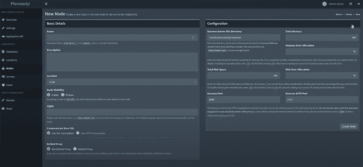
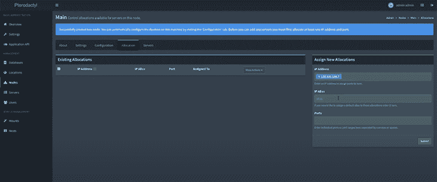
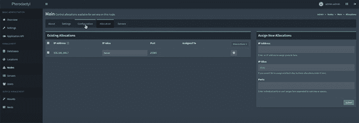
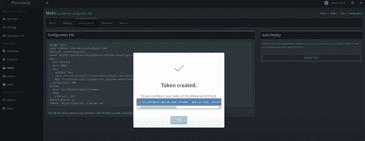
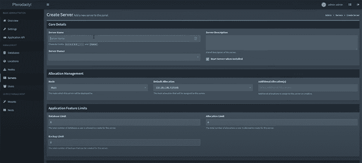
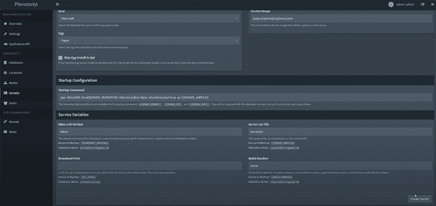
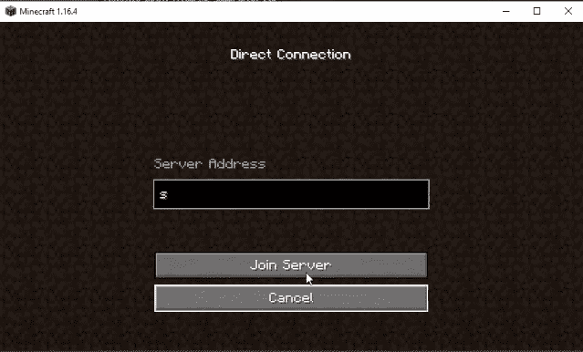

# 翼龙面板入门-日志火箭博客

> 原文：<https://blog.logrocket.com/getting-started-pterodactyl-panel/>

翼龙是一个免费的开源服务器管理工具，用 PHP、React 和 Go 构建。它主要用于游戏服务器管理，因为它为最终用户提供了交互和简单的用户界面，目前它有 150 多个贡献者。

翼龙在 Docker 容器中运行它的游戏服务器。除了它的所有特性之外，它还提供了顶级的安全性，作为用户，您可以自由地深入研究代码并找到任何漏洞。

翼龙支持的游戏有*《我的世界》*、 *Rust* 、 *Terraria* 、 *Teamspeak* 、 *Mumble、团队堡垒 2、* *反恐精英:全球攻势*、 *Garry 的 Mod* 、*方舟:生存进化*。直到今天，翼龙群体还在继续增加这个名单。翼龙提供了一个完美的平台来管理游戏服务器，大大减少了工作量。

在这篇文章中，我们将接触翼龙。我们将从安装过程开始，并继续进行顺利托管支持的游戏所需的设置。我们还将介绍并浏览翼手龙的术语。

## 安装指南

对用户来说，一个巨大的好处是，翼龙支持许多流行的操作系统。然而，翼龙有一些重要的依赖性。[完整列表可在此处找到](https://pterodactyl.io/panel/1.0/getting_started.html#dependencies)。

在继续之前，请确认您已经安装了依赖项。

最好给翼龙一个目录，在那里你可以安装所有必要的文件，并且只从那个路径操作。要下载与面板相关的文件，您需要发出如下所示的`curl`请求:

```
curl -Lo panel.tar.gz https://github.com/pterodactyl/panel/releases/latest/download/panel.tar.gz
tar -xzvf panel.tar.gz

```

在安装开始之前，会有一个提示询问一些细节，比如管理员用户配置、数据库名称、SSL 等等。它会在你输入详细信息后安装。之后，您可以导航到您的域并打开一个面板。使用您的凭证登录，它将看起来像这样:


安装所需的所有文件都在这里。下一步是建立一个服务器，但是在这之前你需要有 Wings(以前称为 Daemon)。

## 翼龙翅膀

Wings 用于翼龙服务器控制。它是使用 Go 和 Node.js 守护进程构建的。与翼龙面板一样，Wings 也支持 CentOS 和 Ubuntu 等多种操作系统，但不支持 Windows。

还有一些基本的系统依赖，比如 curl 和 Docker。如果您的机器中没有这些，您应该在安装 Wings 之前安装它们。

让我们来看看如何安装翅膀:

```
mkdir -p /etc/pterodactyl
curl -L -o /usr/local/bin/wings "https://github.com/pterodactyl/wings/releases/latest/download/wings_linux_$([[ "$(uname -m)" == "x86_64" ]] && echo "amd64" || echo "arm64")"
chmod u+x /usr/local/bin/wings

```

现在，您可以在管理员视图中的已安装面板上创建一个节点，方法是单击侧边栏中的**节点**。屏幕看起来像这样:



屏幕上显示两个部分:一个用于基本细节，另一个用于配置。**基本** **细节**会询问你的名字、描述、位置、域名和其他一些东西，而在**配置**标签中，你会指定内存、磁盘空间、端口等。之后，点击**创建** **节点**按钮。



接下来，在**分配新分配**框中填写详细信息，并点击**提交**。



您可以在顶部菜单的**分配**选项卡中看到所有已分配的节点。

还有另一个选项可用于自动配置节点。为此，从侧边栏进入**配置**菜单，点击**生成令牌**按钮。这将为您生成一个令牌，如下所示:



现在，将 Bash 命令复制并粘贴到您的终端中，然后重启 Wings。然后，转到**节点**并刷新页面。在节点列表前可以看到一颗绿色的心。


要启动 Wings，执行`sudo wings`。节点分配也是基于 IP 和端口号完成的，并且可以分配给你的服务器。节点设置可以在侧边栏的**节点**标签下找到。

## 服务器设置

web 服务器只不过是负责管理 HTTP/HTTPS 请求的硬件。翼龙有两个 web 服务器:Nginx 和 Apache。您可以使用您更喜欢的任何一种，它们都可以配置有或没有 SSL。我的建议是使用 SSL 来使你的服务器更加安全。

翼龙不能在默认配置下工作，所以你必须事先移除它。关于这个步骤的更多细节，你可以查看官方的[设置指南](https://pterodactyl.io/panel/1.0/webserver_configuration.html#webserver-configuration)。

创建 web 服务器后，您现在需要为面板创建一个服务器，作为游戏的联系点。为此，点击侧边栏中的**服务器**。如您所见，您必须填写这一部分的许多字段。





在填写完所有细节并点击**创建** **服务器**后，该服务器现在将在主页上列出。


一段时间后，安装过程将完成，您可以单击该服务器来管理它。屏幕将如下所示:


启动后，您可以导航到您的游戏，并选择此服务器作为连接。我通过提供服务器地址将我的*《我的世界》*游戏与翼龙服务器连接起来，如下所示:



现在，你的全新服务器将与游戏相匹配，你可以尽情地玩了！

完成设置后，还需要配置其他一些东西。首先是备份存储。

备份是必要的，以防你的重要数据发生可怕的事情，并为你提供快速恢复。翼龙允许我们在本地和 S3 存储桶上进行备份，并为切换存储提供了一个简单的配置。您可以在`.env`文件中进行设置。

### 本地备份

默认情况下，该选项在`.env`文件中被配置为备份选项。

```
# Setting backup driver to choose local backup via Wings
APP_BACKUP_DRIVER=wings

```

现在，您可能想知道您的备份将存储在哪里。为此，您需要写下 Wings 内部的路径'`config.yml`:

```
system:
  backup_directory: /path/to/backup/storage

```

### S3 备份

AWS S3 也可用于创建备份。要在 S3 上实施备份，请更改`.env`文件中的给定配置:

```
APP_BACKUP_DRIVER=s3

# Info to actually use s3
AWS_DEFAULT_REGION=
AWS_ACCESS_KEY_ID=
AWS_SECRET_ACCESS_KEY=
AWS_BACKUPS_BUCKET=
AWS_ENDPOINT=

```

翼龙为反向代理、reCAPTCHA 和 2FA 提供了设置选项。

* * *

### 更多来自 LogRocket 的精彩文章:

* * *

## 数据库设置

数据库是系统不可分割的一部分，用于正确存储数据。在我们的例子中，最好有一个数据库和一个拥有所有权限的管理员用户。

翼龙使用 MySQL 进行管理，你需要安装 MySQL 作为先决条件。你可以在他们的[官网](https://pterodactyl.io/tutorials/mysql_setup.html)上获取安装步骤。之后，按照给定的步骤设置数据库:

```
mysql -u root -p

# Remember to change 'yourPassword' below to be a unique password
CREATE USER 'pterodactyl'@'127.0.0.1' IDENTIFIED BY 'yourPassword';
CREATE DATABASE panel;
GRANT ALL PRIVILEGES ON panel.* TO 'pterodactyl'@'127.0.0.1' WITH GRANT OPTION;
exit

```

一旦执行完毕，您需要通过执行给定的命令来生成一个加密密钥文件:

```
cp .env.example .env
composer install --no-dev --optimize-autoloader

# This will be executed for the initial setup only. If you had set up Pterodactyl previously, then skip it.  
php artisan key:generate --force

```

初始设置后，环境设置是必不可少的。您需要运行所描述的两个命令，这将设置一个会话、缓存和 DB 凭证。

```
php artisan p:environment:setup
php artisan p:environment:database

```

目前，数据库仅设置了结构。您需要插入将在面板中使用的基本数据。只需运行下面的命令，等待它执行:

```
php artisan migrate --seed --force

```

在基本数据之后，您需要一个管理员用户。要设置管理员用户及其权限，让我们再运行几个命令:

```
php artisan p:user:make

# If using NGINX or Apache (not on CentOS):
chown -R www-data:www-data /var/www/pterodactyl/*

# If using NGINX on CentOS:
chown -R nginx:nginx /var/www/pterodactyl/*

# If using Apache on CentOS
chown -R apache:apache /var/www/pterodactyl/*

```

现在您有了一个管理员用户和一个完全设置好的数据库！

## SSL 证书设置

SSL 或安全套接字层有助于系统安全。

通常，SSL 会加密数据并验证用户身份。如果在服务器级别配置了 SSL 证书，那么浏览器与服务器的通信将是安全的。翼龙对此也给出了一个选项，你可以为 Panel 和 daemon 都设置 SSL。

有两种方法可以创建 SSL 证书。

第一种方法是使用 [Certbot](https://certbot.eff.org/) 。对于这个选项，您需要通过给定的命令安装 Certbot:

```
sudo apt update
sudo apt install -y certbot
# Run this if you use Nginx
sudo apt install -y python3-certbot-nginx
# Run this if you use Apache
sudo apt install -y python3-certbot-apache

```

安装完成后，您可以使用`webserver-specific`插件生成一个证书。在给定的命令中，相应地提及您的域名:

```
# Nginx
certbot certonly --nginx -d example.com
# Apache
certbot certonly --apache -d example.com
# Standalone - Use this if neither works. Make sure to stop your webserver first when using this method.
certbot certonly --standalone -d example.com

```

SSL 证书已添加到您的服务器中。您可能知道，每个 SSL 证书都有到期日，并且需要重新生成。在这里，您实际上可以设置自动更新，并从任何再生麻烦中解脱出来。

让我们探索第二种方法，它只为单一用例设计。让我们举一个用户无权访问端口 80 的例子。在这种情况下，您需要使用 Cloudflare API。完整的安装说明可以在 [acme.sh](https://github.com/acmesh-official/acme.sh) 找到。

```
curl https://get.acme.sh | sh

```

安装后，从 **My Profile** 下的选项卡获取您的 Cloudflare API 密钥。现在，执行下面的命令来创建证书:

```
sudo mkdir /etc/letsencrypt/live/example.com

export CF_Key="Your_CloudFlare_API_Key"
export CF_Email="[email protected]"

acme.sh --issue --dns dns_cf -d "example.com" \
--key-file /etc/letsencrypt/live/example.com/privkey.pem \
--fullchain-file /etc/letsencrypt/live/example.com/fullchain.pem 

```

SSL 证书就是这样生成的！它是安全系统不可或缺的一部分。

## 使用翼龙的优势

翼龙提供了一些非常吸引用户的超越界限的优势。有许多有益的特性，我们将在下面重点介绍几个重要的特性。

### 安全性

我们生活在一个更安全的时代。信息非常重要，不应该落入坏人之手，翼龙牢记这一点。翼龙提供 AES-256-CBC 加密机制、bcrypt 散列和 HTTPS 支持。

### 用 Docker 托管游戏服务器

Pterodacyl 允许我们使用 Docker 容器来托管游戏服务器。Docker 提供了许多好处，包括对资源利用的设置限制和每个游戏的环境设置。

### 可量测性

您可能会从较少的资源开始，随着您的受众开始增长，您可能会考虑添加更多资源。有了翼龙，很容易在飞行中伸缩。最终，这可以为所有用户提供无缝体验。

### 易于故障排除和安装

翼龙有一个很好的故障排除机制。通过运行命令，您可以获得一个错误日志文件，并确定可以在更短时间内修复的问题。

翼龙还为管理员提供了挂载特性，允许将其他目录从主机文件存储挂载到服务器存储。该配置可用于面板和机翼。

总的来说，翼龙是建立在现代工具上的，在我看来，是最好的设计。它支持自定义修改，并具有用户友好的界面，任何人都可以在最少的指导下使用——更不用说翼龙是免费的，代码是开源的。

## 结论

有了翼龙，任何人都可以实现游戏服务器的强大性能和高级别的安全性。它提供了一个可扩展的托管设施，并在其他免费和开源游戏服务器中脱颖而出。翼龙也有一个很好的支持系统，将解决任何个人或主机提供商的查询。

我使用翼龙已经有一段时间了，并推荐给任何有兴趣建立游戏服务器的人。通过这种改进的配置，您不仅可以获得无缝体验，还可以邀请用户访问您的服务器，并在此基础上创造收入。

## 使用 [LogRocket](https://lp.logrocket.com/blg/signup) 消除传统错误报告的干扰

[](https://lp.logrocket.com/blg/signup)

[LogRocket](https://lp.logrocket.com/blg/signup) 是一个数字体验分析解决方案，它可以保护您免受数百个假阳性错误警报的影响，只针对几个真正重要的项目。LogRocket 会告诉您应用程序中实际影响用户的最具影响力的 bug 和 UX 问题。

然后，使用具有深层技术遥测的会话重放来确切地查看用户看到了什么以及是什么导致了问题，就像你在他们身后看一样。

LogRocket 自动聚合客户端错误、JS 异常、前端性能指标和用户交互。然后 LogRocket 使用机器学习来告诉你哪些问题正在影响大多数用户，并提供你需要修复它的上下文。

关注重要的 bug—[今天就试试 LogRocket】。](https://lp.logrocket.com/blg/signup-issue-free)