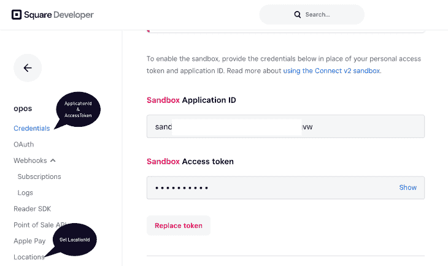
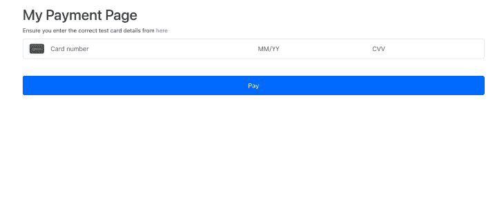

# Square Node.js SDK - LogRocket 博客入门

> 原文：<https://blog.logrocket.com/getting-started-square-node-js-sdk/>

[Square](https://squareup.com/us/en) 是一个全面的商业应用程序，使组织能够运行和发展其电子商务业务，管理工资，并运行商业银行服务。Square 允许集成众多与分析、税务、会计、团队管理等相关的第三方[应用](https://squareup.com/help/us/en/article/6259-square-register-supported-integrations)。

本文将演示如何使用 Square Node.js SDK 轻松地将 Square 的信用卡处理功能集成到应用程序中。在本教程结束时，您将拥有一个工作代码，可以开始使用它来利用 Square SDK 提供的许多特性。

> **N.B.** ，有一个[弃用的 Square Connect SDK](https://www.npmjs.com/package/square-connect) 已经不再支持，不应该使用；事实上，本教程中的大多数函数在弃用版本中都找不到。

*向前跳转:*

## 先决条件

要跟随本教程，您需要以下内容:

*   已安装 Node.js ≥v12
*   熟悉 React 和 Vite 或创建 React 应用程序

## 什么是 Square SDK？

为了更好地理解 Square SDK 是什么，我们先快速回顾一下 API 和 SDK 的定义。

API 是一种媒介，它使应用程序能够访问彼此的功能并发送信息。应用程序编程接口增强了应用程序的功能。

同时，SDK 是一组工具，允许您访问应用程序的功能和服务，包括其 API。软件开发工具包通过为您提供启动开发所需的几乎所有东西来简化应用程序开发，使您能够专注于应用程序业务逻辑。

Square SDK 使您能够轻松地将 Square 集成到您的应用程序中。在本教程中，您将看到，有了 Square SDK，您不需要关心如何调用 API 端点，也不需要担心 Square 如何处理您的支付。您只需要知道需要哪些 SDK 功能，以及 SDK 需要哪些数据来完成订单。

## 设置广场

为了探索和使用 Square 的商业工具套件，我们需要建立一个 Square 帐户，并获得应用程序 ID、位置 ID 和访问令牌。使用 Square SDK 需要这些凭据。

首先在 [Square 网站](https://squareup.com/signup?country_code=us&lang_code=en&return_to=https%3A%2F%2Fdeveloper.squareup.com%2Fapps&v=developers)上注册成为一名开发者，并获得您的证书。对于本教程，我们将使用沙盒环境，因此，请确保您获得了沙盒凭证。

登录您的仪表板，点击**凭证**选项卡，查看您的**申请 ID** 和您的**访问令牌**。要获取您的**位置 ID** ，点击**位置**选项卡，如下所示。



## 与 Node.js 后端(服务器)集成

需要注意的是，Square Node.js SDK 应该只在后端使用。Square SDK 有一些前端集成，我们将在本文后面介绍。

首先，我们将使用开源 Node.js 框架 [Fastify](https://www.fastify.io) 创建一个基本服务器。

首先，使用`yarn init`命令初始化应用程序。然后，更新`package.json`文件以包含以下依赖项:

```
"dependencies": {
    "@fastify/cors": "^7.0.0",
    "dotenv": "^16.0.1",
    "fastify": "^3.29.0",
    "square": "^19.0.0",
    "uuid4": "^2.0.2"
  }

```

现在，在您的终端上运行命令`yarn`来安装依赖项。

接下来，创建一个`index.js`文件。这将是主文件，也是服务器文件。添加以下代码:

```
const { fastify } = require('fastify');
const PORT = 3001;

const app = fastify();
async function startApp() {
    try {
        app.register(require('@fastify/cors'), {
            origin: '*',
        });
        app.post("/pay", async (request, reply) => {
            // our logic will go here.
        });
        await app.listen(PORT);
        console.log('listening on port', PORT);
    } catch (e) {
        console.error(e);
    }
}
startApp();

```

这段代码将在`PORT 3001`上为我们设置一个服务器，并提供一个 post 路由`/pay`。

接下来，添加您的 Square 集成代码。为了保持代码的整洁，创建一个名为`square.connect.js`的新文件。现在，添加以下内容:

```
const dotenv = require('dotenv');
const { Client, Environment } = require("square");
dotenv.config();

const client = new Client({
  accessToken: process.env.SQUARE_ACCESS_TOKEN,
  environment: Environment.Sandbox,
});

module.exports = client;

```

这段代码将初始化 Square，然后允许您使用访问令牌验证您的帐户。如果没有此设置，您将无法访问 Square。

确保使用这个键将 Square 访问令牌添加到您的`.env`文件中:`SQUARE_ACCESS_TOKEN`。

接下来，修改索引文件，导入`uuidv4`，以及刚刚初始化的 Square 客户端。此外，修改`/pay`端点以包含支付 API 函数。

```
const { fastify } = require('fastify');
const uuidv4 = require('uuid4');
const { paymentsApi } = require("./connect.square.js");
const PORT = 3001;
const app = fastify();

async function startApp() {
    try {
        app.register(require('@fastify/cors'), {
            origin: '*',
        });
        app.post("/pay", async (request, reply) => {
            let body = request.body;
            body.idempotencyKey = uuidv4();
            body.amountMoney = {
                amount: 1,
                currency: 'GBP',
            };
            let paymentResponse = paymentsApi.createPayment(body);
            paymentResponse.then((response) => {
                console.log(response)
                reply.send(response)
            })
        });
        await app.listen(PORT);
        console.log('listening on port', PORT);
    } catch (e) {
        console.error(e);
    }
}
startApp();

```

如果您仔细检查代码，您会注意到一个名为`idempotencyKey`的键。这是防止用户进行重复交易的要求；任何事务都不能有多个`idempotencyKey`。

通常，您会在数据库中生成并存储这个密钥来验证交易，但是在本教程中，我们将使用一个通用的惟一标识符`uuidv4`来生成这个密钥，然后用它来进行支付。

另外，您会注意到`amountMoney`是一个对象。这也是一项强制性要求，因为每笔付款都必须有一个支付金额。为了避免被利用，您应该从数据库中获取这个值，而不是从前端发送它。但是出于本教程的目的，我们将硬编码`amountMoney`:

```
body.amountMoney = {
    amount: 1,
    currency: 'GBP',
};

```

您可以使用任何 [Stripe 支持的货币](https://stripe.com/docs/currencies)，但对于沙盒帐户，仅支持英镑。

有了后端的这些数据，以及来自客户端的一个有效负载，您应该能够通过调用`createPayment()`方法来创建一个支付。

```
paymentsApi.createPayment(body)

```

现在我们已经设置了 Node.js 后端并集成了 Square Node.js SDK，让我们将它与客户机集成。

## 与 React 应用程序(客户端)集成

让我们创建一个基本的 React 应用程序，它将接受用户的信用卡信息和付款。

最好使用 Vite 来设置 React 应用程序，但是如果你愿意，你可以[使用 Create React App](https://blog.logrocket.com/create-react-app-a-quick-setup-guide-b812f0aad03c/) 来设置应用程序。

接下来，通过运行以下命令，安装 Square React 社区支持的 web 支付 SDK，[React-Square web-payments-SDK](https://www.npmjs.com/package/react-square-web-payments-sdk):

```
yarn add react-square-web-payments-sdk
```

现在您已经设置了 React 并安装了 SDK，创建一个组件`SqurePayment.jsx`，并添加以下代码:

```
import * as React from 'react';
import { CreditCard, PaymentForm } from 'react-square-web-payments-sdk';
const SquarePaymentForm = () => (
   {
      console.info({ token, buyer });
      let body = JSON.stringify({
        sourceId: token.token
      });
      const paymentResponse = await fetch('http://localhost:3001/pay', {
        method: 'POST',
        headers: {
          'Content-Type': 'application/json',
        },
        body,
      });
      if (paymentResponse.ok) {
        return paymentResponse.json();
      }
    }}

    /**
     * This function enables the Strong Customer Authentication (SCA) flow
     *
     * It's important you use this function to verify a user to reduce the 
     * chances of fraudulent transactions
     */

    createVerificationDetails={() => ({
      amount: '1.00',
      /* collected from the buyer */
      billingContact: {
        addressLines: ['123 Main Street', 'Apartment 1'],
        familyName: 'Doe',
        givenName: 'John',
        countryCode: 'GB',
        city: 'London',
      },
      currencyCode: 'GBP',
      intent: 'CHARGE',
    })}
    /**
     * Identifies the location of the merchant that is taking the payment.
     */
    locationId="LPWYFGdds9"
  >

);
export default SquarePaymentForm;

```

这里我们使用`PaymentForm`和`Card`组件来收集用户的信用卡详细信息和支付信息，然后将其发送给 Square。

将该组件导入到`App.jsx`文件中，并渲染如下所示:

```
import SquarePaymentForm from './SquarePayment'
import { Button, Container } from 'react-bootstrap';
import './App.css'
function App() {
  return (
    <Container>
      <h1>My Payment Page</h1>
      <p>
        Ensure you enter the correct test card details from <a href="https://developer.squareup.com/docs/devtools/sandbox/payments" target="_blank">here</a>
      </p>
      <p>
        <SquarePaymentForm  />
      </p>
    </Container>
  )
}
export default App
```

它应该是这样的:



您还可以创建一个表单来收集用户的帐单信息:

```
billingContact: {
  addressLines: ['123 Main Street', 'Apartment 1'],
  familyName: 'Doe',
  givenName: 'John',
  countryCode: 'GB',
  city: 'London',
},

```

现在，对您的服务器进行 API 调用，这将向 Square 服务器发出请求并返回响应。记住，我们在前面创建了`/pay`端点；请求应该包含上面代码中显示的所有信息。

## 结论

Square 的 Node.js 让您能够毫不费力地使用 Square API。您只需要专注于调用函数、传递数据和操纵响应。我希望本文有助于您开始将 Square 集成到 Node.js 工作流中。

Square Node.js SDK 提供了许多有利于提高电子商务业务运营效率的特性。查看[文档](https://developer.squareup.com/us/en),了解更多关于 Square SDK 可以做的事情。

您可以在以下 GitHub 资源库中找到本教程中使用的所有代码:

## [LogRocket](https://lp.logrocket.com/blg/ecommerce-signup) :看看用户为什么不完成你的电子商务流程中的一个步骤的技术和 UX 原因。

[](https://lp.logrocket.com/blg/ecommerce-signup)

LogRocket 就像是一个网络和移动应用程序和网站的 DVR，记录你的电子商务应用程序上发生的一切。LogRocket 没有猜测用户不转化的原因，而是主动揭示了阻止你转化的根本原因，比如 JavaScript 错误或死点击。LogRocket 还可以监控应用的性能，报告客户端 CPU 负载、客户端内存使用等指标。

开始主动监控您的电子商务应用程序— [免费试用](https://lp.logrocket.com/blg/ecommerce-signup)。

## 200 只显示器出现故障，生产中网络请求缓慢

部署基于节点的 web 应用程序或网站是容易的部分。确保您的节点实例继续为您的应用程序提供资源是事情变得更加困难的地方。如果您对确保对后端或第三方服务的请求成功感兴趣，

[try LogRocket](https://lp.logrocket.com/blg/node-signup)

.

[](https://lp.logrocket.com/blg/node-signup)[https://logrocket.com/signup/](https://lp.logrocket.com/blg/node-signup)

LogRocket 就像是网络和移动应用程序的 DVR，记录下用户与你的应用程序交互时发生的一切。您可以汇总并报告有问题的网络请求，以快速了解根本原因，而不是猜测问题发生的原因。

LogRocket 检测您的应用程序以记录基线性能计时，如页面加载时间、到达第一个字节的时间、慢速网络请求，还记录 Redux、NgRx 和 Vuex 操作/状态。

[Start monitoring for free](https://lp.logrocket.com/blg/node-signup)

.