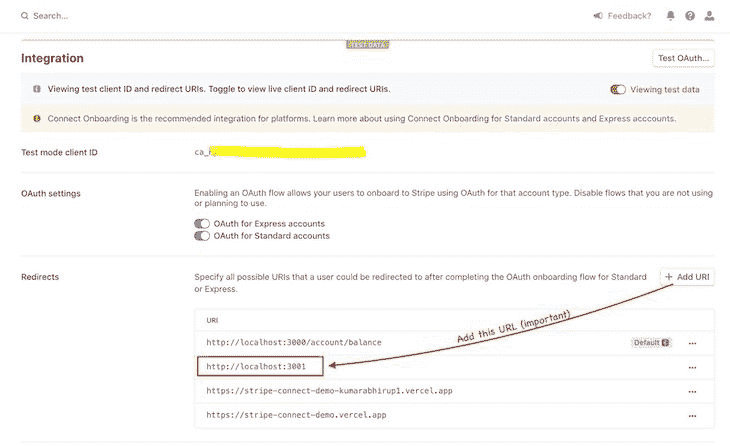
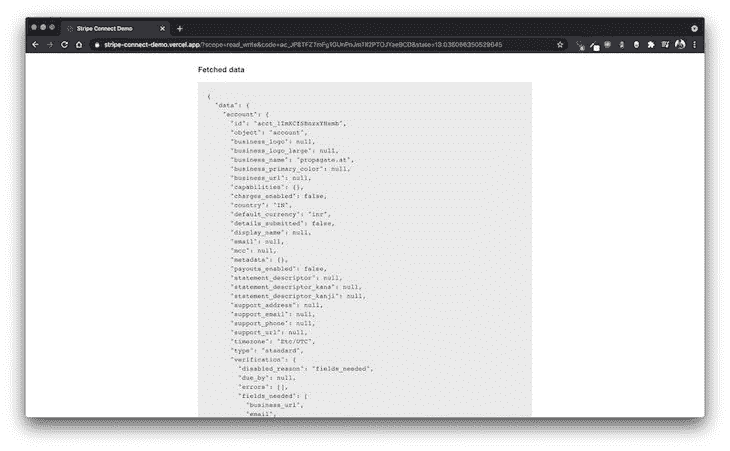
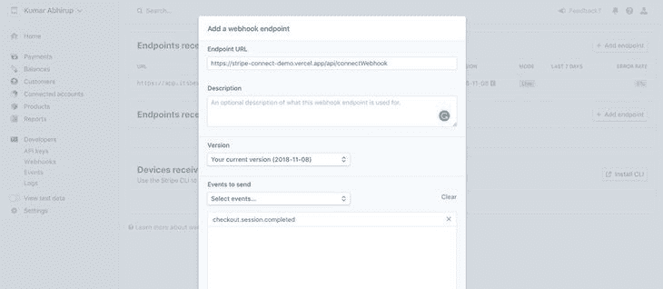

# 使用 Next.js 开始使用条带连接

> 原文：<https://blog.logrocket.com/getting-started-stripe-connect-next-js/>

许多卖家依靠 Stripe 这样的市场和支付处理平台来销售他们的商品。如果您正在为卖家创建一个使用您的平台销售产品的市场，并且如果您希望从您平台上的每笔交易中赚取 15%的利润，您需要使用 Stripe Connect 将您用户的 Stripe 帐户连接到您的 Stripe 帐户。

在本教程中，您将了解如何使用 Next.js 和 Stripe Connect 将用户的 Stripe 帐户连接到您的平台。您还将了解 Stripe Connect webhooks 的工作原理。

## 什么是条带连接？

[Stripe Connect](https://stripe.com/en-in/connect)Payment on boarding 流程帮助开发人员访问其用户的 Stripe 帐户，以创建产品、编辑产品、销售产品等，同时向平台提供申请费。

## 条带连接帐户的类型

Stripe Connect 帐户主要有两种类型，标准或快速。

[Stripe Express](https://stripe.com/en-in/connect/express) 是第一层，因为它让平台对资金流动有更多的控制权，而且对平台来说更贵，因为每个活跃关联账户每月收费 2 美元。这个 Stripe Connect 实现被 [Medium](https://help.medium.com/hc/en-us/articles/360003928833-Setting-up-payouts-with-Stripe) 、 [Quora](https://help.quora.com/hc/en-us/articles/360000673263-Partner-Program-Frequently-Asked-Questions) 和其他高级市场使用。

[条带标准](https://stripe.com/docs/connect/standard-accounts)将条带账户连接到平台条带账户，但为平台提供有限的控制。它是免费使用的，你不需要支付申请费用。例如，它被[子栈](https://on.substack.com/p/your-guide-to-going-paid)使用。

还有另一种类型的 Stripe Connect 实现，称为 Stripe Custom Connected Accounts，由需要实现复杂和定制支付系统的公司使用。像 Shopify 和 Lyft 这样的公司用它来支付他们的用户和商家。Stripe Custom Connected Accounts 提供了对付费入门体验的精细控制。出于本文的考虑，我们将不讨论自定义帐户。

点击了解这些账户[之间的差异。](https://stripe.com/docs/connect/accounts)

在本教程中，我们将重点介绍如何使用 Stripe 标准连接帐户，但这一过程对于 Stripe Express 帐户也几乎相同。

## 使用 OAuth 流构建 Stripe 标准帐户

这里有一个我们正在使用 OAuth flow 构建的项目的快速演示。

当您进入演示并点击**与条带**连接时，您将转到条带登录页面。登录并连接有效帐户后，您将看到对您的 Stripe 帐户的完整分析，如下所示。👇


每当您向用户提供连接到您的 Stripe 帐户的选项时，如果您希望通过您的平台向他们支付费用，或者如果您希望收取申请费，您将需要考虑以下事项:

1.  该帐户是否支持支付？
2.  这个账户能向顾客收费吗？
3.  是否提交了关于 Stripe 帐户的所有详细信息？
4.  如果 Stripe 帐户的某些方面看起来不正常，您需要允许用户取消 Stripe 帐户的链接，以便他们可以尝试连接到不同的帐户。如果一切正常，并且条带帐户已连接，您将需要确保用户无法取消其条带帐户的链接，以防止错误和冲突。是否允许解除链接取决于各种因素。我们稍后将讨论它们。

要使用 [Connect Webhooks](https://stripe.com/docs/connect/webhooks) 来操作一个已连接的帐户(本文后面会有相关教程)，要在已连接的帐户上执行操作，您可能需要检查上面提到的四件事情。

## 在开发服务器上测试条带

首先，我们需要启动并运行您的 [Stripe 帐户](https://stripe.com/)。(你可以在这里查看[完整的 GitHub 源代码](https://github.com/KumarAbhirup/stripe-connect-demo)。)

从你的[条纹仪表盘](https://dashboard.stripe.com/dashboard)中，获得一个**条纹可公开密钥**和一个**秘密密钥**。如果您还没有有效的 Stripe 帐户，您可以在测试模式下尝试。请确保保存好这些密钥，在接下来的步骤中会用到它们。

现在，进入 [**条纹连接设置**](https://dashboard.stripe.com/settings/applications) ，滚动到最底部，得到你的 **OAuth 客户端 ID** 。



确保将`[https://localhost:3001](https://localhost:3001)`添加为重定向 URL(不需要将其设为默认)，或者，如果您正在使用其他 URL 进行开发和测试，则添加该 URL。我提供给你的存储库使用开发`port 3001`。

> **注意**:确保所有这些键要么都来自测试模式，要么都来自实时模式；不要把它们搞混了！

现在，克隆或下载[这个存储库，](https://github.com/KumarAbhirup/stripe-connect-demo)，然后复制`.env.sample`并将其重命名为`.env.development`，并像这样填写凭证(替换密钥)。👇

```
NEXT_PUBLIC_BASE_URL=http://localhost:3001
NEXT_PUBLIC_STRIPE_PUBLISHABLE_KEY=pk_test_***
STRIPE_SECRET_KEY=sk_test_***
NEXT_PUBLIC_STRIPE_OAUTH_CLIENT_ID=ca_***

```

接下来，运行`npm install`，然后运行`npm run dev`。这就对了，你现在让它工作了！请务必使用您的 Stripe 帐户进行尝试。

## 创建和验证条带帐户 id

接下来，我们需要创建、连接并验证帐户 ID。

当您单击“连接到条带”按钮时，您会被重定向到此链接:

```
https://dashboard.stripe.com/oauth/authorize?response_type=code&client_id=<OAUTH_CLIENT_ID>&scope=read_write&redirect_uri=http://localhost:3001
```

您可以自己访问该链接，只需用您的 OAuth 客户端 ID 替换`<OAUTH_CLIENT_ID>`。

> **提示**:如果你想指定另一个重定向 URL(来自你在 Stripe Connect 设置中设置的 URL)，你也可以这样做。

请注意，当用户在该特定链接上使用其 Stripe 帐户登录时，这意味着他们同意您将其 Stripe 连接到您的平台。

现在，您需要在服务器端验证该同意。

当用户通过您的 Stripe OAuth 链接使用 Stripe 登录时，他们返回到指定的【the URL 中包含一些属性，如下所示:

```
https://localhost:3001/?scope=read_write&code=ac_***
```

因此，当用户同意将其 Stripe 帐户连接到您的 OAuth 链接时，Stripe 会将您发送到带有`code`的重定向 URL，您现在需要在后端使用该 URL 来验证同意并成功连接帐户。

验证这一点很容易。你只需要在后台发出这个小小的请求。如果请求为您提供了一个帐户 ID，则连接成功。

现在您有了帐户 ID，您可以将它存储在任何您希望以后访问它的信息的地方，并对该帐户执行各种条带操作。现在，让我们打好基础。

## 创建样式化按钮

接下来，创建经典条纹风格的“条纹连接”按钮。

我们用的是`styled-components`。[这里是按钮样式](https://github.com/KumarAbhirup/stripe-connect-demo/blob/master/src/views/Home/components/Styles.tsx)。

现在，在该按钮的`onClick`事件上，将人们重定向到您的 Stripe OAuth URL，就像这样:

```
<button
  type="button"
  className="stripe-connect"
  onClick={() => {
    if (window) {
      const url = `https://dashboard.stripe.com/oauth/authorize?response_type=code&client_id=${
        process.env.NEXT_PUBLIC_STRIPE_OAUTH_CLIENT_ID
      }&scope=read_write&redirect_uri=${
        process.env.NEXT_PUBLIC_BASE_URL
      }`;
      window.document.location.href = url;
    }
  }}
>
  <span>Connect with Stripe</span>
</button>

```

为此，请确保再次检查您的`.env.development`文件，确保所有凭证都是正确的，如果遇到问题，请重新运行`npm run dev`。

`scope=read_write`条款允许您对用户的条带帐户执行读写操作。

* * *

### 更多来自 LogRocket 的精彩文章:

* * *

## 创建后端 API 端点

现在，让我们在后端制作一个 API，在用户从您的 OAuth 页面返回后，验证 URL 栏中 Stripe 发送的代码。您可以在存储库中引用[这个文件的最终版本](https://github.com/KumarAbhirup/stripe-connect-demo/blob/master/pages/api/verifyStripe.ts)，它负责验证它在请求体中接收到的`code`。

> **注意**:主逻辑使用了一些其他的实用函数，所以让你在存储库中检查所有这些。

让我们从`/pages/api/verifyStripe.ts`中的这段代码开始。

```
import { NextApiHandler } from 'next';
import handleErrors from '@/api/middlewares/handleErrors';
import createError from '@/api/utils/createError';

const stripe = require('stripe')(process.env.STRIPE_SECRET_KEY);

const handler: NextApiHandler = async (req, res) => {
  const body = req.body;

  switch (req.method) {
    case 'POST':
      const result = await stripe.oauth
        .token({
          grant_type: 'authorization_code',
          code: body?.code,
        })
        .catch((err: unknown) => {
          throw createError(400, `${(err as any)?.message}`);
        });

      res
        .status(200)
        .json({ oauth: result });
      break;

    default:
      throw createError(405, 'Method Not Allowed');
  }
};

export const config = {
  api: {
    bodyParser: {
      sizeLimit: '1mb',
    },
  },
};

export default handleErrors(handler);

```

这里，如果请求中提供了正确的`code`…

```
const result = await stripe.oauth
  .token({
    grant_type: 'authorization_code',
    code: body?.code,
  })
  .catch((err: unknown) => {
    throw createError(400, `${(err as any)?.message}`);
  });
```

…你从 Stripe 得到这个结果。

```
{
  "token_type": "bearer",
  "stripe_publishable_key": "{PUBLISHABLE_KEY}",
  "scope": "read_write",
  "livemode": false,
  "stripe_user_id": "{ACCOUNT_ID}",
  "refresh_token": "{REFRESH_TOKEN}",
  "access_token": "{ACCESS_TOKEN}"
}
```

如果向 API 提供了不正确或过期的代码，它也会返回错误。

> 请记住，`code`在几秒钟内就会过期，因此，当客户端收到这个代码时，请在加载时立即验证它。

现在，您已经有了一个基本的 API 端点，可以由 Next.js 客户机执行 pinged 操作了！

## 使用 React 和 Next.js 在服务器端验证连接的帐户

让我们从 Next.js 主页创建一个服务器端请求，如果它在 URL 中收到了`code`参数。

在`/pages/index.ts`里应该是这样的。

```
import React from 'react';
import fetch from 'isomorphic-unfetch';

import HomeView from '@/views/Home';

const Home = (props) => {
  return <HomeView data={props} />;
};

export const getServerSideProps = async ({
  req,
}) => {
  const body = req?.__NEXT_INIT_QUERY;

  if (!body?.code) {
    return { props: { data: null, req: body } };
  }

  let response;
  try {
    response = await fetch(
      process.env.NEXT_PUBLIC_BASE_URL + '/api/verifyStripe',
      {
        method: 'POST',
        body: JSON.stringify(body),
        headers: {
          'Content-Type': 'application/json',
        },
      },
    ).then((res) => res.json());
  } catch (error) {
    return { props: { data: { error }, req: body } };
  }

  return { props: { data: response, req: body } };
};

export default Home;

```

当您从 Next.js 页面文件中导出一个`getServerSideProps`函数时，Next.js 会在服务器上运行该函数。您可以在`getServerSideProps`函数中返回提取的数据，以便 React 组件以 props 的形式接收提取的数据。

你可以在这里了解更多关于 Next.js SSR 是如何工作的[。](https://nextjs.org/docs/basic-features/data-fetching#getserversideprops-server-side-rendering)

> **注意**:您也可以在`useEffect()`中发出请求，然后在获取数据后更新客户端状态。

如果您的 URL 有`?code=ac_***`，您将希望从 URL 获取该参数。Next.js 为您提供了`req?.__NEXT_INIT_QUERY`对象中的主体参数。

```
{
  code: "ac_***",
  scope: "read_write"
}

```

使用`isomorphic-unfetch`，我们通过在请求中提供`code`从 API 中提取数据:

```
await fetch(
  process.env.NEXT_PUBLIC_BASE_URL + '/api/verifyStripe', // our API endpoint
  {
    method: 'POST',
    body: JSON.stringify(body), // '{"code": "ac_***", "scope": "read_write"}'
    headers: {
      'Content-Type': 'application/json',
    },
  },
).then((res) => res.json());
```

如果你检查`/pages/api/verifyStripe.ts`，你会看到 API 返回`{ oauth: result }`。

该结果包含 Stripe 帐户 ID，我们现在可以在 React 组件的`props`中使用它，方法是在`/pages/index.ts`的`getServerSideProps`中返回该响应。

```
return { props: { data: response, req: body } };

```

在上面的代码行中，我们将所有从 API 获取的数据转储到`data` prop 中。`req` prop 提供了 URL 参数数据，您现在可以在 React 组件中访问这些数据。

现在，让我们使用通过 React 组件传递的`data` prop 来使用获取的数据。

```
const Home = (props) => {
  return <HomeView data={props} />;
};

const HomeView = ({ data }) => {
  return (
    <>
      <button
        type="button"
        className="stripe-connect"
        onClick={() => {
          if (window) {
            const url = `https://dashboard.stripe.com/oauth/authorize?response_type=code&client_id=${
              process.env.NEXT_PUBLIC_STRIPE_OAUTH_CLIENT_ID
            }&scope=read_write&redirect_uri=${
              process.env.NEXT_PUBLIC_BASE_URL
            }`;
            window.document.location.href = url;
          }
        }}
      >
        <span>Connect with Stripe</span>
      </button>

      {data?.req?.code?.startsWith('ac_') && (
        <>
          <div className="fetchedData">
            <h3>Fetched data</h3>
            <pre>{JSON.stringify(data, null, 2)}</pre>
          </div>
        </>
      )}
    </>
  );
};

```

注意，如果地址栏有以`ac_`开头的`code`参数字符串，前端将在一个`<pre>`元素中显示从后端获取的数据。

现在，尝试点击**条纹**按钮并注册。当您从 Stripe OAuth 页面重定向回主页时，您应该会看到一条成功消息，如下所示:

```
{
  "data": {
    "oauth": {
      "access_token": "sk*****4m",
      "livemode": false,
      "refresh_token": "r*****Oib6W",
      "token_type": "bearer",
      "stripe_publishable_key": "pk_test_51***tfPe",
      "stripe_user_id": "acct_1******YHsmb",
      "scope": "read_write"
    }
  },
  "req": {
    "scope": "read_write",
    "state": "13.036056350529645",
    "code": "ac_JP8TFZTmFg1GUnPnJmTII2PTOJYaeBCD"
  }
}

```

酷！现在您已经有了从`/api/verifyStripe`端点获取的前端数据。

## 获取条带帐户信息

你可能已经注意到少了点什么。您有帐户 ID，但没有帐户信息。

让我们也从`/pages/api/verifyStripe.ts`中获取它。

```
import { NextApiHandler } from 'next';
import handleErrors from '@/api/middlewares/handleErrors';
import createError from '@/api/utils/createError';

const stripe = require('stripe')(process.env.STRIPE_SECRET_KEY);

const handler: NextApiHandler = async (req, res) => {
  const body = req.body;

  switch (req.method) {
    case 'POST':
      const result = await stripe.oauth
        .token({
          grant_type: 'authorization_code',
          code: body?.code,
        })
        .catch((err) => {
          throw createError(400, `${err?.message}`);
        });

      // We get the Account ID from `result.stripe_user_id`, 
      // let's fetch more account details using the ID.
      const account = await stripe.accounts
        ?.retrieve(result?.stripe_user_id)
        ?.catch((err) => {
          throw createError(400, `${err?.message}`);
        });

      // Here we get the important details of the account.
      const accountAnalysis = {
        hasConnectedAccount: !!account?.id, // Check if account ID received is actually connected or exists.
        accountId: account?.id,
        hasCompletedProcess: account?.details_submitted,
        isValid: account?.charges_enabled && account?.payouts_enabled,
        displayName:
          account?.settings?.dashboard?.display_name ||
          account?.display_name ||
          null,
        country: account?.country,
        currency: account?.default_currency,
      };

      // boolean - Once the account is connected, should we let it unlink?
      const shouldAllowUnlink =
        accountAnalysis?.hasConnectedAccount &&
        (!accountAnalysis?.isValid ||
          !accountAnalysis?.hasCompletedProcess ||
          !accountAnalysis?.displayName);

      res
        .status(200)
        .json({ account, oauth: result, accountAnalysis, shouldAllowUnlink });

      break;

    default:
      throw createError(405, 'Method Not Allowed');
  }
};

export const config = {
  api: {
    bodyParser: {
      sizeLimit: '1mb',
    },
  },
};

export default handleErrors(handler);

```

现在，刷新主页，再次登录 Stripe，你会发现你现在有了比以前多得多的重要信息。



让我们使用前端获取的数据，并用动态文本更新你的 Stripe Connect 按钮。

```
<button
  type="button"
  className="stripe-connect"
  disabled={!data?.data?.shouldAllowUnlink}
  onClick={() => {
    if (window) {
      const url = `https://dashboard.stripe.com/oauth/authorize?response_type=code&client_id=${
        process.env.NEXT_PUBLIC_STRIPE_OAUTH_CLIENT_ID
      }&scope=read_write&state=${Math.random() * 100}&redirect_uri=${
        process.env.NEXT_PUBLIC_BASE_URL
      }`;
      window.document.location.href = url;
    }
  }}
>
  {data?.data?.account?.id ? (
    <span>Connected: {data?.data?.account?.display_name}</span>
  ) : (
    <span>Connect with Stripe</span>
  )}
</button>

```

这将检查您在`data`属性中是否有帐户 ID。如果你这样做，它说，`Connected: Display Name`，否则，`Connect with Stripe`。

在这里，我们还为按钮添加了`disabled={!data?.data?.shouldAllowUnlink}`道具。您将在本文的下一部分了解什么是`shouldAllowUnlink`事物。

我们还可以像这样显示帐户信息:

```
const YES = <>✅&nbsp;&nbsp;Yes.</>;
const NO = <>❌&nbsp;&nbsp;No.</>;

const HomeView: React.FC<{
  data?;
}> = ({ data }) => {
  return (
    <>
      <h1>Stripe Connect Demo</h1>

      ...

      {data?.data?.account?.id && (
        <>
          <div className="accountAnalysis">
            <div>
              <h3>Payouts Enabled?</h3>
              <h2>{data?.data?.account?.payouts_enabled ? YES : NO}</h2>
            </div>
            <div>
              <h3>Charges Enabled?</h3>
              <h2>{data?.data?.account?.charges_enabled ? YES : NO}</h2>
            </div>
            <div>
              <h3>Details Submitted?</h3>
              <h2>{data?.data?.account?.details_submitted ? YES : NO}</h2>
            </div>
          </div>

          <div className="allowUnlink">
            <h3>Allow Unlink?</h3>
            <p>
              When users connect their Stripe account, and if it is incomplete
              or invalid, you might want to let them unlink.
            </p>
            <h2>{data?.data?.shouldAllowUnlink ? YES : NO}</h2>
          </div>
        </>
      )}

      ....

    </>
  );
}   

```

这是结果。


就这样，您成功地实现了基本的条带 OAuth！

## 确定和优化条带帐户有效性的因素

这些因素对于确保更好的 KYC 进程极其重要。

### 1.我们应该允许解除条带帐户的链接吗？

我们先来了解一下“解除条纹账户链接”是什么意思。

当用户连接他们的 Stripe 帐户时，您将获得帐户 ID，您可以将它存储在数据库中以供将来访问。

现在，想象一下，有了一个关联账户，你就有了大量的产品、客户和订阅。

如果用户的帐户运行顺畅，您不会希望用户能够通过您的帐户(从您的平台 UI)断开他们的条带。你也不希望他们改变他们的条纹帐户，否则事情会打破。

但是，如果帐户无效，如果支付被禁用，如果收费被禁用，或者如果帐户来自您不支持的国家或货币，您*希望他们能够断开并重新连接帐户。*

> **记住**:无论如何，用户总是可以将你的平台从他们的 Stripe 仪表盘上断开。但是您仍然需要决定是否要在您的平台上为用户提供该选项。

在我们的演示示例中，我们检查一个帐户是否应该能够自行解除链接，就像这样(check `verifyStripe.ts`)👇

```
const accountAnalysis = {
  hasConnectedAccount: !!account?.id,
  accountId: account?.id,
  hasCompletedProcess: account?.details_submitted,
  isValid: account?.charges_enabled && account?.payouts_enabled,
  displayName:
    account?.settings?.dashboard?.display_name ||
    account?.display_name ||
    null,
  country: account?.country,
  currency: account?.default_currency,
};

// @type boolean
const shouldAllowUnlink =
  accountAnalysis?.hasConnectedAccount &&
  (!accountAnalysis?.isValid ||
    !accountAnalysis?.hasCompletedProcess ||
    !accountAnalysis?.displayName);

```

在我们的示例中，如果帐户已连接，并且如果以下任一项为`false`或`null`，我们应该允许解除帐户链接:

*   `account.charges_enabled`
*   `account.payouts_enabled`
*   `account.details_submitted`
*   帐户显示名称

> **注意**:是否允许解链接取决于你平台的需求。确保相应地调整逻辑。

### 2.是否启用支出？

您的 Stripe Connected 帐户用户能够从其 Stripe 余额中提取资金到其银行帐户吗？

如果您得到的`account?.payouts_enabled`是`false`，这意味着该账户没有有效的银行账户连接到 Stripe 账户。

有时，这不应该影响您的平台，因为即使您用户的关联帐户没有启用支付，您也可以提供服务。

这取决于您的用例。但是理想情况下，您应该要求用户启用它。

### 3.是否启用收费？

这是在问:您的关联帐户用户能够创建费用吗？

如果您将`account?.charges_enabled`设为`false`，则该账户无法创建费用。

如果用户没有启用费用，您将无法在他们的帐户上创建费用。如果您的平台依赖于通过其用户的 Stripe 帐户创建收费，您需要启用用户收费。

诸如订阅、计划和结帐之类的事情可能依赖于收费 API。因此，它在几乎所有用例中都是绝对必要的。

### 所有的细节都提交了吗？

这个应该很明显。

当你创建一个 Stripe 账户时，它会询问你很多信息:姓名、电子邮件、地址、税务信息、EIN 代码、银行账户信息等。

要使 Stripe 帐户功能齐全，具备所有必要的功能，您可能希望用户的 Stripe 帐户得到 Stripe 的全面验证，并且其所有详细信息都正确提交。

如果您将`account?.details_submitted`设为`false`，这意味着帐户验证过程尚未完成，或者一些细节尚不清楚。

始终避免使用此类账户进行交易。

### 4.检查其他要求

当您验证条带连接帐户时，请立即检查`account?.requirements[currently_due]`。如果是`null`，那说明关联账户状态很好。

如果有到期的需求，并且如果用户没有及时地遵守需求，关键帐户操作可能会在以后被阻塞。

因此，当你发现`account?.requirements[currently_due]`中列出的需求时，一定要通知用户并让他们采取行动。

> **提示**:保持每四周检查一次您的关联账户，并保持优化和收集关于关联 Stripe 账户有效性的数据。

## 对条带连接的帐户执行操作

您可以使用 Node.js 和`stripe`节点包轻松地执行操作。

```
const stripe = require('stripe')(process.env.STRIPE_SECRET_KEY);

await payment.products
  .create(
    {
      name: "New product",
      description: "Product created on a Connected Account",
      metadata: {
        userId: "<WHATEVER_CUSTOM_PLATFORM_USER_ID_YOU_HAVE>"
      }
    },
    // Just add the following object as a second parameter on any Stripe operation.
    { stripeAccount: account?.id }
  )
  .catch(async e => {
    throw new Error(e.message)
  })

```

在上面的示例中，您可以在关联的帐户上创建一个条带产品。为此，您只需要在 Stripe 节点 API 的可选第二个参数中提供对象中的一个`stripeAccount` ID。请注意，如果您不提供条带帐户 ID，它将在您的条带帐户而不是所需的关联帐户上创建产品。

> **记住**:如果一个已连接的帐户通过 Stripe dashboard 与您的平台断开连接，或者如果该帐户不够有效，一些操作可能会失败。因此，建议您只对完全有效的关联账户进行操作。

您可以使用类似的方法对连接的条带帐户执行大多数其他操作。

## 使用条带连接 webhooks

什么是 webhook？它是一个端点，当事件实时发生时，从(或通过)其他服务接收事件。

### 条纹网钩是做什么的？

每次 Stripe 帐户上发生事件时，例如，当创建发票时，或者当创建或更新订阅、收费或支付方法时，Stripe 能够使用适当的信息 ping 您的 API 端点，以便您可以从自己的角度完成事件。

这里有一个用例示例。

您的用户在您的 Stripe checkout 页面上，并向您支付购买软件许可证的费用。当用户从 Stripe checkout 页面提交并返回主页后，用户将会看到一条“支付成功”的消息。

但是，你怎么知道用户是否付钱给你呢？通过使用条纹网钩。当用户通过你的结帐页面向你付款时，Stripe pings 你的 webhook API 端点，告诉你用户已经在特定时刻为特定产品向你支付了费用。现在，您可以通过电子邮件向他们发送许可证，并完成订单。

## 什么是 Stripe Connect webhooks？

基本上，它们是 Stripe webhooks，每当选定的事件在其中一个连接的帐户上发生时，它们就 ping 您的给定端点。

如果您有一个订阅或任何其他活动在连接的帐户上运行，您将使用 Stripe Connect webhooks。

## 创建简单的条带连接 webhook

首先，[安装 Stripe CLI](https://stripe.com/docs/stripe-cli) 。然后在终端运行`stripe listen --forward-connect-to localhost:3001/api/connectWebhook`。

如果您是第一次这样做，它会要求您登录。登录并再次运行该命令。

运行该命令将为您提供一个以`whsec_`开头的端点密码。它现在正在监听您的所有 Stripe 连接帐户中可能发生的所有事件。

每次它得到一个事件，就会在【ping 你的 webhook。

在`.env.development`和`.env.production`文件中，保存运行 CLI 命令后收到的`STRIPE_SECRET_KEY`，并重启服务器。

要创建 webhook，在`/pages/api/connectWebhook.ts`创建一个文件。

```
import { NextApiHandler } from 'next';
import handleErrors from '@/api/middlewares/handleErrors';
import createError from '@/api/utils/createError';

const stripe = require('stripe')(process.env.STRIPE_SECRET_KEY);

const handler: NextApiHandler = async (req, res) => {
  const body = req.body;

  switch (req.method) {
    case 'POST':
      // Refers to STRIPE_ENDPOINT_SECRET variable in .env.development file
      const endpointSecret: string = process.env.STRIPE_ENDPOINT_SECRET

      // This is to verify if the request is coming from Stripe indeed.
      const sig = req.headers["stripe-signature"]

      let event
      try {
        event = stripe.webhooks.constructEvent(req?.body, sig, endpointSecret)
      } catch (err) {
        console.log(err.message)
        return res.status(401).send(`Webhook Error: ${err.message}`)
      }

      // Handle the checkout.session.completed event
      if (event.type === "checkout.session.completed") {
        const session = event?.data?.object

        // Fulfill the purchase if payment_status is "paid".
        if (session.payment_status === "paid") {
          try {

            // Do whatever here to fulful the purchase.
            // await fulfilThePurchase()

            // Or just observe the Session object
            console.log(session)

          } catch (err) {
            return res.status(400).send({ received: true, error: `${err}`, event })
          }
        }
      }

      // Return a response to acknowledge receipt of the event
      res
        .status(200)
        .json({ received: true, event });
      break;

    default:
      throw createError(405, 'Method Not Allowed');
  }
};

export const config = {
  api: {
    bodyParser: {
      sizeLimit: '1mb',
    },
  },
};

export default handleErrors(handler);

```

在上面的例子中，您正在监听`checkout.session.completed`事件。您可以选择收听发生在您的 Stripe 帐户或 Stripe Connected 帐户上的更多事件。[在这里查看所有活动的列表](https://stripe.com/docs/api/events/types)。

根据您正在收听的事件，您可以通过创建/编辑产品或更新订阅来从您的仪表板触发这些 webhooks。

为了在开发模式下进行测试，[使用条带测试触发器](https://stripe.com/docs/webhooks/test)。

```
$ stripe trigger checkout.session.completed

```

现在您已经了解了 Stripe Connect Webhooks 是如何工作的，以及如何在开发模式下测试它。

要在 Stripe 的生产中使用此 webhook，请转到 Stripe 仪表板中的**开发人员> [**Webhooks**](https://dashboard.stripe.com/webhooks)** 部分。

在从连接应用程序接收事件的**端点旁边，点击**添加端点**。**



填写您想要收听的事件，并使用您在线托管的端点 URL。

对于部署，我会推荐 Vercel，因为它免费且易于使用——您可以在终端中运行`vercel`命令，然后部署您的 Next.js 项目。

部署时，确保`.env.production`变量对于您的条带帐户都是正确的。您还应该从您的 Vercel 项目仪表板添加它们。

感谢阅读！

## [LogRocket](https://lp.logrocket.com/blg/ecommerce-signup) :看看用户为什么不完成你的电子商务流程中的一个步骤的技术和 UX 原因。

[](https://lp.logrocket.com/blg/ecommerce-signup)

LogRocket 就像是一个网络和移动应用程序和网站的 DVR，记录你的电子商务应用程序上发生的一切。LogRocket 没有猜测用户不转化的原因，而是主动揭示了阻止你转化的根本原因，比如 JavaScript 错误或死点击。LogRocket 还可以监控应用的性能，报告客户端 CPU 负载、客户端内存使用等指标。

开始主动监控您的电子商务应用程序— [免费试用](https://lp.logrocket.com/blg/ecommerce-signup)。