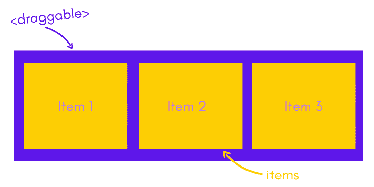
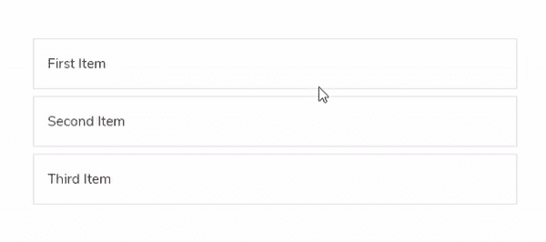
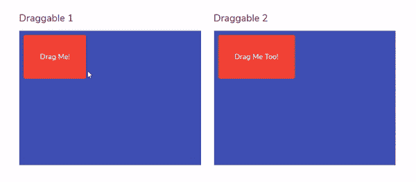
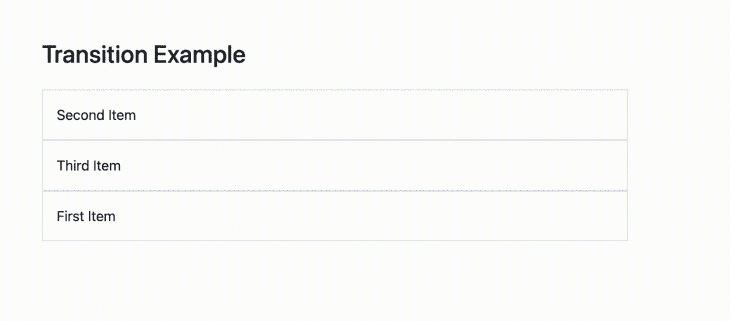
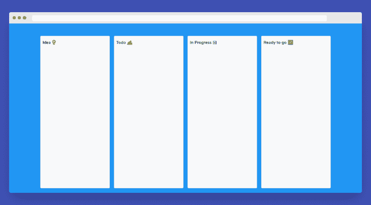
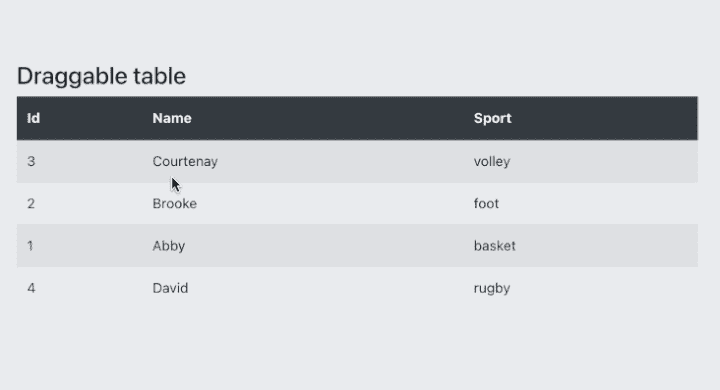
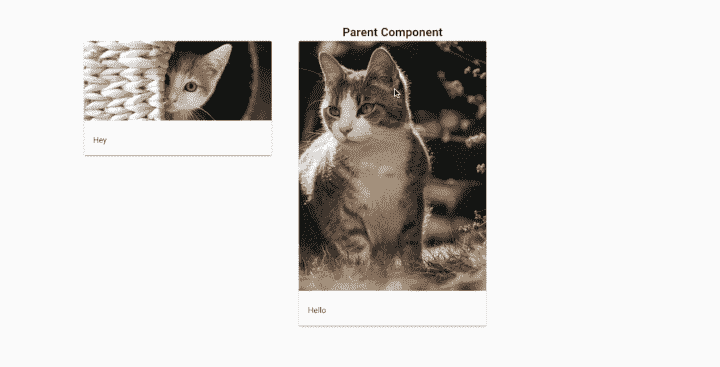

# vue.draggable 入门

> 原文：<https://blog.logrocket.com/getting-started-vue-draggable/>

除了使用原生的 HTML 5 拖放 API，还有大量的 JavaScript 库可以帮助您在 web 应用程序中轻松实现拖放功能。

这个列表中最受欢迎和最受欢迎的是 [Sortable.js](https://github.com/SortableJS/Sortable) ，在其 GitHub repo 上有超过 2.3 万个赞。你可能会猜测这是因为这个项目背后的社区致力于将这个库引入几乎所有的前端框架，包括 Angular、React、Vue、Polymer、Ember.js 等等。

在本教程中，我们将探索 vue . draggable——基于 Vue 的项目的官方 Sortable.js 组件——同时涵盖以下部分:

在本教程的最后，我们的项目将会是这样的:


## 先决条件

在我们进入文章之前，这里有一些你应该有的东西:

*   基本熟悉安装的 Vue.js 和 [Vue CLI](https://cli.vuejs.org/guide/installation.html)
*   已安装 Node.js 和 npm/yarn
*   文本编辑器

## vue .可拖动功能

开发人员社区更喜欢 vue.draggable 用于拖放实现的一些原因包括:

*   支持的触摸设备——与其他库不同，vue.draggable 拖放实现不仅限于用鼠标光标移动元素；它也适用于触摸设备
*   拖动控制柄和可选文本—该库还允许您处理拖动事件，并在用户试图选择可拖动元素中的文本时自动识别
*   vue.draggable 重用现有的 UI 库组件——您也可以将现有的 vue 组件附加到可拖动的元素上

## 设置 vue.draggable

将 vue.draggable 添加到新的 vue 项目非常简单。首先，您想用 Vue CLI 创建一个新的应用程序:

```
vue create drag-app && cd drag-app

```

创建新应用程序后，我们可以通过运行以下命令来添加 vue.draggable 包:

```
npm i -s vuedraggable
# OR
yarn add vuedraggable

```

*注意，如果你的应用是用 Vue 3 而不是 2.x 构建的，你应该安装* `[[email protected]](/cdn-cgi/l/email-protection)` *而不是:*

```
npm i -s [email protected]
# OR
yarn add [email protected]

```

要进行尝试，打开项目文件夹中的`src/App.vue`,将其内容更改为以下代码:

```
<template>
  <main>
    <div class="mt-5 container">
      <div class="row justify-content-center border py-5">
        <div class="col-5">
          <h4 class="mb-3">Draggable 1</h4>
          <draggable class="draggable-list" :list="list1" group="my-group">
            <div class="list-item" v-for="element in list1" :key="element.name">
              {{ element.name }}
            </div>
          </draggable>
        </div>

        <div class="col-5">
          <h4 class="mb-3">Draggable 2</h4>
          <draggable class="draggable-list" :list="list2" group="my-group">
            <div class="list-item" v-for="element in list2" :key="element.name">
              {{ element.name }}
            </div>
          </draggable>
        </div>
      </div>
    </div>
  </main>
</template>
<script>
import draggable from "vuedraggable";
export default {
  components: {
    draggable,
  },
  data() {
    return {
      list1: [{ name: "Drag Me!" }],
      list2: [{ name: "Drag Me Too!" }],
    };
  },
};
</script>
<style scoped>
.draggable-list {
  background: #3f51b5;
  color: #fff;
  border: 1px solid;
  height: 50vh;
}
.list-item {
  margin: 10px;
  padding: 40px;
  cursor: pointer;
  font-size: 18px;
  border-radius: 5px;
  background: #f44336;
  display: inline-block;
}
</style>

```

这里，我们从 vue.draggable 导入了 draggable 组件，并用虚拟数据渲染了两次，只是为了展示这个库是如何工作的。在下一节中，我们将深入研究如何添加这些数据，以及您可以在 draggable 组件中使用的一些其他道具。

接下来，运行应用程序:

```
npm run serve

```

您应该会在浏览器中看到以下输出:


## 了解`<draggable />`组件

开箱即用,`<draggable>`组件中的所有子元素都将具有拖放功能。这与 [CSS flexbox](https://blog.logrocket.com/how-to-build-a-basic-flexbox-layout-a-tutorial-with-examples/) 的工作方式非常相似:



虽然这不是必需的，但是建议将所有可拖动的项目与`<draggable>`组件同步。这在我们希望将自定义函数附加到可拖动事件的情况下非常有用。

我们可以通过向组件添加值`v-model`或`list` prop 来实现这一点:

```
<template>
  <main>
    <div>
      <draggable :list="myList">
        <div v-for="(list, i) in myList" :key="i">
          {{ list }}
        </div>
      </draggable>
    </div>
  </main>
</template>
<script>
import draggable from "vuedraggable";
export default {
  components: {
    draggable,
  },
  data() {
    return {
      myList: ["First Item", "Second Item", "Third Item"],
    };
  },
};
</script>

```

运行上面的代码，您应该在浏览器中得到以下输出:



## “视图”“疏浚干净”

vue.draggable 还支持你的项目的其他有用的道具。

### `group`

属性接受一个对象，我们可以用它来对可拖动的项目进行分类，它还设置了当我们将新的项目放入这个类别时会发生什么。

下面是我们第一个例子中更新后的代码，我们将`pull`选项设置为`clone`，将`put`设置为`false`:

```
    <draggable
        class="draggable-list"
        :list="list1"
        :group="{ name: 'myGroup', pull: 'clone', put: false}"
    >
    ....

```

将`pull`选项设置为`clone`意味着将一个元素拖出该列表将会`clone`该元素，而不会将其永久移出列表。将`put`设置为`false`意味着我们不能将新元素拖入这个组。

运行此代码将产生以下输出:



### `tag`

我们使用`tag`属性来指定 HTML 元素或 Vue 组件的名称，Vue 组件是由`<draggable>`创建的，作为包含槽的外部元素，默认为`div`。

### `clone`

当组中的`push`或`pull`值被设置为`clone`时(就像我们前面的例子)，我们可以向源组件添加一个额外的`clone`道具。

这个属性接受一个函数，该函数在组内的元素被克隆时被触发，也就是说，如果我们的第二个可拖动元素带有新的克隆属性，如下所示:

我们定义了一个方法`cloneAction()`:

每次在`list2`中克隆一个项目，都会触发该功能，浏览器控制台会记录“cloned”消息以及克隆的项目属性。

```
<draggable
  class="draggable-list"
  :list="list2"
  :group="{ name: 'my-group', pull: 'clone', put: false }"
  :clone="cloneAction()"
>
```

`move`

```
cloneAction(item) {
    console.log("cloned", item);
}
...
```

这个属性接受一个函数，通过这个函数我们可以访问一个`draggable`元素在`move`上的事件和细节:

### 我们可以让我们的`detectMove`函数为:

过渡

```
<draggable :list="myList" :move="detectMove"></draggable>

```

vue.draggable 还提供了一个过渡包装器，我们可以用它来制作可拖动项目的动画。这可以通过`<transition-group>`组件实现。我们只需要给这个元素添加一个转换名称，每当发生拖动时，一个新的字符串`-move`就会被附加到我们的转换名称上，这样我们就可以用 CSS 正确地指定转换。

```
    detectMove: function(evt){
       console.log(evt)
    }

```

下面的代码为我们之前的简单列表示例添加了一个过渡:

运行这个新示例，当我们拖动元素时，我们有一个平滑的过渡:

### 

构建看板

我们在这里的目标是创建一个四列项目管理板，让您将任务移动到类别“想法”、“待办事项”、“进行中”和“准备就绪”。

```
<template>
  <div>
    <h3>Transition Example</h3>
    <draggable
      v-model="myList"
    >
      <transition-group name="flip-transition">
        <div
          class="list-item"
          v-for="item in myList"
          :key="item.order"
        >
          {{ item.name }}
        </div>
      </transition-group>
    </draggable>
  </div>
</template>

<script>
import draggable from "vuedraggable";

export default {
  components: {
    draggable,
  },
  data() {
    return {
      myList: [
        { name: "Third Item", order: 3 },
        { name: "First Item", order: 1 },
        { name: "Second Item", order: 2 },
      ],
    };
  },
};
</script>

<style>
.flip-transition-move {
  transition: all 0.7s;
}
.list-item{
  padding: 10px;
  border: 1px solid #ccc;
}
</style>
```

为了避免编写过多的 CSS 代码，我们将使用[引导程序](https://blog.logrocket.com/tailwind-css-vs-bootstrap-ui-kits/)来快速设置网格和任务卡。为此，打开项目文件夹中的`public/index.html`，在`head`标签中添加一个引导 CDN 条目，如下所示:

接下来，打开`src/App.vue`,将其内容更改如下:

## 上面的代码将为我们的看板创建必要的列。运行该程序，您应该会看到浏览器中显示以下输出:

接下来，我们想在`script`部分导入 vue.draggable，并为我们的面板中的每一列创建一些虚拟任务:

最后一步是在页面中实现`<draggable>`组件，并分别遍历每一列中的任务。

```
<link
rel="stylesheet"
href="https://maxcdn.bootstrapcdn.com/bootstrap/4.0.0/css/bootstrap.min.css"
/>

```

为此，将`src/App.vue`更新为以下代码:

```
<template>
  <div class="container mt-5 mb-5">
    <div class="row">
      <div class="col mx-2 px-2 py-3 bg-light border rounded">
        <h6>Idea</h6>
      </div>
      <div class="col mx-2 px-2 py-3 bg-light border rounded">
        <h6>Todo</h6>
      </div>
      <div class="col mx-2 px-2 py-3 bg-light border rounded">
        <h6>In Progress</h6>
      </div>
      <div class="col mx-2 px-2 py-3 bg-light border rounded">
        <h6>Ready to go</h6>
      </div>
    </div>
  </div>
</template>
<style scoped>
h6 {
  font-weight: 700;
}
.col {
  height: 90vh;
}
</style>

```

运行代码，我们应该准备好看板:


```
<script>
import draggable from "vuedraggable";
export default {
  components: {
    draggable,
  },
  data() {
    return {
      tasks: {
        ideas: ["Migrate codebase to TypeScript"],
        todos: ["Dockerize App", "Add vue.draggable to project"],
        inProgress: ["Implement Web3 Features", "Bump to vite.js"],
        completed: [],
      },
    };
  },
};
</script>

```

我可以用 vue.draggable 做什么？

你可以用 vue.draggable 做更多的事情，比如开发一个更复杂的界面。阻碍你的只有你自己的想象。下面重点介绍了使用该库可以做些什么的一些其他示例:

```
<template>
  <div class="container mt-5 mb-5">
    <div class="row">
      <div class="col mx-2 px-2 py-3 bg-light border rounded">
        <h6>Idea 💡</h6>
        <draggable class="draggable-list" :list="tasks.ideas" group="tasks">
          <div v-for="(idea, i) in tasks.ideas" :key="i">
            <div class="bg-white mt-3 p-2 shadow border rounded">
              <p>{{ idea }}</p>
            </div>
          </div>
        </draggable>
      </div>
      <div class="col mx-2 px-2 py-3 bg-light border rounded">
        <h6>Todo ✍</h6>
        <draggable class="draggable-list" :list="tasks.todos" group="tasks">
          <div v-for="(todo, i) in tasks.todos" :key="i">
            <div class="bg-white mt-3 p-2 shadow border rounded">
              <p>{{ todo }}</p>
            </div>
          </div>
        </draggable>
      </div>
      <div class="col mx-2 px-2 py-3 bg-light border rounded">
        <h6>In Progress 🗓</h6>
        <draggable
          class="draggable-list"
          :list="tasks.inProgress"
          group="tasks"
        >
          <div v-for="(task, i) in tasks.inProgress" :key="i">
            <div class="bg-white mt-3 p-2 shadow border rounded">
              <p>{{ task }}</p>
            </div>
          </div>
        </draggable>
      </div>
      <div class="col mx-2 px-2 py-3 bg-light border rounded">
        <h6>Ready to go ✅</h6>
        <draggable class="draggable-list" :list="tasks.completed" group="tasks">
          <div v-for="(task, i) in tasks.completed" :key="i">
            <div class="bg-white mt-3 p-2 shadow border rounded">
              <p>{{ task }}</p>
            </div>
          </div>
        </draggable>
      </div>
    </div>
  </div>
</template>

<script>
import draggable from "vuedraggable";
export default {
  components: {
    draggable,
  },
  data() {
    return {
      tasks: {
        ideas: ["Migrate codebase to TypeScript"],
        todos: ["Dockerize App", "Add vue.draggable to project"],
        inProgress: ["Implement Web3 Features", "Bump to vite.js"],
        completed: [],
      },
    };
  },
};
</script>

<style scoped>
h6 {
  font-weight: 700;
}
.col {
  height: 90vh;
  overflow: auto;
}
.draggable-list {
  min-height: 10vh;
}
.draggable-list > div {
  cursor: pointer;
}
</style>

```

可拖动的桌子

使用 vue.draggable 也可以很容易地在表格中包含拖放功能，如下例所示。实现和前面的一样简单，为了方便起见，下面包含了实现的代码:

## 

[链接到示例](https://sortablejs.github.io/Vue.Draggable/#/table-example)

### 拖动并替换

另一个有趣的概念是拖动和替换特性；即，从一个组中拖动一个项目，使得它替换另一个组中的另一个项目。下面是一个例子，以及代码参考:



[链接到示例](https://codesandbox.io/s/3dmoq)

### 你还可以在 [CodePen](https://codesandbox.io/examples/package/vuedraggable) 上探索更多有趣的例子，看看人们用 vue.draggable 构建了什么。

结论

Sortable.js 为在应用程序中实现拖放提供了一个快速简单的解决方案，支持多种前端框架。在本文中，我们探索了 vue . draggable(vue . js 项目的 Sortable.js 官方组件)，它是多么容易使用，我们还学习了如何创建看板。

虽然本文提供了开始实现 vue.draggable 所需的所有内容，但是如果您有兴趣了解 Sortable.js 作为一个框架本身的更多信息，那么他们的 [GitHub repo](https://github.com/SortableJS/Sortable) 是一个很好的起点。

像用户一样体验您的 Vue 应用

## 调试 Vue.js 应用程序可能会很困难，尤其是当用户会话期间有几十个(如果不是几百个)突变时。如果您对监视和跟踪生产中所有用户的 Vue 突变感兴趣，

.

LogRocket 就像是网络和移动应用程序的 DVR，记录你的 Vue 应用程序中发生的一切，包括网络请求、JavaScript 错误、性能问题等等。您可以汇总并报告问题发生时应用程序的状态，而不是猜测问题发生的原因。

## LogRocket Vuex 插件将 Vuex 突变记录到 LogRocket 控制台，为您提供导致错误的环境，以及出现问题时应用程序的状态。

现代化您调试 Vue 应用的方式- [开始免费监控](https://lp.logrocket.com/blg/vue-signup)。

[try LogRocket](https://lp.logrocket.com/blg/vue-signup)

.

[](https://lp.logrocket.com/blg/vue-signup)[https://logrocket.com/signup/](https://lp.logrocket.com/blg/vue-signup)

[LogRocket](https://lp.logrocket.com/blg/vue-signup) is like a DVR for web and mobile apps, recording literally everything that happens in your Vue apps including network requests, JavaScript errors, performance problems, and much more. Instead of guessing why problems happen, you can aggregate and report on what state your application was in when an issue occurred.

The LogRocket Vuex plugin logs Vuex mutations to the LogRocket console, giving you context around what led to an error, and what state the application was in when an issue occurred.

Modernize how you debug your Vue apps - [Start monitoring for free](https://lp.logrocket.com/blg/vue-signup).