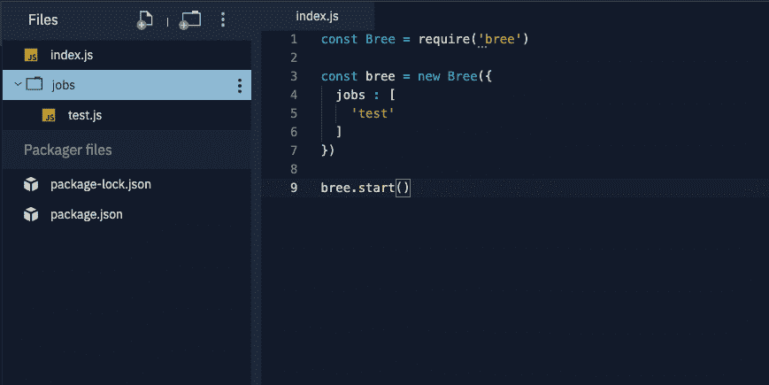
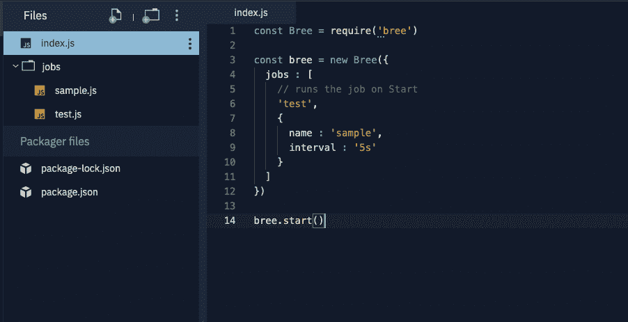
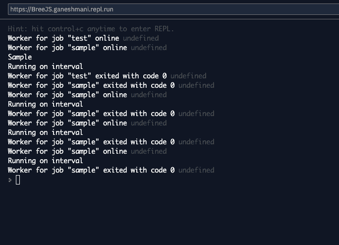

# Bree.js - LogRocket 博客入门

> 原文：<https://blog.logrocket.com/getting-started-with-bree-js/>

本文涵盖了 Bree.js 是什么以及如何开始构建一个实际的应用程序。

### Bree.js 是什么？

Bree.js 是 Node.js 应用程序的作业调度程序。[作业调度](https://en.wikipedia.org/wiki/Job_scheduler)是以预定的、重复的方式执行一段代码的过程。

Node.js 社区中还有其他可用的作业调度程序。然而，有一些很好的理由说明为什么我们应该选择 Bree.js 而不是其他。

## 为什么是 BreeJS？

#### 工作线程

Bree.js 在幕后使用工作线程。由于工作线程在 Node.js LTS 版本中可用，所以最好使用线程来完成后台作业，而不是使用主线程。

#### 并发、节流和重试

Bree.js 帮助您同时运行作业，并提供重试选项。有时，您需要重试作业中的特定操作。你可以使用像 [this](https://github.com/sindresorhus/p-all) 这样的库来实现。

## 安装和设置

让我们安装 Bree.js，看看如何在 Node.js 中开始一个简单的计划作业:

```
npm install bree
```

之后，让我们在根目录下创建一个名为`jobs`的文件夹，其中包含所有后台作业:



> 跳转到内容这个有趣的，经典的模拟把一个绘图变成一个轨道链！如果你感到困惑，试着减少循环次数🙂欢迎加入我的编码服务器:[https://discord.gg/9PSpWyTNkB](https://discord.gg/9PSpWyTNkB)一个简单的命令行翻译器，使用由 Brave 托管的 Lingvanex 翻译 API。

`bree.start()`将启动调度程序并运行所有已配置的作业。这里，我们有一个作业数组，它包含所有后台作业。该名称应该与作业目录中声明的文件名相匹配。

例如，这里我们有一个作业`test`。因此，jobs 目录应该包含一个名为`test.js`的文件来运行这个作业。我们可以在`test.js`中编写我们的逻辑，它与后台作业一起运行。

一旦我们运行了脚本，我们就可以运行作业并执行作业脚本文件中的逻辑。


## 安排工作

到目前为止，我们已经了解了如何在脚本启动时运行作业。现在，让我们看看如何使用 Bree.js 安排作业。安排作业很简单。您只需要向 jobs 数组元素传递一个附加参数:



这里，我们有一个参数`interval`，它每 5 秒运行一次脚本。

```
const Bree = require('bree')
const bree = new Bree({
  jobs : [
    // runs the job on Start
    'test',
    {
      name : 'sample',
      interval : '5s'
    }
  ]
})
bree.start()
```

我们的输出将如下所示:



您还可以使用其他选项来计划作业，包括以下选项:

#### 超时

超时在作业配置中的指定时间后运行脚本。您可以用它来替代 JavaScript 中的`setTimeout`。

```
const Bree = require('bree')
const bree = new Bree({
  jobs : [
    // runs the job on Start
    'test',
    {
      name : 'sample',
      timeout : '30s' //run the script after 30 seconds from the start
    }
  ]
})
bree.start()
```

#### 时间单位

Cron 只是用于在 Node.js 中运行 cron 作业。cron 作业的用例包括根据指定的小时、天、月或年备份数据库和运行脚本。

```
const Bree = require('bree')
const bree = new Bree({
  jobs : [
    // runs the job on Start
    'test',
    {
      name : 'sample',
      cron : '* * * * *'
      // timeout : '30s' //run the script after 30 seconds from the start
    }
  ]
})
bree.start()
```

到目前为止，我们已经了解了如何安排作业。现在，我们将看到如何从主文件向我们的作业传递一个值。

## 传递数据

因为 Bree.js 使用一个工作线程，所以您可以使用相同的概念将数据传递给一个工作线程。您只需传递`workerData`中的数据，该数据将出现在相应的作业文件中:

```
const Bree = require('bree')
const bree = new Bree({
  jobs : [
    // runs the job on Start
    // 'test',
    {
      name : 'sample',
      worker: {
        workerData: {
          foo: 'bar',
          beep: 'boop'
        }
      }
      // cron : '* * * * *'
      // timeout : '30s' //run the script after 30 seconds from the start
    }
  ]
})
bree.start()
```

```
const { Worker, isMainThread, workerData } = require('worker_threads');
console.log("worker data",workerData.foo)
```

我们现在已经开始触及 Bree.js 的皮毛。

以上细节已在 [Breejs](https://jobscheduler.net) 的文档中提供。我不想在本文中再次浏览文档，因为它已经被很好地记录了。

相反，我们将构建一个使用 Bree.js 的小应用程序。这样，我们将学习如何在实际应用中使用 Bree.js。

这里，我们将构建一个 Twitter 调度程序应用程序。它允许用户在指定的时间安排一个 Tweet。让我们看看如何使用 Bree.js 构建这个应用程序:

 [https://www.youtube.com/embed/pas2zS2zmmc?version=3&rel=1&showsearch=0&showinfo=1&iv_load_policy=1&fs=1&hl=en-US&autohide=2&wmode=transparent](https://www.youtube.com/embed/pas2zS2zmmc?version=3&rel=1&showsearch=0&showinfo=1&iv_load_policy=1&fs=1&hl=en-US&autohide=2&wmode=transparent)

视频

## 安装和设置

让我们安装该应用程序所需的依赖项:

```
npm install express bree body-parser cabin ejs twit passport passport-twitter
```

*   [express](https://expressjs.com/)–web 服务器处理服务器端的请求
*   [Bree](https://jobscheduler.net/)–任务调度器，用于调度推文
*   [body-parser](https://www.npmjs.com/package/body-parser)–lib 解析 POST 请求体
*   [小屋](https://github.com/cabinjs/cabin)–测井库(Bree.js 推荐用于测井)
*   ejs–呈现网页的模板引擎
*   [twit](https://www.npmjs.com/package/twit)–Twitter 客户端库将数据发布到 Twitter
*   [passport](https://www.npmjs.com/package/passport)–用于处理 Twitter 认证

接下来，在根目录中创建`app.js`,并添加以下代码:

```
const express = require("express");
const bodyParser = require("body-parser");
const expressLayouts = require("express-ejs-layouts");
const passport = require("passport");
const session = require("express-session");
const mongoose = require("mongoose");
const app = express();
const routes = require("./routes");
const dotenv = require("dotenv");
const Bree = require("bree");
const Cabin = require("cabin");
dotenv.config({});

const MONGO_USER = process.env.MONGODB_USER;
const MONGO_PASSWORD = process.env.MONGODB_PASSWORD;

// MONGODB Connection
mongoose
  .connect(
    <url>,
    { useNewUrlParser: true, useCreateIndex: true, useUnifiedTopology: true }
  )
  .then((res) => {
    console.log("mongodb connected successfully");
    app.use(bodyParser.json());
    app.use(bodyParser.urlencoded({ extended: false }));

    // Template Engine
    app.use(expressLayouts);
    app.set("view engine", "ejs");

    //Passport Configuration
    require("./config/passport")(passport);

    // Express Session for the application
    app.use(
      session({
        secret: "abcdefg",
        resave: true,
        saveUninitialized: false,
      })
    );

    // passport initialization
    app.use(passport.initialize());
    app.use(passport.session());

    // breejs configuration.
    const bree = new Bree({
      //   logger: new Cabin(),
      jobs: [{ name: "tweet-schedule", interval: "1m" }],
    });
    bree.start();

    //routes
    app.use("/", routes);

    //PORT for our application.
    const PORT = process.env.PORT || 4500;
    app.listen(PORT, () => {
      console.log(`Server is running on PORT ${PORT}`);
    });
  })
  .catch((err) => {
    console.log("Error in mongodb connection", err);
  });
```

我们有一个 MongoDB 连接功能，它通过 MongoDB URI 进行连接:

```
mongoose
  .connect(
    <url>,
    { useNewUrlParser: true, useCreateIndex: true, useUnifiedTopology: true }
  ){
     //logic comes here
   }
```

之后，我们必须实现 POST 请求的主体解析器和模板引擎的设置，这是`ejs`:

```
app.use(bodyParser.json());
app.use(bodyParser.urlencoded({ extended: false }));
app.use(expressLayouts);
app.set("view engine", "ejs");
```

之后，我们可以设置快速会话和 passport 初始化:

```
app.use(
      session({
        secret: "abcdefg",
        resave: true,
        saveUninitialized: false,
      })
);
app.use(passport.initialize());
app.use(passport.session());
```

最后，我们将使用 jobs 配置来设置 Bree.js，以实现 Tweet 调度功能。

```
const bree = new Bree({
      //   logger: new Cabin(),
      jobs: [{ name: "tweet-schedule", interval: "1m" }],
    });
    bree.start();
```

## 调度程序逻辑

让我们编写调度程序作业功能的逻辑。

在`jobs`目录中创建一个文件`tweet-scheduler.js`。现在，添加以下代码:

```
const { parentPort } = require("worker_threads");
const Cabin = require("cabin");
const { Signale } = require("signale");
const Jobs = require("../models/Jobs");
const User = require("../models/User");
const mongoose = require("mongoose");
const moment = require("moment-timezone");
const tweetUtils = require("../lib/tweetUtils");
const cabin = new Cabin({
  axe: {
    logger: new Signale(),
  },
});
let isCancelled = false;
if (parentPort) {
  parentPort.once("message", (message) => {
    if (message === "cancel") isCancelled = true;
  });
}
(async () => {
  await mongoose.connect(
    <URL>,
    { useNewUrlParser: true, useCreateIndex: true, useUnifiedTopology: true }
  );
  const tweetJobs = await Jobs.find({ isActive: true }).exec();
  await Promise.all(
    tweetJobs.map(async (tweet) => {
      return new Promise(async (resolve, reject) => {
        try {
          if (isCancelled) return;
          const user = await User.findById({ _id: tweet.userId }).exec();
          if (
            moment().tz(tweet.timezone).format("YYYY-MM-DD HH:mm") <
            moment(tweet.scheduledTime, "YYYY-MM-DD HH:mm").format(
              "YYYY-MM-DD HH:mm"
            )
          ) {
            console.log("It it not time yet to post tweet");
            // return;
            resolve();
          } else {
            console.log("==================");
            try {
              await tweetUtils({
                accessToken: user.twitter.accessToken,
                accessSecret: user.twitter.refreshToken,
                tweet: tweet.body,
              });
              await Jobs.findOneAndUpdate(
                { _id: tweet._id },
                { isActive: false }
              );
            } catch (e) {
              cabin.error(e);
            }
            resolve();
          }
        } catch (e) {
          reject(e);
        }
      });
    })
  );
  if (parentPort) parentPort.postMessage("done");
  else process.exit(0);
})();
// cabin.info("tweet schedule jobb");
// console.log("==============================================");
```

我知道乍一看可能会让人不知所措。让我们一步一步地分解它，以便更好地理解正在发生的事情。

首先，我们设置了 Cabin.js 记录器。然后，我们检查工作线程的父端口是否发送了任何消息。如果工作线程的 parentPort 发送类型为`cancel`的消息，那么我们将`isCancelled`设置为 true。

```
const cabin = new Cabin({
  axe: {
    logger: new Signale(),
  },
});
let isCancelled = false;
if (parentPort) {
  parentPort.once("message", (message) => {
    if (message === "cancel") isCancelled = true;
  });
}
```

下面是我们应用程序的逻辑:


我们需要检查我们是否可以在后台工作中做一些事情。它们包括:

*   从数据库中获取数据，这样我们就可以从数据库中安排推文
*   在 Bree.js 作业文件中使用异步/等待
*   工作完成后更新

为了从数据库中访问数据，我们需要在后台作业中单独连接数据库，即使我们在`app.js`中有连接逻辑:

```
mongoose.connect(
   <URL>,
    { useNewUrlParser: true, useCreateIndex: true, useUnifiedTopology: true }
  );
```

之后，我们需要在我们的作业中立即调用具有异步功能的函数执行(IIFE)来使用 Async/Await。

```
(async () => {
  await mongoose.connect(
    <URL>,
    { useNewUrlParser: true, useCreateIndex: true, useUnifiedTopology: true }
  );
  // Logic comes Here
})();
```

然后，我们需要使用这个查询从数据库中找到所有活跃的推文:

```
const tweetJobs = await Jobs.find({ isActive: true }).exec();
```

一旦我们得到了所有活跃的 tweet，我们就遍历它并发送 tweet。通过我们的调度程序，我们希望在小于或等于我们当前时间的时间发送这些推文:

```
await Promise.all(
    tweetJobs.map(async (tweet) => {
      return new Promise(async (resolve, reject) => {
        try {
          if (isCancelled) return;
          const user = await User.findById({ _id: tweet.userId }).exec();
          if (
            moment().tz(tweet.timezone).format("YYYY-MM-DD HH:mm") <
            moment(tweet.scheduledTime, "YYYY-MM-DD HH:mm").format(
              "YYYY-MM-DD HH:mm"
            )
          ) {
            console.log("It it not time yet to post tweet");
            // return;
            resolve();
          } else {
            console.log("==================");
            try {
              await tweetUtils({
                accessToken: user.twitter.accessToken,
                accessSecret: user.twitter.refreshToken,
                tweet: tweet.body,
              });
              await Jobs.findOneAndUpdate(
                { _id: tweet._id },
                { isActive: false }
              );
            } catch (e) {
              cabin.error(e);
            }
            resolve();
          }
        } catch (e) {
          reject(e);
        }
      });
    })
  );
```

最后，当我们完成任务时，我们可以向父线程发送一条消息，告诉它任务已经完成。

```
if (parentPort) parentPort.postMessage("done");
  else process.exit(0);
```

## 结论

最后，您应该使用您认为最容易实现的框架或库，这样您就可以自信地说这个库做得很好。根据这个简单的标准，我觉得 Bree.js 是最适合使用的库。您可以使用 Bree.js 实现任意复杂的逻辑。

要深入了解 Bree.js，请查看文档[这里](https://jobscheduler.net/#/?id=writing-jobs-with-promises-and-async-await)和[这里](https://jobscheduler.net/#/?id=cancellation-retries-stalled-jobs-and-graceful-reloading)。

## 通过理解上下文，更容易地调试 JavaScript 错误

调试代码总是一项单调乏味的任务。但是你越了解自己的错误，就越容易改正。

LogRocket 让你以新的独特的方式理解这些错误。我们的前端监控解决方案跟踪用户与您的 JavaScript 前端的互动，让您能够准确找出导致错误的用户行为。

[](https://lp.logrocket.com/blg/javascript-signup)

LogRocket 记录控制台日志、页面加载时间、堆栈跟踪、慢速网络请求/响应(带有标题+正文)、浏览器元数据和自定义日志。理解您的 JavaScript 代码的影响从来没有这么简单过！

[Try it for free](https://lp.logrocket.com/blg/javascript-signup)

.