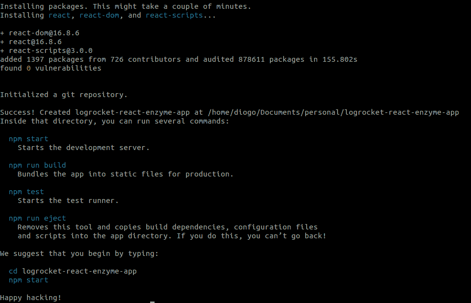
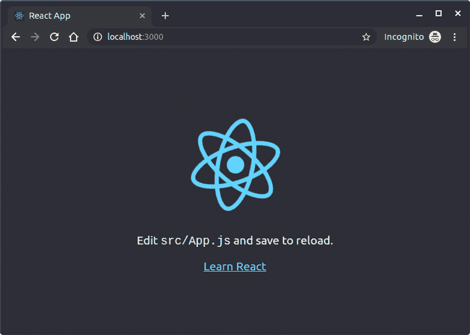

# React - LogRocket 博客的酶入门

> 原文：<https://blog.logrocket.com/getting-started-with-enzyme-for-react-a106b58fc53b/>

测试是 web 应用程序开发中的一个重要步骤，尤其是对于基于 React 这样的组件库开发的应用程序。在众多不同的测试工具和库当中， [Enzyme](http://airbnb.io/enzyme/) 因其灵活性和易于为 React 代码开发测试而脱颖而出。

实际上，Enzyme 更像是一个 JavaScript 测试工具，可以更容易地断言、操作和遍历 React 组件的输出。它由 Airbnb 创建，添加了许多实用功能，以方便组件渲染，以类似于 jQuery 的方式查找元素并与之交互。

在本教程中，我们将探索该工具提供的不同渲染选项，以及一些实际的例子。

[](https://logrocket.com/signup/)

### 设置和安装

首先确保你的本地开发机器上有[节点](https://nodejs.org/en/) ≥ v8.10.0。如果你不确定你是否在使用最新版本，参考 [nvm 文档](https://github.com/nvm-sh/nvm#installation)来确认。

对于这个项目，我们将使用 [create-react-app](https://facebook.github.io/create-react-app/) 来设置一个 react 应用程序，并让它立即运行。有了它，我们不需要安装或配置 Webpack 或 Babel 之类的工具；它们是预先配置和隐藏的，因此我们可以专注于代码。

它使用了 [npx](https://www.npmjs.com/package/npx) ，这是一个 npm 包运行程序，附带了 NPM v 5.2，所以整个事情非常简单。你可以在这里阅读 npx 上的。🙂

因此，为了创建我们的应用程序，在提示符下运行以下命令:

```
cd your-project-directory
npx create-react-app logrocket-react-enzyme-app
```

这将创建并初始化带有一系列预置节点模块的项目，这些模块对于 React 开发非常重要:



*Facebook create-react-app output.*

这是生成的文件和目录结构:

```
logrocket-react-enzyme-app
├── README.md
├── node_modules
├── package.json
├── .gitignore
├── public
│   ├── favicon.ico
│   ├── index.html
│   └── manifest.json
└── src
    ├── App.css
    ├── App.js
    ├── App.test.js
    ├── index.css
    ├── index.js 
    ├── logo.svg
    └── serviceWorker.js
```

花点时间打开`package.json`文件，分析预装的节点依赖，包括 React、React DOM、脚本；预设的启动脚本；建筑测试；以此类推:

```
{
  "name": "logrocket-react-enzyme-app",
  "version": "0.1.0",
  "private": true,
  "dependencies": {
    "react": "^16.8.6",
    "react-dom": "^16.8.6",
    "react-scripts": "3.0.0"
  },
  "scripts": {
    "start": "react-scripts start",
    "build": "react-scripts build",
    "test": "react-scripts test",
    "eject": "react-scripts eject"
  },
  "eslintConfig": {
    "extends": "react-app"
  },
  "browserslist": {
    "production": [
      ">0.2%",
      "not dead",
      "not op_mini all"
    ],
    "development": [
      "last 1 chrome version",
      "last 1 firefox version",
      "last 1 safari version"
    ]
  }
}

```

要检查正在运行的应用程序，只需在应用程序根文件夹中键入`npm start`命令，索引页面将在`[http://localhost:3000/](http://localhost:3000/)`时在浏览器中打开，就像这样:



*Index React App page*

现在，让我们继续酶的设置。一旦我们使用 React 16(撰写本文时的最新版本)进行项目开发，可以发出以下命令来正确安装 Enzyme:

```
npm i — save-dev enzyme enzyme-adapter-react-16
```

之后，您会注意到我们的`package.json`文件被更新了:

```
"devDependencies": {
   "enzyme": "^3.9.0",
   "enzyme-adapter-react-16": "^1.12.1"
}
```

如果你使用的是 React 的不同版本，不用担心——你可以按照[官方酶安装文档](https://airbnb.io/enzyme/docs/installation/)来指导如何为你的项目安装正确的版本。

注意:如果您使用的是 Linux，并且您得到了错误`Error: ENOSPC: System limit for number of file watchers reached`，这意味着您的系统达到了文件观察者的限制。要修复它，只需运行以下命令:

```
echo fs.inotify.max_user_watches=524288 | sudo tee -a /etc/sysctl.conf && sudo sysctl -p
```

### 创建我们的第一个测试

为了使用 Enzyme 的功能，我们需要告诉我们的 React 应用程序它已经安装并且可用。但是，请记住，我们需要参考我们之前安装的适配器包，并正确设置适配器以供 Enzyme 使用。因此，转到`src`文件夹，创建一个名为`enzyme.js`的新文件:

```
import Enzyme, { configure, shallow, mount, render } from 'enzyme';
import Adapter from 'enzyme-adapter-react-16';

configure({ adapter: new Adapter() });
export { shallow, mount, render };
export default Enzyme;

```

这将足以导出所有不同的酶渲染类型。然后，在`src/components`目录中创建另一个文件夹`tests`来保存我们的测试文件。

让我们考虑一个简单的例子:一个 HTML 有序列表。它将由两部分组成:

*   `OrderedList`:这将存储构建一个`OrderedListOption`元素的`<ol>`的函数，为不同的显示配置检查列表是否为空
*   `OrderedListOption`:它独立地处理每个`<li>`项、CSS 类及其值

例如，考虑到它的列表性质，这个组件可以很容易地适应于一个`<select>`。让我们来看看源代码:

```
import React from 'react';
import PropTypes from 'prop-types';

import OrderedListOption from './OrderedListOption';

function OrderedList(props) {
  const { options } = props;
  if (!options.length) {
    return <span className="empty">No options added.</span>;
  }

  return (
    <ol className="options">
      {options.map(option => <OrderedListOption key={option} value={option} />)}
    </ol>
  );
}

OrderedList.propTypes = {
  options: PropTypes.array,
};

OrderedList.defaultProps = {
  options: [],
};

export default OrderedList;

```

代码非常简单:我们在文件顶部导入`React`和`OrderedListOption`组件，同时检查条目的数组是否为空，以显示正确的 HTML 内容。如果数组不为空，我们将遍历它来组成列表选项。

看一看`OrderedListOption`代码:

```
import React from 'react';
import PropTypes from 'prop-types';

function OrderedListOption(props) {
  const { value } = props;
  return <li className="value">{value}</li>;
}

OrderedListOption.propTypes = {
  value: PropTypes.string,
};

export default OrderedListOption;

```

它只是接收元素的值，并将其放入`<li>`元素中。很简单，不是吗？

在我们创建测试之前，声明酶支持的三种不同渲染类型是很重要的。

#### `shallow`

这基本上每次呈现一个组件。换句话说，Enzyme 不会考虑测试的子元素。考虑这样的情况，您希望将组件本身与其周围或内部的其他组件隔离开来进行测试。当您喜欢单元测试而不是完全集成的测试时，这种呈现类型很有用。

#### `mount`

这与`shallow`相反，使用完整的 DOM 渲染，包括所有的子元素。它非常适合每个组件与其他组件(DOM API)紧密交互的情况。

#### `render`

它呈现为静态 HTML。这包括所有的子元素。同时，它阻止了对 React 生命周期方法的访问，这反过来为测试提供了更少的灵活性和功能性——此外，它的速度要快得多。它构建在 [Cheerio](https://github.com/cheeriojs/cheerio) 之上，后者是一个基于服务器 jQuery 核心的 DOM 操作和遍历 API。因此，您将拥有 jQuery 的所有功能。

现在让我们做一些测试。在我们的`/tests`文件夹中创建一个名为`OrderedList.test.js`的新文件，并添加以下代码:

```
import React from 'react';
import { shallow, mount, render } from '../../enzyme';

import OrderedList from '../OrderedList';

describe('Our test suite', () => {

    it('renders all the mocked animal options', () => {
        const animals = ['duck', 'bear', 'whale'];

        const wrapper = render(<OrderedList options={animals} />);

        expect(wrapper.find('.options')).toBeDefined();
        expect(wrapper.find('.value')).toHaveLength(animals.length);
    });

    it('renders no animal options', () => {
        const animals = [];
        const wrapper = shallow(<OrderedList options={animals} />);

        expect(wrapper.find('.empty').exists()).toBe(true);
    });

    it('renders a single animal option', () => {
        const animals = ['duck'];
        const wrapper = mount(<OrderedList options={animals} />);

        expect(wrapper.contains(<li key='duck' className="value">duck</li >)).toBeTruthy();
    });

    it('renders correct text in animal option', () => {
        const animals = ['duck', 'bear', 'whale'];
        const wrapper = mount(<OrderedList options={animals} />);

        expect(wrapper.find('.value').get(0).props.children).toEqual('duck');
    });
});

```

首先，我们从之前创建的`enzyme.js`文件开始导入三种渲染类型。这里，我们为每种类型的渲染设想了四个测试场景。

第一种为`render`型；我们基本上是要求 Enzyme 用给定的动物参数数组渲染一个`OrderedList`，并通过`expect()`函数断言测试条件。

`wrapper`对象代表`render()`结果，在其中，我们可以调用`find`CSS 类`options`(我们的项目的孩子)和`value`，关于每个内部列表元素的类。我们还测试了子元素的数量。

第二个测试集中在一个不接收任何元素的列表上。这里，我们使用的是`shallow`渲染类型，这使得像`exists()`这样的方法对我们可用。

最后两个测试利用了`mount()`函数，该函数将完整的 DOM 返回给`wrapper`对象。方法`contains()`是 React 生命周期方法的另一个例子。

### 测试表单组件

您甚至可以进一步测试表单、表单元素、事件等等。让我们来看第二个例子，一个登录表单组件(`Login.js`):

```
import React from 'react';

class Login extends React.Component {
    constructor() {
        super()
        this.state = {
            username: '',
            password: ''
        }
    }

    handleInputChange = (event) => {
        this.setState({
            [event.target.name]: event.target.value
        })
    }

    render() {
        return (
            <form className='login'>
                <label>Username</label>
                <input id='email' onBlur={this.handleInputChange} name='email' type='text' />
                <label>Password</label>
                <input id='password' onBlur={this.handleInputChange} name='password' type='password' />
                <button>Submit</button>
            </form>
        )
    }
}
export default Login

```

这是一个常见的表单结构组件，只是我们在这里保存的状态必须在每次输入中发生模糊事件时更新。

我们来看看`Login.test.js`文件:

```
import React from 'react';
import { shallow, mount, render } from '../../enzyme';
import Login from '../Login'

describe('Login Test Suite', () => {

    it('should render the form', () => {
        const wrapper = shallow(<Login />);

        expect(wrapper.find('form.login').exists()).toBe(true);
        expect(wrapper.find('#email').length).toEqual(1);
        expect(wrapper.find('#password').length).toEqual(1);
    })
})

describe('Email Test Suite', () => {

    it('should change the state of the Login component', () => {

        const wrapper = shallow(<Login />);
        wrapper.find('#email').simulate('blur',
            {
                target: { name: 'email', value: '[email protected]' }
            });

        expect(wrapper.state('email')).toEqual('[email protected]');
    })
})

describe('Password Test Suite', () => {

    it('should change the state of the Login component', () => {

        const wrapper = mount(<Login />);
        wrapper.find('#password').simulate('blur',
            {
                target: { name: 'password', value: 'my log is rocket' }
            });

        expect(wrapper.state('password')).toEqual('my log is rocket');
    })
})

```

第一个测试套件并不新鲜；我们只是检查表单元素是否存在。第二个和第三个测试利用了`simulate()`函数，顾名思义，模拟现场的事件——在本例中是`onBlur`。

一旦我们设置了`onBlur`将触发每个输入字段的状态更新，我们就可以检查是否存储了相同的状态。这是一个很好的行为测试的例子，其中我们测试在酶强制模拟组件中的事件后会发生什么。

这将是您的 IDE 中的最终输出(这里是 Visual Studio 代码):

*Test results in the terminal*

### 结论

你可以从我的 [GitHub repo](https://github.com/diogosouza/react-enzyme-app) 获得完整的源代码。如果你喜欢它，请留下一个星级。

在酶提供的许多方法和例子中，我们在这里只介绍了几个。这是一个动态和丰富的环境，您可以创建您的测试套件并探索许多不同的测试场景，例如集成、单一、行为、语义等。

参考[官方文档页面](https://airbnb.io/enzyme/docs/api/)了解更多关于酶及其功能、附加配置等的信息。以一个经过良好测试的应用程序为目标，让它更值得信赖。

你用酶反应过吗？请告诉我们一点您的体验…

## [LogRocket](https://lp.logrocket.com/blg/react-signup-general) :全面了解您的生产 React 应用

调试 React 应用程序可能很困难，尤其是当用户遇到难以重现的问题时。如果您对监视和跟踪 Redux 状态、自动显示 JavaScript 错误以及跟踪缓慢的网络请求和组件加载时间感兴趣，

[try LogRocket](https://lp.logrocket.com/blg/react-signup-general)

.

[ ](https://lp.logrocket.com/blg/react-signup-general) [](https://lp.logrocket.com/blg/react-signup-general) 

LogRocket 结合了会话回放、产品分析和错误跟踪，使软件团队能够创建理想的 web 和移动产品体验。这对你来说意味着什么？

LogRocket 不是猜测错误发生的原因，也不是要求用户提供截图和日志转储，而是让您回放问题，就像它们发生在您自己的浏览器中一样，以快速了解哪里出错了。

不再有嘈杂的警报。智能错误跟踪允许您对问题进行分类和归类，然后从中学习。获得有影响的用户问题的通知，而不是误报。警报越少，信号就越有用。

LogRocket Redux 中间件包为您的用户会话增加了一层额外的可见性。LogRocket 记录 Redux 存储中的所有操作和状态。

现代化您调试 React 应用的方式— [开始免费监控](https://lp.logrocket.com/blg/react-signup-general)。

* * *