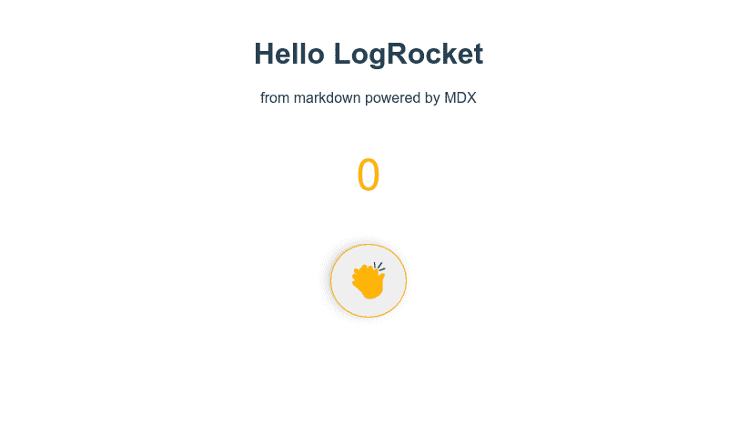
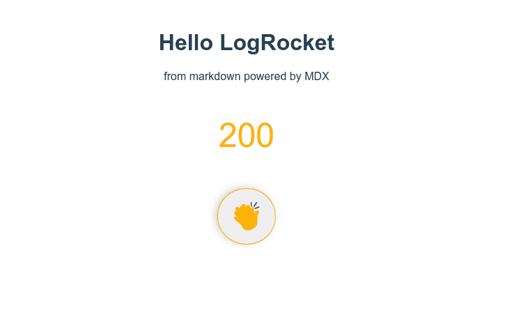

# MDX 和 Vue.js/Nuxt.js 入门

> 原文：<https://blog.logrocket.com/getting-started-with-mdx-and-vue-js-nuxt-js/>

自从 Markdown 被引入 web 以来，它已经允许内容创建者(如技术作家和文档工程师等。)有一个更简单的工具来进行创作。在本文中，我们将了解 MDX 以及如何在 Nuxt.js 应用程序中开始使用它。

## 先决条件

*   要想跟上，你需要熟悉 Markdown 和 Vue.js/Nuxt.js

## 什么是 MDX？

MDX 是一个语法扩展，它允许你在你的减价文档中写 [JSX](https://reactjs.org/docs/introducing-jsx.html) 。还有，根据官方 [MDX](https://mdxjs.com/) 文档，MDX 是:

> 一种可创作的格式，可以让你无缝地在你的 Markdown 文档中编写 JSX。您可以导入组件，如交互式图表或警报，并将它们嵌入到您的内容中

所以基本上，MDX 和 JSX 一起降价。在 MDX 之前，用 Markdown 编写 JSX 是一件麻烦的事情，因为编写 Markdown 的简单性在加入 JSX 的过程中丢失了。

MDX 打开了许多有趣的应用程序的大门，以降低文档的价值。例如， [Chakra UI](https://chakra-ui.com) 文档网站使用 MDX 允许读者编辑组件并在页面上实时查看它们的变化。

MDX 对于设计系统文档很有用，就像我们上面提到的使用 MDX 的 Chakra UI 文档一样。MDX 还允许您导入 Markdown ( `.md`或`.mdx`)文件作为组件！

## MDX 的功能

*   MDX 将 Markdown 和 JSX 完美地结合在一起，允许在 JX 的项目中进行更具表现力的创作
*   在您的降价文档中轻松导入和呈现 JSX 组件
*   高度可定制，允许您确定为每个 markdown 元素呈现哪个组件
*   保持了降价的简单性，你只需要在你想的地方使用 JSX
*   MDX 没有任何运行时，因为所有编译都发生在生成阶段。这使得 MDX 非常快

## MDX 和 Vue.js

虽然 JSX 最初是在 React 项目中使用的，但是现在你也可以在 [Vue.js](https://blog.logrocket.com/using-jsx-with-vue/) 中使用它。也就是说，您可以在 Vue.js 项目中自由集成 MDX。

## Vue.js 中 MDX 的特性

*   MDX 允许您将`.md`或`.mdx`文件作为 Vue 组件导入
*   MDX 还允许您在 markdown 文档中导入 Vue 组件
*   使用 MDX 提供程序，您可以用 Vue 组件替换 markdown 元素

让我们通过集成 MDX 和 Vue 来看看这些特性的实际应用。我们将从创建一个新的 Vue 项目开始。使用 Vue CLI 运行:

```
vue create mdx-vue-demo
```

创建 Vue 项目后，我们将通过安装官方加载器`@mdx-js/vue-loader`来添加 MDX 支持，这使得在 Vue 中使用 MDX 成为可能。下面我们来安装一下:

```
npm install @mdx-js/vue-loader
```

安装加载程序后，我们将把加载程序包含在项目的 webpack 配置中。由于我们使用的是 Vue CLI，我们可以在项目的根目录下创建一个`vue.config.js`文件，在`configureWebpack`属性中，我们将`@mdx-js/vue-loader`包含在模块规则下:

```
// vue.config.js
module.exports = {
  configureWebpack: {
    module: {
      rules: [
        {
          test: /\.mdx?$/,
          use: ['babel-loader', '@mdx-js/vue-loader'],
        },
      ],
    },
  },
};
```

代码的意思是任何以`.md`或`.mdx`结尾的文件都将由`babel-loader`和`@mdx-js/vue-loader`处理

如果您使用 webpack 配置 Vue 应用程序，上述步骤仍然相同。你只需将加载器包含在`webpack.config.js`中，就像这样:

```
// webpack.config.js
module: {
  rules: [
    // ...
    {
      test: /\.mdx?$/,
      use: ['babel-loader', '@mdx-js/vue-loader']
    }
  ]
}
```

## 在 Vue 组件中导入降价

现在我们已经安装并配置了`@mdx-js/vue-loader`，让我们在`src/`目录下创建一个`md`文件，并在`src/App.vue`中将其渲染为一个 Vue 组件。我们将在`components/`目录下创建`MyFirstMdx.mdx`，并添加以下内容:

```
# Hello LogRocket

from markdown powered by MDX

```

导入`src/App.vue`中的`.mdx`文件，因为您将导入一个 Vue 组件。像这样:

```
import MyFirstMDX from '@/components/MyFirstMdx.mdx'
```

我们将注册组件:

```
components: {
  MyFirstMdx
}
```

然后用`<my-first-mdx />`替换`App.vue`中的模板。`App.vue`文件现在应该是这样的:

```
<template>
  <div id="app">
    <my-first-mdx />
  </div>
</template>
<script>
import MyFirstMdx from "./components/MyFirstMdx.mdx";
export default {
  name: "App",
  components: {
    MyFirstMdx,
  },
};
</script>
<style>
#app {
  font-family: Avenir, Helvetica, Arial, sans-serif;
  -webkit-font-smoothing: antialiased;
  -moz-osx-font-smoothing: grayscale;
  text-align: center;
  color: #2c3e50;
  margin-top: 60px;
}
</style>
```

启动 Vue 开发服务器，当你在浏览器中访问你的应用时，你会看到`MyFirstMdx.mdx`的内容。

## 在 Markdown 中导入 Vue 组件

为了演示 MDX 如何使在 markdown 文档中导入 Vue 组件变得容易，我们将在`components/`中创建一个允许用户为 MDX 鼓掌的组件(为什么不呢！).我们将这个组件称为`ClapForMdx.vue`。向其中添加以下代码片段:

```
// components/ClapForMdx.vue
<template>
  <section>
    <p class="claps">{{ claps }}</p>
    <button class="clap-btn" @click="clap" title="Clap for MDX">👏</button>
  </section>
</template>
<script>
export default {
  data() {
    return {
      claps: 0,
    };
  },
  methods: {
    clap() {
      this.claps += 5;
    },
  },
};
</script>
<style>
.claps {
  font-size: 3rem;
  color: #f0ab1f;
}
.clap-btn {
  padding: 1rem;
  border-radius: 100%;
  font-size: 2.5rem;
  cursor: pointer;
  border: 1px solid #f0ab1f;
  box-shadow: -4px -1px 18px -10px rgba(0, 0, 0, 0.75);
}
.clap-btn:focus {
  outline: none;
}
</style>
```

然后将`MyFirstMdx.mdx`修改为

```
import ClapForMdx from './ClapForMdx.vue';
# Hello LogRocket
from markdown powered by MDX
<ClapForMdx />
```

您应该在浏览器中看到这个:



你可以和按钮互动，它会按预期响应！



## MDX 和 Nuxt.js

我们现在已经看到了 MDX 在 Vue 项目中是如何工作的。在最后一节中，我们将介绍 Nuxt.js 应用程序中的安装。由于 Nuxt 是 Vue 的一个框架，我们的代码示例将在其中工作，所以我们不需要重复。

首先，我们需要在一个 Nuxt.js 项目中添加 MDX 的官方 NuxtJS 模块作为开发依赖项。在您的终端中运行以下命令:

```
npm install --save-dev @nuxtjs/mdx
```

然后在`nuxt.config.js`中将模块添加到`buildModule`属性中，如下所示:

```
buildModules: ['@nuxtjs/mdx']
```

如果您使用的是 nuxt < 2.9.0，请改用`modules`属性。

就是这样！你可以重用我们上面的例子，它会工作。

## 结论

在这个组件驱动的时代，MDX 允许您无缝地混合 markdown 和 JSX。在本文中，我们研究了如何在您的 Vue.js/Nuxt.js 项目中设置和使用 MDX。如果您想继续探索 MDX 或它与 Vue.js 或 Nuxt.js 的集成，请查看以下资源:

这是我们的演示 VueJS 项目到 GitHub repo 的链接。

## 像用户一样体验您的 Vue 应用

调试 Vue.js 应用程序可能会很困难，尤其是当用户会话期间有几十个(如果不是几百个)突变时。如果您对监视和跟踪生产中所有用户的 Vue 突变感兴趣，

[try LogRocket](https://lp.logrocket.com/blg/vue-signup)

.

[](https://lp.logrocket.com/blg/vue-signup)[https://logrocket.com/signup/](https://lp.logrocket.com/blg/vue-signup)

LogRocket 就像是网络和移动应用程序的 DVR，记录你的 Vue 应用程序中发生的一切，包括网络请求、JavaScript 错误、性能问题等等。您可以汇总并报告问题发生时应用程序的状态，而不是猜测问题发生的原因。

LogRocket Vuex 插件将 Vuex 突变记录到 LogRocket 控制台，为您提供导致错误的环境，以及出现问题时应用程序的状态。

现代化您调试 Vue 应用的方式- [开始免费监控](https://lp.logrocket.com/blg/vue-signup)。

## 您是否添加了新的 JS 库来提高性能或构建新特性？如果他们反其道而行之呢？

毫无疑问，前端变得越来越复杂。当您向应用程序添加新的 JavaScript 库和其他依赖项时，您将需要更多的可见性，以确保您的用户不会遇到未知的问题。

LogRocket 是一个前端应用程序监控解决方案，可以让您回放 JavaScript 错误，就像它们发生在您自己的浏览器中一样，这样您就可以更有效地对错误做出反应。

[](https://lp.logrocket.com/blg/javascript-signup)[https://logrocket.com/signup/](https://lp.logrocket.com/blg/javascript-signup)

[LogRocket](https://lp.logrocket.com/blg/javascript-signup) 可以与任何应用程序完美配合，不管是什么框架，并且有插件可以记录来自 Redux、Vuex 和@ngrx/store 的额外上下文。您可以汇总并报告问题发生时应用程序的状态，而不是猜测问题发生的原因。LogRocket 还可以监控应用的性能，报告客户端 CPU 负载、客户端内存使用等指标。

自信地构建— [开始免费监控](https://lp.logrocket.com/blg/javascript-signup)。