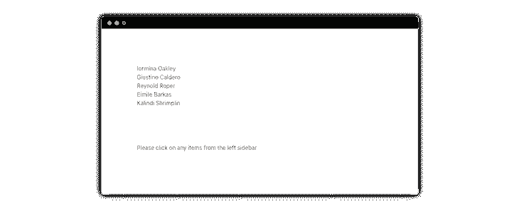
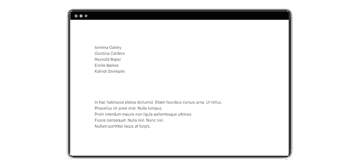
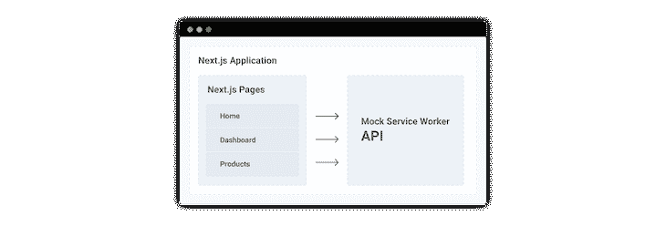
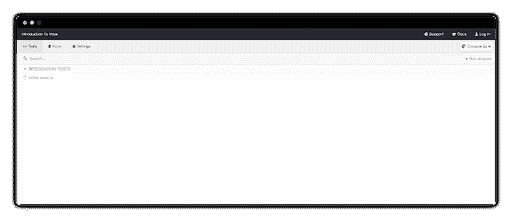
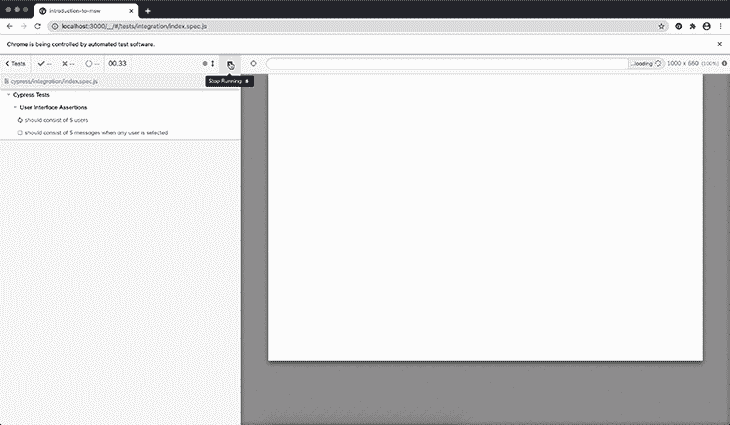

# 模拟服务人员入门

> 原文：<https://blog.logrocket.com/getting-started-with-mock-service-worker/>

在本教程中，我们将学习[模拟服务工作者](https://mswjs.io/)以及我们如何使用它来模拟网络请求。我们将构建一个聊天应用程序，它将使用由模拟服务工作者 API 提供的模拟数据。

## 什么是模拟服务人员，它解决什么问题？

据其[官网](https://mswjs.io/docs/)介绍，Mock Service Worker 是一个 API 嘲讽库，使用服务工作者 API 拦截实际请求。使用模拟服务器工作器，让模拟服务器启动并运行变得非常容易。它基于服务工作者的想法，以便捕获缓存请求。

除其他外，它具有以下特点:

1.  网络级别的拦截
2.  标准化服务工作者 API
3.  支持 REST 和 GraphQL APIs
4.  客户端的执行
5.  支持类型脚本

## 我们将会建造什么

在本教程中，我们将构建一个包含用户列表和消息列表的聊天应用程序。这个聊天应用程序的模拟数据将由模拟服务工作者定义的模拟提供。在本教程结束时，我们的应用程序应该如下所示:


The user interface of our chat application.

我们将使用 [Next.js](https://nextjs.org/) 构建应用程序，使用 [Chakra UI](https://chakra-ui.com/) 设计应用程序的样式。

Next.js 是一个流行的 React 框架，支持服务器端渲染和许多其他现成的特性。关于 Next.js 的更多细节可以从其官方文档中获得。

Chakra UI 是一个简单而强大的组件库，用于构建 React 应用程序。关于 Chakra UI 的更多细节可以从其官方网站获得。

## 创建 Next.js 应用程序

我们可以使用以下命令创建一个 Next.js 应用程序:

```
npx create-next-app
```

上面的命令将创建一个新的 Next.js 应用程序，并为我们设置好一切。安装完成后，我们可以按照屏幕上的说明启动开发服务器。

## 将 Chakra UI 添加到 Next.js 应用程序中

我们可以使用以下命令安装 Chakra UI 依赖项:

```
yarn add @chakra-ui/core @emotion/core @emotion/styled emotion-theming
```

一旦安装完成，我们需要用下面的代码更新`pages/_app.js`文件:

```
// pages/_app.js

import { ThemeProvider, CSSReset, theme } from "@chakra-ui/core";

const App = ({ Component, pageProps }) => {
  return (
    <ThemeProvider theme={theme}>
      <CSSReset />
      <Component {...pageProps} />
    </ThemeProvider>
  );
};

export default App;
```

这将确保所有的脉轮界面风格现在都出现在我们的应用程序中。我们现在可以在我们的应用程序中添加任何 Chakra UI 组件。

> **注意**:添加查克拉 UI 是可选的。这里只是用来设计一个好看的界面。为了保持本教程简短，我们不会深入到查克拉 UI 组件。

## 在我们的应用程序中安装模拟服务工作者

现在让我们将模拟服务工作添加到我们的应用程序中。我们可以使用以下命令来实现这一点:

```
yarn add msw --dev
```

这将把模拟服务工作添加到我们的开发依赖列表中。由于我们在生产中不需要对我们的数据进行任何模拟，所以它应该只安装在开发环境中。

## 定义模拟

使用模拟服务工作者，我们可以模拟 [GraphQL](https://mswjs.io/docs/getting-started/mocks/graphql-api) 和[REST](https://mswjs.io/docs/getting-started/mocks/rest-api)API。在本教程中，我们将模仿 REST APIs。

让我们在一个新文件`mocks/handlers.js`中定义模拟服务工作者的模拟，内容如下:

```
// mocks/handlers.js

import { rest } from "msw";
import users from "data/users"; // contains mock data for users
import messages from "data/messages";// contains mock data for messages

export const handlers = [
  rest.get("https://backend.dev/users", (req, res, ctx) => {
    return res(ctx.json(users));
  }),

  rest.get("/users/:id/messages", (req, res, ctx) => {
    return res(ctx.json(messages));
  }),

  rest.post("/users/:id/messages", (req, res, ctx) => {
    const { message } = JSON.parse(req.body);
    return res(
      ctx.json({
        id: Math.random(),
        message,
      })
    );
  }),
];
```

从上面的代码中，我们可以看到我们已经创建了三个模拟端点，Next.js 将在服务器端获取其中的数据:

1.  这个 API 端点负责发送初始数据来显示我们的用户列表。
2.  `GET /users/:id/messages`–该 API 端点将负责发送显示消息列表的数据。
3.  `POST /users/:id/messages`–该 API 端点将负责在创建新消息时发送数据。

我们将在 Next.js 应用程序中使用所有这些 API 端点。

## 将模拟服务工作者集成到我们的应用程序中

现在，让我们将这些模拟 API 集成到我们的应用程序中。为此，我们需要添加一个新文件`mocks/browser.js`，其内容如下:

```
// mocks/browser.js

import { setupWorker } from "msw";
import { handlers } from "mocks/handlers";

export const worker = setupWorker(...handlers);
```

上面的文件将负责在客户端发送模拟数据。我们还需要创建一个新文件，用于在服务器端发送模拟数据:

```
// mocks/server.js

import { setupServer } from "msw/node";
import { handlers } from "mocks/handlers";

export const server = setupServer(...handlers);
```

上述两个独立的文件是必要的，因为根据 [MSW 文档](https://mswjs.io/docs/getting-started/integrate)，相同的请求处理程序可以在浏览器和节点环境之间共享。由于服务人员无法在 Node 中运行，因此集成过程因环境而异。

我们还需要创建另一个文件`mocks/index.js`，它将负责决定是从服务器还是客户端发送数据。

```
// mocks/index.js

if (typeof window === "undefined") {
  const { server } = require("mocks/server");
  server.listen();
} else {
  const { worker } = require("mocks/browser");
  worker.start();
}
```

上面的`window`对象只在客户端定义。利用这个特性，我们可以很容易地判断数据是从服务器端还是客户端请求的。

接下来，我们需要在我们的`pages/_app.js`文件中添加导入`mocks/index.js`文件:

```
// pages/_app.js

require("mocks");

....

const App = ({ Component, pageProps }) => {

  ....

};

export default App;
```

出于演示目的，我们从 MSW 加载模拟数据。在真实的应用程序中，模拟应该只在开发环境中出现。

我们可以通过检查`NODE_ENV`变量仅在开发时导入 MSW:

```
// pages/_app.js

if (process.env.NODE_ENV === "development") {
  require("mocks");
}

....

const App = ({ Component, pageProps }) => {

  ....

};

export default App;
```

最后，我们需要运行 MSW 的 [init](https://mswjs.io/docs/cli/init) 命令，将服务工作者放在我们应用程序的公共目录中。对于 Next.js，公共目录是`./public`。

```
npx msw init ./public
```


Placing the Service Worker using the init command.

## 从模拟服务工作者获取模拟数据

我们将首先构建获取用户的用户界面。我们可以使用 Next.js `[getServerSideProps](https://nextjs.org/docs/basic-features/data-fetching#getserversideprops-server-side-rendering)`方法在服务器端取数据，然后在浏览器上渲染。为此，我们需要创建一个新文件`pages/index.js`，其内容如下:

```
// pages/index.js

import React from "react";

const Home = ({ users = [] }) => {
  const usersNode = () => {
    if (!users.length) {
      return <>No users found</>;
    }

    return (
      <>
        {users.map((user) => {
          return (
            <div key={user.id}>
              {user.first_name} {user.last_name}
            </div>
          );
        })}
      </>
    );
  };

  return usersNode();
};

export async function getServerSideProps() {
  const response = await fetch("https://backend.dev/users");
  const users = await response.json();

  return {
    props: {
      users,
    },
  };
}

export default Home;
```

这里，我们从服务器端的`[https://backend.dev/users](https://backend.dev/users)` API 端点获取模拟数据，并呈现在用户界面上。上述代码将呈现以下用户界面:


The UI for fetching the list of all the users.

现在，我们将开发获取消息列表的用户界面。当用户被点击时，我们从`/users/:id/messages` API 端点获取一个消息列表，并将其呈现在界面上。为此，我们需要用以下内容更新我们的`pages/index.js`文件:

```
// pages/index.js

import React, { useState } from "react";

const Home = ({ users = [] }) => {
  const [messages, setMessages] = useState([]);

  const handleFetchMessages = async (userId) => {
    // 1\. Set the fetching state to 'true' to show a spinner
    // 2\. Fetch all the mock messages
    // 3\. Store the messages in the state
    // 4\. Set the fetching state to 'false' to remove the spinner
    const response = await fetch(`users/${userId}/messages`);
    const messages = await response.json();

    setMessages(messages);
  };

  const messagesNode = () => {
    if (!messages.length) {
      return <div>Please click on any items from the left sidebar</div>;
    }

    return (
      <div>
        {messages.map((message) => {
          return <div key={message.id}>{message.message}</div>;
        })}
      </div>
    );
  };

  ....

  return (
    <>
      {usersNode()}
      {messagesNode()}
    </>
  );
};

....

export default Home;
```

我们从端点获取所有模拟消息，然后将数据存储在`messages` React 状态中，并在接口上呈现该数组。在获取数据之前，我们的用户界面应该如下所示:



The UI before fetching the list of all the messages.

一旦用户被点击，数据从 API 端点获取，我们的用户界面应该如下所示:



Interface for fetching the list of all the messages.

下图展示了我们的 Next.js 应用程序的不同层。所有 Next.js 页面都可以连接到 MSW 的模拟 API 并请求数据。



Next.js layers for interacting with the MSW API.

## 使用 Cypress 测试我们的应用程序

我们将使用 [Cypress](https://www.cypress.io/) 编写几个集成测试。Cypress 是一个端到端的 JavaScript 测试框架。它有许多[特性](https://www.cypress.io/features)，并且非常容易与任何前端应用程序集成。

首先，我们需要[安装](https://docs.cypress.io/guides/getting-started/installing-cypress.html) Cypress 作为依赖项:

```
yarn add -D cypress
```

上面的命令将把 Cypress 添加到我们的开发依赖列表中。与 MSW 一样，我们不需要在生产中对我们的应用程序进行任何测试，所以它应该只安装在开发环境中。

接下来，我们可以向我们的`package.json`文件添加一个脚本，以便使用 Cypress 运行测试:

```
// package.json

{

  ....

  "scripts": {

    ....

    "test": "cypress open"
  },

  ....

}
```

现在，我们可以运行下面的命令从项目的根目录启动 Cypress:

```
yarn test
```

请注意，我们的应用程序的开发服务器应该已经启动并正在运行，因为我们需要运行集成测试。在一个终端中运行`yarn dev`而在另一个终端中运行`yarn test`是个好主意。

上面的命令将启动 Cypress 测试运行程序。



Cypress test runner.

接下来，我们可以开始使用 Cypress 编写集成测试。我们需要创建一个新文件`cypress/integration/index.spec.js`，内容如下:

```
// cypress/integration/index.spec.js

context("Cypress Tests", () => {
  beforeEach(() => {
    // This will ensure that Cypress always visits our development server 
    // before running any tests
    cy.visit("http://localhost:3000/");
  });

  describe("User Interface Assertions", () => {
    it("should consist of 5 users", () => {
      cy.get("[data-test-id=user]").should("have.length", 5);
    });

    it("should consist of 5 messages when any user is selected", () => {
      cy.get("[data-test-id=user]").first().click();
      cy.get("[data-test-id=message]").should("have.length", 5);
    });
  });
});
```

在上面的代码中，我们编写了两个测试:

1.  第一个测试检查 UI 上应该有五个用户。
2.  第二个测试检查当选择任何用户时，UI 上应该有五条消息。

根据我们的模拟数据，这两个测试都应该通过。



Running our integration tests using Cypress.

## 结论

在本教程中，我们了解了从模拟服务工作者开始模拟和使用模拟数据是多么容易。这个应用的源代码可以在 [GitHub](https://github.com/ghoshnirmalya/introduction-to-msw) 上获得，并且在 [Vercel](https://introduction-to-msw.vercel.app/) 上有一个演示。

请注意，演示应用程序中出现的样式是由 Chakra UI 组件决定的。另外，在演示应用程序中有一个[示例 POST 示例](https://github.com/ghoshnirmalya/introduction-to-msw/blob/master/mocks/handlers.js#L14-L23)。所有的模拟数据都出现在这个目录中[。](https://github.com/ghoshnirmalya/introduction-to-msw/tree/master/data)

## [LogRocket](https://lp.logrocket.com/blg/nextjs-signup) :全面了解生产 Next.js 应用

调试下一个应用程序可能会很困难，尤其是当用户遇到难以重现的问题时。如果您对监视和跟踪状态、自动显示 JavaScript 错误、跟踪缓慢的网络请求和组件加载时间感兴趣，

[try LogRocket](https://lp.logrocket.com/blg/nextjs-signup)

.

[](https://lp.logrocket.com/blg/nextjs-signup)[](https://lp.logrocket.com/blg/nextjs-signup)

LogRocket 就像是网络和移动应用的 DVR，记录下你的 Next.js 应用上发生的一切。您可以汇总并报告问题发生时应用程序的状态，而不是猜测问题发生的原因。LogRocket 还可以监控应用程序的性能，报告客户端 CPU 负载、客户端内存使用等指标。

LogRocket Redux 中间件包为您的用户会话增加了一层额外的可见性。LogRocket 记录 Redux 存储中的所有操作和状态。

让您调试 Next.js 应用的方式现代化— [开始免费监控](https://lp.logrocket.com/blg/nextjs-signup)。