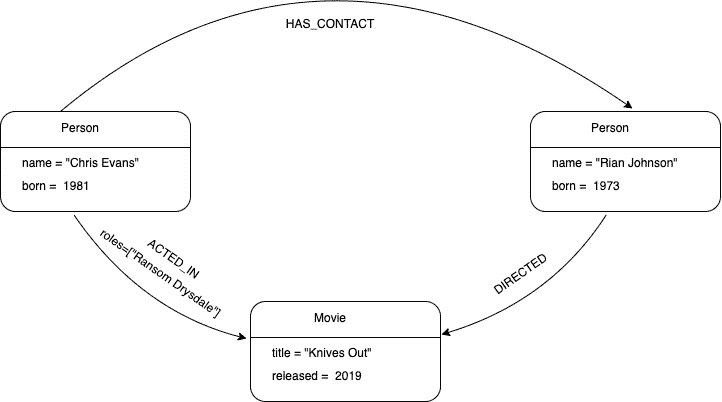
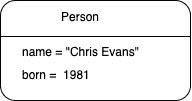
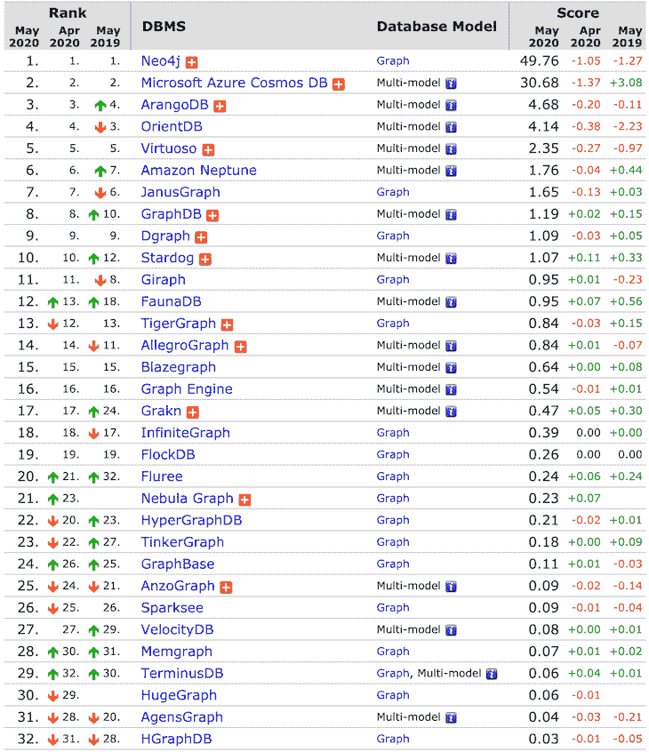
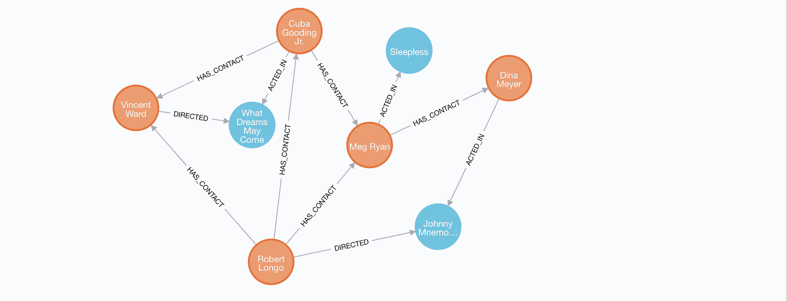
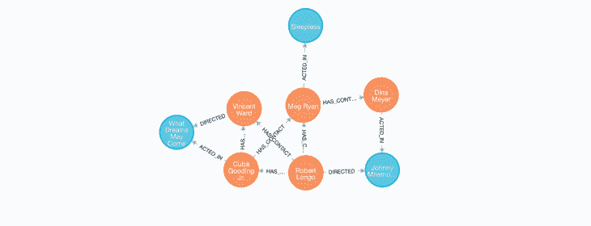

# Neo4j 入门- LogRocket 博客

> 原文：<https://blog.logrocket.com/getting-started-with-neo4j/>

最简单的图是节点和关系的集合。图形数据库是一个数据库管理系统，它使用图形数据模型(节点和关系)来执行创建、读取、更新和删除(CRUD)操作。图形数据库被设计成将节点之间的关系视为一等公民。这意味着数据之间的连接不需要使用外键来推断。



## 图形数据库概念

### 节点

节点是图中的一个实体(如人、地点、对象或相关数据)。最简单的可能图形是单个节点。



### 标签

标签用于将节点分组到集合中，使得标记有特定标签的所有节点属于同一集合。节点标签也可用于将元数据(如索引或约束)附加到某些节点。在上面的示例图中，所有代表人的节点都标有`:Person`。

### 关系

关系是两个节点之间的连接。关系总是有方向、类型、开始节点和结束节点。

我们的示例图将`ACTED_IN`、`HAS_CONTACT`和`DIRECTED`作为关系类型。克里斯·埃文斯节点具有传出关系，而“利刃出稍”节点具有传入关系。

### 性能

属性是用于向节点和关系添加属性的键值对。

在我们的示例图中，我们在`Person`节点上使用了属性`name`和`born`，在电影节点上使用了属性`title`和`released`，在`:ACTED_IN`关系上使用了属性`roles`。

属性值可以是以下任何数据类型:

*   `Integer`
*   `Float`
*   `String`
*   `Boolean`
*   `Point`
*   `Date`
*   `Time`
*   `LocalTime`
*   `DateTime`
*   `LocalDateTime`，以及
*   `Duration`

## 为什么要使用图形数据库？

我们生活在一个高度关联的世界。如今，公司管理着大量互连的数据集。利用数据关系的最佳方式是使用一种非常重视关系的技术。这正是图形数据库所做的。图形数据库将关系信息存储为一级实体。

因为图形数据库不遵循严格的模式，所以它们最适合当今业务需求快速变化的敏捷团队。有了图形数据库，您可以灵活地扩展数据库，以适应不断变化的业务需求。

图形数据库旨在支持高效的数据检索，允许您实时遍历数百万个连接。

## 图形数据库系统

有如此多的图形数据库。下表显示了排名靠前的图形数据库(来源: [DB-Engines](https://db-engines.com/en/ranking/graph+dbms) )。



如您所见，Neo4j 是最流行的图形数据库系统。在本教程中，我们将带您了解如何使用 Neo4j 数据库。

## Neo4j 是什么？

Neo4j 是一个开源的 NoSQL 本地图形数据库，为你的应用提供了一个 ACID 兼容的事务后端。

Neo4j 被称为原生图数据库，因为它有效地实现了属性图模型，一直到存储级别。它还提供了完整的数据库特性，如 ACID 事务遵从性、集群支持和运行时故障转移。Neo4j 支持自己的查询语言 Cypher。

## 安装 Neo4j

在 Neo4j 中，有多种方式可以与图形数据交互并使用图形数据。出于本教程的目的，我们将使用 Neo4j 桌面。

Neo4j Desktop 默认支持 Cypher，不需要单独安装驱动程序。[下载适用于您的操作系统的 Neo4j Desktop](https://neo4j.com/download/) ，然后按照安装说明进行操作。

## 密码查询语言

[Cypher](https://neo4j.com/developer/cypher-query-language/) 是 Neo4j 的图形查询语言。它允许用户从图形数据库中存储和检索数据。

Neo4j 的 Cypher 查询语言易于任何人学习、理解和使用。Cypher 结合了其他标准数据访问语言的能力和功能。

## 用密码查询节点和关系

在我们探索如何查询 Neo4j 图形数据库之前，让我们创建一个新的数据库并用数据填充它。

打开你安装的 Neo4j 桌面应用，创建一个名为`learn-neo4j`的新数据库。在 Neo4j 浏览器中打开新数据库，运行下面的查询，用初始数据填充数据库。

```
// post data
CREATE (johnnyMnemonic:Movie {title:"Johnny Mnemonic",tagline:"The hottest data on earth. In the coolest head in town",released:1995} )
CREATE (sleepless:Movie {title:"Sleepless in Seattle",tagline:"What if someone you never met, someone you never saw, someone you never knew was the only someone for you?",released:1993})
CREATE (dreams:Movie {title:"What Dreams May Come", tagline:"After life there is more. The end is just the beginning.",released:1998}  )
CREATE (dina:Person {name:"Dina Meyer", born:1968} )
CREATE(ice:Person {name:"Ice-T", born:1958})
CREATE(keenu:Person {name:"Keanu Reeves", born:1964})
CREATE(takeshi:Person {name:"Takeshi Kitano", born:1947})
CREATE (robert:Person {name:"Robert Longo", born:1953})
CREATE (meg:Person {name:"Meg Ryan", born:1961} )
CREATE (cuba:Person {name:"Cuba Gooding Jr.", born:1968} )
CREATE (vin:Person {name: "Vincent Ward", born:1956})
CREATE (dina)-[:ACTED_IN { roles: ["Jane"]}]->(johnnyMnemonic)
CREATE (ice)-[:ACTED_IN { roles: ["J-Bone"]}]->(johnnyMnemonic)
CREATE (keenu)-[:ACTED_IN { roles: ["Johnny Mnemonic"]}]->(johnnyMnemonic)
CREATE (takeshi)-[:ACTED_IN { roles: ["Takahashi"]}]->(johnnyMnemonic)
CREATE (meg)-[:ACTED_IN {roles:["Annie Reed"]} ]->(sleepless)
CREATE (robert)-[:DIRECTED]->(johnnyMnemonic)
CREATE (cuba)-[:ACTED_IN]->(dreams)
CREATE (cuba)-[:HAS_CONTACT]->(vin)
CREATE (vin)-[:DIRECTED]->(dreams)
CREATE (cuba)-[:HAS_CONTACT]->(meg)
CREATE (meg)-[:HAS_CONTACT]->(dina)
CREATE (robert)-[:HAS_CONTACT]->(meg)
CREATE (robert)-[:HAS_CONTACT]->(vin)
CREATE (robert)-[:HAS_CONTACT]->(cuba)

```

### 匹配节点

要检索 Neo4j 图中的节点，我们使用`MATCH`语句。`MATCH`语句将搜索我们指定的模式，并为每个成功匹配的模式返回一行。

您可以找到图中存在的所有节点。

```
MATCH (n)
RETURN n

```

`n`是代表所有匹配节点的变量。在这种情况下，它是我们图中的所有节点。结果如下:



通过添加节点的标签，我们可以将查询限制为搜索特定的节点。

```
MATCH (n:Person)
RETURN n
╒═══════════════════════════════════════╕
│"n"                                    │
╞═══════════════════════════════════════╡
│{"name":"Dina Meyer","born":1968}      │
├───────────────────────────────────────┤
│{"name":"Robert Longo","born":1953}    │
├───────────────────────────────────────┤
│{"name":"Meg Ryan","born":1961}        │
├───────────────────────────────────────┤
│{"name":"Cuba Gooding Jr.","born":1968}│
├───────────────────────────────────────┤
│{"name":"Vincent Ward","born":1956}    │
└───────────────────────────────────────┘

```

该查询仅返回标记为`Person`的节点。

### 匹配关系

最简单的关系匹配是通过使用`--`将一个节点与另一个节点连接起来，而无需指定方向。

```
MATCH(m)--(n)
RETURN m, n

```



`--`表示连接节点`m`和`n`的关系。

上面的 Cypher 查询没有返回任何关于关系的信息。为了获得关系信息，我们需要给关系分配一个变量。关系变量用方括号([])命名。

```
MATCH(m)-[rel]-(n)
RETURN m, rel, n

```

您还可以通过在连接节点的任意一端使用`<`或`>`来指定关系的方向。

为了匹配与节点`n`有关系的节点`m`，查询应该是这样的:

```
MATCH(m)-[rel]->(n)
RETURN m, rel, n

```

这里，我们匹配与另一个节点有任何关系的任何节点。为了匹配特定的关系，我们必须添加关系类型。

我们的图形数据库有一个叫做`:ACTED_IN`的关系类型。让我们匹配一个通过`:ACTED_IN`关系连接到另一个节点的节点。

```
MATCH(m)-[rel:ACTED_IN]-(n)
RETURN m, rel, n

```

为了将我们的搜索限制到特定的节点，我们可以向节点添加标签。

```
MATCH(someone:Person)-[rel:ACTED_IN | DIRECTED]-(movie:Movie)
RETURN someone, rel, movie

╒══════════════════╤════════════════════════╤══════════════════════╕
│"someone.name"    │"rel"                   │"movie.title"         │
╞══════════════════╪════════════════════════╪══════════════════════╡
│"Robert Longo"    │{}                      │"Johnny Mnemonic"     │
├──────────────────┼────────────────────────┼──────────────────────┤
│"Dina Meyer"      │{"roles":["Jane"]}      │"Johnny Mnemonic"     │
├──────────────────┼────────────────────────┼──────────────────────┤
│"Meg Ryan"        │{"roles":["Annie Reed"]}│"Sleepless in Seattle"│
├──────────────────┼────────────────────────┼──────────────────────┤
│"Vincent Ward"    │{}                      │"What Dreams May Come"│
├──────────────────┼────────────────────────┼──────────────────────┤
│"Cuba Gooding Jr."│{}                      │"What Dreams May Come"│
└──────────────────┴────────────────────────┴──────────────────────┘

```

管道字符(`|`)表示关系可以是`ACTED_IN`或`DIRECTED`类型。

## 过滤结果

到目前为止，我们已经匹配了图形数据库中的节点和关系，并返回了找到的所有结果。现在让我们来看看如何过滤结果并只返回特定的数据子集。

可以通过使用花括号(`{}`)在`MATCH`语句中指定感兴趣的属性，或者使用`WHERE`子句来完成密码过滤。

```
MATCH(someone{ name: "Robert Longo" })
RETURN someone
╒═══════════════════════════════════╕
│"someone"                          │
╞═══════════════════════════════════╡
│{"name":"Robert Longo","born":1953}│
└───────────────────────────────────┘

```

Neo4j 将搜索所有节点，寻找具有`name`属性和值`Robert Longo`的节点。

您可以通过添加标签将搜索限制在某些节点上。

```
MATCH(someone:Person{ name: "Robert Longo" })
RETURN someone

╒═══════════════════════════════════╕
│"someone"                          │
╞═══════════════════════════════════╡
│{"name":"Robert Longo","born":1953}│
└───────────────────────────────────┘

```

搜索也可以针对多个逗号分隔的属性进行。

```
MATCH(someone:Person{ name: "Robert Longo", born: 1953 })
RETURN someone

╒═══════════════════════════════════╕
│"someone"                          │
╞═══════════════════════════════════╡
│{"name":"Robert Longo","born":1953}│
└───────────────────────────────────┘

```

### `WHERE`条款

您还可以使用`WHERE`子句执行过滤。让我们使用`WHERE`子句重写上面的过滤。

```
MATCH(robert: Person)
WHERE robert.name = "Robert Longo" AND hugo.born = 1953
RETURN robert;

```

这将返回与上面相同的结果。

### 比较运算符

有几个比较运算符可以和`WHERE`子句一起使用。在上面的`WHERE`子句示例中，我们使用了一个比较运算符(`=`)来比较节点的`name`属性和值`Hugo Weaving`。其他运算符有:`<`、`>`、`<=`、`>=`、`<>`(不等于)。

```
MATCH(person: Person)
WHERE person.born >= 1960
RETURN person;

╒═══════════════════════════════════════╕
│"person"                               │
╞═══════════════════════════════════════╡
│{"name":"Dina Meyer","born":1968}      │
├───────────────────────────────────────┤
│{"name":"Meg Ryan","born":1961}        │
├───────────────────────────────────────┤
│{"name":"Cuba Gooding Jr.","born":1968}│
└───────────────────────────────────────┘

MATCH(person: Person)
WHERE person.born <> 1968 AND person.born <> 1956
RETURN person;

╒═══════════════════════════════════╕
│"person"                           │
╞═══════════════════════════════════╡
│{"name":"Robert Longo","born":1953}│
├───────────────────────────────────┤
│{"name":"Meg Ryan","born":1961}    │
└───────────────────────────────────┘

```

### 布尔运算符

布尔运算符允许您执行高级过滤。使用布尔运算符，您可以将多个`WHERE`语句合并成一个。

在上面的`WHERE`子句示例中，我们还没有检查布尔运算符`AND`的示例。`OR`、`NOT`、`IN`和`XOR`是可以用来执行过滤的其他布尔运算符。

```
MATCH(person: Person)
WHERE person.born = 1961 OR person.born = 1962 OR person.born = 1963
RETURN person;

╒═══════════════════════════════╕
│"person"                       │
╞═══════════════════════════════╡
│{"name":"Meg Ryan","born":1961}│
└───────────────────────────────┘

```

上述查询返回出生于 1961 年、1962 年或 1963 年的人。如果您想要扩展查询并添加更多的年份，那么写出来会变得很长而且有点乏味。当要比较的值变大时，可以使用`IN`运算符代替`OR`。

```
MATCH(person: Person)
WHERE person.born IN [1960, 1961, 1962, 1963, 1964, 1965]
RETURN person;

╒═══════════════════════════════╕
│"person"                       │
╞═══════════════════════════════╡
│{"name":"Meg Ryan","born":1961}│
└───────────────────────────────┘

```

为了匹配更大的范围，比如 1960 年到 2000 年之间的年份，可以组合使用布尔运算符`AND`和比较运算符`<=`和`>=`。

```
MATCH(person: Person)
WHERE person.born >= 1960 AND person.born <= 2000
RETURN person;

╒═══════════════════════════════════════╕
│"person"                               │
╞═══════════════════════════════════════╡
│{"name":"Dina Meyer","born":1968}      │
├───────────────────────────────────────┤
│{"name":"Meg Ryan","born":1961}        │
├───────────────────────────────────────┤
│{"name":"Cuba Gooding Jr.","born":1968}│
└───────────────────────────────────────┘

```

## 排序和分页

使用`ORDER BY expression [ASC|DESC]`子句完成排序。`ORDER BY`使用节点或关系的属性对节点和关系进行排序。

分页是使用`SKIP {offset}`和`LIMIT {count}`子句完成的

### `ORDER BY`

```
MATCH(actor: Person)-[:ACTED_IN]->(movie:Movie)
WHERE movie.title = "Johnny Mnemonic"
RETURN actor
ORDER BY actor.born

╒═════════════════════════════════════╕
│"actor"                              │
╞═════════════════════════════════════╡
│{"name":"Takeshi Kitano","born":1947}│
├─────────────────────────────────────┤
│{"name":"Ice-T","born":1958}         │
├─────────────────────────────────────┤
│{"name":"Keanu Reeves","born":1964}  │
├─────────────────────────────────────┤
│{"name":"Dina Meyer","born":1968}    │
└─────────────────────────────────────┘

```

该查询按照出生年份的升序返回电影“Johnny Mnemonic”中的所有演员。要以出生年份的降序返回演员，请在用于执行排序的变量后添加关键字`DESC`。

```
MATCH(actor: Person)-[:ACTED_IN]->(movie:Movie)
WHERE movie.title = "Johnny Mnemonic"
RETURN actor
ORDER BY actor.born DESC

╒═════════════════════════════════════╕
│"actor"                              │
╞═════════════════════════════════════╡
│{"name":"Dina Meyer","born":1968}    │
├─────────────────────────────────────┤
│{"name":"Keanu Reeves","born":1964}  │
├─────────────────────────────────────┤
│{"name":"Ice-T","born":1958}         │
├─────────────────────────────────────┤
│{"name":"Takeshi Kitano","born":1947}│
└─────────────────────────────────────┘

```

### `SKIP`和`LIMIT`

如果你不想要顶部的`n`结果，你可以用`SKIP`修剪掉`if`。`SKIP`接受任何计算结果为正整数的表达式。

```
MATCH(actor: Person)-[:ACTED_IN]->(movie:Movie)
WHERE movie.title = "Johnny Mnemonic"
RETURN actor
ORDER BY actor.born DESC
SKIP 2

╒═════════════════════════════════════╕
│"actor"                              │
╞═════════════════════════════════════╡
│{"name":"Ice-T","born":1958}         │
├─────────────────────────────────────┤
│{"name":"Takeshi Kitano","born":1947}│
└─────────────────────────────────────┘

```

“约翰尼助记符”这部电影有四位演员。前两个参与者被跳过，其他人返回。

`LIMIT`将约束结果中的行数。就像`SKIP`，`LIMIT`接受任何计算结果为正整数的表达式。

```
MATCH(actor: Person)-[:ACTED_IN]->(movie:Movie)
WHERE movie.title = "Johnny Mnemonic"
RETURN actor
ORDER BY actor.born DESC
SKIP 2
LIMIT 1

╒════════════════════════════╕
│"actor"                     │
╞════════════════════════════╡
│{"name":"Ice-T","born":1958}│
└────────────────────────────┘

```

查询结果被限制为单行。

## 聚合函数

Cypher 还支持聚合操作，例如计算平均值、总和、最小值/最大值和计数。

在 Cypher 中，在计算最终结果时，聚合发生在`RETURN`子句中。常见的聚合函数有:`count`、`sum`、`avg`、`min`、`max`等。

### `count`

`count()`返回与表达式匹配的值或行数。

有两种不同的方式执行`count()`操作。第一种是通过使用`count(n)`来计算`n`的出现次数(结果不包括`null`值)。

执行`count()`操作的另一种方法是使用`count(*)`，它计算返回的结果行数(包括那些带有`null`值的行)。

以下是你如何计算电影《强尼助记》中出现的演员人数:

```
MATCH(actor: Person)-[:ACTED_IN]->(movie:Movie)
WHERE movie.title = "Johnny Mnemonic"
RETURN count(actor)

╒══════════════╕
│"count(actor)"│
╞══════════════╡
│4             │
└──────────────┘

```

要仅计算唯一值，请使用`DISTINCT`。比如:`count(DISTINCT actor)`。

### `sum`

`sum()`返回一组数值或持续时间的总和。假设我们图表中的`:ACTED_IN`关系有一个名为`earning`的数字属性，您可以计算某个演员在他们出演的电影中赚的钱。

```
MATCH(actor:Person)-[role:ACTED_IN ]-(movie:Movie)
WHERE actor.name = "Dina Meyer"
RETURN sum(role.earning)

```

### `avg`

`avg()`返回一组数值或持续时间的平均值。要计算我们数据库中演员的平均出生年份:

```
MATCH(actor:Person)-[role:ACTED_IN ]-(movie:Movie)
RETURN avg(actor.born)

╒═════════════════╕
│"avg(actor.born)"│
╞═════════════════╡
│1961.0           │
└─────────────────┘

```

### `max`和`min`

`max()`返回一组数值中的最大值，而`min()`返回最小值。

## 字符串函数

在 Cypher 中，字符串函数用于将非字符串值转换为字符串，并以某种方式操作现有的字符串。常见的字符串函数有`toString`、`toUpper`、`toLower`、`trim`等。

### `toString`

`toString()`函数将一个整数、浮点数或布尔值转换成它的等效字符串。

```
RETURN toString(true)

╒════════════════╕
│"toString(true)"│
╞════════════════╡
│"true"          │
└────────────────┘

```

### `toUpper`和`toLower`

`toUpper()`函数接受一个字符串值，并以大写形式返回原始字符串。`toLower()`返回小写的原始字符串。

```
RETURN toLower("STRING")

╒═══════════════════╕
│"toLower("STRING")"│
╞═══════════════════╡
│"string"           │
└───────────────────┘

```

### `trim`

`trim()`接受一个字符串并返回一个去掉了前导和尾随空格的新字符串。

```
RETURN trim("   I will be trimmed     ")

╒═══════════════════════════════════╕
│"trim("   I will be trimmed     ")"│
╞═══════════════════════════════════╡
│"I will be trimmed"                │
└───────────────────────────────────┘

```

## 数学函数

数学函数只对数值进行运算。如果数学函数使用了非数值，数据库将抛出错误。

密码中的数学函数有`ceil`、`floor`、`rand`、`round`等。

### `floor`

`floor()`返回小于或等于表达式的最大浮点值。

```
RETURN floor(0.9)

╒════════════╕
│"floor(0.9)"│
╞════════════╡
│0.0         │
└────────────┘

```

### `ceil`

`ceil()`返回大于或等于表达式的最大浮点值。

```
RETURN ceil(0.9)

╒═══════════╕
│"ceil(0.9)"│
╞═══════════╡
│1.0        │
└───────────┘

```

### `round`

`round()`返回给定数字舍入到最接近整数的值。

```
╒═════════════════╕
│"round(3.141592)"│
╞═════════════════╡
│3.0              │
└─────────────────┘

```

### `rand`

`rand()`返回在`0`(含)和`1`之间的随机浮点值。

```
RETURN rand()

╒═════════════════╕
│"rand()"         │
╞═════════════════╡
│0.161308614578638│
└─────────────────┘

```

## 使用 Cypher 创建节点和关系

在 Cypher 中插入一个节点与匹配一个节点非常相似。我们将使用`CREATE`进行数据插入，而不是使用`MATCH`关键字进行匹配。`CREATE`可以用来插入节点和关系。

```
CREATE()

```

上面的 Cypher 语句是向图中添加节点的最简单的方法。它创建一个没有标签和属性的匿名节点。

您可以创建一个带有标签的节点，使用`:`后跟标签的名称。

```
CREATE(:Person)

```

您还可以为一个节点分配多个标签。

```
CREATE(:Person :Actor)

```

如果我们执行上面的语句，Cypher 返回变化的数量，在这个例子中增加了一个节点和两个标签。如果你也想返回创建的数据，你可以添加一个`RETURN`语句。

```
CREATE(person:Person :Actor)
RETURN person

```

使用花括号({})将属性添加到节点中。

```
CREATE(john:Person{name:"John Doe", born:1900} )
RETURN john

╒═══════════════════════════════╕
│"john"                         │
╞═══════════════════════════════╡
│{"name":"John Doe","born":1900}│
└───────────────────────────────┘

```

如果想要创建多个节点，可以用逗号分隔节点，或者使用多个`CREATE`语句。

```
CREATE(john:Person{name:"John Doe", born:1900} )
CREATE(jane:Person{name:"Jane Doe", born:1800} )
RETURN jane, john

CREATE(john:Person{name:"John Doe", born:1900} ), (jane:Person{name:"Jane Doe", born:1800} )
RETURN jane, john

╒═══════════════════════════════╤═══════════════════════════════╕
│"jane"                         │"john"                         │
╞═══════════════════════════════╪═══════════════════════════════╡
│{"name":"Jane Doe","born":1800}│{"name":"John Doe","born":1900}│
└───────────────────────────────┴───────────────────────────────┘

```

您还可以创建关系，比如与演员信息的`ACTED_IN`关系，或者与导演的`DIRECTED`关系。

```
CREATE (tom:Person { name:"Tom Hanks",   born:1956 })-[roles:ACTED_IN { roles: ["Forrest"]}]->(movie:Movie { title:"Forrest Gump",released:1994 }) 
CREATE (robert:Person { name:"Robert Zemeckis", born:1951 })-[:DIRECTED]->(movie) RETURN tom,roles,movie, robert

```

属性和关系也可以添加到现有节点中。要向节点添加新信息，首先匹配现有节点，然后通过关系将新创建的节点附加到它们。

要将《云图》添加为汤姆·汉克斯的新电影，请执行以下操作:

```
MATCH (tom:Person { name:"Tom Hanks" })
CREATE (movie:Movie { title:"Cloud Atlas",released:2012 }) 
CREATE (tom)-[role:ACTED_IN { roles: ['Zachry']}]->(movie) 
RETURN tom,role,movie

```

上面的 Cypher 查询将为每个匹配的节点创建一个关系中的`:Movie`节点和`:ACTED_IN`。很多情况下，这就是你想要的。

如果这不是我们想要的，那么我们需要使用`MERGE`语句。`MERGE`的作用类似于`MATCH`或`CREATE`的组合，在创建数据之前首先检查数据是否存在。通过`MERGE`，你可以定义一个模式。

如果您不知道您的图形是否已经包含电影“云图”，但希望向其添加`:ACTED_IN`关系，您可以使用`MERGE`语句来确保如果“云图”已经存在，则不会重新创建它。

```
MATCH (tom:Person { name:"Tom Hanks" })
MERGE (movie:Movie { title:"Cloud Atlas",released:2012 }) 
MERGE (tom)-[role:ACTED_IN { roles: ['Zachry']}]->(movie) 
RETURN tom,role,movie

```

## 用密码更新数据

如果您在数据库中已经有了一个节点或关系，但是想要修改或更新属性，您可以首先匹配节点或关系，然后使用`SET`子句更新属性。

例如，我们可以更新 Tom 的节点来添加生日属性。

```
MATCH (tom:Person { name:"Tom Hanks" })
SET tom.birthday = date("1956-07-01")
RETURN tom

╒════════════════════════════════════════════════════════╕
│"tom"                                                   │
╞════════════════════════════════════════════════════════╡
│{"birthday":"1956-07-01","name":"Tom Hanks","born":1956}│
└────────────────────────────────────────────────────────┘

```

## 用密码删除数据

Cypher 使用`DELETE`关键字删除节点和关系。因为 Neo4j 是 ACID 兼容的，所以如果节点仍然有关系，则不能删除附加了关系的节点。

### **删除关系**

删除节点的第一步是删除它的关系。

首先，匹配开始和结束节点，然后使用`DELETE`关键字，如下面的语句所示。

继续删除汤姆·汉克斯和《云图》之间的`ACTED_IN`关系

```
MATCH (tom:Person { name:"Tom Hanks" })-[role:ACTED_IN]-(:Movie{title: "Cloud Atlas"})
DELETE role

```

### **删除节点**

删除一个节点就像匹配该节点然后使用`DELETE`关键字一样简单，就像我们对上面的关系所做的那样。

删除汤姆·汉克斯的节点:

```
MATCH (tom:Person { name:"Tom Hanks" })
DELETE tom

```

### **删除节点和关系**

您可以使用`DETACH DELETE`语法同时删除节点和关系。`DETACH DELETE`语法告诉 Cypher 删除节点拥有的任何关系，以及删除节点本身。

```
MATCH (tom:Person { name:"Tom Hanks" })
DETACH DELETE tom

```

## 结论

图形数据库——尤其是 Neo4j——是一项了不起的技术，可以应用于许多场景。

最有价值的用例是那些具有高度关联的数据模型的用例，这使得您的查询变得冗长而复杂，难以阅读、编写和理解。示例包括欺诈检测、实时推荐引擎、网络和 IT 运营、身份和访问管理(IAM)等。

## 您是否添加了新的 JS 库来提高性能或构建新特性？如果他们反其道而行之呢？

毫无疑问，前端变得越来越复杂。当您向应用程序添加新的 JavaScript 库和其他依赖项时，您将需要更多的可见性，以确保您的用户不会遇到未知的问题。

LogRocket 是一个前端应用程序监控解决方案，可以让您回放 JavaScript 错误，就像它们发生在您自己的浏览器中一样，这样您就可以更有效地对错误做出反应。

[](https://lp.logrocket.com/blg/javascript-signup)[https://logrocket.com/signup/](https://lp.logrocket.com/blg/javascript-signup)

[LogRocket](https://lp.logrocket.com/blg/javascript-signup) 可以与任何应用程序完美配合，不管是什么框架，并且有插件可以记录来自 Redux、Vuex 和@ngrx/store 的额外上下文。您可以汇总并报告问题发生时应用程序的状态，而不是猜测问题发生的原因。LogRocket 还可以监控应用的性能，报告客户端 CPU 负载、客户端内存使用等指标。

自信地构建— [开始免费监控](https://lp.logrocket.com/blg/javascript-signup)。