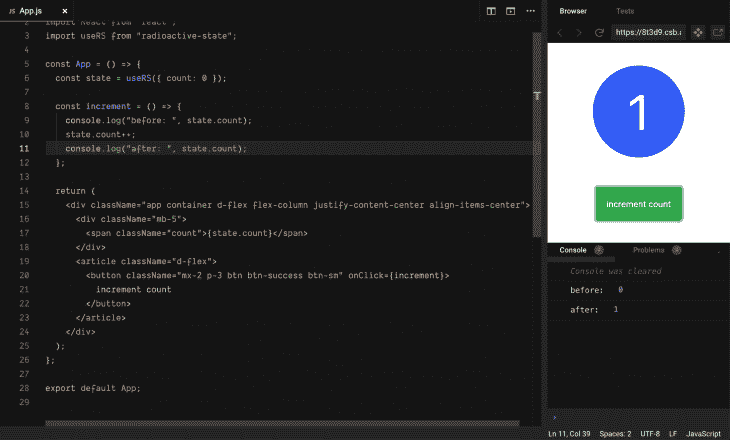

# React - LogRocket 博客中的放射性状态入门

> 原文：<https://blog.logrocket.com/getting-started-with-radioactive-state-in-react/>

放射性状态是一种深度反应状态。当变异时(浅或深)，它会自动触发渲染更新。这消除了设置状态的需要、创建新状态的麻烦以及处理 [`stale state`](https://reactjs.org/docs/hooks-faq.html#why-am-i-seeing-stale-props-or-state-inside-my-function) 的尴尬。

用`useState`钩子管理复杂的状态是相当费力的。在 React 社区中，这被认为是一种反模式。

此外，在设置新状态后，`useState`挂钩不提供对`fresh state`的即时访问。因为状态只在渲染更新后更新，我们仍然需要处理`stale state`。

有了放射性状态，我们消除了这些挑战，提高了性能，并享受新的功能。

## 入门指南

要开始使用放射性状态，请通过运行以下命令安装软件包:

```
npm i radioactive-state or yarn add radioactive-state
```

这提供了`useRS`钩子，使我们能够在我们的组件中创建放射性状态。我们使用`useRS`钩子来初始化状态，钩子将一个对象作为它的参数。该对象的每个属性都指向一个不同的状态，并且可以在不设置状态的情况下进行变异:

```
const state = useRS({ count: 0 }); // initializes the state
```

为了改变这种状态，我们使用下面的语法:

```
const increment = () => state.count++; // increases the count
const decrement = () => state.count--; // decreates the count
```

### 计数器组件

```
import "./styles.css";
import React from "react";
import useRS from "radioactive-state";
export default function App() {
  const state = useRS({ count: 0 });
  const increment = () => state.count++;
  const decrement = () => state.count--;
  return (
    <div className="app container d-flex flex-column justify-content-center align-items-center">
      <div className="mb-4">
        <span className="count">{state.count}</span>
      </div>
      <article className="d-flex">
        <button className="mx-2 btn btn-success btn-sm" onClick={increment}>
          increment count
        </button>
        <button className="mx-2 btn btn-danger btn-sm" onClick={decrement}>
          increment count
        </button>
      </article>
    </div>
  );
}
```

上面是一个简单的计数器组件，当它们的按钮被点击时，它增加或减少 count 的值。你可以在这里玩代码[。](https://codesandbox.io/s/peaceful-night-w6362?fontsize=14&hidenavigation=1&theme=dark)

根据这一简洁的阐述，我们几乎没有触及放射性状态的表面。

## 特征

### 永远新鲜的状态，不像`useState`

使用`useState`钩子管理状态时。我们的组件只在渲染更新后获得一个新的状态。这可能会导致一些难以调试的令人讨厌的错误。让我们看一些例子:

```
import React, { useState } from "react";
import "./styles.css";
const App = () => {
  const [count, setCount] = useState(0);
  const increment = () => {
    console.log("before: ", count);
    setCount(count + 1);
    console.log("after: ", count);
  };
  return (
    <div className="App">
      <div className="app
           container
           d-flex
           flex-column
           justify-content-center
           align-items-center"
      >
        <div className="mb-5">
          <span className="count">{count}</span>
        </div>
        <article className="d-flex">
          <button
            className="mx-2 p-3 btn btn-success btn-sm"
            onClick={increment}
          >
            increment count
          </button>
        </article>
      </div>
    </div>
  );
};
export default App;
```

上面是一个简单的组件，带有一个`count state`和一个增量函数，该函数调用底层的`useState` setter 函数来更新`count state`。计数的当前值显示在 UI 中。

我们注意到，当我们增加计数时，它反映在`UI`上，但是记录到控制台的计数仍然是`0`。


记录到控制台的计数值总是比`UI`中的值小 1。你可以在这里玩代码。

有了`radioactive state`，我们就没有这个问题了:

```
import "./styles.css";
import React from "react";
import useRS from "radioactive-state";
const App = () => {
  const state = useRS({ count: 0 });
  const increment = () => {
    console.log("before: ", state.count);
    state.count++;
    console.log("after: ", state.count);
  };
  return (
    <div className="app
          container
          d-flex
          flex-column
          justify-content-center
          align-items-center"
    >
      <div className="mb-5">
        <span className="count">{state.count}</span>
      </div>
      <article className="d-flex">
        <button className="mx-2 p-3 btn btn-success btn-sm" onClick={increment}>
          increment count
        </button>
      </article>
    </div>
  );
};
export default App;
```

上面是同一个应用程序的实现，但是使用了`useRS`钩子。多亏了`radioactive state`，才没有出现这个问题。



你可以在这里玩代码。在上图中，我们可以从控制台上看到，`count state`被递增前后的值分别是`0`和`1`。这是因为放射性状态的反应性。

### 深度反应，在任何级别直接改变状态以更新组件

这里我们将看看`radioactive state`如何解决 React 中的`stale state`问题:

```
import "./styles.css";
import React, { useState } from "react";
export default function Example() {
  const [count, setCount] = useState(0);
  const lazyIncrement = () => {
    setTimeout(() => {
      setCount(count + 1);
    }, 3000);
  };
  return (
    <div className="app
          container
          d-flex
          flex-column
          justify-content-center
          align-items-center"
    >
      <div className="mb-5">
        <span className="count">{count}</span>
      </div>
      <article className="d-flex flex-column">
        <button
          className="mx-2 p-3 btn btn-success btn-sm"
          onClick={lazyIncrement}
        >
          increment count
        </button>
        <small className="m-2">
          <strong>Increment the count a number of times!</strong>
        </small>
      </article>
    </div>
  );
}
```

这里可以玩代码[。上面是一个使用`useState`钩子管理`count state`的 React 组件。当点击`show count`按钮时，调用`lazyIncrement`函数更新状态。但是`useState`的 setter 函数(`setCount`)会因为`setTimeout`函数而在`3000 milliseconds`之后被调用。因此，状态仅在`3000 milliseconds`之后更新。](https://codesandbox.io/s/confident-poincare-pqw72?fontsize=14&hidenavigation=1&theme=dark)

当我们点击按钮`n`次来增加状态时，我们看到状态只实现了一次。发生这种情况是因为`setCount`不断被旧状态调用。它只在组件重新呈现时获得一个新状态。

为了缓解这个问题，我们通常将一个更新函数传递给`useState` setter 函数。这会将先前的状态(`prevState`)作为参数，并使用它来计算`nextState`的值。因此，上面的问题可以用下面的代码解决:

```
setCount(prevCount => prevCount++)
```

然而，当您想要基于新的状态值更新其他状态时，这就变得很尴尬了。

解决这个`stale state`问题的更干净的方法是使用`radioactive state`。因为它给了我们一个真正的反应状态，我们可以像这样重新实现我们的组件:

```
import "./styles.css";
import React from "react";
import useRS from "radioactive-state";
export default function Example() {
  const count = useRS({ value: 0 });
  const lazyIncrement = () => {
    setTimeout(() => {
      count.value++;
    }, 3000);
  };
  return (
    <div className="app
          container
          d-flex
          flex-column
          justify-content-center
          align-items-center"
    >
      <div className="mb-5">
        <span className="count">{count.value}</span>
      </div>
      <article className="d-flex flex-column">
        <button
          className="mx-2 p-3 btn btn-success btn-sm"
          onClick={lazyIncrement}
        >
          increment count
        </button>
        <small className="m-2">
          <strong>Increment the count a number of times!</strong>
        </small>
      </article>
    </div>
  );
}
```

因为我们现在有一个真正的反应新鲜状态，它能够计算新状态的正确值。即使状态在`3000 milliseconds`之后被更新。你可以在这里玩代码。

### 输入的反应式绑定

React 很棒，但是说到表单处理，许多开发人员更喜欢使用第三方库。反应形式通常是由[个受控组件](https://reactjs.org/docs/forms.html)组成的。处理这些涉及许多重复和烦人的事情，比如记录值和错误。

我们可以像这样创建一个受控组件:

```
const [email, setEmail] = useState("");
  return (
    <div className="App">
      <form>
        <label>Email:</label>
        <input
          value={email}
          placeholder="Enter Email"
          onChange={(e) => setEmail(e.target.value)}
          type="text"
        />
      </form>
    </div>
```

注意，我们必须使用`e.target.value`来跟踪值。如果我们使用复选框，这将是`e.target.checked`。如果我们的表单有不同的输入，比如复选框、范围、单选按钮等等，那就更难了。

放射性状态提供了一个绑定 API，将输入的值绑定到状态中的一个键。此功能使用 es6 扩展运算符，如下所示:

```
<input {...state.$key}  />
```

我们简单地给键加上前缀`$`并如上所示访问它。

绑定 API 通过使用每个状态的初始值作为属性状态来确定输入的类型。因此`state.$key`将返回以下内容:

*   一个包含`value`和`onChange`的对象，如果初始值是一个类型，那么它就是一个`string`或`number`

如果初始值类型是`number`，`onChange`函数会将`e.target.value`从`string`转换为`number`，然后保存在 key 中

*   包含`checked`和`onChange`道具的对象。如果初始值类型为`boolean`，`state.$key`，则在`onChange`函数中内部使用`e.target.checked`

实现如下所示:

```
const state = useRS({
  name: "iPhone 8",
  desc: "The mobile phone",
  promoPrice: 500,
  price: 1000,
  sold: true,
  color: "red"
});
const { $promoPrice, $price, $name, $sold, $color } = state;
```

绑定的用法如下:

```
<input className="form-control" {...$name} type="text" />
```

我已经使用这些绑定构建了一个具有反应状态的产品过滤器组件。这里可以玩代码[。](https://codesandbox.io/s/sparkling-rgb-66tw9?fontsize=14&hidenavigation=1&theme=dark)

### 没有额外的重新渲染–自动变异批处理

这里需要注意的是，当使用`reactive state`时，我们必须将一个对象传递给钩子。

#### 正确的

```
const state = useRS({count: 0})
```

#### 错误的

```
const state = useRS(0)
```

另外，考虑下面的函数:

```
const customFunc = () => {
  state.name = "Lawrence";
  state.teams.frontend.react.push(["Lawrence", "Dave"]);
  state.commits++;
  state.teams.splice(10, 1);
  state.tasks = state.tasks.filter(x => x.completed);
};
```

当调用上面的函数时，问题出现了，它是否会触发多个渲染更新。但它不会。这是因为在`reactive state`中，突变被分批成单个突变。因此，无论状态变化多少次，它都只会在 rerender 上触发。

你可以在这里获得更多关于这个[的细节。](https://github.com/MananTank/radioactive-state#-no-extra-re-renders-mutations-are-batched)

### 反应道具

这大概是`radioactive state`最有趣的特点。React 具有单向数据流。这意味着它的数据向下流动，从父组件到子组件。这些数据(`props`)通常是不可变的，改变它们对父组件没有影响。

父组件可以将其状态作为道具传递给子组件，如下所示:

```
export default function App() {
  const [bulbSwitch, setBulbSwitch] = useState(false);

  return (
    <div className="App">
      <Bulb bulbSwitch={bulbSwitch} />
    </div>
  );
}
```

改变子组件中的`bulbSwitch`状态不会触发父组件中的渲染更新。

然而，`reactive state`世事无常。使用时，子组件可以通过改变状态来触发父组件中的重新呈现器。这是一个非常强大的功能，它还消除了记忆该组件的需要。点击了解更多信息。

### 放射性状态正在飞速发展

当然，如果不谈论使用`reactive state`的性能含义，我们的论述是不完整的。
嗯，`reactive state`就是快。非常快。比`useState`钩子快 25%,这是一个相当复杂的应用程序。随着状态变得越来越复杂，它的表现持续优于`useState`钩子。

> 这个数字是从平均 100 次性能测试中得出的，其中呈现了 200 个对象的数组，并且一个接一个地进行了各种操作，如添加、删除、重新排序和突变

当我们使用`useState`钩子时，每当我们想要更新状态时，就会创建一个新的状态。并且用这个新状态调用`setter function`来更新状态。`Radioactive state`并不是每次更新一个状态就创建一个新的状态。这是它胜过`useState`的一个主要原因。

* * *

### 更多来自 LogRocket 的精彩文章:

* * *

同样，放射性状态通过使用`JavaScript proxy`递归代理状态来创建深度反应状态。点击了解更多信息。

## 要避免的突变陷阱

虽然`radioactive state`很神奇，但是在使用它的时候还是有一些陷阱需要避免。在这一节中，我们将考虑避免这些问题的模式。

### 处理昂贵的初始状态

如果初始状态是从一个昂贵的或长时间运行的计算中获得的，那么初始化状态将是低效的，如下所示:

```
const state = useRS({
  x: getData(); // if getData is an expensive operation.
})
```

每当组件呈现时，上面的模式都会触发`getData`函数。这不是我们想要的。这是一种反模式。正确的方法如下所示:

```
const state = useRS({
  x: getData;
})
```

现在只需要调用一次`getData`函数来初始化状态，因此效率更高。

### 突变标志

考虑下面的代码:

```
const state = useRS({
  users: []
})

useEffect( () => {
  // do something ...
}, [state.users])

const addUser = (user) => state.users.push(user)
```

上面是一个小的人为的例子来说明这个问题。当调用`addUser`函数时，一个新用户被添加到状态中的`users array`。

然而，`useEffect`挂钩不会运行。请注意，调用`addUser`函数会改变用户状态。

这是因为当我们变异一个引用类型数据(比如一个数组或者一个对象)时，在状态中，它的引用保持不变。注意，这个引用类型 date 作为依赖项传递给了`useEffect`钩子。因为它没有改变(即使我们调用了`addUser`),`useEffect`钩子没有运行。

这无疑是一个怪异的 bug。为了解决这个问题，我们将`state.users.$`作为依赖项传递给`useEffect`,而不是`state.users`,如下所示:

```
const state = useRS( { users: [] })

useEffect( () => {
  // do something.
}, [state.users.$])
```

点击了解更多关于此[的信息。](https://github.com/MananTank/radioactive-state#-mutation-flag)

## 最后的想法

给 React 世界带来了革命性的创新。它速度极快、反应灵敏且高效。它提供了更清晰的模式来避免 React 状态管理中的常见缺陷。随着国家变得越来越复杂，它会越来越亮。在这篇文章之后，我相信你应该可以毫无困难地使用`reactive state`,但是请记住这些“陷阱”。

## 使用 LogRocket 消除传统反应错误报告的噪音

[LogRocket](https://lp.logrocket.com/blg/react-signup-issue-free)

是一款 React analytics 解决方案，可保护您免受数百个误报错误警报的影响，只针对少数真正重要的项目。LogRocket 告诉您 React 应用程序中实际影响用户的最具影响力的 bug 和 UX 问题。

[ ](https://lp.logrocket.com/blg/react-signup-general) [  ](https://lp.logrocket.com/blg/react-signup-general) [LogRocket](https://lp.logrocket.com/blg/react-signup-issue-free)

自动聚合客户端错误、反应错误边界、还原状态、缓慢的组件加载时间、JS 异常、前端性能指标和用户交互。然后，LogRocket 使用机器学习来通知您影响大多数用户的最具影响力的问题，并提供您修复它所需的上下文。

关注重要的 React bug—[今天就试试 LogRocket】。](https://lp.logrocket.com/blg/react-signup-issue-free)