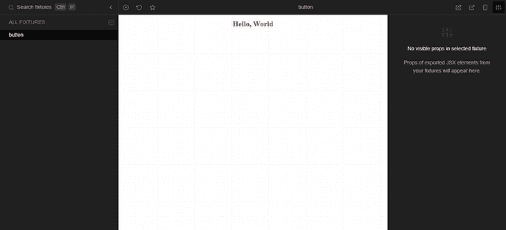
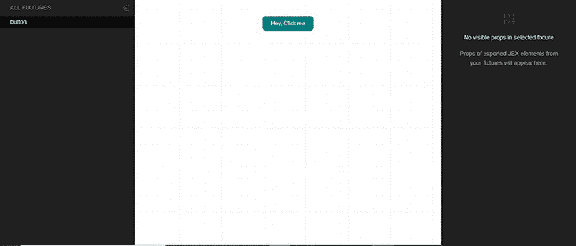

# React Cosmos 入门

> 原文：<https://blog.logrocket.com/getting-started-with-react-cosmos/>

## 介绍

React 的众多卖点之一是用户可以构建组件，并在特定的代码库中重复使用它们。在 React Cosmos 开发工具的帮助下，您可以进一步利用这个特性。

React Cosmos 用于构建隔离的和可扩展的 React 组件。它允许您为 React 应用程序创建一个单独的组件。当使用 React Cosmos 时，您可以考虑不同的用例以及不同的设计模式，这将允许您创建非常通用的、适合许多其他条件的隔离组件。

## 使用 React Cosmos 的好处

React Cosmos 通过利用组件特性来工作。这些组件特性的总和构成了您的组件库。然后，这将呈现在用户界面上，以便于跟踪。使用 [React Cosmos](https://reactcosmos.org/) 的一个主要好处是，它可以扫描你的任何 React 项目，并让你使用任何道具组合或以任何状态渲染每个项目中的组件。

在这一节中，我们将回顾使用 React Cosmos 的许多好处。

### 可重用组件创建

如前所述，React Cosmos 将 [React](https://blog.logrocket.com/tag/react/) 的可重用性优势提升到了一个新的水平，允许创建隔离的和可重用的组件。这给了您更多的空间来创建健壮的架构，同时避免了您必须重写已经定义的 UI。

### 跨不同项目共享用户界面

除了在给定项目中重用 UI 之外，React Cosmos 还允许跨项目组合中的不同项目重用组件。这真的有助于在你的项目中创建坚实统一的品牌。

### 易于调试

使用 React Cosmos 时，识别和修复应用程序中的错误要容易得多，因为它将组件隔离到单独的单元中，而不是强迫您使用非隔离的组件。这使得开发更加容易和快速，因为更容易找出错误来源。

### 构建并发布您的组件库

您可以向您的同事或互联网上的任何人公开您的 React Cosmos 组件。如果您决定构建或发布自己的组件库供公众使用，这可能会派上用场。

### 实时外部 API 模拟

用户可以通过模仿外部 API 来实时查看他们的应用程序的当前状态。这使得开发速度更快，在调试过程中也能派上用场。

## 安装 React Cosmos

React Cosmos 可以用于任何 React 或 React 本地项目，但是对于本文，我们将重点关注 React。确保你已经使用`npx create-react-app`提前安装了你的 React 项目。

现在，让我们使用 npm(节点包管理器)在 React 项目中安装 React Cosmos:

```
npm i --D react-cosmos
```

或纱线:

```
yarn add --dev react-cosmos
```

您可以通过检查 React 项目中的`package.json`文件来确认安装是否成功。

安装完成后，下一步是在应用程序中创建一个`package.json`脚本。这将使你能够开始你的宇宙项目。在您的`package.json`文件的脚本部分包含以下代码:

```
"scripts": {
      "cosmos": "cosmos",
      "cosmos:export": "cosmos-export"
}

```

您的整个`package.json`文件应该是这样的:

```
{
"name": "reactcosmos",
  "version": "0.1.0",
  "private": true,
  "dependencies": {
    "@testing-library/jest-dom": "^5.12.0",
    "@testing-library/react": "^11.2.7",
    "@testing-library/user-event": "^12.8.3",
    "react": "^17.0.2",
    "react-dom": "^17.0.2",
    "react-scripts": "4.0.3",
    "web-vitals": "^1.1.2"
  },
  "scripts": {
    "start": "react-scripts start",
    "build": "react-scripts build",
    "test": "react-scripts test",
    "eject": "react-scripts eject",
    "cosmos": "cosmos",
    "cosmos:export" : "cosmos-export"
  },
  "eslintConfig": {
    "extends": [
      "react-app",
      "react-app/jest"
    ]
  },
  "browserslist": {
    "production": [
      ">0.2%",
      "not dead",
      "not op_mini all"
    ],
    "development": [
      "last 1 chrome version",
      "last 1 firefox version",
      "last 1 safari version"
    ]
  },
  "devDependencies": {
    "react-cosmos": "^5.6.2"
  }
}

```

让我们开始启动我们的应用程序。

## 使用 React Cosmos 发布 React 应用程序

在您的终端中运行以下命令:

使用 npm:

```
npm run cosmos
```

或者，使用纱线:

```
yarn cosmos
```

你应该被提示访问`localhost:5000`来查看你的组件库。你还看不到任何组件，因为我们还没有建立任何组件。


如果您遇到错误消息，您应该执行以下操作:

1.  创建一个名为`babel.config.js`的文件，并用下面的代码更新其内容:

    ```
    module.exports = {    presets: [       ['@babel/preset-env', {targets: {node: 'current'}}],       ['@babel/preset-react', {targets: {node: 'current'}}] // add this    ] };
    ```

2.  创建另一个名为`postcss.config.js`的文件，并将其内容更新为:

    ```
    module.exports = {}
    ```

这应该可以修复任何 Babel 或 PostCSS 问题。如果错误仍然存在，那么您可以通读该消息并尝试进行故障排除，或者在您喜欢的浏览器上浏览该错误消息。

## 构建我们的第一个 React 组件

为了构建我们的第一个组件，我们需要创建一个 fixture。夹具文件通常只包含一个缺省导出-React 元件或 React 节点。要创建一个，我们需要将`.fixture`添加到包含组件的文件名中——我们将使用`main.fixture.js`。这样，React Cosmos 可以很容易地跟踪它。

继续在 React 应用程序的`src`文件夹中创建一个名为`button.fixture.js`的文件。下一步是用下面的代码更新文件:

```
// button.fixture.jsx
import React from 'react';

export default function Hello() {
  return <h1>Hello, World</h1>
}

```

万岁！您刚刚使用 React Cosmos 创建了第一个分离的组件。为了确认这一点，再次进入`localhost:5000`，在这里你会看到你的第一个组件列在**所有夹具**下。



## 更新 React 组件

现在我们已经成功地创建了第一个组件，我们可以继续更新它了。在本节中，我们将构建一个按钮组件。继续更新我们的`button.fixture.js`文件的内容，如下所示。

```
import React from 'react';
import './button.fixture.css'

export default function Button() {

  return <button> Hey, Click me</button>;
}

```

我们上面所做的是创建一个按钮标签，并链接我们尚未创建的 CSS 样式表。现在，为按钮组件样式创建另一个名为`button.fixture.css`的文件。按如下方式更新新文件的内容:

```
button{
    padding:10px 20px;
    color:#fff;
    border:none;
    outline:none;
    background-color: teal;
    border-radius: 8px;
    display:block;
    margin:auto;
    margin-top:40px;
    cursor:pointer;
}

```

这将样式新创建的按钮。您可以再次进入`localhost:5000`查看我们对组件所做的更改。



我们已经成功地创建并更新了我们的独立按钮组件！它现在可以用于我们不同的应用。当您创建更多组件时，它们将显示在您的预渲染仪表板中以供查看。

注意，fixture 文件必须位于 React 应用程序的`src`文件夹中。您可以通过在文件名中添加`.fixture`或创建一个`__fixtures__`文件夹并将所有夹具文件放入其中来创建夹具。

## 多夹具文件

从一个夹具文件中导出多个元件可能会很困难，尤其是当您只允许一个缺省导出时。您可以通过以`object`的形式放置组件来解决这个问题，如下所示；这将使您能够用一个夹具文件导出多个元件。

```
export default {
  primary: <PrimaryButton>Click me</PrimaryButton>,
  primaryDisabled: <PrimaryButton disabled>Click me</PrimaryButton>,
  secondary: <SecondaryButton>Click me</SecondaryButton>,
  secondaryDisabled: <SecondaryButton disabled>Click me</SecondaryButton>,
};

```

## 结论

React Cosmos 是为您当前或未来的 React 应用程序创建隔离组件的一种极好的方式，特别是因为它易于使用，调试迅速，还有其他好处。下次构建组件时，请尝试 React Cosmos，以便轻松快速地进行开发！

## [LogRocket](https://lp.logrocket.com/blg/react-signup-general) :全面了解您的生产 React 应用

调试 React 应用程序可能很困难，尤其是当用户遇到难以重现的问题时。如果您对监视和跟踪 Redux 状态、自动显示 JavaScript 错误以及跟踪缓慢的网络请求和组件加载时间感兴趣，

[try LogRocket](https://lp.logrocket.com/blg/react-signup-general)

.

[ ](https://lp.logrocket.com/blg/react-signup-general) [](https://lp.logrocket.com/blg/react-signup-general) 

LogRocket 结合了会话回放、产品分析和错误跟踪，使软件团队能够创建理想的 web 和移动产品体验。这对你来说意味着什么？

LogRocket 不是猜测错误发生的原因，也不是要求用户提供截图和日志转储，而是让您回放问题，就像它们发生在您自己的浏览器中一样，以快速了解哪里出错了。

不再有嘈杂的警报。智能错误跟踪允许您对问题进行分类，然后从中学习。获得有影响的用户问题的通知，而不是误报。警报越少，有用的信号越多。

LogRocket Redux 中间件包为您的用户会话增加了一层额外的可见性。LogRocket 记录 Redux 存储中的所有操作和状态。

现代化您调试 React 应用的方式— [开始免费监控](https://lp.logrocket.com/blg/react-signup-general)。