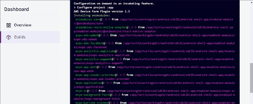

# React Native 和 Expo SDK 入门

> 原文：<https://blog.logrocket.com/getting-started-with-react-native-and-expo-sdk/>

Expo 是一个开源平台，使得开发跨平台的 iOS 和 Android 移动应用程序比以前容易得多。Expo SDK 是一系列适用于每个 iOS 和 Android 平台的本地库，它允许 JavaScript 访问设备的系统功能，如摄像头、推送通知、本地存储、联系人以及其他硬件和操作系统 API。

## 先决条件

要安装 Expo，您需要在您的机器上安装 [Node.js 版本 12](https://nodejs.org/en/) 或更新版本，因为 Expo 的命令行工具和依赖管理依赖于节点平台。您可以通过在终端上运行 Node -v 命令来检查您的节点版本。

Expo 提供了一个名为 [Expo CLI](https://docs.expo.io/workflow/expo-cli/) 的命令行界面。它用于测试正在 iOS 或 Android 中开发的应用程序。

```
npm install -g expo-cli

```

### 为 iOS 和 Android 安装 Expo 移动客户端

要测试您的移动应用程序的功能，您需要适用于 Android 和 iPhone 的 Expo 客户端应用程序。你可以在[谷歌 Play 商店](https://play.google.com/store/apps/details?id=host.exp.exponent&hl=en)和[应用商店](https://itunes.apple.com/us/app/expo-client/id982107779?mt=8)找到它们。

## 构建世博应用程序

让我们构建一个 Expo 应用程序，看看它是如何工作的。您可以使用以下命令创建一个新的 Expo 应用程序:

```
expo init your_app_name

```

将`your_app_name`替换为您希望构建的应用程序的名称。按 enter 键后，系统会提示您选择应用程序的模板类型。

您可以选择适用于您的应用的任何模板。现在，我将选择“**空白工作流**”来简化事情。

接下来，会提示您通过 [Yarn](https://yarnpkg.com/) 安装模板。如果已经装纱，选择**是**，否则选择**继续**。一旦您完成了后续步骤，您的应用程序就可以使用了。

跳转到以下命令来启动项目。

```
cd <app_name>
npm start or yarn start

```

成功执行上述命令后，它将启动一个新的开发 metro 环境。你将获得二维码，应该通过 Android 中的 Expo 客户端应用程序和 iPhones 中的默认相机应用程序扫描。现在，您已经准备好了。

## 在 Expo 和 React Native 中设置项目

我们的项目由几个重要的文件组成:`App.json`拥有所有的 app 配置，比如 app 名称、SDK 版本、图标等等。应用程序的依赖项列在`package.json`文件中。然后是`App.js`，它在应用程序启动时运行。在这里，您将看到`render`方法，它将所有组件包装在 return 语句的一个组件中。

您可以使用位于`App.js`文件底部的`styles`对象来指定 UI 组件的样式。将`styles`移出`render`方法将增强 React Native 中代码的可读性。

下面是`App.js`中的示例代码:

```
import React from 'react';
import { StyleSheet, View, Text } from 'react-native';

export default class Main extends React.Component {

//render method returning RN components   
  render() {
    return (
      <View style={styles.title}>
        <Text style={styles.title_txt}>My First App</Text>
      </View>
    );
  }

}
//code your styles here
const styles = StyleSheet.create({
  title: {
    //Your styles here
  },
  title_txt: {
    //Your styles here
  }
});

```

## Expo SDK 是什么？

Expo 附带了几个内置库，在大多数应用程序中都可以找到。关于这方面的更多细节，请参考世博会文件。但是，以下库在您构建的大多数应用程序中都很有用:

以下是 Expo 支持的一些额外功能:

此外，您还可以访问:

*   `[Audio](https://docs.expo.io/versions/v34.0.0/sdk/audio/)`:播放或录制声音
*   `[AV](https://docs.expo.io/versions/v34.0.0/sdk/av/)`:播放音频/视频
*   `[ART](https://docs.expo.io/versions/v34.0.0/sdk/art/)`:使用 SVG 绘制图形
*   `[Brightness](https://docs.expo.io/versions/v34.0.0/sdk/brightness/)`:管理亮度
*   `[BackgroundFetch](https://docs.expo.io/versions/v34.0.0/sdk/background-fetch/)`:运行后台任务
*   `[Payments](https://docs.expo.io/versions/v34.0.0/sdk/payments/)`:支持使用 Apple Pay 和 Android Pay 通过 Stripe 进行支付集成

一般来说，一旦你通过 Yarn、npm 或 Expo 安装了它，你就可以访问大约 80 个 API，而不需要关闭 metro bundler，这是加快进度的另一种方式。

## 使用 Expo 创建闪屏

让我们通过添加闪屏来了解 Expo 是如何工作的。首先，在中创建一个图像。png 格式，适合应用程序中的闪屏。然后，将该图像放在您的应用程序目录中。在这里，我已经将它添加到了目录的根目录。

现在，使用以下命令将`expo-splash-screen`库安装到应用程序中:

```
expo install expo-splash-screen

```

接下来，创建一个新文件并导入上面的库。之后，创建一个函数来显示闪屏，如下所示:

```
import React, { useCallback, useEffect, useState } from 'react';
import { StyleSheet, Text, View } from 'react-native';

//import splash screen library here
import * as SplashScreen from 'expo-splash-screen';
//import your image from the directory
import splashScreenImage from './splashScreenImage.png'

export default function SplashScreen() {
  const [loaded, setLoaded] = useState(false);

  useEffect(() => {
    async function prepare() {
      try {
       // Keep our splash screen awake while the app fetches the resources
        await SplashScreen.preventAutoHideAsync();
        // Pre-load any content here
        // Also you can make any API calls here
        // Delay loading for one second
        await new Promise(resolve => setTimeout(resolve, 1000));
      } catch (e) {
        console.warn(e);
      } finally {
        // Tell the app that our resources are finished loading
        setLoaded(true);
      }
    }

    prepare();
  }, []);

  const onLayoutRootView = useCallback(async () => {
    if (loaded) {
      // Now, let's inform our splash screen to disappear as our resources are loaded now.
      await SplashScreen.hideAsync();
    }
  }, [loaded]);

  if (!loaded) {
    return null;
  }

  return (
    // Make your view in Splash Screen here.
    <View
      style={{ flex: 1, alignItems: 'center', justifyContent: 'center' }}>
      <Image
        source={splashScreenImage}
        style={{ flex: 1, alignItems: 'center', width: 100, height: 100 }}
        borderRadius={10}
        resizeMode="cover" />
    </View>
  );
}

```

最后，从您的`App.js`导入文件，并在那里调用我们的`SplashScreen`函数。

```
import React from 'react';
import { StyleSheet, View, Text } from 'react-native';
//import our component here
import SplashScreen from './SplashScreen.js';

export default class Main extends React.Component {  
  render() {
    return (
    //place our component here.
      <SplashScreen/>
      <View style={styles.title}>
        <Text style={styles.title_txt}>My First App</Text>
      </View>
    );
  }
}

```

启动你的应用程序，查看博览会的客户端应用程序的结果！


## 将应用程序发布并上传到商店

到了将应用程序发布到商店的时候，会有几个选项供您选择。

```
#Build command
expo build:[ios|android]

```

这个命令将开始在云上而不是本地安装一个包，消除了对高性能笔记本电脑或 PC 的需求。如果你是 Windows 用户也没问题，因为你从来没用过 Xcode。只需等待构建完成，就大功告成了。

构建完成排队后，您可以毫不犹豫地从终端退出。如果您需要了解构建的状态，请导航到“您可以在以下位置监控构建”文本下面的 URL。




在那里，您将找到一个下载按钮，一旦构建完成，该按钮将可用。与此同时，您可以在终端中等待直接连接来下载软件包。

现在，我们如何把它上传到商店？使用 Expo 实现这一点最简单的方法是使用以下命令:

```
expo upload:[ios|android]

```

太好了！你都准备好了！

## 2021 年世博会新增特色

2021 年世博会增加了多项新功能。这里有一些最受欢迎的。

### 集成开发工具

通过 CLI，您可以访问开发人员菜单、检查组件和跟踪结果。只需运行 Expo start，点击 **m** 访问开发者菜单，点击 **shift+m** 访问本机应用中的性能监视器或元素检查器。

### 强制重装

很难每隔几分钟就摇动一次机器！通过在终端 UI 中按下 **r** ，可以重新加载连接的计算机、笔记本电脑、模拟器和浏览器。这种方法兼容 iOS、Android、web 和所有物理设备。

* * *

### 更多来自 LogRocket 的精彩文章:

* * *

### 打字稿的自动设置

因为安装 TypeScript 可能会很麻烦，所以他们把它变成了全自动的。只需生成一个空白的`tsconfig.json`文件并执行 Expo start 命令，Expo 将处理剩下的工作。你可以在“打字稿”下的博览会文件中找到更多细节

### 误差明显减小

没有人喜欢虫子。因此，他们在 SDK 41 中对它们进行了改进，使其具有描述性、有用性和实用性。只显示最重要的堆栈跟踪，并指出错误和警告。源代码映射也已更新，生成的代码跟踪已被静音。

### 调试您的配置

现在你可以看到使用最新 Expo 配置命令的`app.config.js`或 app.json 的评估结果。使用`expo config --type public`命令查看 Expo 中使用的应用程序清单文件。

### 改进了 Apple Store 交互和通过终端连接的能力

Expo CLI 提供快速修复问题的连接，而其他工具显示 401。如果你需要更改支付方式或签订合同，你只需点击几下鼠标，然后继续开发。

总的来说，Expo 现在速度更快，提供了智能身份验证、改进的错误管理，以及直接从控制台对动态问题的全面洞察。

## 世博会的局限性

虽然有许多令人印象深刻的新功能，但您也应该意识到 Expo 的一些局限性:

1.  Expo 应用程序不支持后台代码执行。这意味着当应用程序关闭时，你不能执行监听位置变化的代码。
2.  Expo 应用仅限于 Expo SDK 支持的本地 API。这意味着，如果应用程序需要一个独特的用例，开发它的唯一方法是使用基本的 React 本机代码或使用 ExpoKit 库。
3.  世博会把你和他们的工具捆绑在一起。这意味着您将无法通过简单安装来使用 React 原生开发的任何其他工具，包括命令行工具和 UI 框架。然而，好消息是 Expo SDK 与基本的 React 本地应用程序兼容，因此从 Expo 中弹出您的应用程序不会是一个挑战。
4.  Expo 应用中的独立二进制文件只有在线时才能构建。Expo 提供的命令行工具允许开发者在 Expo 服务器上启动应用程序的构建过程。完成后，您将获得一个可下载的 URL。apk 或者。ipa 文件。

尽管有上述限制，Expo 还是很有价值的，因为它是一个完全功能化的平台，广泛支持著名的 Android 和 iOS APIs。这意味着它涵盖了应用程序通常需要的大多数功能。因此，没有必要在 Expo 之外寻找本地特性。

## 结论

React Native 是开发本地移动应用程序最流行的框架。Expo 通过其 SDK 和开发工具进一步简化了这一过程。如果您是 React 本地开发人员，您应该一直关注 Expo，了解它的优势和局限性。

在这篇博客文章中，我们用 Expo 创建并发布了一个应用程序，您当然可以通过添加更多功能来扩展这个应用程序。总的来说，Expo SDK 是一个非常棒的库集合，几乎包含了你想在移动应用中使用的所有特性。感谢阅读。

## [LogRocket](https://lp.logrocket.com/blg/react-native-signup) :即时重现 React 原生应用中的问题。

[](https://lp.logrocket.com/blg/react-native-signup)

[LogRocket](https://lp.logrocket.com/blg/react-native-signup) 是一款 React 原生监控解决方案，可帮助您即时重现问题、确定 bug 的优先级并了解 React 原生应用的性能。

LogRocket 还可以向你展示用户是如何与你的应用程序互动的，从而帮助你提高转化率和产品使用率。LogRocket 的产品分析功能揭示了用户不完成特定流程或不采用新功能的原因。

开始主动监控您的 React 原生应用— [免费试用 LogRocket】。](https://lp.logrocket.com/blg/react-native-signup)