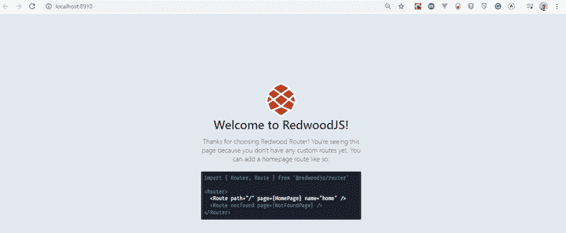
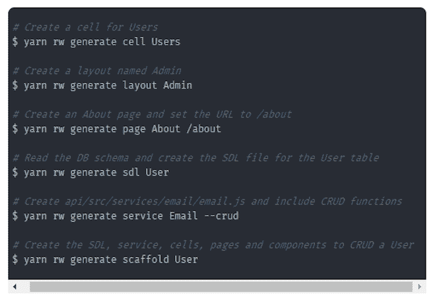

# RedwoodJS - LogRocket 博客入门

> 原文：<https://blog.logrocket.com/getting-started-with-redwoodjs/>

设置和配置一个全栈应用可能是一件令人头疼的事情。想象一下，如果你不用处理 SSG 或无头 CMS，开发一个 JAMstack 应用程序会有多容易？

在本指南中，我将向您介绍 RedwoodJS，这是一个基于 React、GraphQL 和 Prisma 构建的全栈 JAMstack 框架，并演示如何使用它的一些关键特性。

## RedwoodJS 是什么？

许多著名的工具和框架旨在简化开发工作流程。其中一些带有预定义的 webpack、Babel 等设置。，这使得该过程很麻烦。Redwood 是一个在引擎盖下为您做出决策的框架。

根据[文档](https://redwoodjs.com/docs/introduction)，Redwood 是“一个固执己见的、全栈的、无服务器的 web 应用程序框架，它将允许你轻松地构建和部署 JAMstack 应用程序。”

Redwood 是一个类似 React 的前端，由 CDN 静态提供。它通过 GraphQL 与运行在 AWS Lambdas 上的后端对话，并且可以通过一个简单的`git push`进行部署。

## **特性**

在我们开始之前，让我们分解一下我们将在本教程中强调的关键前端和后端特性。

### 前端功能

*   独特的文件结构和格式
*   简单而强大的路由 (所有 路由定义在一个文件中)用动态 (类型化) 参数、约束和命名路由函数 到 生成正确的 URL
*   单元格— 从后端 API 获取数据的声明性方式
*   使用CLI**生成页面、布局和单元格的生成器**
***   客户端和服务器端表单验证和错误处理的预定义助手和约定**

 **### 后端功能

*   无样板 GraphQL API 构造
*   快速生产 SDL 和服务的发电机
*   Easy CRUD ，它为围绕特定 DB 表的 CRUD 操作制作了一个脚手架生成器
*   通过 Prisma 2 进行数据库迁移

### 部署特性

对于部署，RedwoodJS 采用一流的 JAMstack 式部署到。

## 先决条件

要开始使用 RedwoodJS，您需要一些 React、GraphQL 和 Prisma 的基础知识。也就是说，你不需要成为一个专家来拿起 Redwood 框架。

您还需要在您的计算机上安装 Node 版本 12 或更高版本或者 yarn 版本 1.22 或更高版本。否则，您可能会遇到问题。

## 装置

Redwood 使用纱线来搭建你的应用程序。

```
#Run the command and specify your folder name
yarn create redwood-app ./redwoodapp

```

成功安装后，您将拥有一个新目录`redwoodapp`，其中包含几个目录和文件。通过运行以下命令切换到该目录:

```
cd redwoodapp
```

要启动开发服务器，请运行:

```
yarn redwood dev

```

浏览器会自动弹出 [`http://localhost:8910`](http://localhost:8910/) ，你会看到 Redwood 的欢迎页面。



## 文件结构

Redwood 的文件结构有两部分:`api`文件夹和`web`文件夹。这些通常被称为工作空间。

Redwood 的文件结构如下:


### Web 工作区

web 工作区包含所有与组件和静态相关的文件。

`public`文件夹包含所有的静态资产，如`favicon`、`README`等。

`src`存放其他子目录，包括:

*   `components`，其中包含您常用的 React 组件以及其他 Redwood 细胞
*   `layouts`，它包含可重用的组件，这些组件包装您的内容并在应用程序的其他页面之间共享
*   `pages`，包含组件，可选地包裹在`layouts`内
*   `Routes.js`，定义您应用中的所有路线

### API 工作区

API 目录包含两个文件夹:`prisma`和`src`。

`prisma`决定如何将数据传送到前端，这属于管道数据库这一术语。它有两个文件:

*   `schema.prisma`包含表和列，更好的说法是数据库模式
*   `seeds.js`负责向您的数据库中填充您的应用程序所需的任何数据

`src`包含所有其他后端代码和另外四个目录:

*   `functions`除了 Redwood 自动生成的`graphql.js`文件之外，还包含您的应用程序需要的任何 Lambda 函数
*   包含用模式定义语言(SDL)编写的 GraphQL 模式。
*   `lib`包含一个文件`db.js`，它实例化了 Prisma 数据库客户端。您可以将这个目录用于与 API 端相关的、不适合函数或服务的其他代码
*   `services`包含与您的数据相关的业务逻辑。当查询或变更 GraphQL 的数据时，解析器会以一种可在应用程序的其他地方重用的格式进行处理

要了解更多关于文件结构的信息，请查看[Redwood docs](https://redwoodjs.com/tutorial/redwood-file-structure)。

## 按指定路线发送

Redwood 路由器与 React 路由器相比是独一无二的。它由 [React 路由器、Reach 路由器](https://blog.logrocket.com/future-reach-router-react-router/)和自己的路由器组合而成。

Redwood Router (RR)被设计为在一个文件中列出所有路由，消除了对嵌套路由的需要(React 则不是这种情况)。

要使用 Redwood 路由器，请从`@redwoodjs/router`包中导入`Router`和`Route`组件。在 Redwood 中创建一个`Route`需要将`path`、`name`和`page`作为`props`传递给`Route`组件。

```
<Route path="/contact" page={ContactPage} name="contact" />

```

*   `path`指定要匹配的 URL 路径
*   `page`指定路径匹配时要渲染的组件
*   `name`从`Link`组件调用`Route`组件。例如:

```
const AboutPage = () =>
```

RR 使得在您的`path`道具中包含参数成为可能。

```
<Route path="/user/{id}" page={UserPage} name="user" />

```

它有一个很酷的钩子叫做`useParam`，可以让你提取参数。

```
import { useParams } from '@redwoodjs/router'
const MainComponent= () => {
  const { id } = useParams()
  // ...
}

```

默认情况下，JavaScript 将参数指定为字符串。但是对于 Redwood routing，它提供了一种合适的模式来将您的参数转换为您选择的任何数据类型。

您可以在`path`属性中指定路线参数类型。

```
<Route path="/admin/{id:Int}" page={AdminPage} name="admin" />

```

通过在上面的代码中使用`:Int`注释，`Route`参数将通过使用正则表达式`(/\d+/)`来匹配数字，然后使用`Number()`将参数转换成数字。

### **代码拆分**

默认情况下，RR(在 Redwood 应用中使用时)将在每个页面上进行代码拆分，为每个页面创建一个单独的、惰性加载的 webpack 包。当从一个页面导航到另一个页面时，RR 会等到新的页面模块被加载后再重新呈现，这样可以防止“白闪”效应。

* * *

### 更多来自 LogRocket 的精彩文章:

* * *

查看 [Redwood 路由器文档](https://redwoodjs.com/docs/redwood-router)以了解更多关于此功能的信息。

## 用单元格提取数据

Redwood 中的数据获取不同于传统的异步约定。前端和后端相互独立地处理数据。通常，前端在等待数据时会先加载。在大多数情况下，加载指示器或微调器显示数据已被提取。

Redwood 使用一种模式，该模式采用声明式方法从服务器端获取数据(GraphQL)。单元是一个高阶组件，它提供一个动态序列，通过这个序列，它从一个使用占位符显示加载状态的 API 中检索数据，然后将结果显示为一个可重用的模式。

单元格包含 GraphQL 查询和`loading`、`empty`、`error`和`success`状态，每个状态都根据单元格的状态自动呈现。您需要做的只是指定查询；雷德伍德在引擎盖下为你施展所有的魔法。

典型的单元格文件如下所示:

```
export const QUERY = gql`

  query {
    posts {
      id
      title
      body
    }
  }
`
export const Loading = () => <div>Loading...</div>

export const Empty = () => <div>No posts yet!</div>

export const Failure = ({ error }) => (
  <div>Error loading posts: {error.message}</div>
)

export const Success = ({ posts }) => {
  return posts.map((post) => (
    <article>
      <h2>{post.title}</h2>
      <div>{post.body}</div>
    </article>
  ))
}

```

要查看一个单元格，您必须将其导入到您的`page`组件中。

```
import BlogLayout from 'src/layouts/BlogLayout'
import BlogPostsCell from 'src/components/BlogPostsCell'

const HomePage = () => {
  return (
    <BlogLayout>
      <BlogPostsCell />
    </BlogLayout>
  )
}

export default HomePage

```

在上面的代码中，我们导入了一个`BlogPostCell`并将其包装在`BlogLayout`组件中。

更多详情请见 [Redwood cells 文档](https://redwoodjs.com/tutorial/cells)。

## **表格**

Redwood forms 有许多帮助方法，使得表单处理和验证在 web 应用程序中更容易实现。它使用 [React 钩子窗体](https://react-hook-form.com/)使窗体体验独一无二。

## **命令行生成器**

Redwood 使用自己独特的 CLI 生成文件，灵感来自于 [Rails 命令行工具](https://guides.rubyonrails.org/command_line.html)。这样，您可以在您指定的确切目录中创建任何文件。

Redwood CLI 有一个用于开发应用程序的主要入口点命令，`redwood`(别名:`rw`)。

你可以使用`generate`或者`g flag`——两者都可以。



Redwood CLI 工具自动执行重复性任务，例如生成文件(页面、组件、单元格等)。)和迁移数据库，这样您就可以研究使您的应用程序与众不同的地方。

## 使用红木的利与弊

以下是您可能想在下一个应用中尝试 Redwood 的一些原因。

*   Redwood 适用于任何全栈应用，因为它集成了服务、数据库和测试。它的部署模式可高效扩展，几乎不需要干预。另外，它使用 React 前端架构和 GraphQL、Prisma 和 Apollo 作为后端
*   Redwood 采用 [JAMstack 方法](https://blog.logrocket.com/why-you-should-be-using-jamstack/)来构建 web 应用程序
*   与其他框架相比，Redwood 中的工具和约定使得构建 web 应用程序变得轻而易举。您可以在两分钟内用 Redwood 开发一个 CRUD 应用程序，无需任何配置

使用 Redwood 时也有一些瓶颈需要考虑。

*   Redwood 正处于 alpha 阶段，所以现在开发一个基于产品的应用程序是不明智的。我相信团队正在努力工作以尽快发布一个稳定的版本
*   存在与 Lambda 函数长度相关的限制以及将无服务器连接到关系数据库的问题

[预测新冠肺炎](https://predictcovid.com/)是最早在生产中使用红杉的地方之一。

## 结论

当 RedwoodJS 变得稳定时，不难看出它正在演变成构建全栈 web 应用程序的标准。随着时间的推移，开发人员将受益于持续的性能和功能升级，而且只需付出最少的努力。

Redwood 让您的工作变得更加轻松，它可以在幕后为您做出合理的决策，使您能够以更少的设置开发强大的应用程序。

要了解更多关于 Redwood 的信息，请查看以下资源。

## 您是否添加了新的 JS 库来提高性能或构建新特性？如果他们反其道而行之呢？

毫无疑问，前端变得越来越复杂。当您向应用程序添加新的 JavaScript 库和其他依赖项时，您将需要更多的可见性，以确保您的用户不会遇到未知的问题。

LogRocket 是一个前端应用程序监控解决方案，可以让您回放 JavaScript 错误，就像它们发生在您自己的浏览器中一样，这样您就可以更有效地对错误做出反应。

[](https://lp.logrocket.com/blg/javascript-signup)[https://logrocket.com/signup/](https://lp.logrocket.com/blg/javascript-signup)

[LogRocket](https://lp.logrocket.com/blg/javascript-signup) 可以与任何应用程序完美配合，不管是什么框架，并且有插件可以记录来自 Redux、Vuex 和@ngrx/store 的额外上下文。您可以汇总并报告问题发生时应用程序的状态，而不是猜测问题发生的原因。LogRocket 还可以监控应用的性能，报告客户端 CPU 负载、客户端内存使用等指标。

自信地构建— [开始免费监控](https://lp.logrocket.com/blg/javascript-signup)。**