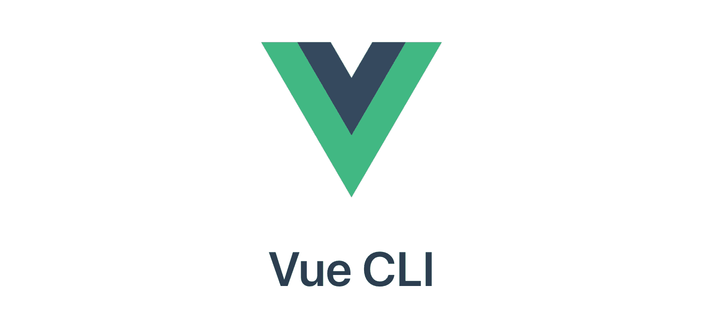
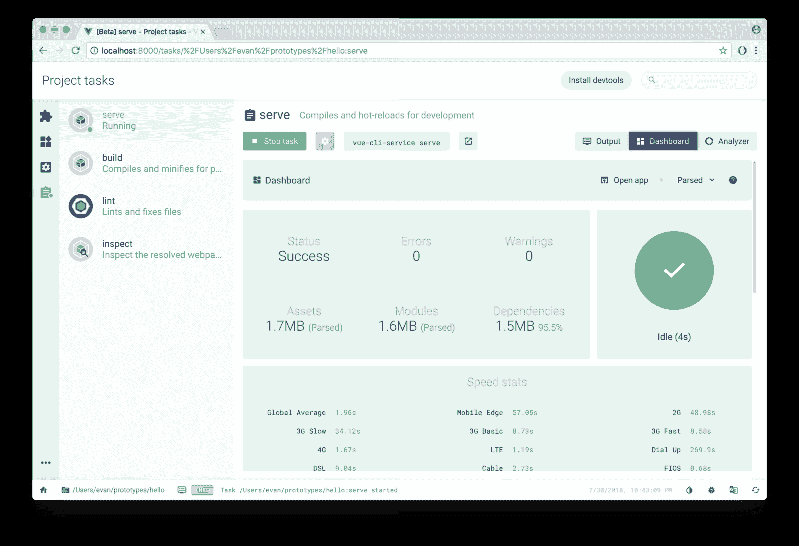
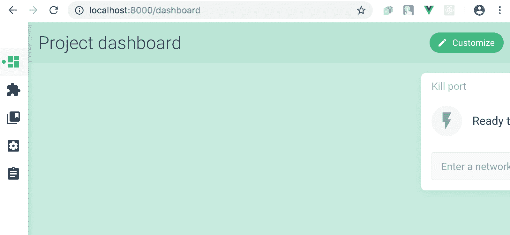
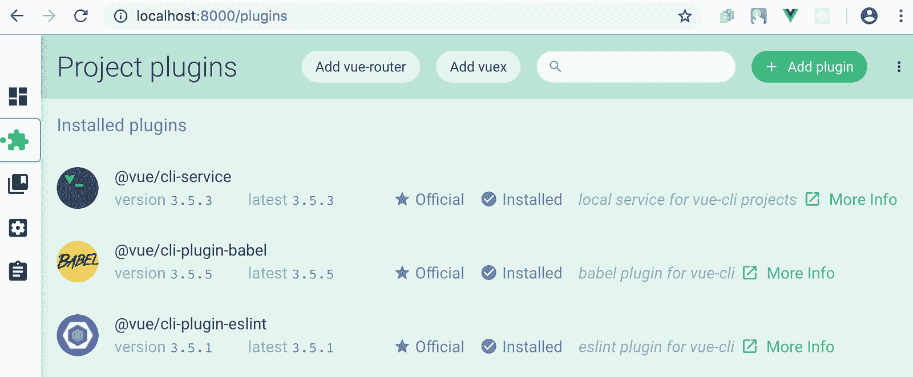
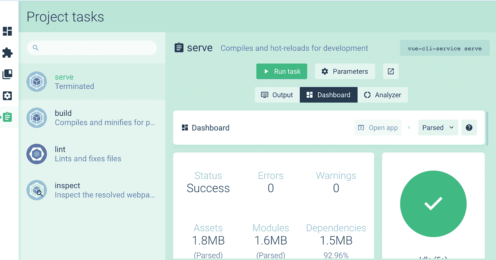

# 开始使用新的 Vue CLI 3 

> 原文：<https://blog.logrocket.com/getting-started-with-the-new-vue-cli-3-43bcbe1ae759/>



> *TL；DR:* 本文将带您了解使用 Vue CLI 3、新的图形用户界面和即时原型功能所需的所有步骤。

### 介绍

Vue JS 由[尤雨溪](https://twitter.com/youyuxi?ref_src=twsrc%5Egoogle%7Ctwcamp%5Eserp%7Ctwgr%5Eauthor) [和 GitHub](https://github.com/vuejs/vue) 上超过 121，000 颗星的 234+开源社区爱好者创建，是一个非常进步的构建用户界面的框架。它由一个易于接近的核心库和一个支持库的生态系统组成，核心库使开发人员只关注 web 应用程序的视图层，支持库可以帮助您处理大型单页面应用程序中的复杂性。

Vue CLI 3 是由 Vue 团队在几个月前发布的。本文将带您了解开始使用 Vue CLI 3(新的图形用户界面和即时原型功能)所需的所有步骤。

[](https://logrocket.com/signup/)

### 开始之前

这篇文章适合使用 Vue JS 的中级前端开发人员，假设他们熟悉初学者的概念和安装过程。在本文中，在开始使用 Vue CLI 3 之前，您应该已经具备了一些先决条件。

您将需要:

*   [Node.js 10.x](https://nodejs.org/) 及以上安装。您可以通过在终端/命令提示符下运行 node -v 来验证您是否做到了
*   还安装了[节点包管理器 6.7 或以上(NPM)](https://nodejs.org/)
*   代码编辑器:强烈推荐使用 Visual Studio 代码
*   在您的机器上全球安装的 Vue 最新版本
*   安装在您机器上的 Vue CLI 3.0 。为此，请先卸载旧版本的 CLI:

`npm uninstall -g vue-cli`

然后安装新的:

`npm install -g @vue/cli`

### 图形用户界面

Vue CLI 3 附带的功能之一是 GUI 工具，它是终端的一个 web 界面选项，适合喜欢图形界面而不是命令行界面的人。您可以使用该工具创建项目、安装插件和安装依赖项。您还可以运行诸如为生产提供或构建应用程序之类的任务。



本文分解了分别使用 CLI 和 GUI 工具开始使用 Vue 的主要部分，还介绍了其他一些事情，比如目前只能单独使用 CLI 工具完成的即时原型制作。

### 开始一个新项目

有两种方法可以启动新的 Vue 项目:

*   图形用户界面技术
*   命令行接口技术

### 图形用户界面技术

图形用户界面技术包括使用 GUI 工具通过几次点击和选择来创建新项目。

打开计算机上的终端，运行以下 GUI 命令:

`vue ui`

它会在您的浏览器上自动打开 GUI 工具(位于[http://localhost:8000/project/select](http://localhost:8000/project/select))。一开始看起来是这样的:


要创建一个新项目，点击 *create* 按钮，会看到一个文件管理器在同一个界面中打开。浏览您的(项目)文件时，您会注意到以前创建的 Vue 项目上有一个 Vue 标志(表示它们是 Vue 项目)。选择要创建新应用程序的文件夹，并在页面上单击*在此创建新项目*按钮。这将带你通过两个简单的注册阶段。

1.  **Details:** 在这里你期望选择一个项目名，选择一个包管理器来使用 yarn 或 npm。如果文件夹内容已经存在，您还可以切换选项以覆盖它。最后，您可以决定是否希望为项目创建一个 git 存储库，它附带了一个选项来选择您所选择的初始提交消息
2.  **预置:**预置是插件和配置的关联。选择功能后，您可以选择将其存储为预设，以便在将来的项目中重复使用，而不必重新配置所有功能。有三类预设:默认预设只包含 babel 和 eslint 插件和 Vue 基本配置，自定义预设让您选择自己的插件，远程预设让您从远程 git 存储库中选择预设(是的，这是可能的)

几秒钟后，您将获得一个*新项目创建*通知，一个项目仪表板在您的应用程序界面中打开。



### 命令行接口技术

使用 CLI 本身的旧选项仍然存在，但使用了新语法，要创建新项目，您只需在终端上运行以下命令:

`vue create vue-test`

其中 *Vue-test* 是您想要构建的应用程序的名称。该命令会导致一系列提示，这些提示会要求与 GUI 完全相同的内容，但都在终端中。当您回答了所有提示并按照您想要的方式配置了应用程序后，CLI 会为您构建好应用程序。

### 安装插件

新的 CLI 是基于插件构建的。Vue 中的功能，甚至第三方功能现在都被识别为插件，插件被新的 CLI 用来随时修改我们项目设置的配置。它们基本上是依赖于编辑 Webpack 配置的额外功能。

### 图形用户界面技术

project dashboard 边栏有五个图标，第二个图标用于插件。当你点击它时，你会看到你在注册阶段安装的插件:eslint，babel 和 cli-service，这是插件工作的服务。



添加新插件很容易，点击*添加插件*按钮，插件列表出现，您可以使用搜索栏查询服务，并根据您的搜索词返回可用插件列表。如果你选择一个像 [Vuetify](https://vuetifyjs.com/en/) 这样的插件，你会看到一个 *install* 按钮，它会把插件安装到你的项目中，并自动修改插件的 Webpack 配置。

### 命令行接口技术

要使用 CLI 直接安装 Vuetify 插件，您可以导航到项目目录并使用 add 命令，如下所示:

`vue add Vuetify`

这将 Vue 化插件安装到您的 Vue 项目中，并修改该插件将影响的所有文件。一些插件带有后续提示，引导它们安装。在我看来，我认为新 CLI 中实现的插件概念是受 Angular CLI 的启发。

### 安装依赖项

Vue 中的依赖由主要的 Vue 核心依赖和开发依赖组成。这些可以通过 GUI 和 CLI 技术安装在中。

### 图形用户界面技术

项目控制面板边栏有五个图标，第三个图标表示依赖关系。主要部分有 Vue 和核心依赖项，开发依赖项包括模板编译器、eslint 开发依赖项等等。


如果你想在你的项目中安装 bootstrap 依赖项以便能够使用 bootstrap 类，你可以点击*安装依赖项*按钮，然后搜索 Bootstrap 并点击*安装*。这将需要几秒钟，然后通知您新的安装。

* * *

### 更多来自 LogRocket 的精彩文章:

* * *

### 命令行接口技术

要使用 CLI 直接安装引导依赖项，请导航到项目目录并使用如下安装命令:

`npm install bootstrap`

### 运行任务

任务就像对我们的 Vue 项目采取行动的命令，它可以是在开发服务器上提供它，也可以是为生产而构建它，或者执行林挺。所有这些任务都可以通过 GUI 和 CLI 工具来完成。

### 图形用户界面技术

项目仪表板边栏上的最后一个图标是用于任务的。您可以在界面中看到以下任务:



1.  **Serve:** 这在 localhost 上的本地开发服务器中提供您的应用程序。它有一个非常直观的仪表板，显示错误日志和消息、资产、模块和使用的依赖项。它有一个数据可视化分析器，只需点击*停止任务*就可以很容易地终止任务
2.  **Build:** 这个界面看起来与服务器非常相似，但是它缩小并在 *dist* 文件夹中构建生产应用程序
3.  **Lint:** 该任务使用您在创建应用程序时已经选择的 eslint 标准来处理林挺
4.  **Inspect:** 该任务处理对创建项目时为应用程序隐式设置的已解析 Webpack 配置的检查

### 命令行接口技术

要使用 CLI 直接运行这些任务，您需要使用以下语法:

`npm run serve`

`npm run build`

`npm run lint`

### 配置

您可以在“配置”标签中更改您为 Vue 项目设置的原始配置，该标签是项目仪表板边栏上的第四个图标。

您可以为生产更改目录位置和 *dist* 文件夹的位置。您还可以将 CSS 设置和 lint on save 中的 lint 设置一起更改为预处理器。

### 即时原型制作

您是否曾经想创建一个单独的 Vue 组件，而不必创建整个项目？现在有了新的 Vue CLI 特性 **instant prototyping** 可以做到这一点，它抽象了在任何保存的*上创建单个组件所需的所有配置。vue* 文件。您只需在您的计算机上全局安装 Vue CLI 服务，您可以这样做:

`npm install -g @vue/cli-service-global`

现在安装了该服务，您可以在计算机上的任何地方创建一个 Vue 组件，就像创建一个完整的 Vue 项目一样。

### 创建单个 Vue 组件

打开您选择的文件夹，创建一个新文件，命名为 helloworld.vue，将下面的代码复制到文件中并保存

```
// helloword.vue file
<template>
<div class=”hello”>
<h1>{{ msg }}</h1>
<h3>Installed CLI Plugins</h3>
<h3>Essential Links</h3>
<h3>Ecosystem</h3>
</div>
</template>
<script>
export default {
name: ‘HelloWorld’,
props: {
msg: String
}
}
</script>
```

您可以使用以下命令在 dev 服务器上运行它:

`vue serve helloWorld.vue`

这将在您的本地主机上启动一个 Vue 单个组件，就像一个完整的项目一样。

### 结论

我们已经一步一步地了解了新的 Vue CLI 3.0 及其随附的出色 GUI 工具。在撰写本文时，GUI 工具不能通过使用 GUI 工具的即时原型在单个组件上创建或运行任务，但是可以在 CLI 本身上完成。希望你觉得这个指南很有帮助，编码快乐！

## 像用户一样体验您的 Vue 应用

调试 Vue.js 应用程序可能会很困难，尤其是当用户会话期间有几十个(如果不是几百个)突变时。如果您对监视和跟踪生产中所有用户的 Vue 突变感兴趣，

[try LogRocket](https://lp.logrocket.com/blg/vue-signup)

.

[](https://lp.logrocket.com/blg/vue-signup)[https://logrocket.com/signup/](https://lp.logrocket.com/blg/vue-signup)

LogRocket 就像是网络和移动应用程序的 DVR，记录你的 Vue 应用程序中发生的一切，包括网络请求、JavaScript 错误、性能问题等等。您可以汇总并报告问题发生时应用程序的状态，而不是猜测问题发生的原因。

LogRocket Vuex 插件将 Vuex 突变记录到 LogRocket 控制台，为您提供导致错误的环境，以及出现问题时应用程序的状态。

现代化您调试 Vue 应用的方式- [开始免费监控](https://lp.logrocket.com/blg/vue-signup)。