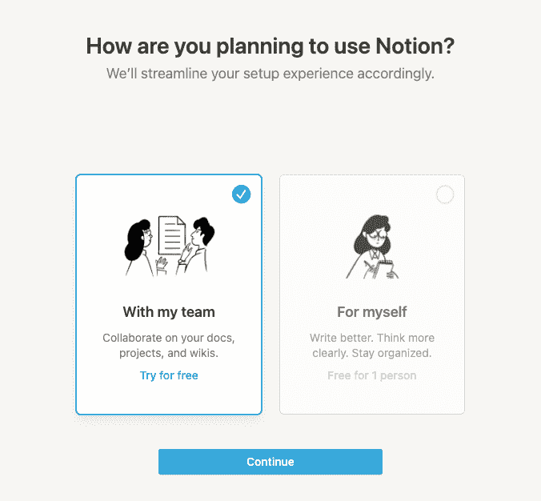
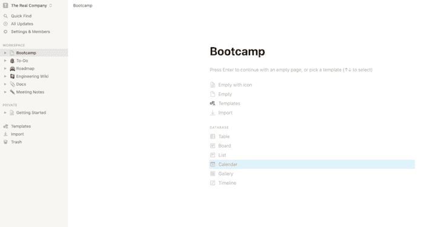
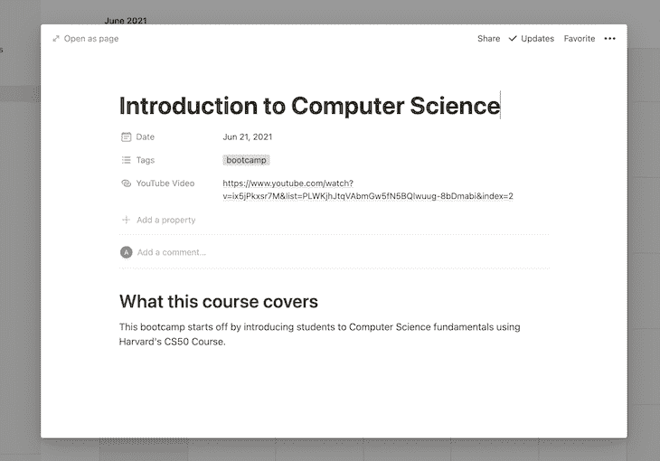
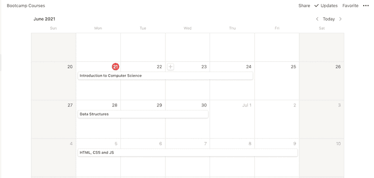
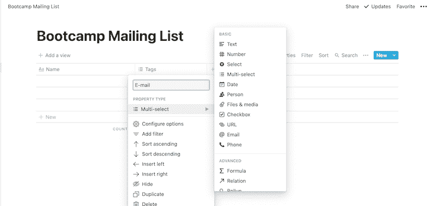
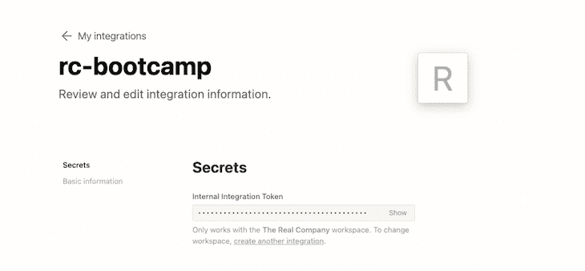
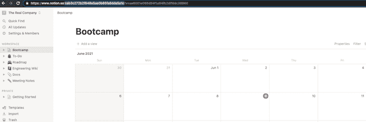
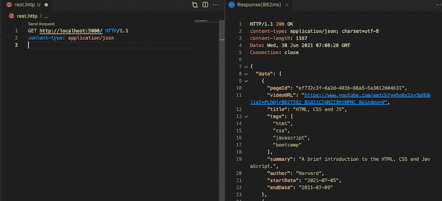

# 概念 API 入门

> 原文：<https://blog.logrocket.com/getting-started-with-the-notion-api/>

概念是一个可定制的项目管理软件，它可以轻松地在项目和页面上进行协作，在内部或外部共享您的工作，并跟踪队友。

[概念](http://notion.so)易于使用，是科技和非科技公司的最爱。一些流行的替代概念是[特雷罗](https://trello.com/)、[吉拉](https://jira.atlassian.com/)和[空中桌](https://airtable.com/)。

opinion 最近发布了[opinion API](https://developers.notion.com/reference/intro)，允许开发者在 opinion 之上进行构建。虽然仍处于公测阶段，但我们可以使用概念 API 来开发和测试我们自己的应用程序。

在本教程中，我们将使用概念创建一个数据库，连接到概念 API，并创建一个小型 Node.js 服务器，该服务器使用 Fastify 从我们的概念工作区提供内容。请注意，本教程将只构建应用程序的后端。

要跟随本教程，您需要具备 JavaScript 和 Node.js 的基础知识。

我们开始吧！

## 在 idea 上设置您的帐户

前往[概念网站](https://www.notion.so/login)注册一个账户。对于我们的例子，我们将建立一个团队帐户，但是，您可以选择注册一个个人帐户。



输入团队工作区的详细信息。


在最后的入职培训屏幕上，您可以选择邀请队友或不邀请继续。对于我们的例子，我们将跳过这一步。

请注意，concept 已经在左侧栏中设置了一些工作区，如待办事项、路线图、工程 Wiki、文档和会议笔记。


## 创建页面、日历和数据库

现在，让我们开始有趣的部分！假设我们是一家虚构的科技公司的一部分，该公司经营着一个由来自世界各地的学生参加的编码训练营。

我们希望根据项目协调员在我们的概念工作区中输入的信息，在学生的仪表板上为他们提供当月应该学习哪些课程的信息。我们还希望收集加入该计划的新生的姓名和电子邮件，并将这些信息存储在我们将在 idea 中创建的邮件列表中。

让我们从在概念仪表板上创建一个新页面开始。几乎所有的概念都是一个页面，子页面是嵌套在页面中的页面。

当您创建一个新的工作区时，首先创建一个页面。在侧边栏中工作区标题的右侧，单击 **+** 符号添加一个新页面。我们将把我们的新工作区称为“训练营”。

创建完训练营页面后，让我们创建一个日历。日历是一种视图，与表格、列表、公告板、图库和时间线一样。

idea 中的数据库视图是保持数据结构化和组织化的好方法，确保数据显示在我们使用它的上下文中是有意义的。



要在 idea 中创建日历数据库，添加一个新页面，输入“Bootcamp”，从数据库列表中选择**日历**。概念将向您显示一个日历视图，您可以开始输入您的数据。

当您将鼠标悬停在某一天时，单击显示的 **+** 图标，选择日历上的某一天。现在，您将能够在该日期输入数据。



如果您愿意，可以随意添加不同日期的数据。您也可以拖动日历上的日期来创建页面的开始和结束日期。

输入数据后，我们的日历将如下图所示:



## 使用概念建立邮件列表

如前所述，我们希望建立一个邮件列表，其中包含训练营中每个学生的电子邮件地址。当一名新学生从前端应用程序注册时，我们会将他们的姓名和电子邮件地址存储在 idea 中。

在左侧栏中，通过点击 **+ Add a Page** ，创建一个新的工作区。为您的页面添加标题；我们称我们的为“训练营邮件列表”。选择数据库下的**表**选项。设置表格，使其在第一列接受一个`Name`文本字段，在第二列接受一个`Email`字段。



## 为我们的概念 API 设置访问令牌

我们需要建立一个集成，通过概念 API 连接数据库，然后生成一个访问令牌来访问概念的 API。

要设置您的第一个集成，进入[概念 API 文档](https://developers.notion.com/reference/intro)页面，点击右上角的**我的集成**按钮。点击 **+** **创建新的积分**按钮。


为您的集成命名。我们称我们的为“rc-bootcamp”。然后点击**提交**。现在，您将看到您的内部集成令牌。



最后，为了使我们之前创建的数据库可以在我们的集成中使用，请转到 Bootcamp 工作区。点击页面右上角的**分享**按钮。选择我们刚刚创建的 **rc-bootcamp** 集成。

点击**邀请。**我们的集成现在应该可以访问我们的 Bootcamp 工作区了。

对我们之前创建的 Bootcamp 邮件列表工作区重复这个过程。


## 建立概念客户端

既然我们已经建立了工作空间、数据库和集成，我们可以开始为我们的学生仪表板应用程序创建后端服务器。

在您的终端中，使用命令`npm init -y`创建一个新的 Node.js 项目，这会在项目的根目录中自动生成一个`package.json`文件。

接下来，我们需要安装[概念 API SDK](https://github.com/makenotion/notion-sdk-js) 。运行命令:

```
npm install @notionhq/client

```

在根目录下创建一个`.env`文件。复制我们之前生成的内部集成令牌，并将其分配给您的`.env`文件中的一个`NOTION_API_TOKEN`变量。

为了在我们的项目中使用`.env`文件，我们需要安装 [dotenv](https://www.npmjs.com/package/dotenv) 库:

```
npm i dotenv

```

### 在概念中获取数据库 ID

我们需要找到我们的数据库 ID 来连接到我们创建的数据库。前往您的工作区，在`notion.so/`和`?`之间复制 URL 中的字母数字字符。



对于这个例子，我们的 Bootcamp 数据库 ID 是`cab3c272b2f848e5ae0b85fa8dda5a1c`。对 Bootcamp 邮件列表工作区重复相同的过程。

在您的`.env`文件中添加一个名为`NOTION_DATABASE_ID`的新变量。用您的 Bootcamp 数据库 ID 更新此变量。添加另一个名为`NOTION_MAILING_LIST_ID`的变量，并添加你的 Bootcamp 邮件列表数据库 ID。

现在，您的`.env`文件应该包含您的`NOTION_DATABASE_ID`、`NOTION_MAILING_LIST_ID`和`NOTION_API_TOKEN`。

## 连接到概念 SDK

现在我们已经获得了`NOTION_API_TOKEN`、`NOTION_MAILING_LIST_ID`和`NOTION_DATABASE_ID`，我们可以开始使用概念 SDK 了。

将项目的文件结构设置为类似于下面的代码:

```
|___controllers
  |___bootcamp.controller.js
|___models
  |___bootcamp.model.js
|___routes
  |___index.js
|___services
  |___notion.js
|___.env
|___server.js

```

在我们继续之前，让我们快速看一下每个目录将负责什么。

*   `controllers`:保存我们应用程序的业务逻辑
*   `models`:保存与概念数据库集成交互的代码
*   `routes`:保存我们的应用程序中路由的代码
*   包含将我们的应用程序连接到外部服务(如概念)的代码

让我们从`services`开始。在您的`services`目录中，将下面的代码块粘贴到您的`notion.js`文件中:

```
// In this file, we connect to the Notion Service
require('dotenv').config()
const { Client } = require('@notionhq/client');
const notion = new Client({ auth: process.env.NOTION_API_TOKEN });
module.exports = notion;

```

接下来，我们来设置`models`。以下代码块将负责写入和读取我们的概念数据库服务:

```
// models/bootcamp.model.js

// This file contains code to make operations on the DB
const notion = require("../services/notion");
const courseDatabaseId = process.env.NOTION_DATABASE_ID;
const mailingListDatabaseId = process.env.NOTION_MAILING_LIST_ID;
const bootcampModel = {
  // list all the courses in the DB
getCourses: async () => {
    try {
      const { results } = await notion.databases.query({
        database_id: courseDatabaseId,
      });
      const res = results.map((page) => {
        return {
          pageId: page.id,
          videoURL: page.properties["YouTube Video"].url,
          title: page.properties.Name.title[0].plain_text,
          tags: page.properties.Tags.multi_select.map((tag) => tag.name),
          summary: page.properties.Summary.rich_text[0].plain_text,
          author: page.properties.Author.rich_text[0].plain_text,
          startDate: page.properties.Date.date.start,
          endDate: page.properties.Date.date.end,
        };
      });
      return res;
    } catch (error) {
      console.error(error);
    }
  },
  getSubscribersFromDB: async () => {
    try {
      const { results } = await notion.databases.query({
        database_id: mailingListDatabaseId,
      });
      const res = results.map((page) => {
        return {
          name: page.properties.Name.title[0]?.text.content,
          email: page.properties["E-mail"].multi_select[0]?.name,
        };
      });
      return res;
    } catch (error) {
      console.error(error);
    }
  },
  addSubscriberToDB: async ({ name, email }) => {
    try {
      const res = await notion.pages.create({
        parent: {
          database_id: mailingListDatabaseId,
        },
        properties: {
          Name: {
            title: [
              {
                text: { content: name, link: null },
                plain_text: name,
              },
            ],
          },
          "E-mail": {
            multi_select: [
              {
                name: email,
              },
            ],
          },
        },
      });
      return res;
    } catch (error) {
      return {
        error: "Failed to add user to Mailing List",
      };
    }
  },
  findSubscriberByEmail: async ({ email }) => {
    try {
      const { results } = await notion.databases.query({
        database_id: mailingListDatabaseId,
        filter: {
          or: [
            {
              property: "E-mail",
              multi_select: {
                contains: email,
              },
            },
          ],
        },
      });
      // check if the results array contains a user
      if (results.length > 0) {
        return {
          isUserInDB: true,
        };
      }
      return {
        isUserInDB: false,
      };
    } catch (error) {
      console.error(error);
    }
  },
};
module.exports = bootcampModel;

```

向数据库发出请求可能需要一些练习，以理解概念是如何组织数据的。一旦你掌握了窍门，你会发现这很简单。

在上面的`models`文件中，我们创建了`findSubscriberByEmail`方法，它检查一个电子邮件地址是否已经存在于我们的 Bootcamp 邮件列表中。

`addSubscriberToDB`方法向我们的邮件列表添加一个新用户，而`getCourses`方法返回我们日历中的课程列表和每个课程的详细信息。

接下来，让我们为我们的`controllers`设置代码:

```
// controllers/bootcamp.controller.js

// Handles the business Logic
const bootcampModel = require("../models/bootcamp.model");

const bootcampController = {
  getAllCourses: async () => await bootcampModel.getCourses(),

  addSubscriberToDB: async ({ name, email }) => {
    const { isUserInDB } = await bootcampModel.findSubscriberByEmail({
      name,
      email,
    });

    // check if the E-mail exists
    if (isUserInDB) {
      return {
        error: "That E-mail already exists in our mailing list.",
      };
    }

    // if the E-mail doesn't already exist, add to Notion DB
    const response = await bootcampModel.addSubscriberToDB({ name, email });

    // if something goes wrong, send an error message
    if (response.error) {
      return {
        error: response.error,
      };
    }

    // if adding a user is successful
    return { message: "Successfully added to the Bootcamp mailing list" };
  },
};

module.exports = bootcampController;

```

在我们的`controllers`中有两个方法。一个连接到我们的概念数据库，获取我们在概念上创建的日历中的所有课程细节，另一个将用户添加到 Bootcamp 邮件列表中。

## 设置 Fastify 服务器

现在，我们将使用 [Fastify](https://github.com/fastify/fastify) 框架启动 Node.js 服务器。虽然开发人员通常在 Node.js 应用程序中使用 Express，但 Fastify 是一个令人兴奋的新框架，它对 Express 的一些最佳功能进行了改进。

例如，Fastify 允许我们通过解析 JSON 请求来编写更好、更干净的异步代码。有了 Fastify 插件，你不必安装来自不同作者的多个 npm 包来执行常见任务，如[认证](https://github.com/fastify/fastify-auth)和[验证](https://github.com/fastify/fastify/blob/main/docs/Validation-and-Serialization.md)。

通过运行以下代码，将 Fastify 添加到您的应用程序中:

```
npm i fastify

```

让我们设置我们的路由目录和启动 Fastify 服务器的代码。在项目根目录下的`server.js`文件中，添加以下代码块:

```
// server.js

const fastify = require('./routes')
  fastify.listen(5000, (err, address) => {
    if (err) throw err
})

```

上面的代码块将在`localhost:5000`启动我们的服务器。

在您创建的`routes`目录中，将以下代码片段添加到您的`index.js`文件中:

```
// routes/index.js

const fastify = require("fastify")({
  logger: true,
});

// Controllers
const bootcampController = require("../controllers/bootcamp.controller");

// Routes
fastify.get("/", async (req, reply) => {
  try {
    const res = await bootcampController.getAllCourses();
    reply.type("application/json").code(200);
    return { data: res };
  } catch (error) {
    reply.type("application/json").code(400);
    return { error };
  }
});

fastify.post("/", async (req, reply) => {
  try {
    const { name, email } = req.body;
    const res = await bootcampController.addSubscriberToDB({ name, email });
    reply.type("application/json").code(200);
    return { data: res };
  } catch (error) {
    reply.type("application/json").code(400);
    return { data: error };
  }
});

module.exports = fastify;

```

上面的代码使用 Fastify 创建了两个`routes`。第一个`route`接受一个 GET 请求。`bootcampController`接收请求，然后返回从我们的概念数据库中检索到的课程列表和课程元数据。

我们将通过使用 VS 代码中的 [REST 客户端扩展](https://marketplace.visualstudio.com/items?itemName=humao.rest-client)发出请求来测试我们的`routes`和端点。一旦安装了 REST 客户端，在项目的根目录下创建一个名为`rest.http`的文件。

让我们尝试向我们的 root 用户`route`发出一个 GET 请求。这个`route`返回我们的概念数据库中的所有课程信息。点击**发送请求**按钮，向`localhost:5000`发出获取请求。



第二个`route`接受 POST 请求。这个`route`负责向 Bootcamp 邮件列表添加一个新用户，并在请求体中接受`Name`和`Email`。


我们还可以导航到前端的 Bootcamp 邮件列表页面，查看使用我们创建的应用程序将用户添加到我们的概念列表中。


如果你想测试我的这个应用程序版本，你可以使用 [`notion-api-demo.glitch.me`端点](https://notion-api-demo.glitch.me/)向我托管在 Glitch 上的服务器发出 GET 和 POST 请求。只需用我的 Glitch URL 替换 REST 客户端中当前使用的`localhost:5000`端点。

在您向该端点发出 POST 请求后，导航到我的 [Bootcamp 邮件列表](https://www.notion.so/092c3ec283d043e8aee78b01bc2807bf?v=ef91eaeba496495eb22282d0198f0373)，查看您的电子邮件是否已添加到邮件列表中。

## 结论

我们的服务器端代码现在已经完成并且可以运行了！在本教程中，我们通过构建一个可以存储和检索数据的应用程序的后端来探索概念 API。我们已经能够设置我们的应用程序来:

*   获取我们的概念数据库中的所有课程以及这些课程的详细信息，包括它们的开始和结束日期、标题、描述和相关的视频 URL
*   将用户添加到我们在概念中创建的 Bootcamp 邮件列表中

为了跟随本教程或快速测试这个应用程序，欢迎您从我的 [GitHub](https://github.com/onedebos/notion-api-server-demo) repo 中克隆这个项目。

## 您是否添加了新的 JS 库来提高性能或构建新特性？如果他们反其道而行之呢？

毫无疑问，前端变得越来越复杂。当您向应用程序添加新的 JavaScript 库和其他依赖项时，您将需要更多的可见性，以确保您的用户不会遇到未知的问题。

LogRocket 是一个前端应用程序监控解决方案，可以让您回放 JavaScript 错误，就像它们发生在您自己的浏览器中一样，这样您就可以更有效地对错误做出反应。

[](https://lp.logrocket.com/blg/javascript-signup)[https://logrocket.com/signup/](https://lp.logrocket.com/blg/javascript-signup)

[LogRocket](https://lp.logrocket.com/blg/javascript-signup) 可以与任何应用程序完美配合，不管是什么框架，并且有插件可以记录来自 Redux、Vuex 和@ngrx/store 的额外上下文。您可以汇总并报告问题发生时应用程序的状态，而不是猜测问题发生的原因。LogRocket 还可以监控应用的性能，报告客户端 CPU 负载、客户端内存使用等指标。

自信地构建— [开始免费监控](https://lp.logrocket.com/blg/javascript-signup)。