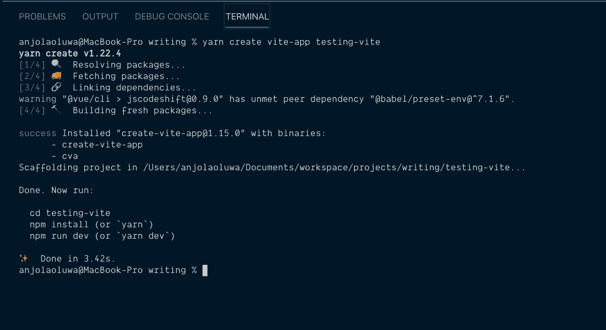
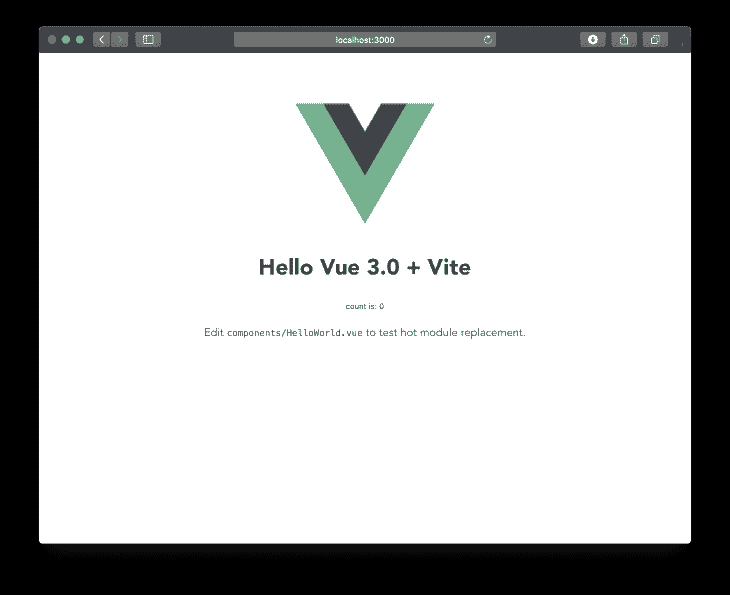

# Vite - LogRocket 博客入门

> 原文：<https://blog.logrocket.com/getting-started-with-vite/>

JavaScript 构建工具已经改变并塑造了我们构建在 web 上运行的东西的方式。构建工具是任何开发工作流不可或缺的一部分，它们包括(但不限于)任务运行器、传输器、模块打包器、linters、包管理器和开发服务器。

这些工具帮助开发人员高效地构建，并使开发过程更加容易(尽管配置它们可能会变得复杂)。

在本文中，我们将了解一个名为 [Vite](https://github.com/vitejs/vite) 的构建工具，它是什么，我们为什么需要它，它如何改进我们的开发工作流程，以及如何开始使用它。

## 先决条件

本教程假设读者具备以下条件:

## Vite 到底是什么？

Vite 最初只是作为 Vue 单文件组件(SFC)的开发服务器，但是它已经发展成为一个无捆绑的 JavaScript 开发服务器。

Vite 不把我们的项目捆绑在开发环境中，而是使用本地 es 模块导入。

根据其官方[文档](https://github.com/vitejs/vite):

> Vite 是一个固执己见的 web 开发构建工具，它在开发过程中通过原生 es 模块导入为您的代码提供服务，并将其与用于生产的 [Rollup](https://rollupjs.org/) 捆绑在一起。

Vite 和目前可用的其他开发服务器的主要区别在于，它不会在开发过程中捆绑您的文件。

值得注意的是，Vite 在很大程度上仍然是实验性的，并且正在进行使其适合生产的工作。最好不要在关键项目上使用它，直到它变得稳定。

## 它是如何工作的？

今天模块捆绑器受欢迎的原因之一是当 ES 模块首次在 [ES2016](https://developers.google.com/web/shows/ttt/series-2/es2015) 中引入时，浏览器对 [ES6 模块](https://developer.mozilla.org/en-US/docs/Web/JavaScript/Guide/Modules)的支持很差。许多现代浏览器现在支持本地 ES 模块，您可以本地使用`[import](https://developer.mozilla.org/en-US/docs/Web/JavaScript/Reference/Statements/import)`和 [`export`](https://developer.mozilla.org/en-US/docs/Web/JavaScript/Reference/Statements/export) 语句，我们可以使用脚本标签中的`type="module"`属性在 HTML 中包含我们的导入，以指定我们正在导入一个模块:

```
<script type="module" src="filename.js"></script>
```

根据[文档](https://github.com/vitejs/vite)，我们源代码中的 ES 导入语法直接提供给浏览器，任何支持本地<脚本模块>的浏览器都会自动解析它们，然后为每次导入发出 HTTP 请求。dev 服务器拦截来自浏览器的 HTTP 请求，并在必要时执行代码转换。

这使得 Vite 服务器非常快， [Vite 冷启动时钟大约为 140 毫秒，而 Vue-CLI 为 1900 毫秒](https://www.getrevue.co/profile/vuenewsletter/issues/180-say-hi-to-vite-a-brand-new-extremely-fast-development-setup-for-vue-so-fast-it-feels-instant-242032)。

Vite 提供了什么？

## 使用 Vite 的一些好处包括:

**裸模块解析** —浏览器还不支持裸模块导入，因为它不是 node_modules 的相对路径。Vite 检查您的 JavaScript 文件中是否有这样的裸导入说明符，重写它们并执行模块解析，以从您的项目依赖关系中找到正确的文件，并将它们解析为有效的模块说明符。

**热模块替换(HMR)** —热模块替换是 JavaScript bundlers 中提供的一项功能，您的 JavaScript 文件更改会在浏览器中更新，而无需刷新浏览器，使用 Vite，您所有的文件更改几乎会立即反映在浏览器中，您无需重新加载浏览器。根据[文档](https://github.com/vitejs/vite)，“热模块更换(HMR)性能与模块总数无关。这使得无论你的应用程序有多大，你的项目中的 HMR 总是很快。

HMR 速度对于使用 Webpack 的开发者来说是一个巨大的痛点。

**按需编译** — Vite 根据浏览器的请求编译源文件，因此只编译当前屏幕上导入和需要的代码，未更改的文件返回一个 [304(未修改)](https://developer.mozilla.org/en-US/docs/Web/HTTP/Status/304#:~:text=The%20HTTP%20304%20Not%20Modified,redirection%20to%20a%20cached%20resource.&text=The%20equivalent%20200%20OK%20response,ETag%20%2C%20Expires%20%2C%20and%20Vary%20.)错误代码。这与当前的打包程序不同，因为它们会编译项目中的所有文件，并在您开始更改它们之前将它们打包。这使得 Vite 适合更大的项目。

**配置选项** —如果您想对您的项目有更多的控制，您可以使用项目的基本根目录或当前工作目录中的`vite.config.js`或`vite.config.ts`文件来扩展您的项目的默认配置。您也可以通过`vite --config my-config.js`明确指定一个配置文件。

您可以通过在开发模式下在您的配置文件中添加一个 [Koa 中间件](https://github.com/koajs/koa)和一个用于构建的[汇总插件](https://github.com/rollup/plugins)来添加对定制文件转换的支持。

Vite 的其他功能包括:

### 支持使用 [esbuild](https://github.com/evanw/esbuild) 进行编译的`.tsx`和`.jsx`文件

*   对类型脚本的现成支持也使用 [esbuild](https://github.com/evanw/esbuild) 进行翻译
*   资产 URL 处理
*   支持 CSS 前处理器、后 CSS 和 CSS 模块
*   支持模式选项和环境变量
*   基本用法

## 为了开始使用 vite，我们将使用 [create-vite-app](https://github.com/vitejs/create-vite-app) ，这是一个引导新 Vite 项目的样板，我们不必担心配置，因为它将 Vue 作为默认启动器，我们可以配置我们想要使用的模板，因为它也支持 React 和 Preact。

运行这个命令，用样板文件创建一个新的 Vite 应用程序:



```
#Using NPX
npx create-vite-app testing-vite

#or, Using Yarn
yarn create vite-app testing-vite
```

我们使用名称“testing-vite”作为本教程的项目名称，它可以替换为您认为合适的任何名称。

现在，使用命令切换到创建的项目目录:

然后继续安装我们的项目运行所需的必要包:

```
cd testing-vite
```

然后，我们可以通过运行以下命令在浏览器中启动我们的开发服务器:

```
#Using NPM
npm install

#or, Using Yarn
yarn
```

在运行`dev`命令后，您应该会在 [http://localhost:3000](http://localhost:8080/) 上看到类似这样的内容:

```
#Using NPM
npm run dev

#or, Using Yarn
yarn dev
```



您可以运行以下命令来捆绑您的应用程序以用于生产:


```
vite build
```

Vite 对生产构建使用 Rollup，生产构建输出在位于项目根目录下的`dist`目录中。它包含可以在任何地方部署的静态资产(并且可以被填充以支持旧的浏览器)。

文档说，“构建步骤可以通过将大多数选项传递给 Rollup 来配置”。

结论

## 有了 Vite，您就有了一个非常快速的开发服务器，它将改进您的开发工作流程并提高生产率。

文件更改的结果会在浏览器中即时显示，您可以使用 Rollup 将您的应用程序捆绑用于生产。本文的代码库可以在 [GitHub](https://github.com/Jolaolu/vite-demo) 上访问。

您是否添加了新的 JS 库来提高性能或构建新特性？如果他们反其道而行之呢？

## 毫无疑问，前端变得越来越复杂。当您向应用程序添加新的 JavaScript 库和其他依赖项时，您将需要更多的可见性，以确保您的用户不会遇到未知的问题。

LogRocket 是一个前端应用程序监控解决方案，可以让您回放 JavaScript 错误，就像它们发生在您自己的浏览器中一样，这样您就可以更有效地对错误做出反应。

[LogRocket](https://lp.logrocket.com/blg/javascript-signup) 可以与任何应用程序完美配合，不管是什么框架，并且有插件可以记录来自 Redux、Vuex 和@ngrx/store 的额外上下文。您可以汇总并报告问题发生时应用程序的状态，而不是猜测问题发生的原因。LogRocket 还可以监控应用的性能，报告客户端 CPU 负载、客户端内存使用等指标。

[](https://lp.logrocket.com/blg/javascript-signup)[https://logrocket.com/signup/](https://lp.logrocket.com/blg/javascript-signup)

自信地构建— [开始免费监控](https://lp.logrocket.com/blg/javascript-signup)。

Build confidently — [Start monitoring for free](https://lp.logrocket.com/blg/javascript-signup).