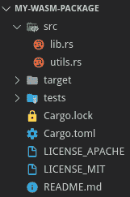
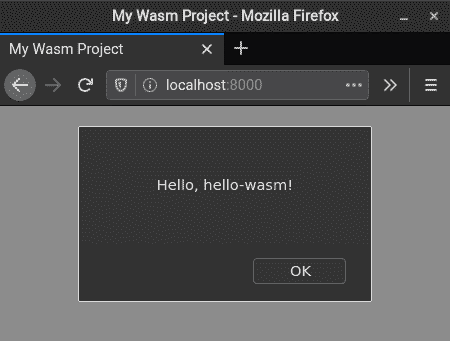

# WebAssembly 和 Rust - LogRocket 博客入门

> 原文：<https://blog.logrocket.com/getting-started-with-webassembly-and-rust/>

我最初接触 Rust 是因为这个团队在支持和推动 WebAssembly 方面所做的出色工作。官方文档是构建一个示例项目的绝佳资源。

本指南将作为 WebAssembly 的介绍以及如何在 Rust Wasm 环境中设置和工作的教程。

要继续学习，您应该对 Rust 和 web 开发有一个基本的了解。

## 了解 WebAssembly

WebAssembly 是大多数浏览器都支持的二进制指令格式。它支持 Rust、C、C++ Go 等语言。，在 web 浏览器中编译和运行。

Wasm 不是 JavaScript 的替代品。可以把它看作是把计算量大的任务转移到更合适的语言上的一种方式。它使您能够将现有的项目和库移植到 web 上，而不用用 JS 重写它们，从而提高性能。

如果你对在 web 之外采用 Wasm 规范感兴趣，那么 [WebAssembly 系统接口(WASI)](https://wasi.dev/) 可能会让你感兴趣。

在开始设置环境之前，请确保您的计算机上安装了以下软件。

*   [Rust](https://www.rust-lang.org/tools/install) (最好是最新版本)
*   现代网络浏览器(Internet Explorer 不算)
*   您最喜欢的文本编辑器
*   一种托管简单 web 服务器的方法，以避免浏览器唠叨跨源请求被阻塞；如果你安装了 Python，有一个很棒的命令
*   CLI

为什么需要`wasm-pack`？根据 [Mozilla](https://hacks.mozilla.org/2018/04/hello-wasm-pack/) 的说法，“`wasm-pack`是一个针对 WebAssembly 的组装打包 Rust crates 的工具。这些软件包可以发布到 npm 注册表，并与其他软件包一起使用。这意味着你可以将它们与 JS 和其他包一起使用，也可以在很多应用程序中使用。”

Rust crates 类似于其他语言的包和库。板条箱直接与 Rust 的构建系统和 package manager，Cargo 一起工作。

## 创建和构建 Wasm 包

我们将使用`wasm-pack` CLI 创建一个新的 Wasm 项目。如果您曾经通过`cargo` CLI 创建过 Rust 项目，那么您应该对此很熟悉。

```
wasm-pack new hello-wasm
cd hello-wasm

```

生成的项目本质上是一个带有样板 Wasm 代码的 Rust 库。



查看`wasm-pack`中可用的命令，很明显，这里关注的是创建和发布 npm 包。

```
WASM-PACK SUBCOMMANDS:
    build      🏗️  build your npm package!
    help       Prints this message or the help of the given subcommand(s)
    login      👤  Add an npm registry user account! (aliases: adduser, add-user)
    new        🐑 create a new project with a template
    pack       🍱  create a tar of your npm package but don't publish!
    publish    🎆  pack up your npm package and publish!
    test       👩‍🔬  test your wasm!

```

虽然这对于有 bundlers (Webpack、Rollup 等)的项目来说很棒。)，我们的目标是一个简单的设置，我们可以在一个 HTML 文件中导入 Wasm 二进制文件。谢天谢地，`wasm-pack`的`build`有一个针对其他环境的论点。

```
-t, --target <target>        Sets the target environment. [possible values: bundler, nodejs, web, no-modules]
                                [default: bundler]

```

这个目标正是我们想要的！一旦构建完成，输出将包含多个文件，作为 Wasm 和 JS 之间的粘合代码。最后，我们的 Wasm 二进制文件将通过一个 [JavaScript 模块](https://developer.mozilla.org/en-US/docs/Web/JavaScript/Guide/Modules)公开。

```
wasm-pack build --target web

```

## 在浏览器中运行 Wasm

Rust 代码编译成 Wasm 后，我们现在可以从 JavaScript 调用它了。

在项目的根目录下创建一个名为`index.html`的文件，并添加以下内容。

```
<!DOCTYPE html>
<html>
  <head>
    <meta charset="utf-8" />
    <title>My Wasm Project</title>
  </head>

  <body>
    <script type="module">
      // Importing WASM as a JS module requires us to call an init function provided by the default export.
      // This is planned to be changed in the future.
      import { default as wasm, greet } from "./pkg/hello_wasm.js";

      wasm().then((module) => {
        // The boiler plate project comes with a `greet` function that calls:
        // `alert("Hello, hello-wasm!");`
        greet();
      });
    </script>
  </body>
</html>

```

出于安全原因，浏览器通常不允许您从`file://`导入本地资源。这阻止了我们导入 Wasm 二进制文件，但是一个简单的解决方案是启动一个快速 web 服务器。

如果安装了 Python，可以使用以下命令之一。

*   Python 3: `python -m http.server 8000`
*   Python 2: `python -m SimpleHTTPServer 8000`

我们现在已经有了可以在浏览器中运行的 Rust 代码。访问 [http://localhost:8000](http://localhost:8000/) 看直播。它应该是一个带有警告的空白页。



## Rust 和 JavaScript 互操作

对于下面的代码示例，您可以编辑`index.html` 和 `src/lib.rs` 文件来体验新的变化。记住每次编辑 Rust 代码时都要编译。

既然您已经知道如何构建一个项目，那么是时候学习如何使用它了。默认情况下，Rust 不能直接与 JavaScript 或 web APIs 通信。该功能通过`[wasm-bindgen](https://rustwasm.github.io/docs/wasm-bindgen/)`启用。项目本身由多个板条箱和一个 CLI 工具组成。我们实际上一直在通过`wasm-pack`使用它的 CLI。

来自`wasm-bindgen`的板条箱包括:

### 导出常见类型

通过导入`wasm_bindgen::prelude::*`，我们获得了与 JS 对话的强大抽象。这里有一些我想强调的:

*   自动处理 Rust 和 JS 之间大部分绑定的宏。
*   `JsValue`:JS 拥有的数据的表示。
*   `UnwrapThrowExt`:对`Option<T>`和`Result<T, E>`的特征扩展。

假设您正在编辑`src/lib.rs`，下面的例子展示了如何用 Wasm 接收和返回值。注意，给变量加下划线(比如`_c`)是一种习惯，表示它没有被使用。

```
use wasm_bindgen::prelude::*;

// JS doesn't have a chars type which means:
// - The _c argument is the first char of a JS string.
// - The char returned will be a JS string.
#[wasm_bindgen]
pub fn char_example(_c: char) -> char {
    '🚀'
}

#[wasm_bindgen]
pub fn string_example(s: String) -> String {
    format!("Hello {}", s)
}

// str cannot be used as a return type.
// This is because we can't return borrowed references with the wasm_bindgen macro.
#[wasm_bindgen]
pub fn str_example(s: &str) -> String {
    format!("Hello {}", s)
}

#[wasm_bindgen]
pub fn number_example(n: i32) -> i32 { // assume the same for u32, usize, etc.
    n+100
}

#[wasm_bindgen]
pub fn bool_example(_b: bool) -> bool {
    true
}

// `Box<[JsValue]>` are the representation for a JS array object.
// When it comes to Js Arrays:
// - They are iterable.
// - Can contain multiple types by being of type JsValue (strictly typed arrays exist for numbers).
// - Don't really support N-dimensional arrays and are expensive to work with.
#[wasm_bindgen]
pub fn mixed_array_example(array: Box<[JsValue]>) -> Box<[JsValue]> {
    for value in array.iter() {
        // compute things...
    }

    vec![
        "Hello".into(),
        512.into(),
        JsValue::NULL,
        JsValue::UNDEFINED,
        61.20.into(),
    ]
    .into_boxed_slice()
}

// Typed arrays are only available for number types.
// For example, the function below will return a JS Int32Array type.
#[wasm_bindgen]
pub fn typed_array_example(_array: Box<[i32]>) -> Box<[i32]> {
    vec![1, 2, 3, 4, 5, 6, 7].into_boxed_slice()
}

// When it comes to Option:
// - Some returns the value inside.
// - None returns a JS undefined.
#[wasm_bindgen(catch)]
pub fn option_example() -> Option<i32> {
    None
}

// When it comes to Result
// - Result<T, JsValue> is the only supported signature. T must be convertible to a JsValue.
// - #[wasm_bindgen(catch)] must be used when returning a result.
// - Err will be equivalent to a JS thrown error.
// - Ok will return the value inside.
#[wasm_bindgen]
pub fn result_example() -> Result<i32, JsValue> {
    // With the wasm prelude imported, we can convert most common types by calling .into()
    Err("Look Pa, I'm throwing a JS error!".into())
}

```

一旦项目再次构建，这些功能可以直接在我们的网页中使用。您可以随意试验并打印返回值。

```
<script type="module">
  import * as wasm from "./pkg/hello_wasm.js";

  wasm.default().then((module) => {
    wasm.char_example("R");
    wasm.string_example("Jane");
    wasm.str_example("John");
    wasm.number_example(28);
    wasm.mixed_array_example([2, null, undefined, "Hola", true]);
    wasm.typed_array_example([1, 2, 3, 4, 5, 6, 7, 8, 9, 10]);
    wasm.option_example();
    wasm.result_example();
  });
</script>

```

### 导出结构和枚举

枚举和结构是相当简单的导出。虽然有一些限制，但语法应该还是感觉日复一日的生锈。

```
use wasm_bindgen::prelude::*;

// When it comes to Enums:
// - They  are C styled.
// - JS represents them through an object with a number for each variant.
#[wasm_bindgen]
pub enum ExampleEnum {
    Yes,
    No,
}

#[wasm_bindgen]
pub fn verify_enum_choice(choice: ExampleEnum) -> bool {
    match choice {
        ExampleEnum::Yes => true,
        ExampleEnum::No => false,
    }
}

// When it comes to Structs:
// - Cannot contain lifetimes or type parameters.
// - Each field value must impl the Copy trait.
#[wasm_bindgen]
pub struct ExampleStruct {
    pub value: i32,
}

// For struct impl, we have the option for struct methods and type-level functions.
// JS handles structs by creating a JS object with a pointer (i.o.w. we can use references!).
#[wasm_bindgen]
impl ExampleStruct {
    pub fn new(value: i32) -> ExampleStruct {
        ExampleStruct { value }
    }

    pub fn read_method(&self) -> i32 {
        self.value
    }

    pub fn write_method(&mut self, value: i32) {
        self.value = value;
    }

    pub fn transfer_ownership(self) -> ExampleStruct {
        self
    }
}

```

现在，我们可以将 struct 和 enum 直接导入到 JS 代码中。一旦一个结构被实例化，我们可以调用它的 Wasm 兼容的方法。

```
<script type="module">
  import * as wasm from "./pkg/hello_wasm.js";

  wasm.default().then((module) => {
    // Enum \\
    let rustEnum = wasm.ExampleEnum.Yes;
    console.log(wasm.verify_enum_choice(rustEnum));

    // Struct \\
    let rustStruct = wasm.ExampleStruct.new(6);
    console.log(rustStruct); // this will contain a pointer
    console.log(rustStruct.value);

    rustStruct.write_method(200);
    console.log(rustStruct.read_method());

    let newRustStruct = rustStruct.transfer_ownership();
    rustStruct.read_method(); // rustStruct is now invalid. An error will throw.
  });
</script>

```

下面是上面脚本的输出图像，演示了这些类型是如何工作的。注意枚举和结构在 JS 中是如何表示的。


### 手动创建绑定

这个箱子为与 JS 对话提供了强大的工具。然而，JS 标准或 web APIs 没有直接的绑定。这就是`web-sys`和`js-sys`出现的原因。两个板条箱都有现成的绑定，提供了一个标准的工作界面。

当然，这些板条箱并不能覆盖所有东西，所以我们需要为丢失的任何东西创建我们自己的绑定。一个常见的例子是包装定制的 JS 类和函数。当您第一次打开`src/lib.rs`时，您可能已经注意到为`alert()`函数创建了一个绑定。

在我们介绍如何创建自己的定制绑定之前，让我们先来看看 Rust 要绑定的 JS 代码。

```
<!--
  For simplicity, we'll add a class declaration to the global namespace.
  The goal, from rust, is to create this class, call a method, and get/set a property.
-->
<script>
  class Coordinate {
    constructor(x, y) {
      this.x = x;
      this.y = y;
    }

    printValues() {
      return `(x:${this.x} y:${this.y})`;
    }
  }
</script>

<script type="module">
  import * as wasm from "./pkg/hello_wasm.js";

  wasm.default().then((module) => {
    wasm.manual_bindings_example();
  });
</script>

```

在绑定`Coordinates`类的基础上，下面是一些如何为各种 JS 函数做同样事情的例子。

```
use wasm_bindgen::prelude::*;

// Although we're using what's in the global namespace, we can also import from other modules.
// #[wasm_bindgen(module = "./bar")]
// extern "C" {}

// Binding JS involves a bit of boilerplate because we have to specify each name
// and signature to bind.
#[wasm_bindgen]
extern "C" {
    // Bindings must be named as their JS equivalent
    fn alert(s: &str);

    // A different name can be specified as long as the original name is passed to the macro.
    #[wasm_bindgen(js_name = prompt)]
    fn ask(s: &str) -> String;

    // Methods can be from any js namespace.
    #[wasm_bindgen(js_namespace = console)]
    fn log(s: &str);

    // Using a different name allows us to specify various signatures.
    #[wasm_bindgen(js_namespace = console, js_name = log)]
    fn log_num(n: i32);

    //* JS Class example *\\
    // The process is a little verbose because create a binding for
    // each part of the class we want (class name, constructor, methods, setters, getters).
    type Coordinate;

    #[wasm_bindgen(constructor)]
    fn new(x: i32, y: i32) -> Coordinate;

    // methods must match the naming in the class declaration.
    #[wasm_bindgen(method)]
    fn printValues(this: &Coordinate) -> String;

    // getters are named as the property we want.
    #[wasm_bindgen(getter, method)]
    fn x(this: &Coordinate) -> i32;

    // setters are named the same as getters but with a `set_` prefix.
    #[wasm_bindgen(setter, method)]
    fn set_x(this: &Coordinate, x: i32);
}

#[wasm_bindgen]
pub fn manual_bindings_example() {
    alert("Hey buddy!");
    log(&ask("Tell me about your day!"));

    let coordinates = Coordinate::new(-4, 15);
    log_num(coordinates.x()); // prints -4

    coordinates.set_x(coordinates.x() * 2);
    log(&coordinates.printValues()); // prints (-8, 15)
}

```


## 与 web APIs 交互

大多数重要的 web APIs 都是由`web-sys`机箱提供和记录的。在指定了我们想要的 API 之后，我们可以做很多事情，包括:

*   编辑 HTML 元素
*   添加事件侦听器
*   打印到 web 控制台
*   在画布上画画

由于列表非常广泛，我们将只关注如何设置和使用这个 create。

将以下内容添加到项目的`Cargo.toml`中，然后指定您想要使用的每个 web API。

```
[dependencies]
web-sys = { version = "0.3.39", features = ['console'] }

use wasm_bindgen::prelude::*;
use web_sys::console;

#[wasm_bindgen]
pub fn print_things() {
  // console has multiple log_x functions that represent how many items are being printed.
  // log_x takes in a reference to a JsValue so we need to convert the values we want to print.
  console::log_1(&"Printing from Rust!!".into());
  console::log_2(&"Numbers: ".into(), &1234.into());
}

```

要了解更多信息，请查看以下`web-sys`资源。

如果您发现需要从标准 JS 导入类型和函数，那么研究一下`js-sys`箱也是值得的。

## 结束语

虽然我们不可能在一篇博文中涵盖所有内容，但我希望这篇指南能够帮助您开始 WebAssembly 之旅。我非常鼓励浏览 [`wasm-bindgen`文档](https://rustwasm.github.io/docs/wasm-bindgen/)来探索更深入的例子和重要主题，比如[在 JavaScript 和 Rust](https://rustwasm.github.io/docs/wasm-bindgen/reference/arbitrary-data-with-serde.html) 之间传输任意数据。

请记住，Rust WebAssembly 生态系统仍在发展，而且只会越来越好。

## [log rocket](https://lp.logrocket.com/blg/rust-signup):Rust 应用的 web 前端的全面可见性

调试 Rust 应用程序可能很困难，尤其是当用户遇到难以重现的问题时。如果您对监控和跟踪 Rust 应用程序的性能、自动显示错误、跟踪缓慢的网络请求和加载时间感兴趣，

[try LogRocket](https://lp.logrocket.com/blg/rust-signup)

.

[](https://lp.logrocket.com/blg/rust-signup)

LogRocket 就像是网络和移动应用程序的 DVR，记录你的 Rust 应用程序上发生的一切。您可以汇总并报告问题发生时应用程序的状态，而不是猜测问题发生的原因。LogRocket 还可以监控应用的性能，报告客户端 CPU 负载、客户端内存使用等指标。

现代化调试 Rust 应用的方式— [开始免费监控](https://lp.logrocket.com/blg/rust-signup)。