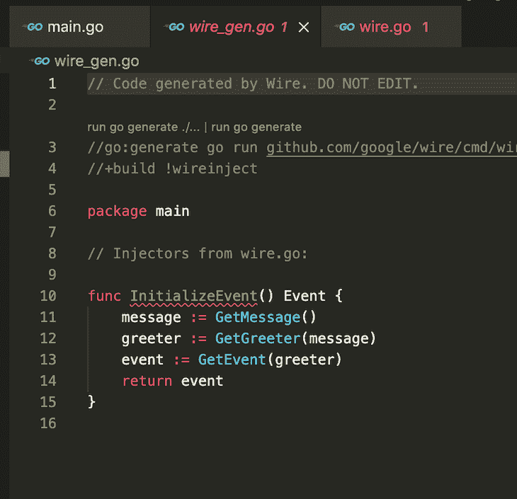
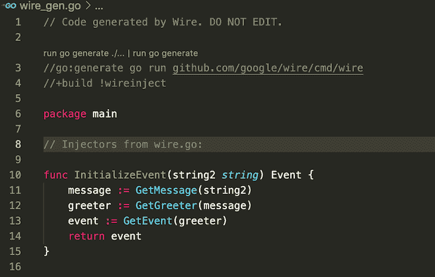

# 使用 Wire 进行依赖注入

> 原文：<https://blog.logrocket.com/go-dependency-injection-wire/>

## 介绍

Go 是一种相对较新的语言，但值得探索。它被设计成具有简单的语法，同时保持像 C 或 C++这样的编程语言的速度。

在这篇文章中，我们将会看到一种软件工程技术，这种技术在大多数编程语言中都存在，在 Go 中也不奇怪:依赖注入。

## 什么是依赖注入？

依赖注入是一种软件工程技术，其中对象或结构在编译时接收其依赖关系。维基百科这样定义依赖注入:

> 依赖注入是一种技术，其中一个对象接收它所依赖的其他对象，称为依赖。通常，接收对象称为客户端，传入(“注入”)对象称为服务。

为了更好地理解这一点，我们来分析一个例子。看一下下面的代码:

```
package main

import (
   "fmt"
)

type Message string
type Greeter struct {
   Message Message
}
type Event struct {
   Greeter Greeter
}

func GetMessage() Message {
   return Message("Hello world!")
}
func GetGreeter(m Message) Greeter {
   return Greeter{Message: m}
}
func (g Greeter) Greet() Message {
   return g.Message
}
func GetEvent(g Greeter) Event {
   return Event{Greeter: g}
}
func (e Event) Start() {
   msg := e.Greeter.Greet()
   fmt.Println(msg)
}
func main() {
   message := GetMessage()
   greeter := GetGreeter(message)
   event := GetEvent(greeter)

   event.Start()
}

```

如果你看一下上面的代码，我们有一个消息、一个欢迎和一个事件。还有一个返回消息的`GetMessage`函数；一个`GetGreeter`函数，接收一条消息并返回一个欢迎信息；和一个接受欢迎者并返回事件的`GetEvent function`。该事件还有一个名为`Start`的方法，它打印出消息。

如果你看一下我们的`main`方法，我们首先创建一个消息，然后我们把消息作为一个依赖项传递给欢迎者，最后把它传递给事件。通过在终端中运行命令`go run .`来运行代码。


正如你所看到的，它打印“你好，世界！”到控制台。这是一个非常浅的依赖图，但是你已经可以看到在一个大的代码库中实现它的复杂性。这就是像 Wire 这样的依赖注入工具的用武之地。

## 什么是电线？

Wire 是一个代码依赖工具，它在没有运行时状态或反射的情况下运行。编写用于 Wire 的代码甚至对于手写初始化也很有用。

Wire 可以在编译时生成源代码，也可以实现依赖注入。根据[官方文档](https://pkg.go.dev/github.com/google/wire)，“在 Wire 中，组件之间的依赖关系被表示为函数参数，鼓励显式初始化而不是全局变量。”

## 如何安装电线

要使用 Wire，首先，您需要在当前工作目录中初始化 Go 模块。运行命令`go mod init go-wire`来做到这一点。


现在，运行命令`go get github.com/google/wire/cmd/wire`进行安装。


现在，让我们重构代码，使用 Wire 作为依赖注入工具。创建一个名为`wire.py`的文件，并添加以下代码:

```
package main

import "github.com/google/wire"

func InitializeEvent() Event {
   wire.Build(GetMessage, GetGreeter, GetEvent)
   return Event{}
}

```

首先，我们导入 Wire，然后我们创建一个名为`InitializeEvent`的函数。这个函数返回一个我们将在`main`方法中使用的事件。在`InitializeEvent`函数中，我们调用了 Wire。然后我们构建并传递我们所有的依赖项。注意，我们可以以任何顺序传递这些依赖关系。

然后我们返回一个空事件。别担心，电线会接管这里！

现在，把你的`main`方法改成这样:

```
func main() {
   event := InitializeEvent()
   event.Start()
}

```

请注意我们如何成功地将 main 方法中的代码减少到只有两行。

运行命令`go run github.com/google/wire/cmd/wire`来生成我们与 Wire 的依赖关系。


现在您会看到 Wire 已经生成了一个名为`wire_gen`的文件。



如果你再次运行代码，你会得到一个错误。


这是因为我们的`InitializeEvent`函数现在已经在`wire_gen`文件中重新声明了。将
`//+build wireinject`添加到你的`wire.go`文件的开头，告诉 [Go](https://blog.logrocket.com/5-top-go-web-frameworks) 在建造时忽略它。确保在那之后添加新的一行，否则这将不起作用。


如果再运行`go run .`，应该还是会看到同样的“Hello，world！”输出。


## 使用参数

如果您想动态地将消息作为参数传入，该怎么办？让我们来看看如何做到这一点。将`GetMessage`功能修改为:

```
func GetMessage(text string) Message {
   return Message(text)
}

```

现在我们必须传入一个文本来显示。让我们试着运行它，看看输出。


如您所见，Wire 意识到我们必须向`GetMessage`函数传递一个参数。让我们解决这个错误。在您的`wire.go`文件中修改您的`InitializeEvent`函数:

```
func InitializeEvent(string) Event {
   wire.Build(GetMessage, GetGreeter, GetEvent)
   return Event{}
}

```

现在我们告诉 Wire，我们需要一个字符串参数。

再次运行`go run github.com/google/wire/cmd/wire`。如果您看一下我们的`wire_gen.go`文件，您会看到 Wire 已经重构了代码来接受这个值。



在您的`main`方法中传递字符串:

```
func main() {
   event := InitializeEvent("Hello People!")
   event.Start()
}

```

再次运行`go run .`，你应该会看到文本被打印出来。


## 导线中的错误处理

如果我们忘记传入任何初始值设定项怎么办？让我们看看 Wire 如何处理这个问题。

在您的`wire.go`文件中，省略`GetEvent`参数并再次运行`go run github.com/google/wire/cmd/wire`:

```
func InitializeEvent(string) Event {
   wire.Build(GetMessage, GetEvent)
   return Event{}
}

```


如您所见，Wire 检测到我们没有传入参数，并打印出一个有用的输出，告诉我们忽略了哪个参数。当我们传入的参数超过所需数量时，也会发生同样的情况。

## 结论

在本文中，我们已经介绍了 Wire 的基本特性。在上面的小例子中，我们已经看到了如何使用它进行动态依赖注入，但是当我们有一个大的代码库时，Wire 的真正威力就显现出来了。如果你想了解更多的高级特性，你可以[查看这里的文档](https://github.com/google/wire/blob/main/docs/guide.md#advanced-features)。

## 使用 [LogRocket](https://lp.logrocket.com/blg/signup) 消除传统错误报告的干扰

[](https://lp.logrocket.com/blg/signup)

[LogRocket](https://lp.logrocket.com/blg/signup) 是一个数字体验分析解决方案，它可以保护您免受数百个假阳性错误警报的影响，只针对几个真正重要的项目。LogRocket 会告诉您应用程序中实际影响用户的最具影响力的 bug 和 UX 问题。

然后，使用具有深层技术遥测的会话重放来确切地查看用户看到了什么以及是什么导致了问题，就像你在他们身后看一样。

LogRocket 自动聚合客户端错误、JS 异常、前端性能指标和用户交互。然后 LogRocket 使用机器学习来告诉你哪些问题正在影响大多数用户，并提供你需要修复它的上下文。

关注重要的 bug—[今天就试试 LogRocket】。](https://lp.logrocket.com/blg/signup-issue-free)