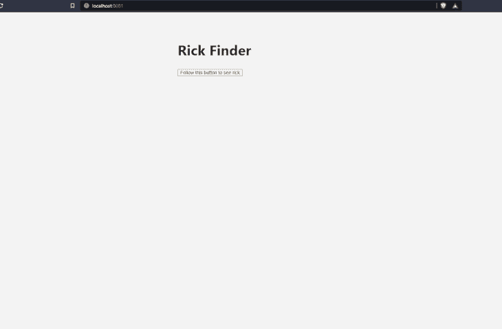
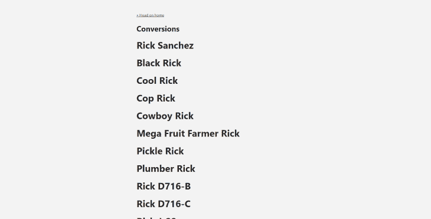

# 十一月的博客没有服务器

> 原文：<https://blog.logrocket.com/going-serverless-eleventy/>

单独使用 Eleventy 可以帮助你高效地制作优秀的静态网站，并提高性能。然而，当在应用程序中使用动态数据时，这种方法并不奏效。

在本教程中，我们将浏览创建 Eleventy 组件的过程，然后向您展示如何使用 Eleventy 无服务器插件来处理逻辑和数据。

## 什么是十一？

Eleventy 是一个静态的站点生成器，它使用各种模板语言来组装 HTML 网页，你可以通过你的提供商托管这些网页。

Eleventy 遍历项目中的所有文件，从不同的模板语言收集数据，包括 markdown、Nunjucks、Liquid、Haml、JavaScript 等。然后，在构建期间，它使用模板语言生成一个包含`*.html`文件的输出文件夹——即一个静态 HTML 网站。

这带来了出色的性能，但也带来了动态内容和用户输入方面的缺点。

## 什么是 Eleventy Serverless？

[Eleventy Serverless](https://www.11ty.dev/docs/plugins/serverless/) 是一个插件，可以让你使用无服务器功能管理 Eleventy 中动态生成的数据。它使用 Netlify 函数，但也可以与 Netlify 的按需构建器一起工作，我们将在后面解释。

Eleventy Serverless 与您的静态站点协同工作，但是它在 HTTP 请求点运行一个或多个模板文件来生成动态页面。它可以开启许多新的用例，从静态网页转向动态生成的内容。

按需构建器是缓存结果的函数。运行一次，并在每隔一次运行时获取静态 HTML。

## 十一装置

让我们通过运行以下命令来启动我们的项目并添加我们的`package.json`:

```
npm init

```

要使用 Eleventy Serverless，我们需要 11ty 的 1.0 发行版的最新版本，在撰写本文时是 [1.0.0.canary.44](https://www.npmjs.com/package/@11ty/eleventy/v/1.0.0-canary.44) :

```
npm i @11ty/[email protected]^1.0.0-canary.44

```

此外，我们可以安装网络功能:

```
npm install @netlify/functions

```

## 十一构型

要使用 Eleventy Serverless，我们需要转到我们的根文件夹来创建和配置我们的`.eleventy.js`文件。这个文件帮助我们在项目中配置 Eleventy Serverless。Eleventy 无服务器插件是 Eleventy 自带的，我们刚刚安装的)。

十一项配置如下:

```
const { EleventyServerlessBundlerPlugin } = require("@11ty/eleventy");
// Require the package we just installed
const axios = require("axios");
module.exports = function (eleventyConfig) {
  eleventyConfig.addPlugin(EleventyServerlessBundlerPlugin, {
    name: "rick", // The serverless function name for the permalink object 
    functionsDir: "./netlify/functions/",
  });

};

```

如前所述，我们从我们的`11ty/eleventy`导入`EleventyServerlessBundlerPlugin`。然后，我们使用`eleventyConfig.addPlugin`为我们的无服务器插件设置配置。

我们可以添加无服务器函数的名称和处理无服务器函数的网络函数目录。

## 入门指南

现在是时候看看 Eleventy Serverless 的实际应用了。我们将演示如何发出请求或添加业务逻辑，以便在您的站点上显示动态内容。

我们将使用 [Rick 和 Morty API](https://rickandmortyapi.com/) 来显示剧中所有还活着的名叫 Rick 的角色。



## 过滤

首先，让我们回到我们的`.eleventy.js`文件并创建我们的过滤器:

```
const { EleventyServerlessBundlerPlugin } = require("@11ty/eleventy");
// Require the package we just installed
const axios = require("axios");
module.exports = function (eleventyConfig) {
  eleventyConfig.addPlugin(EleventyServerlessBundlerPlugin, {
    name: "rick",
    functionsDir: "./netlify/functions/",
  });
  eleventyConfig.addFilter("rickList", (name) => {
    const list = axios
      .get(
        `https://rickandmortyapi.com/api/character/?name=${name}&status=alive`
      )
      .then((res) => {
        console.log(res.data.results);
        let i = res.data.results
        return i
      })
      .catch((err) => console.log(err));
      return list 
  });
};

```

这个`rickList`过滤器接受一个`name`参数，并向 Rick 和 Morty API 发送一个请求，后者返回一个响应。我们将在 UI 中显示这个响应。

构建将自动为我们的无服务器功能创建`netlify/functions`文件夹。

## 网络功能

我们的网络函数可以是动态的，也可以是缓存的。默认情况下，它将是一个动态的无服务器功能，运行在每次加载。

对于缓存，我们将使用 Netlify 按需构建来提高性能并缓存其结果。因此，如果我们的过滤器有重复出现的参数，我们不需要再次运行脚本。相反，我们可以使用之前缓存的结果。这样，我们只在无服务器函数有新参数时才运行函数。缓存无服务器功能使用 Netlify 按需构建器来运行。

要将我们的函数设置为缓存，进入生成的`netlify/functions/rick/index.js`，滚动到底部，并替换以下内容:

```
exports.handler = handler;

```

包含以下内容:

```
const { builder } = require("@netlify/functions");
exports.handler = builder(handler);

```

在进入实际代码之前，我们应该将正确的文件添加到我们的`.gitignore`文件中。我们需要添加我们的 Netlify 函数文件，所以我们不会将它们上传到一个版本控制工具，比如 Git。

```
netlify/functions/rick/**  
!netlify/functions/rick/index.js

```

## 11 个组件

现在，创建一个名为`_includes`的新文件夹。在这个文件夹中，创建一个`base.njk`文件。默认情况下，Eleventy 使用`_includes`来查找要渲染的模板文件。

```
<!DOCTYPE html>
<html lang="en">
<head>
    <meta charset="UTF-8">
    <meta http-equiv="X-UA-Compatible" content="IE=edge">
    <meta name="viewport" content="width=device-width, initial-scale=1.0">
    <link rel="stylesheet" href="https://unpkg.com/some-nice-basic-css/global.css" />
    <style>.container{max-width: 80ch;margin: auto;</style>
    <title>{{ title }}</title>
</head>
<body>
    <main class="container">
        {{ content | safe }}
    </main>
</body>
</html>

```

让我们转到我们的根文件夹并创建一个`index.njk`文件，我们将把它导入到`_includes/base.njk`中。这个`index.njk`文件将包含我们的主页，这是用户打开网站后看到的内容。

* * *

### 更多来自 LogRocket 的精彩文章:

* * *

```
---
title: "Rick Finder"
layout: "base.njk"
permalink: 
    build: "/"       
---

    
        {{ eleventy.serverless.query.query | safe }}
    
        {{ title }}
    

<h1>{{ pageTitle }}</h1>

<button onclick="window.location.href = '/rick/'" id="rickForm"> Follow this button to see rick</button>

```

`index.njk`文件显示一个标题和按钮来帮助我们导航到`/rick`页面。

在根文件夹中创建一个`rick.html`文件，与`index.njk`文件处于同一级别:

```
---
layout: "base.njk"
permalink: 
    rick: "/rick/"
---

<a href="/">&laquo; Head on home</a>

<h2>Names</h2>


<div class="card-grid">
  
    <h1>{{ result.name }}</h1>
  
</div>

```

这里，我们将这个页面的永久链接设置为与我们的无服务器插件的名称相同。

我们将创建一个名为`name`的变量，并将其赋给字符串`rick`。然后，我们将通过提供`with name`作为参数来触发配置文件中的`rickList`过滤器。响应被分配给结果。然后，我们遍历响应并显示名称。

我们可以通过运行`npm run start`来启动它。

现在，如果我们转到`localhost:8080/rick/`，我们会看到《瑞克和莫蒂》中一系列名字为瑞克的角色:



## 结论

如果你坚持到了最后，恭喜你！

在本教程中，我们向您介绍了 Eleventy Serverless，逐步介绍了安装配置 Eleventy 的步骤，并演示了如何在实际项目中使用 Eleventy Serverless 来处理异步逻辑。最重要的是，我们展示了如何在静态站点之外实现这一点。

用于本次演示的完整代码可在 [GitHub](https://github.com/Atanda1/11tyrick) 上获得。

## 使用 [LogRocket](https://lp.logrocket.com/blg/signup) 消除传统错误报告的干扰

[](https://lp.logrocket.com/blg/signup)

[LogRocket](https://lp.logrocket.com/blg/signup) 是一个数字体验分析解决方案，它可以保护您免受数百个假阳性错误警报的影响，只针对几个真正重要的项目。LogRocket 会告诉您应用程序中实际影响用户的最具影响力的 bug 和 UX 问题。

然后，使用具有深层技术遥测的会话重放来确切地查看用户看到了什么以及是什么导致了问题，就像你在他们身后看一样。

LogRocket 自动聚合客户端错误、JS 异常、前端性能指标和用户交互。然后 LogRocket 使用机器学习来告诉你哪些问题正在影响大多数用户，并提供你需要修复它的上下文。

关注重要的 bug—[今天就试试 LogRocket】。](https://lp.logrocket.com/blg/signup-issue-free)