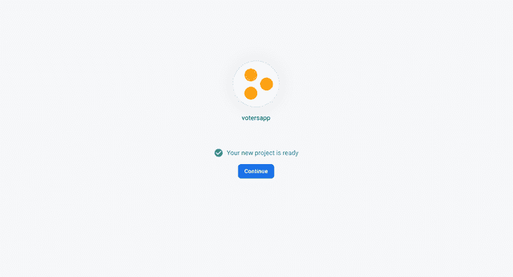
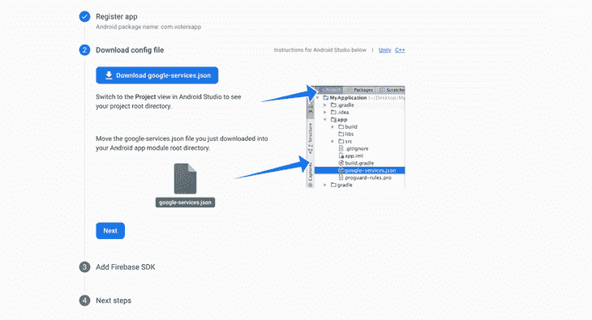
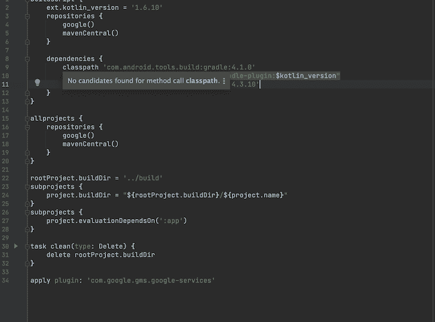
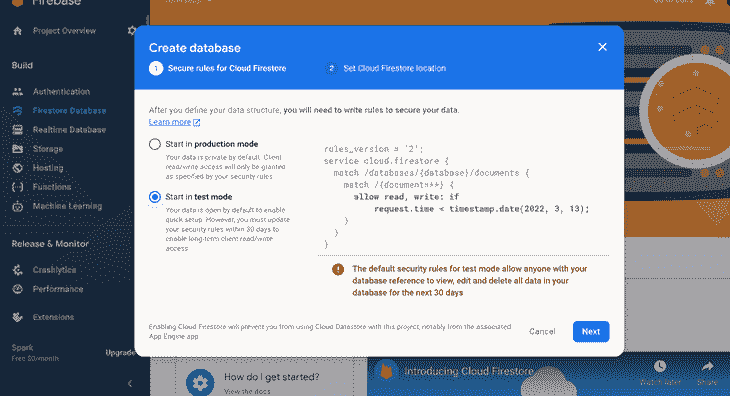
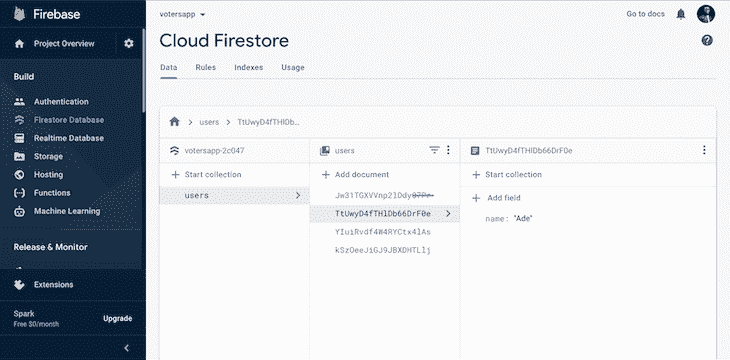
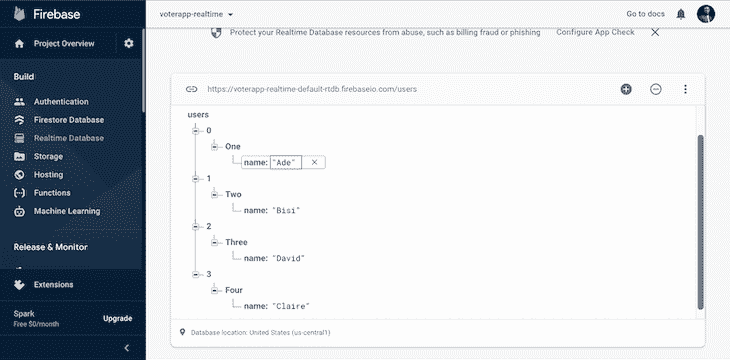

# Google Cloud Firestore 和 Flutter - LogRocket 博客中的实时数据库

> 原文：<https://blog.logrocket.com/google-cloud-firestore-realtime-database-flutter/>

Google 提供了维护数据持久性的服务。我们的应用程序所使用的数据应该在我们需要的时候可用，易于访问，并且最好是结构化的，以备我们的应用程序使用。

云 Firestore 和 Firebase 实时数据库是 Google 提供的两项服务。两者都可以满足我们的应用程序要求，但它们之间有许多不同之处——这实际上使它们最适合特定的应用程序类型。

本文将向您展示哪个数据库更适合 Flutter 应用程序查询。为了开始，我们将提供本文所涵盖的内容、我们的示例用例、先决条件和我们的过程的快速分解。

让我们开始吧。

## 内容

## **我们将讨论的内容**

在本文中，我们将引导您完成以下内容:

*   如何将 Flutter 应用程序分别连接到云 Firestore 和实时数据库
*   他们如何在数据查询方面脱颖而出

### **我们的例子**

我们将创建一个应用程序，允许平台上的注册用户就特定的主题或决策进行投票。

要使用的样本数据集将使我们能够展示云 Firestore 和实时数据库之间的差异，原因有两个:

*   它与我们的 Flutter 应用程序的连接
*   它们可以处理的查询功能有何不同

### **先决条件**

*   了解如何创建基本的颤振应用
*   熟悉 no SQL/基于文档的数据存储的概念
*   了解云 Firestore 或实时数据库，无论是外部颤振或颤振，是一个加号

### **运行通过**

我们的流程将采用以下结构:

*   我们将为我们的应用程序运行一个简单的数据库后端设置。此步骤适用于云 Firestore 和实时数据库。(注意:我们将在继续进行的过程中强调这两个过程之间的区别)
*   我们将用一个基本代码来设置我们的 Flutter 应用程序。我们这样做是为了支持应用程序点的核心，也就是用户投票的时候——因此我们的两个数据库都将预先填充我们可以使用的数据。这些数据将从我们的应用程序中插入到我们的数据库中，而不是像我们的情况那样，通过任何特别的手动过程
*   我们将通过连接和执行简单的读写操作来展示它们之间的区别
*   然后，我们将展示它们基于不同的查询功能有何不同

## 云风暴

Cloud Firestore 是一个 NoSQL 文档数据库，它在全球范围内简化了应用程序的存储、同步和查询数据。

这是一个将后端放在 Flutter 应用程序上的好方法，而没有拥有服务器的麻烦。与实时数据库相比，云 Firestore 支持复杂的查询结构。因为我们的数据在存储(作为文档)时是结构化的，所以与实时数据库相比，我们可以执行更麻烦或不可能的查询。

对于我们的例子，我们将需要一个后端源，在所有应用程序之间共享数据，并可以跟踪不同位置的不同成员投票的持久性。

借助 Cloud Firestore，我们可以为参与投票会话的用户创建集合，并为他们可以投票的可能决策列表分组。当我们收集数据时，我们会将 Cloud Firestore 集成到我们的应用程序中，并使用收集的数据构建我们的 Flutter 小部件。Firestore 处理大多数较小的细节，确保持久的信息更新和所有现有应用程序实例的变化。

### 创建我们的颤振应用程序

继续创建一个新的 Flutter 应用程序来执行我们的 Firestore 操作。

### 创建我们的 Firebase 项目

首先，我们将创建一个 Flutter 项目。

首先，我们需要为我们的应用程序建立一个 Firebase 项目。为此，直接进入 [Firebase](https://console.firebase.google.com/) 并创建一个新项目。


我们将使用我们的应用程序名称`votersapp`。接下来，单击“继续”创建一个项目。(注:启用 Google Analytics 是个人选择)。



创建项目后，单击“继续”并注册项目的各个应用程序。我们将通过单击当前页面上的 Android 图标为 Android 设备注册我们的项目。如果我们注册一个 iOS 应用程序或注册两个平台，过程大体上是相同的。

移动到我们的 Android 包名称字段的 Flutter 应用程序；复制公司名称(反向域名)，输入。这可以在 androidmanifest.xml 文件中找到。

完成后，单击下载配置文件，然后单击“下一步”。



现在，我们将不得不设置一些基本配置，以确保 Firebase 可以完成我们的应用程序的注册并与之通信。

拖动我们之前下载的 google-services.json 文件，并将其插入到我们的 android/app/目录中。

设置 Firebase Gradle 插件。打开我们的 Flutter 项目 Android 目录中的 build.gradle 文件，并将该代码添加到下面的依赖项中:

```
classpath 'com.google.gms:google-services:4.3.10

```

```
{
classpath 'com.android.tools.build:gradle:4.1.0'
classpath "org.jetbrains.kotlin:kotlin-gradle-plugin:$kotlin_version"
}

```



接下来，打开 android/app/build.gradle 文件，将以下内容添加到`apply plugin`键:“com.google.gms.google-services”。


接下来，前往[https://pub.dev/packages/cloud_firestore](https://pub.dev/packages/cloud_firestore)，获取最新版本的云 Firestore 并将其添加到我们的 pubspec。YAML 档案。

运行 Flutter `pub get`来抓取插件。

接下来，从我们的控制台仪表板中选择 Cloud Firestore。在构建/firestore 数据库下，选择“测试模式”并启用它。



接下来，我们将创建一个名为“Users”的集合该集合将保存每个可以投票的用户的文档。然后，我们将用四个用户填充它；艾德、比西、大卫和克莱尔。

至此，我们已经设置好了我们的后端。现在，我们需要我们的应用程序与我们的 Firebase 后端进行通信。我们将在我们的 Flutter 应用程序中使用云 Firestore 插件。

### 我们的颤振应用

对于我们的 Flutter 应用程序，我将展示一个截图来演示本教程的核心思想。

### 阅读我们的云风暴

```
import 'package:flutter/material.dart';
import 'package:firebase_core/firebase_core.dart';
import 'package:cloud_firestore/cloud_firestore.dart';

Future<void> main() async {
WidgetsFlutterBinding.ensureInitialized();

 await Firebase.initializeApp();
 runApp(const MyApp());
}

class MyApp extends StatelessWidget {
 const MyApp({Key? key}) : super(key: key);

 // This widget is the root of your application.
 @override
 Widget build(BuildContext context) {
 return MaterialApp(
 title: 'Flutter Demo',
 theme: ThemeData(
 primarySwatch: Colors.blue,
 ),
 home: const MyHomePage(title: 'Flutter Demo Home Page'),
 );
 }
}

class MyHomePage extends StatefulWidget {
 const MyHomePage({Key? key, required this.title}) : super(key: key);

 final String title;

 @override
 State<MyHomePage> createState() => _MyHomePageState();
}

class _MyHomePageState extends State<MyHomePage> {
 final Stream<QuerySnapshot> _usersStream =
 FirebaseFirestore.instance.collection('users').snapshots();

 @override
Widget build(BuildContext context) {
 return Scaffold(
 appBar: AppBar(
 title: Text(widget.title),
 ),
 body: SingleChildScrollView(
 child: Container(
 margin: EdgeInsets.symmetric(
  vertical: MediaQuery.of(context).size.height * 0.04,
  horizontal: MediaQuery.of(context).size.width * 0.04),
 child: Column(
  mainAxisAlignment: MainAxisAlignment.start,
  crossAxisAlignment: CrossAxisAlignment.start,
  children: <Widget>[
  const Text(
   'Enter user name',
  style: TextStyle(fontSize: 16),
  ),
  const SizedBox(
  height: 10,
  ),
  TextField(

  onChanged: (value) {
  //Do something with the user input.

  },
  decoration: const InputDecoration(
  hintText: 'Enter your password.',
  contentPadding:
   EdgeInsets.symmetric(vertical: 10.0, horizontal: 20.0),
  border: OutlineInputBorder(
   borderRadius: BorderRadius.all(Radius.circular(6.0)),
  ),
  ),
  ),

  , icon: Icon(Icons.add), label: Text('Add user')),
  const SizedBox(
  height: 20,
  ),
  StreamBuilder<QuerySnapshot>(
  stream: _usersStream,
  builder: (BuildContext context,
   AsyncSnapshot<QuerySnapshot> snapshot) {
   if (snapshot.hasError) {
   return const Text('Something went wrong');
   }
   if (snapshot.connectionState == ConnectionState.waiting) {
   return const Text("Loading");
   }
   return ListView(
   shrinkWrap: true,
   children:
   snapshot.data!.docs.map((DocumentSnapshot document) {
   Map<String, dynamic> data =
    document.data()! as Map<String, dynamic>;
   return ListTile(
   title: Text(data['name']),
   );
   }).toList(),
   );
  })
  ],
 ),
 ),
 ),
 );
}
}

```



### 代码片段的解释

在上面的代码中，我们导入了 Flutter 应用程序所需的插件。

(注意:Firestore 需要一个 Firebase 内核，所以我们将其添加到了我们的 pubspec 中。YAML 文件，并将其导入到我们的应用程序。)

下面的代码将 Firebase 初始化到我们的应用程序中。作为一个附加说明，在构建我们的小部件时，我们有一个文本字段和数据库中当前用户的列表。我们用`SingleChildScrollView`包装了小部件，并将`ListView` `ShrinkWrap`属性设置为`true`以避免重叠。

```
WidgetsFlutterBinding.ensureInitialized();

await Firebase.initializeApp();

```

下面的代码是主要的发电站——它从我们的云 Firestore 执行读取功能。

```
final Stream<QuerySnapshot> _usersStream =
 FirebaseFirestore.instance.collection('users').snapshots();

```

它获取我们的用户集合的一个实例，并将其存储在我们的`Stream<QuerySnapshot>`变量中。

下面的代码是一个 Flutter 小部件——它创建了一个流，每当数据库中的数据快照发生变化时，这个流就会更新小部件的状态。它显示所有用户的列表。

```
StreamBuilder<QuerySnapshot>(
  stream: _usersStream,
  builder: (BuildContext context,
   AsyncSnapshot<QuerySnapshot> snapshot) {
   if (snapshot.hasError) {
   return const Text('Something went wrong');
   }
   if (snapshot.connectionState == ConnectionState.waiting) {
   return const Text("Loading");
   }
   return ListView(
   shrinkWrap: true,
   children:
   snapshot.data!.docs.map((DocumentSnapshot document) {
   Map<String, dynamic> data =
    document.data()! as Map<String, dynamic>;
   return ListTile(
   title: Text(data['name']),
   );
   }).toList(),
   );
  })
  )

```

### Firestore 写操作

为了执行写操作，我们将首先创建一个集合实例和一个变量来保存我们的用户文本输入。这里显示了一个示例:

```
CollectionReference users = FirebaseFirestore.instance.collection('users');
String name = '';

```

接下来，我们将使用 Cloud Firestore 创建一个将文档插入数据库的函数。

```
Future<void> addUser() {
 // Call the user's CollectionReference to add a new user
 return users
  .add({
  'name': name, // John Doe
 })
  .then((value) => print("User Added"))
  .catchError((error) => print("Failed to add user: $error"));
}

```

我们在代码中添加了一个按钮小部件，并设置了`onPressed`函数来用文本字段的内容更新 name 变量。我们的代码库变成了这样:

```
import 'package:flutter/material.dart';
import 'package:firebase_core/firebase_core.dart';
import 'package:cloud_firestore/cloud_firestore.dart';

Future<void> main() async {
 WidgetsFlutterBinding.ensureInitialized();
 await Firebase.initializeApp();
 runApp(const MyApp());
}

class MyApp extends StatelessWidget {
 const MyApp({Key? key}) : super(key: key);

 // This widget is the root of your application.
 @override
 Widget build(BuildContext context) {
 return MaterialApp(
  title: 'Flutter Demo',
  theme: ThemeData(
  primarySwatch: Colors.blue,
  ),
  home: const MyHomePage(title: 'Flutter Demo Home Page'),
 );
 }
}

class MyHomePage extends StatefulWidget {
 const MyHomePage({Key? key, required this.title}) : super(key: key);

 final String title;

 @override
 State<MyHomePage> createState() => _MyHomePageState();
}

class _MyHomePageState extends State<MyHomePage> {
 final Stream<QuerySnapshot> _usersStream =
  FirebaseFirestore.instance.collection('users').snapshots();

 CollectionReference users = FirebaseFirestore.instance.collection('users');

 String name = '';

 Future<void> addUser() {
 // Call the user's CollectionReference to add a new user
 return users
  .add({
  'name': name, // John Doe
 })
  .then((value) => print("User Added"))
  .catchError((error) => print("Failed to add user: $error"));
 }

 @override
 Widget build(BuildContext context) {
 return Scaffold(
  appBar: AppBar(
  title: Text(widget.title),
  ),
  body: SingleChildScrollView(
  child: Container(
   margin: EdgeInsets.symmetric(
    vertical: MediaQuery.of(context).size.height * 0.04,
    horizontal: MediaQuery.of(context).size.width * 0.04),
   child: Column(
   mainAxisAlignment: MainAxisAlignment.start,
   crossAxisAlignment: CrossAxisAlignment.start,
   children: <Widget>[
    const Text(
     'Enter user name',
    style: TextStyle(fontSize: 16),
    ),
    const SizedBox(
    height: 10,
    ),
    TextField(
    onChanged: (value) {
     //Do something with the user input.
     name = value;
    },
    decoration: const InputDecoration(
     hintText: 'Enter your password.',
     contentPadding:
      EdgeInsets.symmetric(vertical: 10.0, horizontal: 20.0),
     border: OutlineInputBorder(
     borderRadius: BorderRadius.all(Radius.circular(6.0)),
     ),
    ),
    ),
    const SizedBox(
    height: 5,
    ),
    ElevatedButton.icon(
     onPressed: (){
     addUser();
    }, icon: Icon(Icons.add), label: Text('Add user')),
    const SizedBox(
    height: 20,
    ),
    StreamBuilder<QuerySnapshot>(
     stream: _usersStream,
     builder: (BuildContext context,
      AsyncSnapshot<QuerySnapshot> snapshot) {
     if (snapshot.hasError) {
      return const Text('Something went wrong');
     }
     if (snapshot.connectionState == ConnectionState.waiting) {
      return const Text("Loading");
     }
     return ListView(
      shrinkWrap: true,
      children:
       snapshot.data!.docs.map((DocumentSnapshot document) {
      Map<String, dynamic> data =
       document.data()! as Map<String, dynamic>;
      return ListTile(
       title: Text(data['name']),
      );
      }).toList(),
     );
     })
   ],
   ),
  ),
  ),
 );
 }
}

```

这里还列出了其他云 Firestore 功能:
[【https://firebase.flutter.dev/docs/firestore/usage/】](https://firebase.flutter.dev/docs/firestore/usage/)。

(注意:在 Cloud Firestore 中，我们可以链接过滤器，并在单个查询中结合对属性的过滤和排序。)

## 实时数据库

设置我们的 Firebase 后端项目与我们对云 Firestore 所做的类似，只是在选择我们的数据库时，我们选择实时数据库，而不是 Firestore 数据库。

### 我们的颤振应用

与 Cloud Firestore 相比，我们将在本部分使用不同的插件。因此，在我们的`pubspec.YAML`文件中，我们添加 Firebase_database 作为依赖项。对于我们的颤振应用，我们需要遵循以下步骤。

首先，我们将 Firebase_database 导入我们的 Dart 文件。

```
import 'package:firebase_database/firebase_database.dart';

```

接下来，为了初始化我们的应用程序，我们使用下面的代码:

```
WidgetsFlutterBinding.ensureInitialized();
await Firebase.initializeApp();

```

应该注意，实时数据库将数据存储为 JSON，这使我们能够通过`DatabaseReference`访问数据的节点。例如，如果我们像下面这样存储数据，我们可以为每个发现创建引用。那就是:

```
{
 "users":
   “One”: {
  "name": "Ade"
 },
   “Two”: {
  "name": "Bisi"
 },
   ‘Three”: {
  "name": "David"
 },
   ‘Four”: {
  "name": "Claire"
 }
}

```

我们可以通过提供路径来创建对节点的引用:

*   users/:创建对整个“users”对象的引用
*   users/One:创建对“One”用户对象的引用
*   users/Two/name:创建对属性(值为“比西”)的引用

```
DatabaseReference ref = FirebaseDatabase.instance.ref("voters/1/users/1");

```

(注意:如果不提供路径，引用将指向数据库的根目录。)

### 向实时数据库添加数据

在本节中，我们将通过添加一个新用户来将数据写入数据库，就像我们在 Firestore 中所做的那样。为此，我们需要遵循以下步骤。

首先，创建一个对我们想要写入的路径的引用。

```
final refDataInstance = FirebaseDatabase.instance.reference().child('users');

```

下面，我们有完整的代码，从我们的实时数据库读取数据，并向我们的数据库写入新用户。

```
import 'package:firebase_database/ui/firebase_animated_list.dart';
import 'package:flutter/material.dart';
import 'package:firebase_core/firebase_core.dart';
import 'package:firebase_database/firebase_database.dart';

Future<void> main() async {
 WidgetsFlutterBinding.ensureInitialized();

 var app = await Firebase.initializeApp();
 runApp(MaterialApp(
  title: 'Flutter Demo',
  theme: ThemeData(
  primarySwatch: Colors.blue,
  ),
  home: MyHomePage(app: app, title: 'Flutter Demo')));
}

class MyHomePage extends StatefulWidget {
 final FirebaseApp app;

 const MyHomePage({Key? key, required this.title, required this.app})
  : super(key: key);

 final String title;

 @override
 State<MyHomePage> createState() => _MyHomePageState();
}

class _MyHomePageState extends State<MyHomePage> {
 final refDataInstance = FirebaseDatabase.instance.reference().child('users');

 String name = '';

 @override
 Widget build(BuildContext context) {
 return Scaffold(
  appBar: AppBar(
  title: Text(widget.title),
  ),
  body: SingleChildScrollView(
  child: Container(
   height: MediaQuery.of(context).size.height,
   margin: EdgeInsets.symmetric(
    vertical: MediaQuery.of(context).size.height * 0.04,
    horizontal: MediaQuery.of(context).size.width * 0.04),
   child: Column(
   mainAxisAlignment: MainAxisAlignment.start,
   crossAxisAlignment: CrossAxisAlignment.start,
   children: <Widget>[
    const Text(
    'Enter user name',
    style: TextStyle(fontSize: 16),
    ),
    const SizedBox(
    height: 10,
    ),
    TextField(
    onChanged: (value) {
     //Do something with the user input.
     name = value;
    },
    decoration: const InputDecoration(
     hintText: 'Enter your password.',
     contentPadding:
      EdgeInsets.symmetric(vertical: 10.0, horizontal: 20.0),
     border: OutlineInputBorder(
     borderRadius: BorderRadius.all(Radius.circular(6.0)),
     ),
    ),
    ),
    const SizedBox(
    height: 5,
    ),
    ElevatedButton.icon(
     onPressed: () {
     // adds new user to DB
     refDataInstance.push().child('name').set(name).asStream();
     },
     icon: const Icon(Icons.add),
     label: const Text('Add user')),
    const SizedBox(
    height: 20,
    ),
    Flexible(
     child: FirebaseAnimatedList(
    shrinkWrap: true,
    query: refDataInstance,
    itemBuilder: (BuildContext context, DataSnapshot snapshot,
     Animation<double> animation, int index) {
     return ListTile(
     title: Text(snapshot.value['users']),
     );
    },
    )),
   ],
   ),
  ),
  ),
 );
 }
}

```

### 写入我们的实时数据库

我们利用下面的表达式来执行写操作。使用我们的数据库引用的实例，我们可以在我们的`elevatedButton`小部件的`onTap`函数中写入我们的 name 变量的值。

```
refDataInstance.push().child('name').set(name).asStream();

```

### 从数据库实例中读取

使用 Firebase 的`FirebaseAnimatedList`小部件，我们可以在更改数据库时执行实时流写或读。

```
FirebaseAnimatedList(
 shrinkWrap: true,
 query: refDataInstance,
 itemBuilder: (BuildContext context, DataSnapshot snapshot,
  Animation<double> animation, int index) {
 return ListTile(
  title: Text(snapshot.value['users']),
 );
 },
)

```

(注意:在实时数据库中，我们可以在单个查询中只对一个属性而不是多个属性进行筛选或排序。)



## 结论

与实时数据库相比，云 Firestore 支持复杂的查询结构。因为我们的数据在存储时是结构化的(作为文档)，所以我们可以在 Cloud Firerstore 中执行繁琐的查询。

我们可以选择在单个查询中只对一个属性进行过滤或排序，而不是像在实时数据库中那样只对多个属性进行过滤或排序。在 Cloud Firestore 中，我们可以链接过滤器，并在单个查询中结合属性的过滤和排序。

如果我们想按降序获取数据，Cloud Firestore 在实时数据库不提供查询功能的情况下非常有用，我们还可以在 Cloud Firestore 中链接多个“where”方法来创建更具体的查询(逻辑 and)。

```
users.whereEqualTo("name", "Bisi").whereEqualTo("vote", 0);

```

出于这些原因，在为 Flutter 应用程序寻找具有最佳查询能力的数据库时，我强烈建议使用 Cloud Firestore。通过上面的几个例子，我们已经看到了云 Firestore 如何超越它的 Firebase 对手。

快乐编码💻