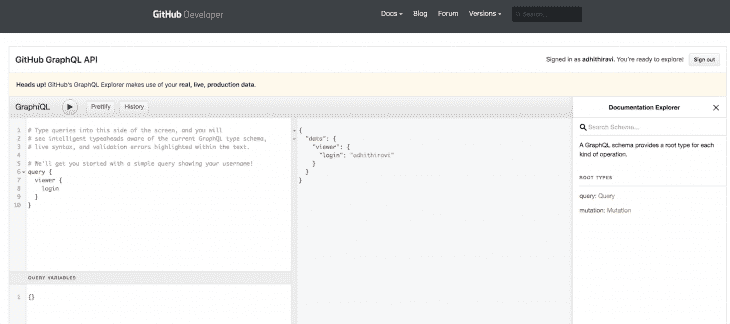

# 用简单的术语解释 GraphQL 查询

> 原文：<https://blog.logrocket.com/graphql-queries-in-simple-terms/>

GraphQL 是一种用于 API 的查询语言。这是脸书在 2015 年开源的，从那以后作为 REST 的[替代品而广受欢迎。创建 GraphQL 是为了在客户机和服务器之间有更好的通信。在这篇博文中，我们将学习 GraphQL 查询是什么，甚至自己写一些。](https://blog.logrocket.com/graphql-vs-rest-what-you-didnt-know/)

您可以将 GraphQL 查询想象成 REST 中的 GET 请求。GraphQL 查询用于向 GraphQL 服务器查询客户端需要的数据。GraphQL 的有趣之处在于，客户可以根据自己的需求编写定制的查询。这意味着 GraphQL 使客户端能够使用查询准确地询问他们想要的内容，并返回仅包含所询问内容的响应。这种方法给了客户端更多的权力。

为了进一步理解这一点，让我们探索一下构成 GraphQL 查询的概念。

## 入门:使用 GitHub 的公共 API

为了演示和学习 GraphQL 查询，我将使用公众可用的 [GitHub API](https://developer.github.com/v4/) 。你可以跟着打开 https://developer.github.com/v4/explorer/的。确保您已登录 GitHub 帐户来运行查询。

在 GitHub GraphQL explorer 上，我们可以开始在左侧输入我们的查询，然后点击 play 在右侧查看 JSON 响应。我们还可以浏览右侧的 API 文档。资源管理器是针对 GraphQL APIs 编写查询的好方法。



菲尔茨

## GraphQL 查询就是询问对象上的特定字段[和](https://graphql.org/learn/queries/#fields)。

GraphQL 查询由字段组成。我将针对 GitHub API 编写我们的第一个查询。在这个查询中，我们查询字段*查看器*，并在其中查询字段*名称。*

***提示*** :在浏览器上点击 Ctrl+Space，将会显示所有可以根据 API 查询的可用字段。

这是我们收到的 GraphQL 响应。请注意，我们得到的正是我们所要求的。我们得到了 JSON 格式的查看者的名字。所有响应都包装在*数据*对象中。太好了！您编写了第一个 GraphQL 查询。让我们进一步了解查询。

```
// GraphQL Query
{
  viewer {
    name
  }
}
```

争论

```
// GraphQL Response JSON
{
  "data": {
    "viewer": {
      "name": "Adhithi Ravichandran"
    }
  }
}
```

## **参数可以传递给 GraphQL 中的字段和嵌套对象。这有助于消除从 API 获取数据的多次往返。**

在 GraphQL 中，我们可以选择将参数值传递给字段，请求特定的数据。通过这样做，它不同于 REST 方法，并且消除了到多个端点的多次往返的需要。到 API 服务器的多次往返可能很繁琐，并且性能很高。使用 REST，我们只能向 URL 传递一组参数。而使用 GraphQL，您可以向每个字段和嵌套对象传递参数，完全消除了多次 API 获取。一个简单的查询就可以从 API 中获取我们需要的所有数据。

现在让我们针对*存储库*字段进行查询。这个字段需要我们传递两个参数，*的所有者*和*的名字。*我传递 *google* 作为拥有者，你可以传递你选择的任何其他组织作为参数。除此之外，我们还需要传递存储库的名称*和*。

我们从服务器返回的 JSON 响应如下。我们现在有了从服务器请求的*存储库*信息。通过传递不同的参数集，您可以进一步研究这个查询。

```
// GraphQL Query with Arguments
{
  repository (owner:"google", name:"WebFundamentals") {
    name
    owner {
      id
    }
  }
}
```

别名

```
// GraphQL Response JSON
{
  "data": {
    "repository": {
      "name": "WebFundamentals",
      "owner": {
        "id": "MDEyOk9yZ2FuaXphdGlvbjEzNDIwMDQ="
      }
    }
  }
}
```

## 如果您想用多个参数查询同一个字段，该怎么办？有时，您可能会使用不同的参数集来查找同一字段的信息。您可以在 GraphQL 中使用 Alias 来实现这一点。

**别名有助于查询相同的字段，在 GraphQL 中有不同的参数。**

让我们在前面的查询中添加更多内容。假设我想查询同一个字段*存储库，*，但是这次除了 Google 存储库之外，我还想查询脸书存储库。这导致 GraphQL 中的字段冲突。为了克服这一点，我们引入了别名。

提供别名后，我们的查询现在没有错误，可以运行了。JSON 响应返回同一字段上两个参数的数据。每个响应都包含在别名中。我们在 *googleRepo* 和 *facebookRepo* 对象*中有响应。*

```
// GraphQL Query Aliases
{
  // alias "googleRepo"
  googleRepo: repository (owner:"google", name:"WebFundamentals") {
    name
    owner {
      id
    }
  }
  // alias "facebookRepo"
  facebookRepo: repository (owner:"facebook", name:"react") {
    name
    owner {
      id
    }
  }
}
```

碎片

```
// GraphQL JSON Response

{
  "data": {
    "googleRepo": {
      "name": "WebFundamentals",
      "owner": {
        "id": "MDEyOk9yZ2FuaXphdGlvbjEzNDIwMDQ="
      }
    },
    "facebookRepo": {
      "name": "react",
      "owner": {
        "id": "MDEyOk9yZ2FuaXphdGlvbjY5NjMx"
      }
    }
  }
}
```

## 编写 GraphQL 查询时一个有用的概念是**片段。**如果您注意到您的查询在多个区域中有许多重复的字段，您可以将它们合并成一个可重用的单元，称为片段。

片段让你构建多个字段，并在多个查询中包含它们。这就像一个功能也是一个可重用的单元。

让我们看看下面的查询。注意，我们多次查询*所有者*字段中的相同字段。这是使用片段的好地方。

更多来自 LogRocket 的精彩文章:

* * *

### 我们可以重写我们的查询来使用一个片段。片段是用关键字 **fragment** 创建的，并且可以使用唯一的名称。这与用编程语言编写函数是同一个概念。

* * *

```
{
  googleRepo: repository (owner:"google", name:"WebFundamentals") {
    name
    owner {
      id,
      avatarUrl
      resourcePath
      url
    }
  }
  facebookRepo: repository (owner:"facebook", name:"react") {
    name
    owner {
      id,
      avatarUrl
      resourcePath
      url
    }
  }
}
```

我们可以创建一个名为 *ownerInfo 的片段。在创建片段时，我们必须让 GraphQL 知道它是在哪个字段上创建的。在我们的例子中，我们在 *RepositoryOwner* 字段上创建片段。在我们的片段定义中，我们可以包含我们在 *RepositoryOwner* 对象*上查询的所有字段。*我们将 *id、avatarUrl、resourcePath* 和 *url* 作为字段添加到我们的片段中。*

然后，通过使用…运算符并提供片段的名称，您可以在查询中使用该片段，如下所示:

下面显示的代码是使用片段后的 JSON 响应。请注意，使用片段返回的响应不会有任何可见的变化。片段只是让你的查询看起来简洁易读。它对返回的查询响应没有影响。

```
// GraphQL Query with fragments

{
  googleRepo: repository(owner: "google", name: "WebFundamentals") {
    name
    owner {
      ...ownerInfo //fragment
    }
  }
  facebookRepo: repository(owner: "facebook", name: "react") {
    name
    owner {
     ...ownerInfo //fragment
    }
  }
}

// fragment ownerInfo for RepositoryOwner fields
fragment ownerInfo on RepositoryOwner {
  id
  avatarUrl
  resourcePath
  url
}
```

操作名称

```
// GraphQL JSON Response

{
  "data": {
    "googleRepo": {
      "name": "WebFundamentals",
      "owner": {
        "id": "MDEyOk9yZ2FuaXphdGlvbjEzNDIwMDQ=",
        "avatarUrl": "https://avatars1.githubusercontent.com/u/1342004?v=4",
        "resourcePath": "/google",
        "url": "https://github.com/google"
      }
    },
    "facebookRepo": {
      "name": "react",
      "owner": {
        "id": "MDEyOk9yZ2FuaXphdGlvbjY5NjMx",
        "avatarUrl": "https://avatars3.githubusercontent.com/u/69631?v=4",
        "resourcePath": "/facebook",
        "url": "https://github.com/facebook"
      }
    }
  }
}
```

## 到目前为止，我们一直在编写查询，但没有为查询提供名称。当有多个查询时，为查询提供一个名称将确保可读性。

**操作名是 GraphQL 操作的一个有意义且明确的名称。**

让我们在这里为我们的查询命名。我们可以使用关键字*查询*并提供我们选择的名称。

结论

```
query repos{
  googleRepo: repository(owner: "google", name: "WebFundamentals") {
    name
    owner {
      ...ownerInfo
    }
  }
}
```

## 我希望您喜欢编写一些 GraphQL 查询。如果你有兴趣进一步了解 GraphQL，并对 GraphQL 有一个全面的了解，你可以查看我在 GraphQL 上的 [Pluralsight](https://app.pluralsight.com/library/courses/graphql-big-picture/table-of-contents) 课程。

**其他资源:**
[https://graphql.org](https://graphql.org)/
[https://graphql.org/learn/](https://graphql.org/learn/)
[https://www.graphql.com/](https://www.graphql.com/)

如果您有任何意见，请发表在下面，并与您的团队和朋友分享这篇文章。

监控生产中失败和缓慢的 GraphQL 请求

## 虽然 GraphQL 有一些调试请求和响应的特性，但确保 GraphQL 可靠地为您的生产应用程序提供资源是一件比较困难的事情。如果您对确保对后端或第三方服务的网络请求成功感兴趣，

.

[try LogRocket](https://lp.logrocket.com/blg/graphql-signup)

LogRocket 就像是网络和移动应用的 DVR，记录下你网站上发生的每一件事。您可以汇总并报告有问题的 GraphQL 请求，以快速了解根本原因，而不是猜测问题发生的原因。此外，您可以跟踪 Apollo 客户机状态并检查 GraphQL 查询的键值对。

[](https://lp.logrocket.com/blg/graphql-signup)[https://logrocket.com/signup/](https://lp.logrocket.com/blg/graphql-signup)

LogRocket 检测您的应用程序以记录基线性能计时，如页面加载时间、到达第一个字节的时间、慢速网络请求，还记录 Redux、NgRx 和 Vuex 操作/状态。

.

[Start monitoring for free](https://lp.logrocket.com/blg/graphql-signup)

.