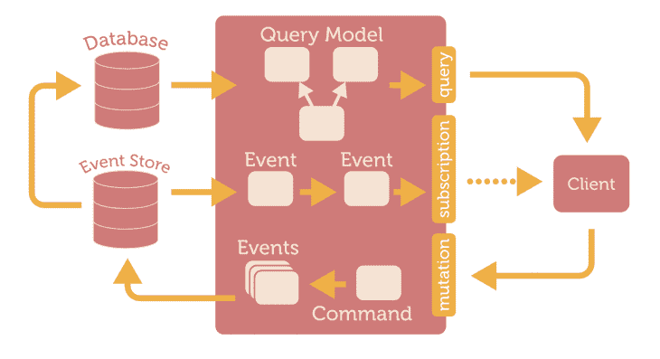
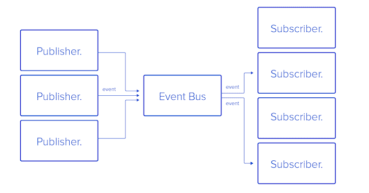
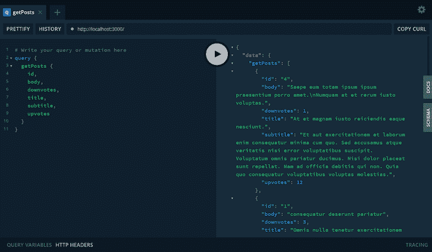
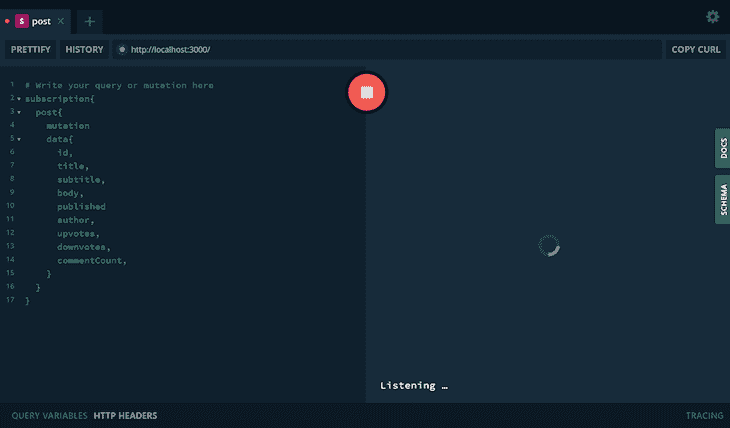
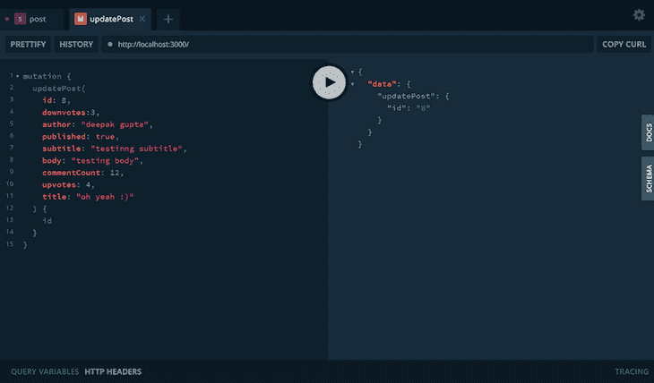
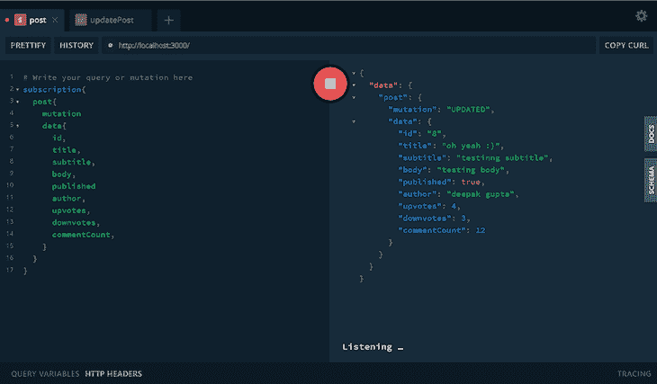

# Node.js 和 Express 的 GraphQL 订阅

> 原文：<https://blog.logrocket.com/graphql-subscriptions-nodejs-express/>

> 编者按:这篇文章最后一次更新是在 2021 年 11 月 29 日，以反映 GraphQL 的更新。

你有没有想过当朋友发布消息时，脸书会如何通知你？或者谷歌地图如何实时更新你的位置？这些和许多其他谜团的答案是 GraphQL 订阅。GraphQL 订阅使您能够订阅源流下的事件，并在所选事件执行时通过响应流实时接收通知。

在本文中，我们将提供对 Node.js 服务器中 JSON 数据事件的 GraphQL 订阅的基本理解。你可以在 [GitHub](https://github.com/finallyayo/graphql-subscription) 上获得本教程中使用的完整源代码。

在我们开始之前，您应该具备以下条件:

我们开始吧！

> 注意:您可以在这个 [GitHub 资源库](https://github.com/finallyayo/graphql-subscription)中访问该项目的完整源代码。

### 目录

## GraphQL 订阅是如何工作的？

执行 GraphQL 订阅后，将在服务器上创建一个持久函数，该函数将底层的源流映射到返回的响应流，如下图所示:



High level overview of GraphQL subscriptions

> (来源: [GitHub](https://github.com/sangria-graphql/sangria-subscriptions-example) )

GraphQL 订阅与查询的不同之处在于向客户端传递数据的方式。查询会立即返回一个响应，而 GraphQL 订阅会在每次发布关于您订阅的主题的数据时返回一个结果。

GraphQL 订阅方法是由一个[发布者/订阅者机制](https://www.apollographql.com/docs/graphql-subscriptions/setup/)促成的，该机制可以有效地、大规模地处理事件驱动的系统。在发布者/订阅者模型中，所有消息和数据根据队列原则(先进先出)流动，然后到达订阅者:



Diagram of the queue principle in the context of GraphQL subscriptions

> 注意:对于生产，建议使用 Redis 的[发布/订阅实现。](https://redis.io/topics/pubsub)

npm 上有许多可用的包，可以用来实现 GraphQL 订阅的发布/订阅模型。以下是一些最常用的软件包:

*   `[graphql-yoga](https://github.com/prisma-labs/graphql-yoga)`:功能全面的 GraphQL 服务器，专注于简单的设置、性能和出色的开发人员体验
*   [`graphql-subscriptions`](https://github.com/apollographql/graphql-subscriptions) :让您将 GraphQL 与发布/订阅系统(如 Redis)连接起来，以实现 GraphQL 订阅
*   [`apollo-server-express`](https://github.com/apollographql/apollo-server):graph QL 服务器的 Express 和 connect 集成。Apollo server 是一个由社区维护的开源 GraphQL 服务器，可以与许多 Node.js HTTP 服务器框架一起工作

我们将使用`graphql-yoga`模块，因为它是建立在其他两个包之上的，它提供了所有必要的依赖项和与 Node.js 的服务器绑定。

## 构建我们的 GraphQL 应用程序

我们将使用存储在 JSON 文件中的预定义 post 数据来执行以下操作:

*   `getPosts`:阅读所有帖子
*   `getPost`:通过 ID 阅读特定帖子
*   `updatePost`:更新帖子
*   `deletePost`:删除帖子
*   `createPost`:创建帖子

然后，我们将订阅添加到最后三个操作中。现在，是时候用一些代码来弄脏我们的手了！首先，创建一个文件夹，随意命名，并用一个`package.json`文件初始化，如下所示:

```
mkdir graphql-sub
cd graphql-sub
npm init -y

```

接下来，安装所需的依赖项:

```
npm i graphql-yoga

```

现在，我们将创建所有文件:

```
mkdir src
cd src
touch index.js postData.json typeDefs.js resolver.js

```

`index.js`负责使用 pub/sub 创建 GraphQL 服务器，稍后我们将看到。`postData.json`是 JSON 文件，我们将在其中执行 CRUD 操作。您可以添加来自 GitHub 的[示例代码，或者使用以下模式为帖子创建一个对象数组:](https://gist.github.com/dg92/78ce53985f4a647681da6fc7c7c9dab7)

*   `id:ID!`
*   `title:String!`
*   `subtitle:String!`
*   `body:String!`
*   `published:Boolean!`
*   `author: String!`
*   `upvotes: Int!`
*   `downvotes: Int!`
*   `commentCount: Int!`

我们使用`typeDefs.js`为上面的操作创建模式。最后，`resolvers.js`有逻辑来解析在`typeDefs.js`下定义的所有查询、变异和订阅。在`typeDefs.js`中，添加以下代码:

```
//type definitions and schemas - (operation and data structure)
const typeDefs = `
    type Query {
        getPosts(query: String):[Post!]!
        getPost(query: String):Post!
    }

    type Post{
        id:ID!
        title:String!
        subtitle:String!
        body:String!
        published:Boolean!
        author: String!
        upvotes: Int!
        downvotes: Int!
        commentCount: Int!
    }

    type Mutation{
        updatePost(
          id:ID!
          title:String!
          subtitle:String!
          body:String!
          published:Boolean!
          author: String!
          upvotes: Int!
          downvotes: Int!
          commentCount: Int!
        ): Post!
        deletePost(id: ID!): Post!
        createPost(
          id:ID!
          title:String!
          subtitle:String!
          body:String!
          published:Boolean!
          author: String!
          upvotes: Int!
          downvotes: Int!
          commentCount: Int!
        ): Post!
    }

    type Subscription {
        post: PostSubscriptionPayload!
    }

    type PostSubscriptionPayload {
        mutation: String!
        data: Post!
    }
`;

module.exports = typeDefs;

```

除了查询和突变的正常模式定义，我们还有一个名为`Subscription`的类型，它通过自定义类型`SubscriptionPayload`添加到`post`对象上。

因此，每次对一个`post`对象进行更改，都会触发一个事件，返回所执行的变异的名称，可以是`update`、`delete`或`create`一个 post。

现在，让我们为上面的`typeDefs`编写`resolvers.js`文件的框架:

```
const posts = require('./postData');
//Resolvers - This are the set of the function defined to get the desired output for the given API
const resolvers = {
  Query:{

  },

  Mutation:{

  },

  Subscription:{

  },
}
module.exports = resolvers;

```

我们导入了`postData`，然后添加了我们的`resolver`对象，它包含了我们的`Query`、`Mutation`和`Subscription`对象。我们将在下面的章节中充实每个对象。

## 编码我们的`Query`对象

在我们的`Query`对象中，我们将定义两个查询，`getPost`和`getPosts`:

```
Query: {
  getPosts() {
    return posts;
  },
  getPost(parent, args) {
    return posts.filter((post) => {
      const body = post.body.toLowerCase().includes(args.query.toLowerCase());
      const title = post.title
        .toLowerCase()
        .includes(args.query.toLowerCase());
      return body || title;
    });
  },
},

```

## 编码我们的`mutation`对象

我们将在我们的`mutation`对象中定义三个突变，`createPost`、`updatePost`和`deletePost`。

### `createPost`

`createPost`方法检查该 ID 的帖子是否已经存在。如果是这样，我们将向 GraphQL 服务器抛出一个错误。否则，我们将从`args`对象创建帖子，并将其添加到我们的 posts JSON 数据中:

```
createPost(parent, args, { pubsub }) {
  const id = parseInt(args.id, 10);
  const postIndex = posts.findIndex((post)=> post.id === id);

  if (postIndex === -1) {
    posts.push({
      ...args
    });

    pubsub.publish('post', {
      post:{
        mutation: 'CREATED',
        data: {...args}
      }
    }); 

   return {...args};
  };

  throw new Error('Post with same id already exist!');
}

```

一旦创建了帖子，我们将通过套接字将新创建的帖子数据发布到`post`通道的所有订阅者。

### `updatePost`

在`updatePost`方法中，具有指定 ID 的文章将被更新为`args`的内容。如果帖子 ID 不存在，我们将抛出一个错误:

```
updatePost(parent, args, { pubsub }) {
  const id = parseInt(args.id, 10);
  const postIndex = posts.findIndex((post) => post.id === id);

  if (postIndex !== -1) {
    const post = posts[postIndex];
    const updatedPost = {
      ...post,
      ...args,
    };

    posts.splice(postIndex, 1, updatedPost);

    pubsub.publish("post", {
      post: {
        mutation: "UPDATED",
        data: updatedPost,
      },
    });
    return updatedPost;
  }

  throw new Error("Post does not exist!");
},

```

如您所见，当操作成功时，发布了一个名为`UPDATED`的新事件。

### `deletePost`

如果 ID 存在，`deletePost`方法从数组中删除一个 post。之后，发布一个名为`DELETED`的新事件，其中包含已删除的帖子数据:

```
deletePost(parent, args, { pubsub }) {
  const id = parseInt(args.id, 10);
  const isPostExists = posts.findIndex((post)=> post.id === id);
  if (isPostExists === -1) {
    throw new Error('Post does not exist!');
  }

  // splice will return the index of the removed items from the array object
  const [post] = posts.splice(isPostExists, 1);
  pubsub.publish('post', {
    post:{
        mutation: 'DELETED',
        data: post
    }
  });

  return post;
},

```

## 编码我们的`subscription`对象

最后，我们将添加我们的`subscription`对象，该对象使用一个`pubsub.asyncIterator`函数来将来源流下的事件映射到一个返回的响应流。`asyncIterator`采用频道名称，通过该名称将绘制出整个应用程序中的事件:

```
post:{
  subscribe(parent, args, {pubsub}){
    return pubsub.asyncIterator('post');
  }
}

```

现在，唯一剩下的文件就是`index.js`。向其中添加以下代码:

```
const { GraphQLServer, PubSub } = require("graphql-yoga");
const typeDefs = require("./typeDefs");
const resolvers = require("./resolvers");
const pubsub = new PubSub();

const server = new GraphQLServer({
  typeDefs,
  resolvers,
  context: {
    pubsub,
  },
});

const options = {
  port: 3000,
};

server.start(options, ({ port }) => {
  console.log(
    `Graphql Server started, listening on port ${port} for incoming requests.`
  );
});

```

我们创建了一个 GraphQL 服务器，传递了我们所有的文件，然后启动了服务器。最后，我们将添加一个脚本来运行我们在`package.json`中的项目:

```
"scripts": {
  "start": "node src/index.js"
},

```

打开终端，运行`npm start`。如果一切正常，您将看到以下消息:

```
Graphql Server started, listening on port 3000 for incoming requests.

```

现在，在浏览器中输入`[http://localhost:3000](http://localhost:3000)`，您将看到一个 GraphQL Playground 实例。为了确认一切正常，运行一个`getPosts`查询，如下所示:

```
query {
  getPosts {
    id,
    body,
    downvotes,
    title,
    subtitle,
    upvotes
  }
}

```



Running a getPosts query in GraphQL

要开始订阅帖子更改，我们将在 GraphQL Playground 中打开一个新选项卡，并运行以下代码:

```
subscription{
  post{
    mutation
    data{
      id,
      title,
      subtitle,
      body,
      published
      author,
      upvotes,
      downvotes,
      commentCount,
    }
  }
}

```

上面的代码使我们能够向我们的频道帖子添加订阅，并开始收听频道中发布的任何事件:



Add GraphQL subscriptions to channel post

要查看我们的 GraphQL 订阅的运行情况，只需在一个新的选项卡中执行任何变化。例如:

```
mutation {
  updatePost(
    id: 8,
    downvotes:3,
    author: "deepak gupta",
    published: true,
    subtitle: "testinng subtitle",
    body: "testing body",
    commentCount: 12,
    upvotes: 4,
    title: "oh yeah :)"
  ) {
    id
  } 
}

```



导航到运行订阅查询的选项卡。注意 post 响应流是如何为`update`事件返回数据的:



Response stream data in a GraphQL subscription

## 概述 GraphQL 订阅流程

为了结束我们的教程，让我们快速回顾一下订购流程。订阅在`typeDefs.js`中定义如下:

```
type Subscription {
  post: PostSubscriptionPayload!
}

type PostSubscriptionPayload {
  mutation: String!
  data: Post!
}

```

使用`graphql-yoga`提供的发布/订阅方法进行订阅和发布。发布/订阅方法也可以促进类似于`EventEmitter`的机制:

```
const { GraphQLServer, PubSub } = require('graphql-yoga');
const typeDefs = require('./typeDefs');
const resolvers = require('./resolvers');
const pubsub = new PubSub();

const server = new GraphQLServer({
  typeDefs,
  resolvers,
  context: {
    pubsub,
  },
});

```

使用`pubsub.asyncIterator`实现订阅类型解析器来映射事件。一旦我们从 GraphQL Playground 请求订阅，`pubsub.asyncIterator`会将我们的套接字添加到它的监听套接字列表中，并在我们调用`pubsub.publish`时发回事件:

```
Subscription: {
  post: {
    subscribe(parent, args, { pubsub }) {
      return pubsub.asyncIterator('post');
    },
  },
}

```

最后，从变异通道调用`pubsub.publish()`方法:

```
pubsub.publish('post', {
  post: {
    mutation: 'UPDATED',
    data: updatedPost,
  },
});

```

## 结论

现在，您已经创建了一个 GraphQL 订阅，这是一种同步客户机和服务器的实时方法。通过像我们在本教程中所做的那样实现 GraphQL 订阅，您可以在执行所选事件时实现实时通知。我希望你喜欢这个教程。

## 200 年代只有监视器在生产中出现故障和网络请求变慢

部署基于节点的 web 应用程序或网站是容易的部分。确保您的节点实例继续为您的应用程序提供资源是事情变得更加困难的地方。如果您对确保对后端或第三方服务的请求成功感兴趣，

[try LogRocket](https://lp.logrocket.com/blg/node-signup)

.

[](https://lp.logrocket.com/blg/node-signup)[https://logrocket.com/signup/](https://lp.logrocket.com/blg/node-signup)

LogRocket 就像是网络和移动应用程序的 DVR，记录下用户与你的应用程序交互时发生的一切。您可以汇总并报告有问题的网络请求，以快速了解根本原因，而不是猜测问题发生的原因。

## 监控生产中失败和缓慢的 GraphQL 请求

虽然 GraphQL 有一些调试请求和响应的特性，但确保 GraphQL 可靠地为您的生产应用程序提供资源是一件比较困难的事情。如果您对确保对后端或第三方服务的网络请求成功感兴趣，

[try LogRocket](https://lp.logrocket.com/blg/graphql-signup)

.

[](https://lp.logrocket.com/blg/graphql-signup)[https://logrocket.com/signup/](https://lp.logrocket.com/blg/graphql-signup)

LogRocket 就像是网络和移动应用的 DVR，记录下你网站上发生的每一件事。您可以汇总并报告有问题的 GraphQL 请求，以快速了解根本原因，而不是猜测问题发生的原因。此外，您可以跟踪 Apollo 客户机状态并检查 GraphQL 查询的键值对。

LogRocket 检测您的应用程序以记录基线性能计时，如页面加载时间、到达第一个字节的时间、慢速网络请求，还记录 Redux、NgRx 和 Vuex 操作/状态。

[Start monitoring for free](https://lp.logrocket.com/blg/graphql-signup)

.

LogRocket 检测您的应用程序以记录基线性能计时，如页面加载时间、到达第一个字节的时间、慢速网络请求，还记录 Redux、NgRx 和 Vuex 操作/状态。

[Start monitoring for free](https://lp.logrocket.com/blg/node-signup)

.