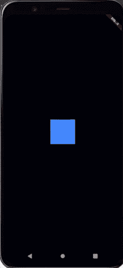
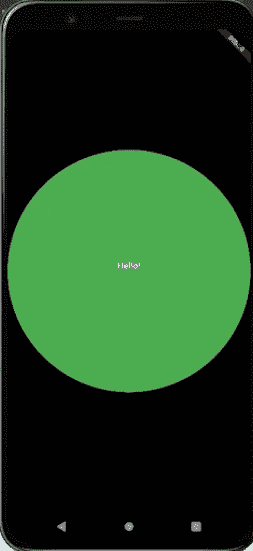
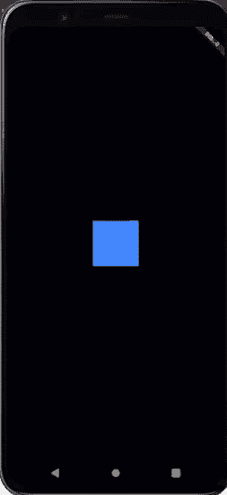
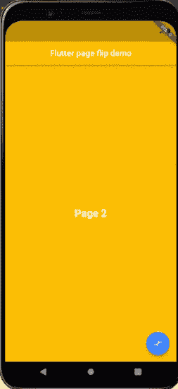
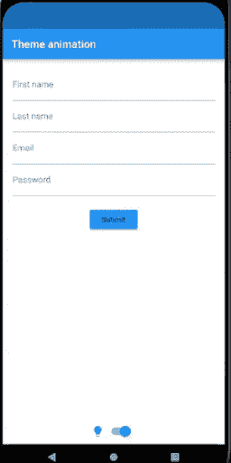

# 高级颤振动画指南

> 原文：<https://blog.logrocket.com/guide-advanced-flutter-animations/>

你的应用程序的用户体验是一个至关重要的特性，它将你的应用程序与其他提供相同服务的应用程序区分开来，并可能有助于说服用户更喜欢你的应用程序。

改善用户体验的方法之一是定制高级动画，本文将指导您创建这些动画。在这里，您将了解一些在 Flutter 中可用的高级动画，以及如何在您的应用程序中实现它们，例如:

*   用`Tween`类构建简单的动画
*   构建复杂、交错的动画
*   为动画订单管理配置一个控制器
*   在 Flutter 中构建布线动画
*   构建摇动或弹跳动画
*   使用颤动挂钩构建动画
*   构建主题动画过渡

### 先决条件

本文假设你熟悉如何[将基本动画添加到你的 Flutter 应用](https://blog.logrocket.com/adding-animations-to-your-flutter-app/)中。您还需要:

*   [飞镖](https://blog.logrocket.com/introduction-to-using-dart-in-flutter/)的基础知识
*   熟练使用 [Flutter](https://docs.flutter.dev/) 构建移动应用
*   您选择的任何合适的 IDE

## 用`Tween`类构建简单的动画

[`[Tween]`](https://api.flutter.dev/flutter/animation/Tween-class.html) 是一个通用的 Flutter 类，它可以通过指定一个 Flutter 小部件的开始和结束值来制作动画。它是您可以在应用程序中构建的许多动画的核心基础组件之一。

`Tween`来自单词“between ”,表示小部件在特定值范围内转换时的状态。使用`Tween`，您可以通过指定属性的初始值和最终值来动画显示小部件的不同属性，如大小或颜色。

例如，假设您想要按比例将容器的高度和宽度从`50px`增加到`200px`，并且您不希望大小的变化对布局产生突然的影响。相反，您希望用户看到容器在指定值范围内的增长。

以下是你如何达到这一期望的结果:

```
 AnimationController _controller;
  Animation<double> _sizeAnimation;

  @override
  void initState() {
    super.initState();
    _controller = AnimationController(vsync: this, duration: Duration(seconds: 3));
    _sizeAnimation = Tween<double>(begin: 50.0, end: 200.0).animate(_controller);
    _controller.forward();
    _controller.addListener(() {
      setState(() {});
    });
  }

```

在`initState`方法中，动画被配置为通过`AnimationController`运行三秒钟。实例化的`Tween`返回一个对象，用`_controller`调用`animate`方法。



在运行时，`Tween`提供`50px`和`200px`之间的值，控制器通过监听值变化的监听器调用`setState`。

## 构建复杂、交错的动画

在某些情况下，您可能希望将一个小部件制作成动画，以便同时发生许多事情，例如增加容器的大小、改变其颜色以及将一些文本滑入容器中，或者每个单词连续出现，或者所有的事情同时出现。

要实现这一点，您最有可能的方法是为每个所需的动画创建一个控制器，这样每个配置的动画都有自己的相应控制器，您可以按顺序触发这些控制器。

虽然这种解决方案可行，但有一个问题:它不容易重新配置。假设您想要更改其中一个动画或其相应控制器的配置。这将要求您考虑依赖于要重新配置的动画或控制器的其他动画。管理所有这些单独的动画控制器，以及它们如何相互作用，可能会比实现您想要的整体动画更痛苦。

交错动画通过将所有动画连接到一个协调动画功能的控制器来解决这个问题。当然，简单地将动画连接到控制器并不是全部，因为动画可能会同时开始，而不是按照期望的顺序。让我们来看看下面的示例动画:



整个动画的顺序如下:

1.  绿色圆圈的大小会增加
2.  圆圈的颜色从绿色变为琥珀色
3.  一个“你好”文本从圆圈的顶部下降到中心，然后淡出
4.  一条信息从右边滑入圆圈

下面是上述实现的代码片段:

```
class _MyHomePageState extends State<MyHomePage>
    with SingleTickerProviderStateMixin {
  AnimationController _controller;

  Animation<double> sizeAnimation;
  Animation<Color> colorAnimation;
  Animation<double> helloAnimation;
  Animation<Offset> messageAnimation;

```

## 配置一个控制器来管理动画顺序

现在，神奇的事情发生了。正如我前面提到的，我们有一个控制器管理多个动画。

配置动画流动的顺序:控制器被初始化运行`5`秒，正如在实例化`_controller`时在`Duration`对象中指定的。

```
 @override
  void initState() {
    super.initState();
    _controller =
        AnimationController(vsync: this, duration: Duration(seconds: 5));

    sizeAnimation = Tween(begin: 50.0, end: 200.0).animate(CurvedAnimation(parent: _controller, curve: Interval(0.0, 0.5, curve: Curves.decelerate)));
    colorAnimation = ColorTween(begin: Colors.green, end: Colors.amber).animate(CurvedAnimation(parent: _controller, curve: Interval(0.5, 1.0)));
    helloAnimation = Tween<double>(begin: 20.0, end: 0.0,).animate(CurvedAnimation(parent: _controller, curve: Interval(0.5, 0.7, curve: Curves.easeIn,),),);
    messageAnimation = Tween<Offset>(begin: Offset(16.0, 0.0), end: Offset.zero,).animate(CurvedAnimation(parent: _controller, curve: Interval(0.7, 1.0, curve: Curves.ease,),),);
    _controller.forward();
    _controller.addListener(() {
      setState(() {});
    });
  }

```

`sizeAnimation`控制器负责将圆的大小从`50.0px`增加到`200.0px`。它还有一个`CurvedAnimation`配置，确保大小增加发生在动画持续时间的前半部分，正如在`Interval`小部件中指定的。

`0.0`表示持续时间的开始，`0.5`表示持续时间的一半(最大值为`1.0`)。

`colorAnimation`负责将圆圈的颜色从绿色变为琥珀色，并运行剩余的一半时间。

`helloAnimation`改变“你好！”文本，并从 50%的持续时间标记运行到 70%。

负责滑动文本的`messageAnimation`然后运行剩余 30%的持续时间。

请注意，相同的控制器被分配给起始点的每个动画。

```
 @override
  Widget build(BuildContext context) {
    return Scaffold(
      backgroundColor: Colors.white,
      appBar:AppBar(
        brightness: Brightness.light,
        backgroundColor: Colors.white,
        elevation: 3.0,
      ),
      body: Center(
        child: CircleAvatar(

          radius: sizeAnimation.value,
          backgroundColor: colorAnimation.value,
          child: Column(
            mainAxisAlignment: MainAxisAlignment.center,
            children: <Widget>[
              FadeTransition(
                opacity: helloAnimation,
                child: Text(
                  "Hello!",
                  style: TextStyle(
                      fontSize: 15,
                      fontWeight: FontWeight.bold
                  ),
                ),

              ),

              SlideTransition(
                position: messageAnimation,
                child: Text("This is a Staggered Animation demo.",
                  style: TextStyle(
                      fontSize: 15,
                      fontWeight: FontWeight.bold
                  ),
                ),
              ),

            ],
          ),
        ),
      ),
    );
  }

```

在上面的构建方法中,“Hello”文本小部件包装在执行文本淡出动画的`FadeTransition`小部件周围，而`SlideTransition`小部件包装在滑入圆圈的文本周围。

## 在 Flutter 中构建布线动画



上面的演示是一个翻页动画的例子，你可以实现它在屏幕间传送。 [`[page_flip_builder package]`](https://pub.dev/packages/page_flip_builder/install) 是一个交互式小工具翻转器，可以翻转屏幕、卡片、容器、图像和任何其他固定大小的小工具。您还可以将屏幕从左向右拖移(反之亦然)，以获得更具互动性的过渡。



在您的终端中运行以下命令来安装软件包。

```
flutter pub add page_flip_builder
flutter pub get

```

```
class _MyHomePageState extends State<MyHomePage> with SingleTickerProviderStateMixin {
  final pageFlipKey = GlobalKey<PageFlipBuilderState>();

  @override
  Widget build(BuildContext context) {

    return PageFlipBuilder(
          key: pageFlipKey,

          frontBuilder: (_) => PageOne(
            onFlip: () => pageFlipKey.currentState.flip(),
          ),
          backBuilder: (_) => PageTwo(
            onFlip: () => pageFlipKey.currentState.flip(),
          ),
          maxTilt: 0.005,
          maxScale: 0.6,
    );
  }
}

```

`PageFlipBuilder` API 接受两个小部件，它们分别通过`frontBuilder`和`backBuilder`作为前视图和后视图。您可以配置`maxTilt`和`maxScale`属性值来满足您的偏好。

`onFlip`属性是每个屏幕的可选参数，它可以接收以编程方式触发转换的函数。

```
class PageOne extends StatelessWidget {
  const PageOne({Key key, this.onFlip}) : super(key: key);
  final VoidCallback onFlip;

  @override
  Widget build(BuildContext context) {
    return Scaffold(
      backgroundColor: Colors.blueAccent,
      appBar: AppBar(
        centerTitle: true,
        backgroundColor: Colors.blueAccent,
        title: Text('Flutter page flip demo'),
      ),
        body: Center(
            child: Text("Page 1",
            style: TextStyle(
              fontSize: 25,
              fontWeight: FontWeight.bold,
              color: Colors.white
            ),)
        ),
      floatingActionButton: FloatingActionButton(
        backgroundColor: Colors.amber,
        child: Icon(Icons.compare_arrows_rounded),
        onPressed: onFlip,
      ),

    );
  }
}

class PageTwo extends StatelessWidget {
  const PageTwo({Key key, this.onFlip}) : super(key: key);
  final VoidCallback onFlip;
  @override
  Widget build(BuildContext context) {
    return Scaffold(
      backgroundColor: Colors.amber,
      appBar: AppBar(
        centerTitle: true,
        backgroundColor: Colors.amber,
        title: Text('Flutter page flip demo'),
      ),
        body: Center(
          child: Text("Page 2",
            style: TextStyle(
                fontSize: 25,
                fontWeight: FontWeight.bold,
                color: Colors.white
            ),
          )
        ),
      floatingActionButton: FloatingActionButton(
        backgroundColor: Colors.blueAccent,
        child: Icon(Icons.compare_arrows_rounded),
        onPressed: onFlip,
      ),

    );
  }
}

```

每个屏幕接收一个传递给`floatingActionButton`的`onPressed`属性的函数。此功能触发翻页过渡和左右或左右拖动功能。

## 构建摇动或弹跳动画

摇动动画是您可能熟悉的另一种常见动画。如下演示所示，您可以垂直或水平摇动所需的小部件。


```
@override 
  Widget build(BuildContext context) { 

 return Scaffold( 
        appBar: AppBar( 
          title: Text("Shake animation demo"), 
       ), 
       body: Center( 
         child: Column( 
           mainAxisAlignment: MainAxisAlignment.center, 
           children: [ 

             TweenAnimationBuilder( 
               child: CircleAvatar( 
                 radius: 60, 
                 backgroundColor: Colors.purpleAccent, 
                ), 
                duration: Duration(milliseconds: 3000), 
                curve: Curves.bounceOut, 
                tween: Tween(begin: 1.0, end: 0.0), 
                builder: (context, value, child){
                // horizontal disposition of the widget. 
 return Transform.translate( 
                     offset:  Offset( 
                       value * 500, 
                        0.0 
                     ), 
                     child: child, 
                   ); 
                 }, 
               ), 
               SizedBox(height: 20,),
```

上面的代码片段展示了演示中的动画圆形小部件。带有相应偏移值的`[[Transform.translate constructor]](https://api.flutter.dev/flutter/widgets/Transform-class.html)`负责微件从左到右的位置变化，反之亦然。抖动/反弹效果是通过`Curves.bounceOut`类、我们设置的持续时间和我们的偏移值来实现的。

下面是演示中其他两个小部件的代码片段。注意分配给具有水平和垂直摇动动画的小部件的偏移属性的值。`dx`值为`0`且`dy`值≥ `0`的偏移有垂直抖动；如果您翻转它们，这些值会产生水平摇动动画。

```
TweenAnimationBuilder(
                child: Container(
                  width: 60,
                  height: 100,
                  color: Colors.blueAccent,
                ),
                duration: Duration(milliseconds: 1000),
                curve: Curves.bounceOut,
                tween: Tween(begin: 1.0, end: 0.0),
                builder: (context, value, child){
                  return Transform.translate(
                    offset:  Offset(
                        0.0,
                      value * 100
                    ),
                    child: child,
                  );
                },
              ),
              SizedBox(height: 20,),

              TweenAnimationBuilder(
                child: Text("Hello!",
                  style: TextStyle(
                      fontSize: 30,
                      fontWeight: FontWeight.bold
                  ),
                ),
                duration: Duration(milliseconds: 500),
                curve: Curves.bounceOut,
                tween: Tween(begin: 1.0, end: 0.0),
                builder: (context, value, child){
                  return Transform.translate(
                    offset:  Offset(
                      value * 60,
                        0.0
                    ),
                    child: child,
                  );
                },
              ),

              SizedBox(height: 20,),

              TweenAnimationBuilder(
                child: RaisedButton(
                  color: Colors.red,
                  onPressed: () => null,
                ),
                duration: Duration(milliseconds: 1200),
                curve: Curves.bounceOut,
                tween: Tween(begin: 1.0, end: 0.0),
                builder: (context, value, child){
                  return Transform.translate(
                    offset:  Offset(
                        0.0,
                        value * 300
                    ),
                    child: child,
                  );
                },
              ),
          ]
    ),
      ),
    );
  }

```

你可以调整`offset`、`duration`和`tween`的值来获得你想要的摇动动画。

## 使用颤动挂钩构建动画

众所周知，Flutter Hooks 可以减少应用程序中的样板代码，有助于提高代码的可重用性。这个优势也适用于在你的 Flutter 应用中构建动画。

在前面的章节中，我们按照以下步骤创建动画:

*   通过 [`[SingleTickerProviderStateMixin mixin]`](https://api.flutter.dev/flutter/widgets/SingleTickerProviderStateMixin-mixin.html) 设置一个跑马灯
*   在`initState`和`dispose`方法中管理控制器和动画
*   向控制器添加一个监听器，该监听器在执行动画时调用`setState`方法

当你用抖动`HookWidget`实现你的动画时，这些步骤就变得不必要了。相反，`HookWidget`抽象了这些功能，减少了您必须执行的配置数量。

```
class ColorContainer extends AnimatedWidget {
  ColorContainer({AnimationController controller})
      : super(
      listenable: ColorTween(begin: Colors.red, end: Colors.blue).animate(controller));

  @override
  Widget build(BuildContext context) {
    Animation animation = listenable;
    return Scaffold(
      appBar: AppBar(
        title: Text("Hook Animation demo"),
      ),
      body: Center(
        child: Container(
          height: 200,
          width: 200,
          color: animation.value,
        ),
      ),
    );
  }
}

```

上面的代码片段是一个小部件，它将一个容器的颜色从红色变为蓝色。`Tween`对象被传递给`[[AnimatedWidget]](https://api.flutter.dev/flutter/widgets/AnimatedWidget-class.html)`超类，旁边是一个控制器，我们将在实例化小部件时提供这个控制器。

```
class HookAnimation extends HookWidget {
  final duration = Duration(seconds: 5);

  @override
  Widget build(BuildContext context) {
    final controller = useAnimationController(duration: duration);
    controller.forward();
    return ColourContainer(controller: controller);
  }
}

```

`HookWidget`提供了`useAnimationController`来管理动画的生命周期。这个控制器的行为类似于添加一个监听器，调用`setState`方法并释放控制器，就像使用`StatefulWidget`方法一样。

```
class HookAnimation extends HookWidget {
  final duration = Duration(seconds: 5);

  @override
  Widget build(BuildContext context) {
    final controller = useAnimationController(duration: duration);
    controller.forward();
    return ColourContainer(controller: controller);
  }
}

```

以下是这些片段的输出:


## 构建主题动画过渡

用户倾向于对应用程序的主题有不同的偏好，比如亮模式和暗模式。为了满足这些偏好，为用户提供在不同主题之间切换的能力是当今许多应用程序的一个常见特性。



您可以通过以下两种方式中的任何一种来实现这一点:

*   通过手动配置每个主题选项的值(这可能会花费更多的代码行)
*   通过集成一些提供这些功能的包(如[动画主题切换器](https://pub.dev/packages/animated_theme_switcher)或[简易动态主题](https://pub.dev/packages/easy_dynamic_theme)

本节将演示如何使用 Flutter 的`ThemeData`类在应用程序的可用主题之间构建过渡。下面的代码片段定义了两个主题，这两个主题配置了不同的值，每次切换开关时，它们都会呈现在指定的小部件上。

```
ThemeData _darkTheme = ThemeData(
    brightness: Brightness.dark,
    primaryColor: Colors.amber,
    iconTheme: IconThemeData(
      color: Colors.amberAccent
    ),
    appBarTheme: AppBarTheme(
      backgroundColor: Colors.blue[800],
      titleTextStyle: TextStyle(
          color: Colors.amber,
        fontWeight: FontWeight.bold,
        fontSize: 20
      )
    ),
    accentColor: Colors.brown,
    buttonTheme: ButtonThemeData(
      buttonColor: Colors.amberAccent,
      textTheme: ButtonTextTheme.accent
    )
  );

  ThemeData _lightTheme = ThemeData(
      brightness: Brightness.light,
      iconTheme: IconThemeData(
          color: Colors.blueAccent
      ),
      primaryColor: Colors.blue,
      accentColor: Colors.white,
      buttonTheme: ButtonThemeData(
          buttonColor: Colors.blueAccent,
          textTheme: ButtonTextTheme.normal
      )
  );

bool lightMode = true;

```

使用 build 方法中的`Switch`小部件，您可以通过`MaterialApp`小部件的`theme`属性在主题之间切换。

```
@override
  Widget build(BuildContext context) {
    return MaterialApp(
        theme: lightMode ? _lightTheme : _darkTheme,
        title: 'Material App',
        debugShowCheckedModeBanner: false,
        home: Scaffold(
          appBar: AppBar(
            title: Text('Theme animation'),
          ),
          body: Center(
            child:  Column(
              mainAxisAlignment: MainAxisAlignment.spaceBetween,
              children: [
              Form(
              child: Padding(
                padding: const EdgeInsets.all(18.0),
                child: Column(
                  children: <Widget>[
                    TextFormField(
                      decoration: InputDecoration(
                          labelText: 'First name'
                      ),
                      textInputAction: TextInputAction.next,
                    ),
                    TextFormField(
                      decoration: InputDecoration(
                          labelText: 'Last name'
                      ),
                      textInputAction: TextInputAction.next,

                    ),
                    TextFormField(
                      decoration: InputDecoration(
                          labelText: 'Email'
                      ),
                    ),
                    TextFormField(
                      decoration: InputDecoration(
                          labelText: 'Passworda'
                      ),
                    ),
                    SizedBox(height: 20,),
                    RaisedButton(
                      onPressed: (){},
                      child: Text(
                          "Submit",

                      ),
                    )
               ] ),
              ),
          ),

                Row(
                  mainAxisAlignment: MainAxisAlignment.center,
                  children: [
                    Icon(
                        Icons.lightbulb,
                    ),
                    Switch(
                      activeColor: Theme.of(context).accentColor,
                        value: lightMode,
                        onChanged: (toggleTheme){
                          setState(() {
                            lightMode = toggleTheme;
                          });
                        }),
                  ],
                ),
              ],
            ),
        ),
        )
    );

  }

```

## 结论

动画是你可以添加到应用程序中来激发和吸引用户的最显著的特性之一。尽管它们很受欢迎，但需要注意的是实现过多的动画是不可取的，不仅因为一些用户可能会发现它们会分散注意力，还因为它们会影响应用程序的性能。

您可以调整用于配置本文中讨论的动画的值，以创建不同的动画和过渡，来满足您的偏好和您想要的用户体验。如果你想学习更多关于颤动动画的知识，[文档](https://docs.flutter.dev/development/ui/animations/tutorial)总是一个开始的好地方。

## 使用 [LogRocket](https://lp.logrocket.com/blg/signup) 消除传统错误报告的干扰

[](https://lp.logrocket.com/blg/signup)

[LogRocket](https://lp.logrocket.com/blg/signup) 是一个数字体验分析解决方案，它可以保护您免受数百个假阳性错误警报的影响，只针对几个真正重要的项目。LogRocket 会告诉您应用程序中实际影响用户的最具影响力的 bug 和 UX 问题。

然后，使用具有深层技术遥测的会话重放来确切地查看用户看到了什么以及是什么导致了问题，就像你在他们身后看一样。

LogRocket 自动聚合客户端错误、JS 异常、前端性能指标和用户交互。然后 LogRocket 使用机器学习来告诉你哪些问题正在影响大多数用户，并提供你需要修复它的上下文。

关注重要的 bug—[今天就试试 LogRocket】。](https://lp.logrocket.com/blg/signup-issue-free)