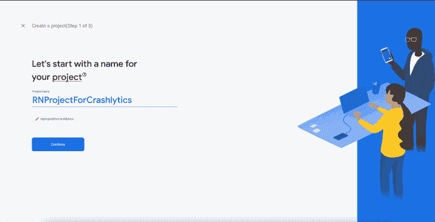
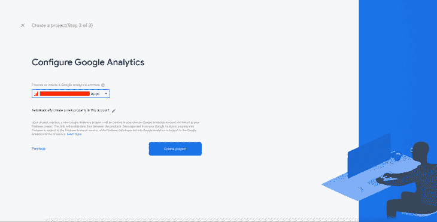
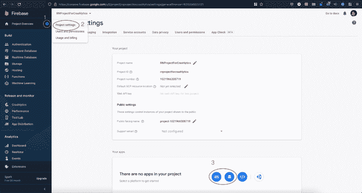
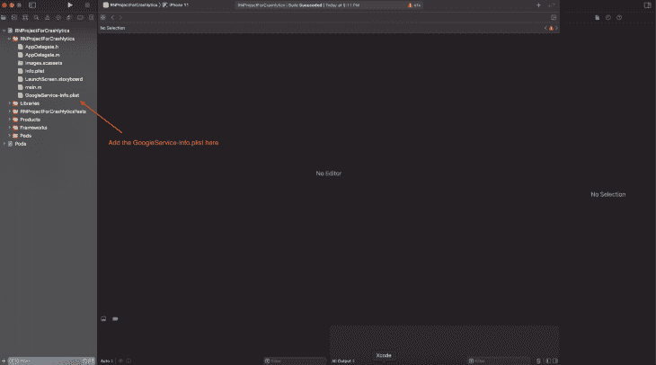

# Firebase Crashlytics:识别 React 本地应用程序中的错误

> 原文：<https://blog.logrocket.com/guide-crashlytics-react-native/>

在应用程序开发人员的生活中，最真实的陈述之一是这样一个事实，即总会有一些 bug 会潜入您的代码中，即使您已经完成了代码审查，并对您的应用程序进行了严格的测试。

一旦你的应用程序在商店发布，就会出现错误和崩溃，这可能很难调试，因为你的用户可能不会慷慨地给你修复它所需的信息。事实上，用户只在商店里留下差评和/或删除你的应用是很常见的。

因此，开发人员了解这些情况是很重要的，这可能会妨碍客户获得我们希望的高质量体验。

现在，考虑到您需要为潜在的错误和崩溃做好准备并尽快做出反应，您将需要合适的工具来完成这项工作。为此，你有一个叫做 [Crashlytics](https://firebase.google.com/docs/crashlytics) 的简洁解决方案。

## 什么是 Firebase Crashlytics？

Firebase Crashlytics 是一个崩溃报告解决方案，可以帮助您收集所有需要的信息，以确定为什么特定用户可能会面临应用程序的错误或崩溃。

这篇博文将指导你如何在 React 本地移动应用中使用 Crashlytics。

鉴于 Crashlytics 属于 Firebase 工具套件，您需要首先在 Firebase 控制台上设置一个 Firebase 项目，然后将 Firebase SDK 集成到 React 本地项目中。

## 设置 Firebase 项目

前往 [Firebase 控制台](https://console.firebase.google.com/u/0/)，登录，并遵循以下步骤:

首先，添加您的项目名称。



接下来，单击**继续步骤 2 中的**。如果你愿意，你可以在这里选择禁用谷歌分析。我一直让它开着。


现在，选择您想要用来创建项目的帐户。



项目创建完成后，进入**项目设置**，点击 **iOS** 或 **Android** 按钮，在 Firebase 控制台中创建你的应用(如下图第三步所示)。



在控制台上创建每个应用程序后，系统会提示您为您的 iOS 项目下载一个`GoogleService-Info.plist`文件，为您的 Android 项目下载一个`google-services.json`文件。

一会儿你会需要这些文件，但是现在，请转到安装程序。

## 安装 Crashlytics 和 react-native-firebase

我们将使用 [react-native-firebase](https://www.npmjs.com/package/react-native-firebase) 包将 firebase 和 Crashlytics 集成到我们的 react 原生应用程序中。

运行以下 npm 命令来添加它们。

```
npm add @react-native-firebase/app

npm add @react-native-firebase/crashlytics

cd ios/ && pod install
```

### iOS 设置

以下是在 iOS 项目中完成 Firebase 集成的步骤。

首先，打开工作区文件，将您先前下载的`GoogleService-Info.plist`拖到您的项目文件夹中。确保勾选了**根据需要复制项目**复选框。



复制文件后，打开`AppDelegate.m`文件并进行以下更改:

```
Added ```import <Firebase.h>``` at the top of the file

```

#import <React/RCTBridge.h>

#import <React/RCTBundleURLProvider.h>

#import <React/RCTRootView.h>

#import <Firebase.h> // add this here
```

现在，向下滚动到`applicationDidFinishLaunching`方法的底部，在从函数返回之前添加`[FIRApp configure]`。它应该是这样的:

```
- (BOOL)application:(UIApplication *)application didFinishLaunchingWithOptions:(NSDictionary *)launchOptions
{
// ...

  self.window = [[UIWindow alloc] initWithFrame:[UIScreen mainScreen].bounds];
  UIViewController *rootViewController = [UIViewController new];
  rootViewController.view = rootView;
  self.window.rootViewController = rootViewController;
  [self.window makeKeyAndVisible];

// Add the following line
  [FIRApp configure];  

  return YES;
}

```


### Android 设置

与 iOS 设置相比，Android 集成要求更高一些。以下是在 Android 项目中完成 Firebase 和 Crashlytics 集成所需遵循的步骤:

将之前下载的`google-services.json`文件拖到以下路径:`/android/app/`。


打开您的`android/build.gradle`文件并添加以下依赖项:

```
classpath 'com.google.gms:google-services:4.3.10'

classpath 'com.google.firebase:firebase-crashlytics-gradle:2.7.1'
```


接下来，打开你的`android/app/build.gradle`，在 gradle 文件的顶部添加以下插件。

```
apply plugin: “com.google.gms.google-services”

apply plugin: “com.google.firebase.crashlytics”
```


就这样，您也完成了 android 设置！

## 验证碰撞分析

为了验证您的 Crashlytics 安装是否有效，您必须进行两项更改:

1.  在调试中启用崩溃分析
2.  强制测试崩溃

### 在调试会话中启用崩溃解析

React Native Crashlytics 不会在您调试应用程序时收集崩溃信息，因为您已经拥有了在调试会话期间评估崩溃所需的所有信息。即使在调试会话期间，要记录崩溃信息，也需要启用它。

将名为`firebase.json`的文件添加到项目的基本文件夹中，并将以下内容粘贴到其中:

```
{
  "react-native": {
    "crashlytics_debug_enabled": true
  }
}

```

### 强制测试碰撞

转到您的`App.tsx`文件，用下面的屏幕替换整个代码

```
import React from 'react';
import {SafeAreaView, StyleSheet, Text, TouchableOpacity} from 'react-native';
import crashlytics from '@react-native-firebase/crashlytics';

export const App = () => {
 return (

      {
         crashlytics().crash();
       }}>
       Force Crash

 );
};

const styles = StyleSheet.create({
 container: {flex: 1, justifyContent: 'center', alignItems: 'center'},
});

```

上面的代码在你的屏幕中间添加了一个强制崩溃的按钮。

实际执行崩溃的代码是这样的:

```
crashlytics().crash();

```

现在，在你点击这个按钮之前，打开你的项目的 [Firebase 控制台](https://console.firebase.google.com)页面，转到 Crashlytics 选项卡。


一旦你进入这个屏幕，在没有调试器连接的情况下打开你的应用程序。现在，点击按钮。这样做会导致应用程序崩溃。

现在，再次打开应用程序，等待 Crashlytics 与控制台同步。Firebase Crashlytics 控制台现在看起来应该是这样的:


对你的 iOS 和 Android 项目都这样做。

至此，您已经成功地将 Firebase Crashlytics 集成到 React 本地项目中了！

## 在 React Native 中使用碰撞分析

现在您的设置已经完成，让我们看看 Crashlytics 提供的不同 API 来帮助调试这些错误和崩溃。

### 致命的车祸

这些是你的应用突然关闭的情况，可能是由你的代码中的错误或者由于系统决定关闭你的应用的内存限制引起的。

Crashlytics SDK 会自动跟踪致命崩溃，并在下次运行应用程序时进行同步。然后，您可以在 Firebase Crashlytics 控制台上查看该崩溃的详细信息。

Firebase 控制台将为您提供崩溃的堆栈跟踪以及发生崩溃的设备的详细信息。你可以点击它来查看更详细的崩溃信息。

### 非致命事故

非致命崩溃是可能在代码中得到妥善处理的错误流，但是您仍然想知道它们的发生情况。这些不会突然关闭你的应用。相反，它们禁止用户使用你的应用程序的某些功能(这就是为什么我们称它们为非致命的)。

一些例子是服务器调用失败和数据库失败。这些情况可能不会在您的一般开发周期中发生，但在生产中的某些特定条件下，它们可能会在某些设备上发生。

您也应该记录这些崩溃。React Native Crashlytics 为您提供了`recordError` API 来帮助记录这些错误。

```
crashlytics().recordError(error);

```

这里有一个小例子:

```
const getUserDetailsFromBackend = () => {
   BackendAPIService.fetchUserDetails()
     .then(response => {
       setUserDetails(response);
     })
     .catch(error => {
       // This is the function you can use to record this error.
       crashlytics().recordError(error);
       setUserDetailFetchError(error)
     });
 };

```

这个 API 记录堆栈跟踪和它在致命崩溃期间捕获的信息。您也可以在 Firebase 控制台中查看这些内容。默认情况下，控制台显示致命和非致命崩溃，但是您可以对其进行过滤，仅显示非致命崩溃。

### 记录 Crashlytics 中的错误

虽然 Crashlytics 可以帮助您记录致命和非致命崩溃的堆栈跟踪，但有时读取堆栈跟踪可能无法帮助您发现问题是如何出现的，或者是什么导致了崩溃。

因此，在整个应用程序会话过程中记录消息总是很有帮助的，这可能有助于您重现 Crashlytics 捕获到的相同崩溃。

您可以使用`log` API

```
const signInUser = (email: string, password: string) => {
   userSignIn({email, password})
     .then(response => {
       if (response.userSignInSuccessful) {
         // Keep logging the most important parts of the sessions so that
         // if a crash occurs post this log, you can be sure the
         // path your app took before it crashes
         crashlytics().log(`User has signed in`);
       } else {
         crashlytics().log(
           `User not present, proceeding with user creation process`,
         );
         proceedWithUserCreationProcess();
       }
     })
     .catch(error => {
       crashlytics().recordError(error);
     });
 };

```

### 设置用户属性

设置属性是为您提供有关会话的更多详细信息的另一种方式。Crashlytics 自己跟踪一些设备细节，但是您可以使用这些 API 来跟踪特定于您的应用程序的某些属性。

```
// store a single key value pair using the following method

crashlytics().setAttribute(‘attribute_name’, ‘attribute_value’);

// store an object of key value pairs using the following method

crashlytics().setAttributes(‘attribute_name’,{attribute_key: attribute_value});

```

无论是使用`setAttribute`方法还是`setAttributes`方法，都只能使用字符串值。

另一点需要注意的是，理想情况下，您不应该记录任何可以识别个人用户的 PII(个人身份信息)数据，因为在您的任何登录设置中都不应该遵循这种做法。如果你的数据被泄露，这可能会导致安全问题。

### 禁用崩溃数据收集

虽然许多应用程序不为用户提供这种配置，但让用户控制他们是否想与你分享关于崩溃的信息总是一个好主意。

您可以使用以下 API 切换此集合配置:

```
crashlytics().setCrashlyticsCollectionEnabled(true) // or you can set it to false

```

## 结论

在本文中，您了解了如何设置和使用 React Native Firebase Crashlytics 库。Crashlytics 可帮助您识别崩溃，并跟踪调查崩溃所需的所有信息。这里有几个文档链接，为了了解更多信息，您一定要看看:

## [LogRocket](https://lp.logrocket.com/blg/react-native-signup) :即时重现 React 原生应用中的问题。

[](https://lp.logrocket.com/blg/react-native-signup)

[LogRocket](https://lp.logrocket.com/blg/react-native-signup) 是一款 React 原生监控解决方案，可帮助您即时重现问题、确定 bug 的优先级并了解 React 原生应用的性能。

LogRocket 还可以向你展示用户是如何与你的应用程序互动的，从而帮助你提高转化率和产品使用率。LogRocket 的产品分析功能揭示了用户不完成特定流程或不采用新功能的原因。

开始主动监控您的 React 原生应用— [免费试用 LogRocket】。](https://lp.logrocket.com/blg/react-native-signup)