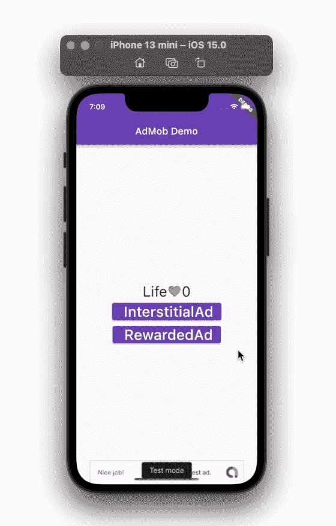
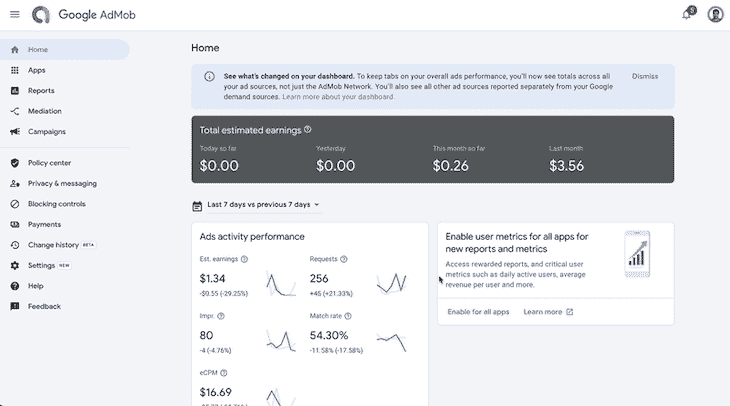
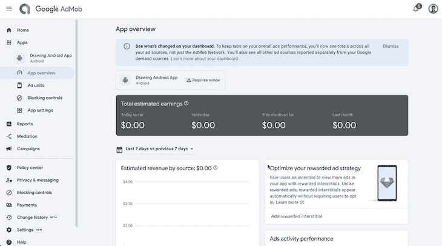
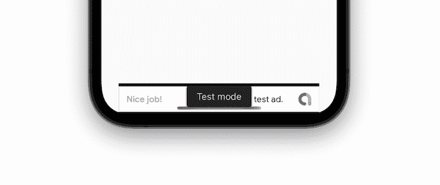
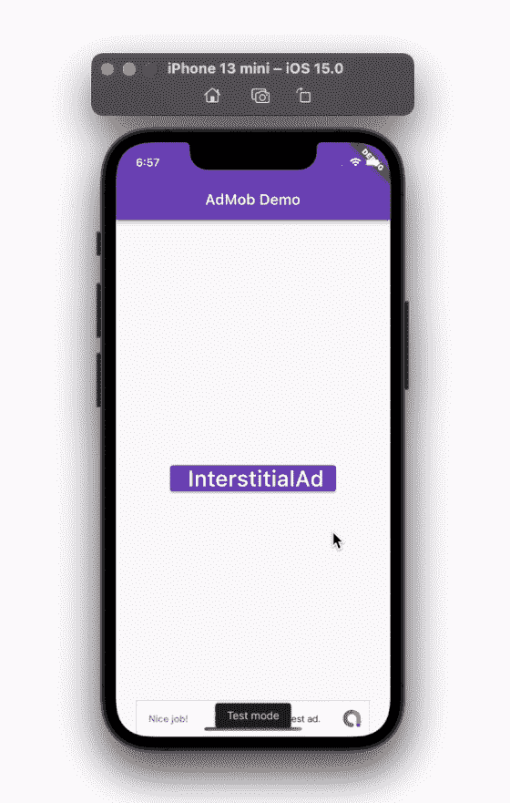

# 使用 AdMob - LogRocket 博客赚钱的指南

> 原文：<https://blog.logrocket.com/guide-monetizing-flutter-app-admob/>

从应用程序中产生价值是许多决策者的首要目标——对于开发者来说，了解如何有效地从他们创建的应用程序中赚钱至关重要。

在 Flutter 中，有三种主要的应用货币化方式:

1.  **广告**:在与应用程序交互时，会显示兼容移动设备的广告
2.  **应用内购买**:对游戏中的视频、音乐、图片和虚拟硬币等数字产品进行一次性或基于订阅的购买
3.  **支付**:衣服和杂货等实物商品的支付通过支付提供商进行，如 Google Pay 和 Apple Pay

在本教程中，我们将介绍如何使用 AdMob(移动广告)将你的 Flutter 应用货币化。

AdMob 是谷歌的一个广告网络，在你的应用上向用户展示各种有针对性的广告。为了在 Flutter 应用中集成 AdMob 服务，您将使用由 Flutter 团队自己创建的 [google_mobile_ads](https://pub.dev/packages/google_mobile_ads) 插件。

这个插件允许你在你的 Flutter 应用中显示横幅广告、插播广告(全屏)、奖励广告和原生广告。

我们将建立一个简单的应用程序，当按钮被按下时，显示不同的广告格式。

这是它完成后的样子:



以下是我们将在本教程中介绍的内容:

## 设置 AdMob

设置 AdMob 包括以下步骤:

1.  添加 AdMob 应用程序
2.  创建 AdUnits
3.  添加并初始化插件
4.  准备测试广告
5.  更新平台特定的文件

### 添加 AdMob 应用程序

在开始将 AdMob 集成到 Flutter 应用程序之前，首先需要在 AdMob 控制台中创建新的应用程序。

以下是如何在 AdMob 中创建应用程序:

1.  前往 AdMob 主页，[注册](https://admob.google.com/home/)账户
2.  转到仪表盘，点击左侧菜单上的**应用程序**
3.  接下来，点击**添加应用**，选择**安卓**作为平台
4.  如果您的应用程序尚未发布，选择**否**选择**该应用程序是否在受支持的应用程序商店中列出？**然后点击**继续**
5.  输入**应用名称**，点击**添加应用**
6.  点击**完成**
7.  对 iOS 应用程序重复相同的过程

(注意:确保您为 Android 和 iOS 应用程序添加(创建)了一个应用程序，以便您可以更好地跟踪每个平台的收入)



### 创建 AdUnits

呈现的广告种类由广告单元决定。你应该为你计划在应用中使用的每种类型的广告创建广告单元。

你可以这样做:

1.  点击左侧菜单上的**应用程序**，然后选择您的应用程序
2.  点击**添加广告单元**按钮
3.  选择广告的类型(如**横幅**
4.  输入**广告单元名称**，点击**创建广告单元**，然后选择**完成**
5.  同样，为**插播**和**有奖**广告创建一个广告单元。创建奖励广告时，请确保保留默认设置
6.  最后，为 iOS 应用程序创建广告单元



### 添加并初始化插件

创建应用和广告单元后，您可以返回到您的应用并添加 [google_mobile_ads](https://pub.dev/packages/google_mobile_ads/versions) 插件。

您的代码应该如下所示:

```
dependencies:
  flutter:
    sdk: flutter
  # The following adds the Cupertino Icons font to your application.
  # Use with the CupertinoIcons class for iOS style icons.
  cupertino_icons: ^1.0.2
  google_mobile_ads: ^1.2.0 # NEW

```

现在，是时候初始化插件了。导航到`main.dart`并在`runApp`前添加以下几行，如下所示:

```
void main() {
  WidgetsFlutterBinding.ensureInitialized(); 
  MobileAds.instance.initialize(); //<-- SEE HERE
  runApp(MyApp());
}

```

### 准备测试广告

当你还在开发你的应用程序时，用测试广告而不是真正的广告来测试你的应用程序是明智的。

(注意:自己测试真实的广告可能会向谷歌发出错误的信号，您的帐户可能会被暂停。此外，如果您在模拟器上测试应用程序，测试广告会自动启用)

有几种方法可以为真实设备启用测试广告。

1.  使用演示测试 id
2.  将您的设备添加到测试列表

### 使用演示测试 id

使用演示测试 id 是测试广告最简单快捷的方法。你只需要复制并粘贴 id，然后就可以继续测试你的应用了。Android 的演示 id 可以在这里[找到](https://developers.google.com/admob/android/test-ads#demo_ad_units)，iOS 的演示 id 可以在这里找到[。](https://developers.google.com/admob/ios/test-ads#demo_ad_units)

您可以将这些演示 id 保存在单独的 Dart 文件中，然后在需要时从应用程序中调用，如下所示:

```
// ad_helper.dart
import 'dart:io';

class AdHelper {
  static String get bannerAdUnitId {
    if (Platform.isAndroid) {
      return 'ca-app-pub-3940256099942544/6300978111';
    } else if (Platform.isIOS) {
      return 'ca-app-pub-3940256099942544/2934735716';
    } else {
      throw new UnsupportedError('Unsupported platform');
    }
  }
}
//--- Call like this ----
_bannerAd = BannerAd(
  adUnitId: AdHelper.bannerAdUnitId,
);

```

### 将您的设备添加到测试列表

您也可以通过提供您的测试 ID 将您的设备添加到测试列表中。如果您选择将您的设备添加到测试列表，您不再需要使用演示 id。在您的代码中，用以下代码替换 `MobileAds.instance.initialize()`:

```
MobileAds.instance
  ..initialize()
  ..updateRequestConfiguration(
    RequestConfiguration(testDeviceIds: ['7C92BD192385F05DDBD6FC73370E2D63']),
  );

```

(注 1:运行应用程序时，您可以在控制台中找到此测试 ID)

(注 2:发布应用程序之前，请更换演示 id 和测试 id)

### 更新平台特定文件

设置 AdMob 的最后一步是更新特定于平台的文件。在这一步中，您将在`AndroidManifest.xml`(对于 Android)和`info.plist`(对于 iOS)中添加 AdMob 应用 ID。

对于 Android，打开`AndroidManifest.xml`文件并添加以下标签:

```
<manifest xmlns:android="http://schemas.android.com/apk/res/android"
    package="com.example.admob_demo">
   <application
        android:label="admob_demo"
        android:name="${applicationName}"
        android:icon="@mipmap/ic_launcher">
...
       <meta-data
           android:name="com.google.android.gms.ads.APPLICATION_ID"
           android:value="ca-app-pub-3940256099942544~3347511713"/>
    </application>
</manifest>

```

对于 iOS，打开`info.plist`文件并添加以下键值对:

```
<?xml version="1.0" encoding="UTF-8"?>
<!DOCTYPE plist PUBLIC "-//Apple//DTD PLIST 1.0//EN" "http://www.apple.com/DTDs/PropertyList-1.0.dtd">
<plist version="1.0">
<dict>
   <key>CFBundleDevelopmentRegion</key>
   <string>$(DEVELOPMENT_LANGUAGE)</string>
   <key>CFBundleDisplayName</key>
   <string>Admob Demo</string>
   <key>CFBundleExecutable</key>
   <string>$(EXECUTABLE_NAME)</string>
...
   <key>GADApplicationIdentifier</key>
    <string>ca-app-pub-3940256099942544~1458002511</string>
</dict>
</plist>

```

(注意:上面代码中使用的 app IDs 都是测试 id。您可以简单地使用它进行测试，但在上线之前，请确保将它们替换为您的原始 ID)

## 横幅广告

横幅广告是最简单的广告形式，可以显示在页面的顶部或底部。通常，横幅内的广告会在一段时间后自行刷新。

(注意:在展示横幅广告之前，请确保您已经完成了上面
“设置 AdMob”部分的所有步骤)

以下是如何在 Flutter 应用程序中显示横幅广告:

1.  创建一个保存横幅广告实例的变量
2.  用所需参数初始化横幅广告，如`adUnitId`、`request`、`size`和`listener`
3.  通过调用横幅广告的`.load()`方法来加载横幅广告
4.  广告加载后，您可以使用`AdWidget`显示它

下面是一个代码示例，可以让您更好地理解正在发生的事情以及它应该是什么样子:

```
late BannerAd _bannerAd;
bool _isBannerAdReady = false;
@override
void initState() {
  super.initState();
  _loadBannerAd();
}

void _loadBannerAd() {
  _bannerAd = BannerAd(
    adUnitId: AdHelper.bannerAdUnitId,
    request: AdRequest(),
    size: AdSize.banner,
    listener: BannerAdListener(
      onAdLoaded: (_) {
        setState(() {
          _isBannerAdReady = true;
        });
      },
      onAdFailedToLoad: (ad, err) {
        _isBannerAdReady = false;
        ad.dispose();
      },
    ),
  );

  _bannerAd.load();
}
//----------- Show Ads like this -------
if (_isBannerAdReady)
  Align(
    alignment: Alignment.bottomCenter,
    child: Container(
      width: _bannerAd.size.width.toDouble(),
      height: _bannerAd.size.height.toDouble(),
      child: AdWidget(ad: _bannerAd),
    ),
  ),

```

### 输出




## 插播广告

插播广告是全屏广告，通常在应用程序的自然暂停期间显示，例如移动到另一个页面。

以下是展示插播广告的方式:

1.  在你的 app 的`initState`里面，加载需要参数的插播广告，比如`adUnitId`、`request`、`adLoadCallback`。在`adLoadCallback`里，无论广告是否加载，你都会得到一个回拨
2.  加载广告后，创建加载广告的实例
3.  您可以使用这个实例在按钮按下时显示插播广告
4.  在插播广告的实例中，附加给`onAdShowedFullScreenContent`、`onAdDismissedFullScreenContent`和`onAdFailedToShowFullScreenContent`一个回调的`FullScreenContentCallback`
5.  在`onAdDismissedFullScreenContent`回调时，处理当前广告并加载新广告
6.  最后，用`.show()`方法显示间质

以下是插播广告的代码示例:

```
InterstitialAd? _interstitialAd;
@override
void initState() {
  super.initState();
  _createInterstitialAd();
}
void _createInterstitialAd() {
  InterstitialAd.load(
      adUnitId: AdHelper.interstitialAdUnitId,
      request: request,
      adLoadCallback: InterstitialAdLoadCallback(
        onAdLoaded: (InterstitialAd ad) {
          print('$ad loaded');
          _interstitialAd = ad;
          _numInterstitialLoadAttempts = 0;
          _interstitialAd!.setImmersiveMode(true);
        },
        onAdFailedToLoad: (LoadAdError error) {
          print('InterstitialAd failed to load: $error.');
          _numInterstitialLoadAttempts += 1;
          _interstitialAd = null;
          if (_numInterstitialLoadAttempts < maxFailedLoadAttempts) {
            _createInterstitialAd();
          }
        },
      ));
}
void _showInterstitialAd() {
  if (_interstitialAd == null) {
    print('Warning: attempt to show interstitial before loaded.');
    return;
  }
  _interstitialAd!.fullScreenContentCallback = FullScreenContentCallback(
    onAdShowedFullScreenContent: (InterstitialAd ad) =>
        print('ad onAdShowedFullScreenContent.'),
    onAdDismissedFullScreenContent: (InterstitialAd ad) {
      print('$ad onAdDismissedFullScreenContent.');
      ad.dispose();
      _createInterstitialAd();
    },
    onAdFailedToShowFullScreenContent: (InterstitialAd ad, AdError error) {
      print('$ad onAdFailedToShowFullScreenContent: $error');
      ad.dispose();
      _createInterstitialAd();
    },
  );
  _interstitialAd!.show();
  _interstitialAd = null;
}
// --- Show like this ------
ElevatedButton(
  onPressed: () {
    _showInterstitialAd();
  },
  child: Text(
    ' InterstitialAd',
    style: TextStyle(fontSize: 30),
  ),
),

```

### 输出



## 奖励广告

奖励广告是全屏广告，并且通常由用户选择加入以便接收奖励。奖励可以是任何东西，如虚拟硬币或游戏中帮助用户完成任务的额外生命。

显示奖励广告的大多数步骤与插播广告相同，除了在显示奖励广告时，如果用户获得了奖励，您会收到一个回调，并且您可以相应地在屏幕上更新它。

区别如下:

```
_rewardedAd!.show(
    onUserEarnedReward: (AdWithoutView ad, RewardItem reward) {
  setState(() {
    life += 1;
  });
});

```

### 输出


完整的源代码可以在[这里](https://github.com/pinkeshdarji/admob_demo)找到。

## 结论

为你的应用增加盈利能力有助于你为应用提供额外的收入来源。

在本教程中，我们首先看了你可以将你的应用货币化的不同方式，然后探讨了如何将 AdMob 服务集成到你的 Flutter 应用中。

我们一步一步地讲解了如何设置 AdMob，然后用实例演示了如何展示不同类型的广告。我们也知道何时使用特定的广告类型来获得最佳效果。

## 使用 [LogRocket](https://lp.logrocket.com/blg/signup) 消除传统错误报告的干扰

[](https://lp.logrocket.com/blg/signup)

[LogRocket](https://lp.logrocket.com/blg/signup) 是一个数字体验分析解决方案，它可以保护您免受数百个假阳性错误警报的影响，只针对几个真正重要的项目。LogRocket 会告诉您应用程序中实际影响用户的最具影响力的 bug 和 UX 问题。

然后，使用具有深层技术遥测的会话重放来确切地查看用户看到了什么以及是什么导致了问题，就像你在他们身后看一样。

LogRocket 自动聚合客户端错误、JS 异常、前端性能指标和用户交互。然后 LogRocket 使用机器学习来告诉你哪些问题正在影响大多数用户，并提供你需要修复它的上下文。

关注重要的 bug—[今天就试试 LogRocket】。](https://lp.logrocket.com/blg/signup-issue-free)