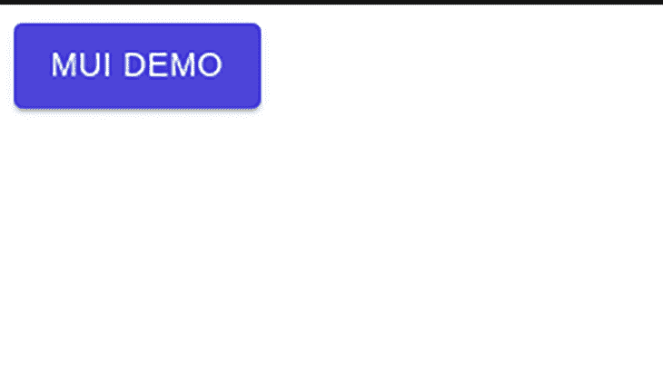
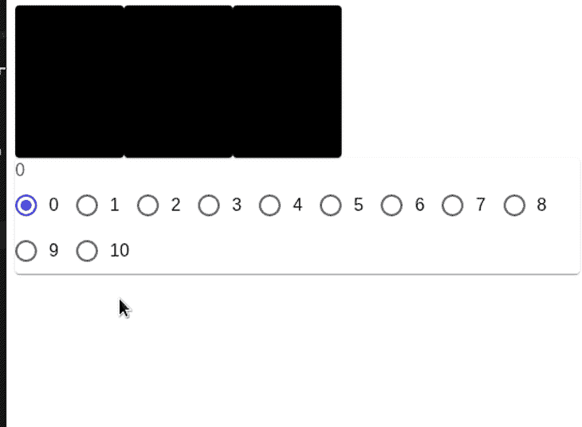
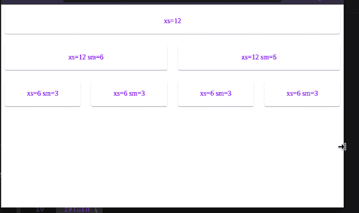
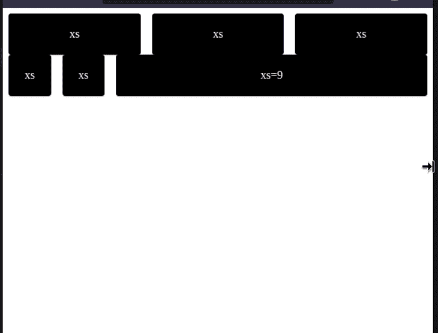
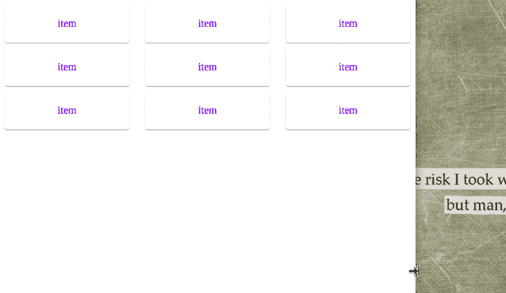
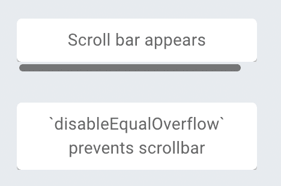

# MUI 网格系统指南- LogRocket 博客

> 原文：<https://blog.logrocket.com/guide-mui-grid-system/>

***编者按**:这篇文章最后一次更新是在 2022 年 11 月 16 日，包括了关于 [MUI Grid v2](https://mui.com/material-ui/react-grid2/) 的信息。*

在本文中，我们将探索使用 MUI 构建 React 应用程序。首先，我们将了解 MUI 网格系统、它的特性和局限性，以及如何在 React 中实现它。我们开始吧！

## 材料设计与 MUI

材料设计是谷歌在 2014 年开发的一个流行的设计系统。它是一种视觉语言，将优秀设计的经典原则与科技创新相结合。

谷歌和许多其他科技公司在其品牌和产品中广泛使用材料设计。2021 年，[谷歌修改了其设计系统](https://material.io/blog/migrating-material-3)，让设计师更灵活地创建定制主题。

[MUI](https://mui.com/) 是一个 React 库，实现了 Google 的材质设计及其网格系统。MUI 广泛用于 Android 应用程序开发，它定义了一套设计 UI 组件的原则和指南。这项技术的创造者在 2021 年 9 月将项目名称从 [Material UI 缩短为 MUI，澄清该项目从未隶属于谷歌。](https://mui.com/blog/material-ui-is-now-mui/#:~:text=A%20new%20name,pronounced%20%2F%C9%9Bm%20ju%CB%90%20a%C9%AA%2F.)

MUI 附带了预构建的 UI 组件，包括按钮、导航条、导航抽屉，以及最重要的网格系统。MUI v5 提供了新的特性，更新的设计，性能优化和增强的主题选项。

## 材料设计的网格系统

网格系统定义了一组度量值，用于根据连续的列和行在页面上放置元素或组件。材料设计中的网格系统在视觉上是平衡的。它适应屏幕大小和方向，确保页面布局一致。

网格系统由三个组件组成:

1.  列:页面上的元素放在列中，列是由百分比而不是固定值定义的，这样元素可以灵活地适应任何屏幕大小
2.  间距:各列之间的间距由每个断点处的固定值定义，以更好地适应屏幕大小
3.  边距:屏幕左侧和右侧之间的间距由一个固定值定义，类似于每个断点处的间距

## 在 React with MUI 中实现材料设计

[MUI 库提供了实现谷歌材质设计的 React 组件](https://blog.logrocket.com/adding-custom-fonts-mui-3-ways/)。让我们探索使用 MUI 在 React 应用程序中实现材质设计。

### 装置

运行以下命令，在项目中安装所需的依赖项:

```
npm install @mui/material @emotion/react @emotion/styled

```

Material Design 使用 Roboto 作为默认字体，所以不要忘记添加它:

```
<link
  rel="stylesheet"
  href="https://fonts.googleapis.com/css?family=Roboto:300,400,500,700&display=swap"
/>

```

或者，您可以省略上面的代码片段，将下面的导入添加到 React 应用程序的入口点，通常应该是`index.js`文件:

```
import "@fontsource/roboto/300.css";
import "@fontsource/roboto/400.css";
import "@fontsource/roboto/500.css";
import "@fontsource/roboto/700.css";

```

### 基本用途

所有的组件都是隔离的、自支持的，并且只注入它们需要呈现的样式。让我们使用下面的例子，它创建了一个简单的按钮组件:

```
import * as React from "react";
//import the Button component from MUI
import Button from "@mui/material/Button";
export default function App() {
  return (
    //Draw a simple button
    <Button variant="contained" color="primary">
      MUI Demo
    </Button>
  );
}

```



A demo button built using MUI

## MUI `Grid`组件

使用 [`Grid`组件](https://mui.com/material-ui/react-grid/)在 MUI 中实现材料设计的网格系统。在引擎盖下，`Grid`组件使用 [Flexbox 属性](https://blog.logrocket.com/flexing-with-css-flexbox-b7940b329a8a/)以获得更大的灵活性。

网格组件有两种类型，`container`和`item`。为了使布局流畅并适应不同的屏幕尺寸，`item`的宽度以百分比设置，填充在每个单独的`item`之间创建间距。网格断点有五种类型，包括`xs`、`sm`、`md`、`lg`和`xl`。

### 导入`Grid`组件

使用以下代码将`Grid`组件导入 JavaScript 文件:

```
import Grid from '@mui/material/Grid';

```

### 容器和物品

`container`属性赋予`Grid`组件一个`flex`容器的 CSS 属性，`item`属性赋予一个`flex`项目的 CSS 属性。每个`item`都必须用一个`container`包裹，如下图所示:

```
<Grid
  container
  // ...this parent component will be a flex-box container
>
  <Grid
    item
    // ... this child component will be a flex item for the parent Grid
  >
    <Paper></Paper> {/* A simple flex item */}
  </Grid>
</Grid>

```

## 特征

让我们看看您可以为`container`和`item`提供的各种道具，以构建灵活的布局。

### 间隔

你可以将`spacing`道具应用到`Grid container`上，在每个单独的网格`item`之间创建空间。在下面的示例中，我们通过一组单选按钮组件传递值来交互式地更改`spacing`属性值:

```
import * as React from "react";
import Grid from "@mui/material/Grid";
import FormLabel from "@mui/material/FormLabel";
import FormControlLabel from "@mui/material/FormControlLabel";
import RadioGroup from "@mui/material/RadioGroup";
import Radio from "@mui/material/Radio";
import Paper from "@mui/material/Paper";

//create our style
const styles = {
  paper: {
    height: 140,
    width: 100,
    backgroundColor: "black"
  }
};
export default function SpacingGridDemo() {
  //create our spacing variable. Default value will be 2
  const [spacing, setSpacing] = React.useState(2);
  //when executed, change the value of spacing Hook to chosen value
  const handleChange = (event) => {
    setSpacing(Number(event.target.value));
  };
  return (
    <div>
      <div>
        {/*This container will be aligned in the center */}
        {/* Spacing will vary depending on user choice.*/}
        <Grid container justify="center" spacing={spacing}>
          {/*Render 3 empty black boxes as items of this container*/}
          {[0, 1, 2].map((value) => (
            <Grid key={value} item>
              <Paper style={styles.paper} />
            </Grid>
          ))}
        </Grid>
      </div>
      <div>
        <Paper>
          <div>
            {/* Show user's chosen spacing value*/}
            <FormLabel>{spacing}</FormLabel>
            <RadioGroup
              name="spacing"
              aria-label="spacing"
              value={spacing.toString()}
              onChange={handleChange}
              row
            >
              {/*Render multiple spacing values in a form */}
              {[0, 1, 2, 3, 4, 5, 6, 7, 8, 9, 10].map((value) => (
                <FormControlLabel
                  key={value}
                  value={value.toString()}
                  control={<Radio />}
                  label={value.toString()}
                />
              ))}
            </RadioGroup>
          </div>
        </Paper>
      </div>
    </div>
  );
}

```



Change the spacing dynamically by passing the spacing values through the radio button component

### 流体网格

我们可以通过使用网格项上的断点道具、`xs`、`sm`、`md`、`lg`、`xl`来创建不同屏幕尺寸的布局。流体网格可以缩放网格项目并调整其中内容的大小:

```
import * as React from "react";
import Paper from "@mui/material/Paper";
import Grid from "@mui/material/Grid";
//create our styles
const classes = {
  root: {
    flexGrow: 1
  },
  paper: {
    padding: 20,
    textAlign: "center",
    color: "blue",
    fontFamily: "Roboto"
  }
};
export default function BreakpointGridDemo() {
  return (
    <div style={classes.root}>
      <Grid container spacing={3}>
        {/*Create items with different breakpoints */}
        {/*For example,This item will be 12 units wide on extra small screens */}
        <Grid item xs={12}>
          <Paper style={classes.paper}>xs=12</Paper>
        </Grid>
        {/*This item will be 12 units on extra small screens */}
        {/*But will be 6 units on small screens */}
        <Grid item xs={12} sm={6}>
          <Paper style={classes.paper}>xs=12 sm=6</Paper>
        </Grid>
        <Grid item xs={12} sm={6}>
          <Paper style={classes.paper}>xs=12 sm=6</Paper>
        </Grid>
        <Grid item xs={6} sm={3}>
          <Paper style={classes.paper}>xs=6 sm=3</Paper>
        </Grid>
        <Grid item xs={6} sm={3}>
          <Paper style={classes.paper}>xs=6 sm=3</Paper>
        </Grid>
        <Grid item xs={6} sm={3}>
          <Paper style={classes.paper}>xs=6 sm=3</Paper>
        </Grid>
        <Grid item xs={6} sm={3}>
          <Paper style={classes.paper}>xs=6 sm=3</Paper>
        </Grid>
      </Grid>
    </div>
  );
}

```



Using fluid grids to scale content for different screen sizes

### 自动布局

自动布局功能允许网格项目自动调整大小并占用可用空间，而不必指定项目的宽度。如果在其中一个项目上设置宽度，子项目将自动调整大小并共享可用空间。

在下面的示例中，您可以看到`xs={9}`项周围的项会自动调整大小，从而形成完美的布局:

```
const classes = {
  root: {
    flexGrow: 1
  },
  paper: {
    padding: 20,
    textAlign: "center",
    backgroundColor: "black",
    color: "white"
  }
};
export default function AutoGridDemo() {
  return (
    <div style={classes.root}>
      <Grid container spacing={2}>
        {/*They all will have default widths */}
        <Grid item xs>
          <Paper style={classes.paper}>xs</Paper>
        </Grid>
        <Grid item xs>
          <Paper style={classes.paper}>xs</Paper>
        </Grid>
        <Grid item xs>
          <Paper style={classes.paper}>xs</Paper>
        </Grid>
      </Grid>
      <Grid container spacing={2}>
        <Grid item xs>
          <Paper style={classes.paper}>xs</Paper>
        </Grid>
        <Grid item xs>
          <Paper style={classes.paper}>xs</Paper>
        </Grid>
        {/*However, this component will have 9 units of space */}
        <Grid item xs={9}>
          <Paper style={classes.paper}>xs=9</Paper>
        </Grid>
      </Grid>
    </div>
  );
}

```



Using the auto-layout feature to achieve a perfect layout every time

### 嵌套网格

我们可以在彼此内部使用网格。在下面的演示中，`container`和`item`道具被组合在一起，因此`Grid`组件可以像容器和物品一样工作。这允许我们在网格项中有另一组网格。在这种情况下，它是`<InnerGrid />`组件:

```
import * as React from "react";
import Paper from "@mui/material/Paper";
import Grid from "@mui/material/Grid";

const classes = {
  root: {
    flexGrow: 1
  },
  paper: {
    padding: 20,
    textAlign: "center",
    color: "blue"
  }
};
//the InnerGrid component will be a collection of multiple Grid items
function InnerGrid() {
  return (
    <>
      <Grid item xs={4}>
        <Paper style={classes.paper}>item</Paper>
      </Grid>
      <Grid item xs={4}>
        <Paper style={classes.paper}>item</Paper>
      </Grid>
      <Grid item xs={4}>
        <Paper style={classes.paper}>item</Paper>
      </Grid>
    </>
  );
}
export default function NestedGridDemo() {
  return (
    <div style={classes.root}>
      <Grid container spacing={1}>
        <Grid container item xs={12} spacing={3}>
          {/*Render the InnerGrid as a child item */}
          <InnerGrid />
        </Grid>
        <Grid container item xs={12} spacing={3}>
          <InnerGrid />
        </Grid>
        <Grid container item xs={12} spacing={3}>
          <InnerGrid />
        </Grid>
      </Grid>
    </div>
  );
}

```



Nested grids in MUI

## MUI 的局限性

### 压缩边界

MUI 使用负边距来实现网格项之间的空格。当负边距超过`<body>`时，出现水平滚动。

为了解决这个问题， [MUI 文档](https://mui.com/components/grid/#negative-margin)建议不要使用间隔特性，而在用户空间中实现它。`spacing={0}`是默认值。另外，在应用背景色时，先将`display:flex`样式应用到父对象。

### `white-space no-wrap`

默认情况下，在 flex 项目中，`min-width`属性被设置为`auto`，当子项目使用`white-space: nowrap;`属性时，会导致定位冲突。

要解决这个问题，我们需要在网格项上设置`min-width: 0`或`zeroMinWidth`属性，如下所示:

```
<Grid item xs zeroMinWidth>
  <Typography noWrap>
  ...

```

### `column and column-reverse`

`direction: column`和`direction: column-reverse`不支持某些网格功能。断点主要用于控制宽度，对`column`容器内的高度没有类似的影响。

## MUI Grid v2 入门

在撰写本文时，MUI Grid v2 刚刚发布，提供了对原始网格系统的一些改进。在发布稳定版本之前，MUI 团队仍在收集反馈。要全面了解新版本，请随意访问[迁移指南](https://mui.com/material-ui/migration/migration-grid-v2/)。我们将快速浏览一下变化，以便您可以开始使用新的网格系统。

要导入新的网格版本，请运行以下代码:

```
import Grid2 from '@mui/material/Unstable_Grid2'; // Grid version 2

```

一个主要的变化是，您可以从您的`Grid`组件中移除`item`和`zeroMinWidth`属性，简化 CSS 变量的逻辑并降低 CSS 特异性。所以，不用使用`<Grid item zeroMinWidth xs={6}>`，你现在可以简单地使用`<Grid XS={6}`并实现相同的行为。

还解决了关于负边距的限制。为了避免出现水平滚动条，例如，当负边距超过`<body>`时，您现在可以如下使用`disableEqualOverflow`属性:

```
import * as React from 'react';
import { styled } from '@mui/material/styles';
import Box from '@mui/material/Box';
import Paper from '@mui/material/Paper';
import Grid from '@mui/material/Unstable_Grid2';

const Item = styled(Paper)(({ theme }) => ({
  backgroundColor: theme.palette.mode === 'dark' ? '#1A2027' : '#fff',
  ...theme.typography.body2,
  padding: theme.spacing(1),
  textAlign: 'center',
  color: theme.palette.text.secondary,
}));

export default function AutoGrid() {
  return (
    <Box
      sx={(theme) => ({
        display: 'flex',
        flexDirection: 'column',
        gap: 3,
        width: 200,
        '& > div': {
          overflow: 'auto hidden',
          '&::-webkit-scrollbar': { height: 10, WebkitAppearance: 'none' },
          '&::-webkit-scrollbar-thumb': {
            borderRadius: 8,
            border: '2px solid',
            borderColor: theme.palette.mode === 'dark' ? '' : '#E7EBF0',
            backgroundColor: 'rgba(0 0 0 / 0.5)',
          },
        },
      })}
    >
      <div>
        <Grid container spacing={3}>
          <Grid xs={12}>
            <Item>Scroll bar appears</Item>
          </Grid>
        </Grid>
      </div>
      <div>
        <Grid container spacing={3} disableEqualOverflow>
          <Grid xs={12}>
            <Item>`disableEqualOverflow` prevents scrollbar</Item>
          </Grid>
        </Grid>
      </div>
    </Box>
  );
}

```



## 结论

尽管上面描述了一些缺点，MUI 使您能够创建创新的、响应迅速的布局。希望本指南能帮助您充分利用我们讨论过的众多特性。当你使用材料设计系统时，它们会在某个时候派上用场。

## 使用 LogRocket 消除传统反应错误报告的噪音

[LogRocket](https://lp.logrocket.com/blg/react-signup-issue-free)

是一款 React analytics 解决方案，可保护您免受数百个误报错误警报的影响，只针对少数真正重要的项目。LogRocket 告诉您 React 应用程序中实际影响用户的最具影响力的 bug 和 UX 问题。

[ ](https://lp.logrocket.com/blg/react-signup-general) [  ](https://lp.logrocket.com/blg/react-signup-general) [LogRocket](https://lp.logrocket.com/blg/react-signup-issue-free)

自动聚合客户端错误、反应错误边界、还原状态、缓慢的组件加载时间、JS 异常、前端性能指标和用户交互。然后，LogRocket 使用机器学习来通知您影响大多数用户的最具影响力的问题，并提供您修复它所需的上下文。

关注重要的 React bug—[今天就试试 LogRocket】。](https://lp.logrocket.com/blg/react-signup-issue-free)