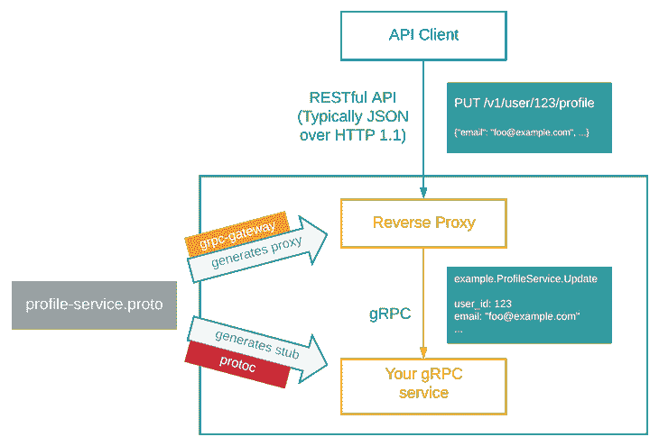
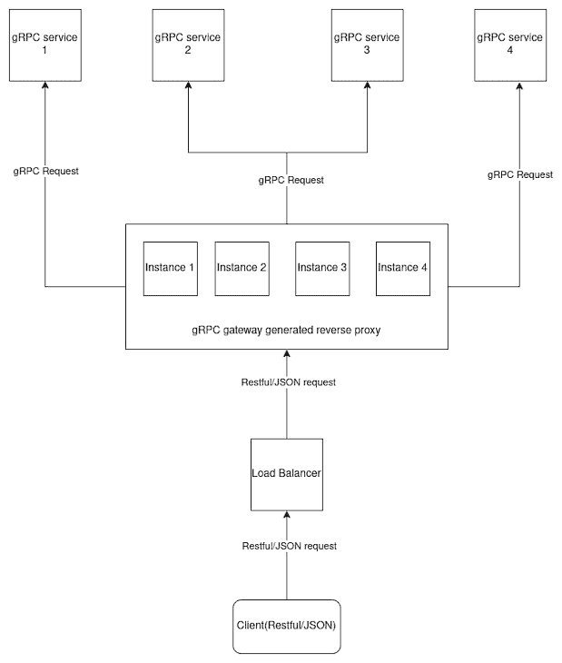

# gRPC-Gateway 一体化指南

> 原文：<https://blog.logrocket.com/guide-to-grpc-gateway/>

gRPC-Gateway 是一个插件，它为 gRPC 服务生成一个反向代理服务器，将 Restful/JSON 转换为 gRPC，反之亦然。

换句话说，gRPC-Gateway 将在您的 gRPC 服务上创建一个层，作为一个 Restful/JSON 服务提供给客户端。gRPC-Gateway 从协议缓冲区的 gRPC 服务定义中生成代码。

## 介绍

gRPC-Gateway 是 protoc 的一个插件，将从 gRPC 定义中生成 Go 代码。

生成的代码可以用作独立的服务器，也可以安装在现有的代码库上。gRPC-Gateway 是高度可定制的，支持从协议文件生成开放 API 文档。

在本教程中，我们将详细介绍独立服务器以及与现有代码的集成。看一下这个流程图，了解 gRPC 网关是如何工作的。



## 为什么选择 gRPC-Gateway？

gRPC 网关为 gRPC 服务构建了一个代理，作为客户端的 Restful/JSON 应用程序。它开启了使用相同的代码库来支持 Restful/JSON 和 gRPC 的可能性。这有两个主要的用例。

1.  遗留客户端可能不支持 gRPC，需要 Restful/JSON 接口
2.  浏览器可能不支持 gRPC 开箱即用；因此，对于希望与 gRPC 服务交互的 web 客户机来说，gRPC-Gateway 是首选。

最常见的 gRPC-Gateway 模式是创建单个 gRPC 网关服务器(可能运行在多台机器上)，该服务器与多个 gRPC 服务接口，作为客户端的代理。

下图解释了该服务的工作原理。



gRPC 网关生成的反向代理被水平扩展以在多台机器上运行，并且在这些实例之前使用负载平衡器。一个实例可以托管多个 gRPC 服务的反向代理。

## 设置 gRPC 网关

gRPC-Gateway 是一个协议插件。在使用它之前，必须在系统上安装协议缓冲编译器。遵循 gRPC 官方网站上的指南，根据您使用的操作系统在您的系统上安装协议。

gRPC-Gateway 使用并生成 Go 代码。要安装 Go，请遵循[官方](https://go.dev/doc/install)网站上的指南。一旦你在系统上安装了 Go，你就可以安装 gRPC-Gateway 插件了。

创建一个名为`grpc-gateway-demo`的目录，它将保存 gRPC-Gateway 项目。为了构建协议缓冲区和生成 gRPC 网关反向代理，将使用 Buf。你可以按照官方[网站](https://docs.buf.build/installation)上的指南安装 Buf。

### 项目结构

所有的协议缓冲区文件将在`proto`目录中，而 Go 文件将在`root`中。为了设置 Go 项目，使用`go mod init grpc-gateway-demo`并创建一个`main.go`文件。您的项目应该如下所示:

```
├── main.go
├── go.mod
└── proto

```

### 配置缓冲区

Buf 需要三个不同的文件来生成存根和反向代理。

`buf.gen.yaml`

这些文件指定了编译器应该使用的所有插件和相关选项。

使用 Buf，您可以简单地在 YAML 文件中指定名称和选项。Buf 还允许构建代码使用远程插件(即，特定的插件将在构建期间由 Buf 自动下载，并由 Buf 在本地系统上维护)。

```
version: v1
plugins:
  # generate go structs for protocol buffer defination
  - remote: buf.build/library/plugins/go:v1.27.1-1
    out: gen/go
    opt:
      - paths=source_relative
  # generate gRPC stubs in golang
  - remote: buf.build/library/plugins/go-grpc:v1.1.0-2
    out: gen/go
    opt:
      - paths=source_relative
  # generate reverse proxy from protocol definations
  - remote: buf.build/grpc-ecosystem/plugins/grpc-gateway:v2.6.0-1
    out: gen/go
    opt:
      - paths=source_relative
  # generate openapi documentation for api
  - remote: buf.build/grpc-ecosystem/plugins/openapiv2:v2.6.0-1
    out: gen/openapiv2

```

`buf.yaml`

这个文件应该在所有原型文件的根目录下。这些文件指定了编译原型文件所需的依赖关系(例如 Google APIs)。

```
 version: v1
 deps:
 # adding well known types by google
  - buf.build/googleapis/googleapis

```

`buf.work.yaml`

该文件指定工作区中包含协议缓冲区定义的所有文件夹/目录。

* * *

### 更多来自 LogRocket 的精彩文章:

* * *

```
version: v1
directories:
  - proto

```

一旦完成，你的项目结构应该如下所示。

```
├── buf.gen.yaml
├── buf.work.yaml
├── go.mod
├── main.go
└── proto
    ├── buf.yaml

```

您可以通过在项目根目录下运行`buf build`命令来测试您的配置。

## 使用 gRPC 网关

到目前为止，您已经将 gRPC-Gateway 设置为插件，但是现在的问题是如何定义基本的 API 规范，比如 HTTP 方法、URL 或请求体。

为了定义这些规范选项在协议缓冲区对一个`service`上的`rpc`方法的定义中使用了什么，下面的例子将使它更加清晰。

**`proto/hello/hello_world.proto`** :

```
// define syntax used in proto file
syntax = "proto3";
// options used by gRPC golang plugin(not related to gRPC gateway)
option go_package = "github.com/anshulrgoyal/grpc-gateway-demo;grpc_gateway_demo";

// well know type by google, gRPC gateway uses HTTP annotation.
import "google/api/annotations.proto";

package hello_world;

// simple message
message HelloRequest {
  string name = 1;
}

message HelloReply {
  string message = 1;
}

// a gRPC service
service Greeter {
 // SayHello is a rpc call and a option is defined for it
  rpc SayHello (HelloRequest) returns (HelloReply) {
  // option type is http
    option (google.api.http) = {
    // this is url, for RESTfull/JSON api and method
    // this line means when a HTTP post request comes with "/v1/sayHello" call this rpc method over this service
      post: "/v1/sayHello"
      body: "*"
    };
  }
}

```

`option`关键字用于为 Rest 请求添加规范。选择了`option`方法，并指定了该请求的路径。

在上面的例子中，`post`是请求的 HTTP 方法，`/v1/sayHello`是响应。

现在，您可以在项目目录的根目录下使用`buf generate`命令构建您的代码。

命令完成后，在项目的根目录下应该有一个包含 Go 代码的`gen`目录。这些文件包含 gRPC 和 gRPC 网关反向代理的存根。`openapiv2`包含 Swagger UI 的开放 API 文档。

```
gen
|-- go
|   `-- hello
|       |-- hello_world.pb.go
|       |-- hello_world.pb.gw.go
|       `-- hello_world_grpc.pb.go
`-- openapiv2
    `-- hello
        `-- hello_world.swagger.json

```

### 实现服务

例如，本教程将在 Go 中实现 gRPC 服务器。任何 gRPC 实现对于 gRPC 网关来说都可以很好地工作。

使用 Go 的优势在于，您可以在同一个进程中运行 gRPC 服务和 gRPC 网关生成的代码。下面是 Go 对`Greeter`服务的实现。

`**sever/main.go:**`

```
package main
import (
    "context"
    "fmt"
    "log"
    "net"
    // importing generated stubs
    gen "grpc-gateway-demo/gen/go/hello"
    "google.golang.org/grpc"
)
// GreeterServerImpl will implement the service defined in protocol buffer definitions
type GreeterServerImpl struct {
    gen.UnimplementedGreeterServer
}
// SayHello is the implementation of RPC call defined in protocol definitions.
// This will take HelloRequest message and return HelloReply
func (g *GreeterServerImpl) SayHello(ctx context.Context, request *gen.HelloRequest) (*gen.HelloReply, error) {
    return &gen.HelloReply{
        Message: fmt.Sprintf("hello %s",request.Name),
    },nil
}
func main() {
    // create new gRPC server
    server := grpc.NewServer()
    // register the GreeterServerImpl on the gRPC server
    gen.RegisterGreeterServer(server, &GreeterServerImpl{})
    // start listening on port :8080 for a tcp connection
    if l, err := net.Listen("tcp", ":8080"); err != nil {
        log.Fatal("error in listening on port :8080", err)
    } else {
        // the gRPC server
        if err:=server.Serve(l);err!=nil {
            log.Fatal("unable to start server",err)
        }
    }
}

```

上面的文件是 gRPC 服务的基本实现。它监听端口 8080。您可以在任何 gRPC 客户机上测试它。

### 在 gRPC 网关代理上注册服务

gRPC 网关代理支持的每台 gRPC 服务器都需要在其上注册。

在幕后，gRPC 网关服务器将创建一个 gRPC 客户机，并使用它向所提供的端点发出 gRPC 请求。您可以向寄存器函数提供各种`DailOptions`。

`**proxy/main.go**`

```
package main
import (
    "context"
    "log"
    "net"
    "net/http"
    "github.com/grpc-ecosystem/grpc-gateway/v2/runtime"
    "google.golang.org/grpc"
    gen "grpc-gateway-demo/gen/go/hello"
)
func main() {
    // creating mux for gRPC gateway. This will multiplex or route request different gRPC service
    mux:=runtime.NewServeMux()
    // setting up a dail up for gRPC service by specifying endpoint/target url
    err := gen.RegisterGreeterHandlerFromEndpoint(context.Background(), mux, "localhost:8080", []grpc.DialOption{grpc.WithInsecure()})
    if err != nil {
        log.Fatal(err)
    }
    // Creating a normal HTTP server
    server:=http.Server{
        Handler: mux,
    }
    // creating a listener for server
    l,err:=net.Listen("tcp",":8081")
    if err!=nil {
        log.Fatal(err)
    }
    // start server
    err = server.Serve(l)
    if err != nil {
        log.Fatal(err)
    }
}

```

`ServerMux`是一个多路复用器，它会根据 JSON/Restful 请求的路径将请求路由到各种注册的服务。

`grpc.WithInsecure()`拨号选项用于允许服务在不使用验证的情况下连接 gRPC。`localhost:8080`是 gPRC 服务正在运行的 URL 因为`Greet` (gRPC 服务构建见前面)服务正在端口 8080 上运行，所以使用了`localhost:8080`。

一旦注册了处理程序，`mux`就可以处理 HTTP 请求了。这里使用了来自`http`包的 Go 标准 HTTP 服务器。您也可以自由地使用其他实现，本文稍后将通过 gRPC 网关代理使用 Gin 来演示这个[。](https://blog.logrocket.com/building-microservices-go-gin/)

`ServerMux`实现了`ServeHTTP`接口——它可以在 HTTP 服务器中用作`Handler`。服务器运行在端口 8081 上。

要启动服务器，只需在项目目录的根目录下运行`go run proxy/main.go`。

### **使用** **路径参数**

现在，如果您想让`v1/sayHello` API 成为 POST 调用中的 GET 调用，并将数据作为路径参数传递，那么在 gRPC 网关设置完成后，您不需要更改任何代码——只需更改协议缓冲区定义并重新生成存根，您就可以使用新的 API 了。

```
message HelloRequest {
  string name = 1;
}

service Greeter {
  rpc SayHello (HelloRequest) returns (HelloReply) {
    option (google.api.http) = {
     get:"/v1/sayHello/{name}"
    };
  }
}

```

上面片段中提供的路径是`/v1/sayHello/{name}`。您可以使用请求负载中的任何键(在本例中为`HelloRequest`)作为路径参数。如果使用带有路径`/v1/sayHello/jane`的 GET 请求，该请求将被路由到`Greeter.sayHello` gRPC 调用。您可以在 URL 中使用任意数量的路径参数。

现在，您对 gRPC 网关及其设置有了一些基本的了解。

我们使用的示例只是对 gRPC 网关的介绍，但是要在生产中运行某些东西，您需要有日志记录、跟踪和错误处理。

## 常见使用模式

对于任何准备好投入生产的系统，它都应该有一些错误处理，并允许某种错误日志记录。

### 添加日志记录

本文的这一部分将演示如何将中间件与 gRPC 网关生成的代理一起使用。

`ServerMux`实现了一个`Handler`接口，因此您可以使用任何中间件来包装`ServerMux`并记录传入和传出的请求。

```
type Handler interface {
        ServeHTTP(ResponseWriter, *Request)
}

```

为了创建一个日志中间件，您可以从`*Request`中提取与 HTTP 请求相关的信息，并且使用`httpsnoop`包提取关于响应的信息。

```
func withLogger(handler http.Handler) http.Handler {
    // the create a handler
    return http.HandlerFunc(func(writer http.ResponseWriter, request *http.Request) {
        // pass the handler to httpsnoop to get http status and latency
        m:=httpsnoop.CaptureMetrics(handler,writer,request)
        // printing exracted data
        log.Printf("http[%d]-- %s -- %s\n",m.Code,m.Duration,request.URL.Path)
    })
}

```

`withLogger`方法将包装处理程序接口并调用 snoop 来提取信息。在引擎盖下，`ServerHTTP`方法由`httpsnoop`包调用。

```
server:=http.Server{
        Handler: withLogger(mux),
    }

```

这与 Go 生态系统中使用的任何其他处理程序没有什么不同。由于`ServerMux`是一个普通的处理程序，任何可用的中间件也将与 gRPC 网关生成的反向代理一起工作。

### 错误处理

gRPC 网关已经提供了将 gRPC 错误代码转换成客户机使用的 HTTP 状态的映射。例如，它会自动将众所周知和常用的 gRPC 代码映射到 HTTP 状态。

`InvalidArgument`转换为`400`(错误请求)。如需完整列表，您可以查看此[链接](https://github.com/grpc-ecosystem/grpc-gateway/blob/7094a052b3287b9e99f52d95230789ab34d2d7c4/runtime/errors.go#L36)。如果您有定制的需求，比如需要一个非常规的状态代码，您可以使用带有错误处理函数的`WithErrorhandler`选项——所有的错误都将通过请求-响应编写器传递给这个函数。

```
runtime.WithErrorHandler(
  func(ctx context.Context, mux *runtime.ServeMux, marshaler runtime.Marshaler, writer http.ResponseWriter, request *http.Request, err error) {}
)

```

错误处理函数获取以下参数

1.  `ctx`:上下文；保存关于执行的元数据
2.  `mux`:这是`ServerMux`；它保存关于服务器的配置数据，比如应该将哪个头传递给响应
3.  `marshaler`:将协议缓冲响应转换为 JSON 响应
4.  这是客户端的响应编写器
5.  `request`:请求包含客户端发送信息的对象
6.  `err`:gRPC 服务发送的错误

下面是一个简单的`WithErrorHandler`的例子。在这个例子中，当错误发生时，请求的 HTTP 状态被改变为`400`,而不考虑错误。

```
mux:=runtime.NewServeMux(
        runtime.WithErrorHandler(func(ctx context.Context, mux *runtime.ServeMux, marshaler runtime.Marshaler, writer http.ResponseWriter, request *http.Request, err error) {
            //creating a new HTTTPStatusError with a custom status, and passing error
            newError:=runtime.HTTPStatusError{
                HTTPStatus: 400,
                Err:        err,
            }
            // using default handler to do the rest of heavy lifting of marshaling error and adding headers
            runtime.DefaultHTTPErrorHandler(ctx,mux,marshaler,writer,request,&newError)
        }))

```

通过创建新的错误并将其传递给`DefaultHTTPErrorHandler`来改变状态。需要注意的是，`DefaultHTTPErrorHandler`在幕后执行了大量工作，将错误转换成有效的 JSON 响应——尽可能使用它。

gRPC 和 Restful/JSON 传递元数据的方式不同。

在 Restful/JSON HTTP 中，头用于发送 HTTP 头，而 gRPC 通过提供依赖于所用语言的元数据接口来抽象发送元数据。

gRPC 网关提供了一个简单的映射接口，将 gRPC 元数据转换成 HTTP 头，反之亦然。它还允许两种不同的方法来处理头到元数据的转换。

首先，`WithOutgoingHeaderMatcher`处理从 gRPC 网关返回到客户端的报头。它将元数据转换成 HTTP 头(即 gRPC 服务传递的任何元数据都将作为 HTTP 头发送回客户端)。

```
var allowedHeaders=map[string]struct{}{
    "x-request-id": {},
}
func isHeaderAllowed(s string)( string,bool) {
// check if allowedHeaders contain the header
    if _,isAllowed:=allowedHeaders[s];isAllowed {
// send uppercase header
       return strings.ToUpper(s),true
    }
// if not in the allowed header, don't send the header
     return s, false
}
// usage
mux:=runtime.NewServeMux(
// convert header in response(going from gateway) from metadata received.
runtime.WithOutgoingHeaderMatcher(isHeaderAllowed))

```

该方法接受一个字符串，如果将头传递给客户端，则返回 true，否则返回 false。

其次，`WithMetadata`处理传入的 HTTP 头(即 cookies、content-type 等。).它最常见的用例是获取一个身份验证令牌并将其传递给元数据。这里提取的 HTTP 头将以元数据的形式发送到 gRPC 服务。

```
mux:=runtime.NewServeMux(
handle incoming headers
runtime.WithMetadata(func(ctx context.Context, request *http.Request) metadata.MD {
header:=request.Header.Get("Authorization")
// send all the headers received from the client
md:=metadata.Pairs("auth",header)
return md
}),

```

它采用一个接收请求并返回元数据的函数。小心头转换为元数据，因为客户端，浏览器，负载平衡器和 CDN 在其中。gRPC 的密钥也有一些限制。

下面是一个完整的例子:

```
package main
import (
    "context"
    "log"
    "net"
    "net/http"
    "strings"
    "github.com/felixge/httpsnoop"
    "github.com/grpc-ecosystem/grpc-gateway/v2/runtime"
    "google.golang.org/grpc"
    "google.golang.org/grpc/metadata"
    gen "grpc-gateway-demo/gen/go/hello"
)
func withLogger(handler http.Handler) http.Handler {
    return http.HandlerFunc(func(writer http.ResponseWriter, request *http.Request) {
        m:=httpsnoop.CaptureMetrics(handler,writer,request)
        log.Printf("http[%d]-- %s -- %s\n",m.Code,m.Duration,request.URL.Path)
    })
}
var allowedHeaders=map[string]struct{}{
    "x-request-id": {},
}
func isHeaderAllowed(s string)( string,bool) {
    // check if allowedHeaders contain the header
    if _,isAllowed:=allowedHeaders[s];isAllowed {
        // send uppercase header
        return strings.ToUpper(s),true
    }
    // if not in the allowed header, don't send the header
    return s, false
}
func main() {
    // creating mux for gRPC gateway. This will multiplex or route request different gRPC service
    mux:=runtime.NewServeMux(
        // convert header in response(going from gateway) from metadata received.
        runtime.WithOutgoingHeaderMatcher(isHeaderAllowed),
        runtime.WithMetadata(func(ctx context.Context, request *http.Request) metadata.MD {
            header:=request.Header.Get("Authorization")
            // send all the headers received from the client
            md:=metadata.Pairs("auth",header)
            return md
        }),
        runtime.WithErrorHandler(func(ctx context.Context, mux *runtime.ServeMux, marshaler runtime.Marshaler, writer http.ResponseWriter, request *http.Request, err error) {
            //creating a new HTTTPStatusError with a custom status, and passing error
            newError:=runtime.HTTPStatusError{
                HTTPStatus: 400,
                Err:        err,
            }
            // using default handler to do the rest of heavy lifting of marshaling error and adding headers
            runtime.DefaultHTTPErrorHandler(ctx,mux,marshaler,writer,request,&newError)
        }))
    // setting up a dail up for gRPC service by specifying endpoint/target url
    err := gen.RegisterGreeterHandlerFromEndpoint(context.Background(), mux, "localhost:8080", []grpc.DialOption{grpc.WithInsecure()})
    if err != nil {
        log.Fatal(err)
    }
    // Creating a normal HTTP server
    server:=http.Server{
        Handler: withLogger(mux),
    }
    // creating a listener for server
    l,err:=net.Listen("tcp",":8081")
    if err!=nil {
        log.Fatal(err)
    }
    // start server
    err = server.Serve(l)
    if err != nil {
        log.Fatal(err)
    }
}

```

### 查询参数

默认情况下支持查询参数。您可以在消息定义中使用相同的键将它们添加到路径中。因此，如果您在`HelloResponse`中有一个名为`last_name`的键，您可以输入路径`v1/sayHello/anshul?last_name=goyal`,而无需修改网关代码。

### 定制响应

gRPC-Gateway 允许您定制您是否希望在原始情况下或`camelCase`的响应中包含密钥。默认情况下，它是`camelCase`，但是您可以编辑编组器配置来更改它。

```
mux:=runtime.NewServeMux(runtime.WithMarshalerOption(runtime.MIMEWildcard, &runtime.HTTPBodyMarshaler{
            Marshaler: &runtime.JSONPb{
                MarshalOptions: protojson.MarshalOptions{
                    UseProtoNames:   true,
                    EmitUnpopulated: true,
                },
                UnmarshalOptions: protojson.UnmarshalOptions{
                    DiscardUnknown: true,
                },
            },
        }),)

```

## 将 gRPC-Gateway 与 Gin 结合使用

Gin 是一个非常流行的 Go web 框架。您可以将 gRPC-Gateway 与 Gin 一起使用，因为它只是一个处理程序。它将允许您在您的服务器上添加 gRPC-Gateway 可能不会生成的其他路由。

```
package main
import (
    "context"
    "log"
    "net/http"
    "strings"
    "github.com/gin-gonic/gin"
    "github.com/grpc-ecosystem/grpc-gateway/v2/runtime"
    "google.golang.org/grpc"
    "google.golang.org/grpc/metadata"
    gen "grpc-gateway-demo/gen/go/hello"
)
var allowedHeaders=map[string]struct{}{
    "x-request-id": {},
}
func isHeaderAllowed(s string)( string,bool) {
    // check if allowedHeaders contain the header
    if _,isAllowed:=allowedHeaders[s];isAllowed {
        // send uppercase header
        return strings.ToUpper(s),true
    }
    // if not in the allowed header, don't send the header
    return s, false
}
func main() {
    // creating mux for gRPC gateway. This will multiplex or route request different gRPC service
    mux:=runtime.NewServeMux(
        // convert header in response(going from gateway) from metadata received.
        runtime.WithOutgoingHeaderMatcher(isHeaderAllowed),
        runtime.WithMetadata(func(ctx context.Context, request *http.Request) metadata.MD {
            header:=request.Header.Get("Authorization")
            // send all the headers received from the client
            md:=metadata.Pairs("auth",header)
            return md
        }),
        runtime.WithErrorHandler(func(ctx context.Context, mux *runtime.ServeMux, marshaler runtime.Marshaler, writer http.ResponseWriter, request *http.Request, err error) {
            //creating a new HTTTPStatusError with a custom status, and passing error
            newError:=runtime.HTTPStatusError{
                HTTPStatus: 400,
                Err:        err,
            }
            // using default handler to do the rest of heavy lifting of marshaling error and adding headers
            runtime.DefaultHTTPErrorHandler(ctx,mux,marshaler,writer,request,&newError)
        }))
    // setting up a dail up for gRPC service by specifying endpoint/target url
    err := gen.RegisterGreeterHandlerFromEndpoint(context.Background(), mux, "localhost:8080", []grpc.DialOption{grpc.WithInsecure()})
    if err != nil {
        log.Fatal(err)
    }
    // Creating a normal HTTP server
    server:=gin.New()
    server.Use(gin.Logger())
    server.Group("v1/*{grpc_gateway}").Any("",gin.WrapH(mux))
    // additonal route
    server.GET("/test", func(c *gin.Context) {
        c.String(http.StatusOK,"Ok")
    })

    // start server
    err = server.Run(":8081")
    if err != nil {
        log.Fatal(err)
    }
}

```

只需使用带有通配符路径的`gin. WrapH`方法，就可以在服务器上使用 gin 了。如果您愿意，它允许您向您的服务器添加一个路由。您还可以使用`HandlePath`将路由直接添加到 ServerMux。

```
err = mux.HandlePath("GET", "test", func(w http.ResponseWriter, r *http.Request, pathParams map[string]string) {
    w.Write([]byte("ok")
})

```

## 在同一端口上运行反向代理和 gRPC 服务

可以在一个端口上运行两种服务。你可以通过使用`cmux`包来实现。

`cmux`将通过区分使用的协议来分割 gRPC 流量和 RestFull/JSON，因为 gRPC 将使用 HTTP2，而 RestFull/JSON 将使用 HTTP1。

```
package main
import (
    "context"
    "fmt"
    "log"
    "net"
    "net/http"
    "github.com/felixge/httpsnoop"
    "github.com/grpc-ecosystem/grpc-gateway/v2/runtime"
    "github.com/soheilhy/cmux"
    // importing generated stubs
    gen "grpc-gateway-demo/gen/go/hello"
    "google.golang.org/grpc"
)
// GreeterServerImpl will implement the service defined in protocol buffer definitions
type GreeterServerImpl struct {
    gen.UnimplementedGreeterServer
}
// SayHello is the implementation of RPC call defined in protocol definitions.
// This will take HelloRequest message and return HelloReply
func (g *GreeterServerImpl) SayHello(ctx context.Context, request *gen.HelloRequest) (*gen.HelloReply, error) {
    if err:=request.Validate();err!=nil {
        return nil,err
    }
    return &gen.HelloReply{
        Message: fmt.Sprintf("hello %s %s",request.Name,request.LastName),
    },nil
}
func main() {
    // create new gRPC server
    grpcSever := grpc.NewServer()
    // register the GreeterServerImpl on the gRPC server
    gen.RegisterGreeterServer(grpcSever, &GreeterServerImpl{})
    // creating mux for gRPC gateway. This will multiplex or route request different gRPC service
    mux:=runtime.NewServeMux()
    // setting up a dail up for gRPC service by specifying endpoint/target url
    err := gen.RegisterGreeterHandlerFromEndpoint(context.Background(), mux, "localhost:8081", []grpc.DialOption{grpc.WithInsecure()})
    if err != nil {
        log.Fatal(err)
    }
    // Creating a normal HTTP server
    server:=http.Server{
        Handler: withLogger(mux),
    }
    // creating a listener for server
    l,err:=net.Listen("tcp",":8081")
    if err!=nil {
        log.Fatal(err)
    }
    m := cmux.New(l)
    // a different listener for HTTP1
    httpL := m.Match(cmux.HTTP1Fast())
    // a different listener for HTTP2 since gRPC uses HTTP2
    grpcL := m.Match(cmux.HTTP2())
    // start server
    // passing dummy listener
    go server.Serve(httpL)
    // passing dummy listener
    go grpcSever.Serve(grpcL)
    // actual listener
    m.Serve()
}
func withLogger(handler http.Handler) http.Handler {
    return http.HandlerFunc(func(writer http.ResponseWriter, request *http.Request) {
        m:=httpsnoop.CaptureMetrics(handler,writer,request)
        log.Printf("http[%d]-- %s -- %s\n",m.Code,m.Duration,request.URL.Path)
    })
}

```

## 结论

本教程解释了为 gRPC 服务构建一个优秀的 gRPC-Gateway 反向代理所需的所有要素。

自从 gRPC-Gateway 以来，ServerMux 现在只是一个处理程序，您可以通过添加更多的中间件(如主体压缩、身份验证和紧急处理)来构建它。

您还可以尝试 gRPC 网关配置。所有的代码示例都可以在[这里](https://github.com/anshulrgoyal/grpc-gateway-demo)找到。

## 使用 [LogRocket](https://lp.logrocket.com/blg/signup) 消除传统错误报告的干扰

[](https://lp.logrocket.com/blg/signup)

[LogRocket](https://lp.logrocket.com/blg/signup) 是一个数字体验分析解决方案，它可以保护您免受数百个假阳性错误警报的影响，只针对几个真正重要的项目。LogRocket 会告诉您应用程序中实际影响用户的最具影响力的 bug 和 UX 问题。

然后，使用具有深层技术遥测的会话重放来确切地查看用户看到了什么以及是什么导致了问题，就像你在他们身后看一样。

LogRocket 自动聚合客户端错误、JS 异常、前端性能指标和用户交互。然后 LogRocket 使用机器学习来告诉你哪些问题正在影响大多数用户，并提供你需要修复它的上下文。

关注重要的 bug—[今天就试试 LogRocket】。](https://lp.logrocket.com/blg/signup-issue-free)