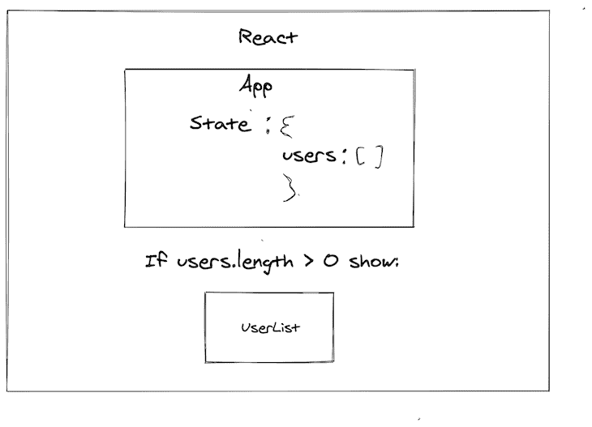
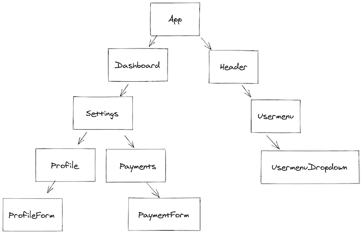
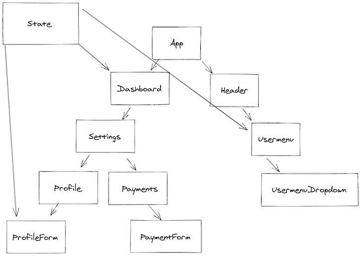
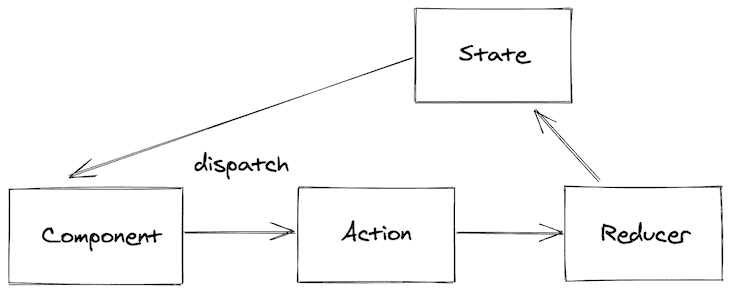
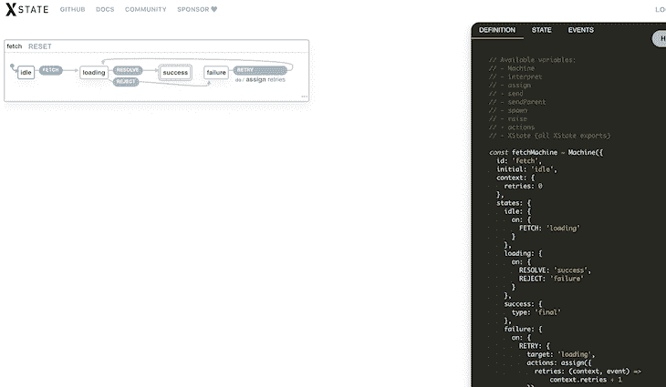

# 反应状态模式的现代指南

> 原文：<https://blog.logrocket.com/guide-understanding-react-state-patterns/>

***编者按:*** *本 React 状态模式指南于 2022 年 8 月 3 日更新，增加了 React 为何使用状态的信息，并增加了区分状态和道具的部分。*

自 2013 年成立以来，React 已经推出了一套强大的工具，帮助开发人员摆脱创建 web 应用程序的一些琐事，让他们专注于重要的事情。

尽管 React 有许多特性，并且在开发人员中一直很受欢迎，但是，我发现我们中的许多人一次又一次地问同一个问题:我们如何使用 React 处理复杂的状态？

在本文中，我们将研究什么是 React 状态，我们如何组织它，以及随着应用程序复杂性的增加，可以采用不同的 React 模式。我们开始吧！

## 什么是反应状态？

在其最纯粹的形式中，React 可以被认为是一个蓝图。给定一些状态，您的应用程序将看起来像某种方式。React 更喜欢声明性命令，这是一种奇特的说法，即你写下你想要发生的事情，而不是写下实现它的步骤。因此，正确管理状态变得极其重要，因为状态控制着应用程序的行为。



Illustration of the concept of state in a React app.

### 行动状态

在我们开始之前，简单讨论一下什么是状态是有用的。就我个人而言，我认为状态是可变值的集合，这些值会随着时间的推移而变化，并直接影响组件的行为。

State 与 props 非常相似，但是不同之处在于，state 可以在定义它的上下文中进行更改，而接收到的 props 在没有传递回调函数的情况下无法更改。

让我们来看看:

```
const UserList = () => {
    const [users, setUsers] = useState([])

     useEffect(() => {
       const getUsers = async () => {
           const response = await fetch("https://myuserapi.com/users")
           const users = await response.json()
           setUsers(users)
       }
       getUsers()
     }, [])

    if (users.length < 1) return null;

    return 
    -       {users.map(user => 
    - {user.name}
    - )}
    -     
}

```

在这个例子中，当组件挂载时，我们从一个 API 获取用户，并在收到响应后更新`users`数组。我们天真地假设调用总是成功的，以降低示例的复杂性。

我们可以看到，状态被用来呈现带有用户名的列表项，如果数组中没有用户，它将返回`null`。状态随时间变化，并用于直接影响组件行为。

同样值得注意的是，我们通过`useState`钩子利用 [React 的状态管理方法。根据应用程序和状态管理的复杂程度，您可能只需要使用 React 的内置钩子来管理您的状态。](https://blog.logrocket.com/a-guide-to-usestate-in-react-ecb9952e406c/)

然而，React 的大量状态管理解决方案清楚地表明，内置的状态管理方法有时是不够的。让我们来看看其中的一些原因。

### 了解支柱钻井

让我们考虑一个稍微复杂一点的应用程序。随着应用程序的增长，为了分离关注点和/或增加可读性，您不得不创建多层组件。当在组件树中不同位置的多个组件中都需要状态时，就会出现问题。



Diagram of a basic React component tree.

如果我们想向`UserMenu`和`Profile`组件提供用户数据，我们必须将状态放在`App`中，因为这是唯一可以将数据传播到每个需要它的组件的地方。这意味着我们将把它传递给可能不需要数据的组件——例如`Dashboard`和`Settings`——用不必要的数据污染它们。

现在，如果您需要操作另一个组件中的数据，该怎么办呢？嗯，您需要向需要进行更新的组件提供 updater 函数(上一个示例中的`setUsers`函数),添加另一个属性来向下传播——所有这些都是为了一个状态。现在，想象一下通过增加五个属性来复合它。它会很快失去控制。

你听过有人说“你需要州立图书馆的时候你就知道了”吗？

对我来说，这意味着我在多层组件中钻研属性和更新功能时感觉有多舒服。我个人对三层有硬性限制；之后，我寻求另一种解决方案。但在那之前，我坚持使用 React 的内置功能。

州立图书馆也是有成本的，除非你确定绝对需要，否则没有理由增加不必要的复杂性。

### 重新渲染的问题

由于 React 会在状态更新后自动触发重新渲染，因此一旦应用程序增长，内部状态处理就会出现问题。组件树的不同分支可能需要相同的数据，为这些组件提供相同数据的唯一方法是[将状态提升到](https://reactjs.org/docs/lifting-state-up.html)最近的共同祖先。

随着应用程序的增长，需要在组件树中向上提升许多状态，这将增加适当的钻取级别，并在状态更新时导致不必要的重新呈现。

### 测试问题

将所有状态保存在组件中的另一个问题是，状态处理对于测试来说变得很麻烦。有状态组件要求您设置复杂的测试场景，在这些场景中，您调用触发状态并匹配结果的操作。以这种方式测试状态会很快变得复杂，并且改变状态在应用程序中的工作方式通常需要完全重写组件测试。

## React 为什么使用状态？

我们在 React 中编写的所有代码都是在组件中定义的。

* * *

### 更多来自 LogRocket 的精彩文章:

* * *

反应状态是一个内置的对象，它存储关于组件的数据或信息。组件的状态会随着时间而改变，当它改变时，组件会重新呈现。用户活动、网络响应或系统生成的事件都会导致状态发生变化，这些变化会影响组件的行为和呈现方式。当您知道变量值会影响视图时，请使用 React state。

React 使用状态来控制组件的行为。因为状态是动态的，所以组件可以跟踪呈现之间不断变化的信息，从而保持它的动态性和交互性。

## 国家对道具

正如我们之前提到的，props 是包含用于控制特定组件行为的数据的对象。虽然这听起来很像状态，但道具和状态完全不同。我们来区分一下这两者。

首先也是最重要的，道具一旦设定就不能更改，而状态是可观察的对象，可以用来保存可能随时间变化的数据。然后，状态在每次更改后控制组件的行为。

此外，属性通常由父组件设置，而状态通常由组件本身在内部更新。

最后，虽然属性对于它们所属的组件是只读的，但是状态包含在单个组件中，并且可以更新。

## 使用 Redux 管理状态

就状态库而言，用于管理状态的最突出和最广泛使用的库之一是 [Redux](https://redux.js.org/introduction/getting-started) 。Redux 于 2015 年推出，是一个状态容器，可以帮助您编写可维护、可测试的状态。它基于来自脸书的开源架构模式 [Flux](https://facebook.github.io/flux/docs/in-depth-overview/) 的原理。



Illustrating how Redux handles state.

本质上，Redux 提供了一个全局状态对象，为每个组件提供它需要的状态，只重新呈现接收状态的组件(及其子组件)。Redux 管理基于动作和归约器的状态。让我们快速检查一下组件:



Illustrating how Redux manages state with actions and reducers.

在这个例子中，组件分派一个动作给 reducer。缩减器更新状态，进而触发重新渲染。

### 状态

国家是真理的唯一来源；它在任何时候都代表你的状态。它的工作是为组件提供状态。示例:

```
{
  users: [{ id: "1231", username: "Dale" }, { id: "1235", username: "Sarah"}]
}

```

### 行动

动作是代表状态变化的预定义对象。它们是遵循特定约定的纯文本对象:

```
{
  type: "ADD_USER",
  payload: { user: { id: "5123", username: "Kyle" } }
}

```

### 还原剂

缩减器是接收动作并负责更新状态对象的函数:

```
const userReducer = (state, action) => {
    switch (action.type) {
       case "ADD_USER":
          return { ...state, users: [...state.users, action.payload.user ]}
       default:
          return state;
    }
}

```

## 当代反应状态模式

虽然 Redux 仍然是一个伟大的工具，但随着时间的推移，React 已经发展并让我们接触到了新技术。此外，状态管理中引入了新的思想和理念，从而产生了许多不同的状态处理方式。在本节中，让我们研究一些更现代的反应状态模式。

### `useReducer`和上下文 API

React 16.8 引入了钩子，为我们提供了通过应用程序共享功能的新方法。因此，我们现在可以访问 React 内置的一个名为`useReducer`的钩子，它允许我们创建开箱即用的减速器。如果我们将这个功能与 React 的上下文 API(T2)结合起来，我们现在就有了一个轻量级的类似 Redux 的解决方案，可以在我们的应用程序中使用。

让我们来看一个用缩减器处理 API 调用的例子:

```
const apiReducer = (state = {}, action) => {
  switch (action.type) {
      case "START_FETCH_USERS":
        return { 
               ...state, 
               users: { success: false, loading: true, error: false, data: [] } 
         }
      case "FETCH_USERS_SUCCESS": 
        return {
              ...state,
              users: { success: true, loading: true, error: false, data: action.payload.data}
        }
      case "FETCH_USERS_ERROR":
        return {
           ...state,
           users: { success: false, loading: false, error: true, data: [] }
        }
      case default:
         return state 
    }
}

```

现在我们有了缩减器，让我们创建我们的上下文:

```
const apiContext = createContext({})

export default apiContext;

```

有了这两部分，我们现在可以通过组合它们来创建一个高度灵活的状态管理系统:

```
import apiReducer from './apiReducer'
import ApiContext from './ApiContext

const initialState = { users: { success: false, loading: false, error: false, data: []}}

const ApiProvider = ({ children }) => {
    const [state, dispatch] = useReducer(apiReducer, initialState)

    return 
      {children}

}

```

完成后，我们现在需要将这个提供者包装在应用程序中需要访问这个状态的组件周围。例如，在我们的应用程序的根:

```
ReactDOM.render(document.getElementById("root"), 

)

```

现在，作为`App`的子组件的任何组件都将能够访问我们的`ApiProviders`状态和 dispatcher，以便以如下方式触发动作和访问状态:

```
import React, { useEffect } from 'react'
import ApiContext from '../ApiProvider/ApiContext

const UserList = () => {
     const { users, apiDispatcher } = useContext(ApiContext)

     useEffect(() => {
        const fetchUsers = () => {
           apiDispatcher({ type: "START_FETCH_USERS" })
           fetch("https://myapi.com/users")
              .then(res => res.json())
              .then(data =>  apiDispatcher({ type: "FETCH_USERS_SUCCCESS", users: data.users }))
              .catch((err) => apiDispatcher({ type: "START_FETCH_ERROR" }))
        }
        fetchUsers()
     }, [])

     const renderUserList = () => {
         // ...render the list 
     }

     const { loading, error, data } = users; 
     return 

         0} show={renderUserList} />

}

```

### 用状态机和 XState 管理状态

管理状态的另一种流行方式是使用状态机。简而言之，状态机是专用的状态容器，可以在任何时候保存有限数量的状态。这使得状态机非常容易预测。因为每个状态机都遵循相同的模式，所以您可以将一个状态机插入到一个生成器中，并接收一个带有数据流概览的状态图。



A state chart produced by XState.

就格式而言，状态机通常遵循比 Redux 更严格的规则，以保持可预测性。在 React 状态管理领域， [XState](https://xstate.js.org/) 是最流行的创建、解释和使用状态机的库。

让我们看看来自 XState 文档的例子:

```
import { createMachine, interpret, assign } from 'xstate';

const fetchMachine = createMachine({
  id: 'Dog API',
  initial: 'idle',
  context: {
    dog: null
  },
  states: {
    idle: {
      on: {
        FETCH: 'loading'
      }
    },
    loading: {
      invoke: {
        id: 'fetchDog',
        src: (context, event) =>
          fetch('https://dog.ceo/api/breeds/image/random').then((data) =>
            data.json()
          ),
        onDone: {
          target: 'resolved',
          actions: assign({
            dog: (_, event) => event.data
          })
        },
        onError: 'rejected'
      },
      on: {
        CANCEL: 'idle'
      }
    },
    resolved: {
      type: 'final'
    },
    rejected: {
      on: {
        FETCH: 'loading'
      }
    }
  }
});

const dogService = interpret(fetchMachine)
  .onTransition((state) => console.log(state.value))
  .start();

dogService.send('FETCH');

```

## `useSWR`

多年来，国家管理变得越来越复杂。虽然适当的状态管理加上像 React 这样的视图库使我们能够做令人惊讶的事情，但毫无疑问，我们正在将许多复杂性转移到前端。随着复杂性的增加，我们也带来了更多的认知负荷、更多的间接性、更多的潜在错误以及更多需要彻底测试的代码。

在这方面一直是一股新鲜空气。将这个 React 状态库与 React 钩子的原生功能结合起来，会产生一种难以抗拒的简单性。这个库使用 HTTP 缓存技术`stale-while-revalidate`，这意味着它保留了以前数据集的本地缓存，并在后台与 API 同步以获取新数据。

这保持了应用程序的高性能和用户友好性，因为 UI 可以在等待获取更新时用过时的日期进行响应。让我们看看如何利用这个库，并消除一些复杂的状态管理。

```
// Data fetching hook
import useSWR from 'swr'

const useUser(userId) {
    const fetcher = (...args) => fetch(...args).then(res => res.json())
    const { data, error } = useSWR(`/api/user/${userId}`, fetcher)

    return { 
      user: data,
      error,
      loading: !data && !error
    }
}

export default useUser

```

现在我们有了一个可重用的钩子，可以用来将数据放入组件视图中。无需创建 reducers、actions 或将组件连接到 state 来获取数据，只需导入并使用需要数据的组件中的钩子:

```
import Loader from '../components/Loader'
import UserError from '../components/UserError'
import useUser from '../hooks/useUser';

const UserProfile = ({ id }) => {
    const { user, error, loading } = useUser(id);

     if (loading) return 
     if (error) return 

      return 

{user.name}

          ...

}

```

在另一个组件中:

```
import Loader from '../components/Loader'
import UserError from '../components/UserError'
import useUser from '../hooks/useUser';

const Header = ({ id }) => {
    const { user, error, loading } = useUser(id);

     if (loading) return 
     if (error) return 

      return 

           ...

}

```

这个方法允许您轻松地传递可以访问共享数据对象的钩子，因为`useSWR`的第一个参数是一个键:

```
const { data, error } = useSWR(`/api/user/${userId}`, fetcher)

```

基于这个键，我们的请求被重复删除、缓存，并在所有使用`useUser`钩子的组件之间共享。这也意味着只要键匹配，就只向 API 发送一个请求。即使我们有 10 个组件使用了`useUser`钩子，只要`useSWR`键匹配，只有一个请求会被发送。

## 结论

如果 React 是一块画布，可以随时呈现应用程序的状态，那么状态对于正确处理非常重要。在本文中，我们已经研究了在应用程序中处理 React 状态的各种方法，事实上，我们可以包括更多的方法。

更不用说 React Query 和 MobX 了，反冲和 Jotai 在这样的讨论中肯定是相关的，事实上我们有许多不同的状态库是一件很棒的事情。它推动我们尝试不同的东西，并推动图书馆作者不断做得更好。这就是前进的方向。

现在，您应该为您的项目选择哪种解决方案？这是一个我无法回答的问题，但我会给出我自己的看法。

就个人而言，我倾向于支持引入最少复杂性的库。有像 Redux 这样的工具供我们使用真是太棒了，有时候也需要它们，但是在你感到痛苦之前，我会选择最简单的解决方案。

对我来说，使用`useSWR`是一种启示，它大大降低了我最近编写的应用程序的间接性和复杂性。

如果你喜欢这篇文章，请在推特上给我留言。如果你想关注我的更多内容，[关注我的 YouTube 频道](https://www.youtube.com/channel/UCZTeUahnA2GMoo_YpTBFo9A)。

## [LogRocket](https://lp.logrocket.com/blg/react-signup-general) :全面了解您的生产 React 应用

调试 React 应用程序可能很困难，尤其是当用户遇到难以重现的问题时。如果您对监视和跟踪 Redux 状态、自动显示 JavaScript 错误以及跟踪缓慢的网络请求和组件加载时间感兴趣，

[try LogRocket](https://lp.logrocket.com/blg/react-signup-general)

.

[ ](https://lp.logrocket.com/blg/react-signup-general) [](https://lp.logrocket.com/blg/react-signup-general) 

LogRocket 结合了会话回放、产品分析和错误跟踪，使软件团队能够创建理想的 web 和移动产品体验。这对你来说意味着什么？

LogRocket 不是猜测错误发生的原因，也不是要求用户提供截图和日志转储，而是让您回放问题，就像它们发生在您自己的浏览器中一样，以快速了解哪里出错了。

不再有嘈杂的警报。智能错误跟踪允许您对问题进行分类，然后从中学习。获得有影响的用户问题的通知，而不是误报。警报越少，有用的信号越多。

LogRocket Redux 中间件包为您的用户会话增加了一层额外的可见性。LogRocket 记录 Redux 存储中的所有操作和状态。

现代化您调试 React 应用的方式— [开始免费监控](https://lp.logrocket.com/blg/react-signup-general)。