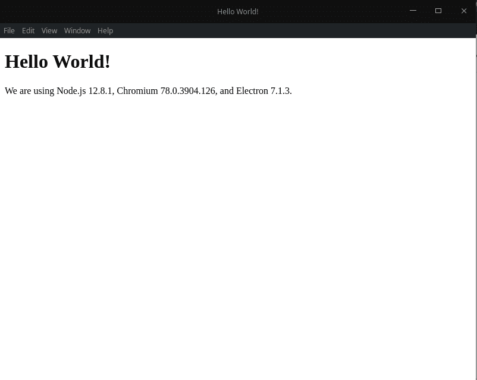
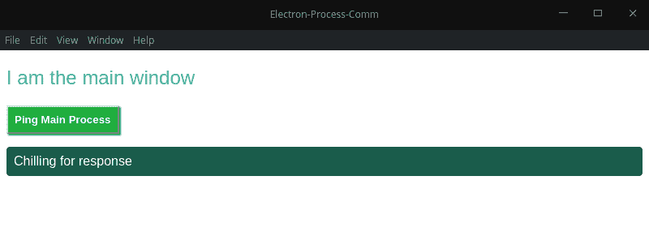
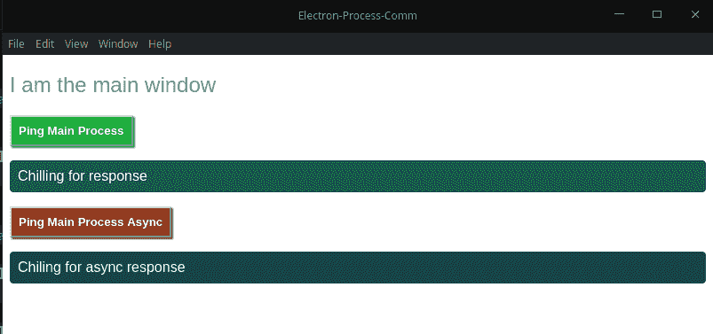
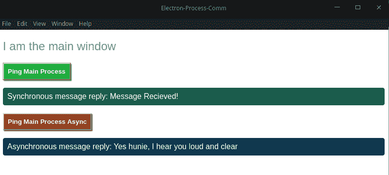

# 处理电子应用程序中的进程间通信，如 pro 

> 原文：<https://blog.logrocket.com/handling-interprocess-communications-in-electron-applications-like-a-pro/>

[电子](https://electronjs.org/)牛逼。我喜欢它，但我知道它有不同的评论。无论你发现自己处于分歧的哪一方，你都不得不承认，它通过使用 web 技术降低了入门门槛，从而彻底改变了桌面应用程序的构建方式。

有了简单的单窗口应用程序，你就不必担心传递数据带来的复杂性。当你的软件有不止一个窗口时，你才开始担心，因为像跟踪数据是如何被移动、持久化和修改这样的事情会很快失控。在本文中，我们将研究如何在不同的窗口(称为进程)之间传递数据，以及常见的陷阱和解决方法。

## 先决条件

在我们进一步讨论之前，本文假设:

*   [Node.js ≥ v6](https://nodejs.org/) 安装在您的机器上
*   您的机器上安装了 npm
*   您已经对电子有了基本的了解，进而对 JavaScript 有了基本的了解

## 入门指南

我们将利用`electron-quick-start`模板。对于这个演示，我们将项目文件夹命名为`electron-process-comm`(您可以随意命名)。

创建项目目录后，运行以下代码:

```
git clone https://github.com/electron/electron-quick-start <your-project-folder>
```

这将快速入门模板克隆到您的项目文件夹中。现在，将目录更改为您的项目目录和`npm install`，然后运行启动脚本:

```
cd <your-project-folder>
npm install
npm start
```

如果一切顺利，将呈现快速入门模板附带的默认 HTML 页面，内容可能会根据您阅读本文的时间而有所不同(由于节点、chromium 和电子更新)。



在我们进入所有有趣的内容之前，让我们先来看几件重要的事情。

## 电子过程

在这种情况下，流程基本上描述了电子应用程序如何运行，分为两个部分:

*   主流程
*   渲染器进程

每个电子 app 只能有一个主进程，它运行 package.json 主脚本，管理其他渲染器进程(创建和管理窗口和一些 API，像文件系统，只在这个进程中可用)。

相比之下，渲染器进程是独立的，只关心运行它的网页。当网页实例被销毁时，相应的呈现器进程也被终止。

值得注意的是，渲染器进程可以表现得像主进程一样。也就是说，访问 API 本来只对主进程是可访问的。然而，通常不鼓励这样做。

## 进程间通信

因为电子被分成两个过程，所以需要一种在它们之间进行通信的方式。Electron 为此提供了一个模块，即 [IPC 模块](https://medium.com/@hamzasurti/in-progress-6959b733a55a)，通过它，您可以在进程之间发送和接收同步和异步消息。主进程和渲染器都有特定的模块， [ipcMain](https://electronjs.org/docs/api/ipc-main) 用于主进程， [ipcRenderer](https://electronjs.org/docs/api/ipc-renderer) 用于渲染器进程。为了演示这是如何工作的，我们将继续修改`index.html`文件和渲染器。

您可能会选择以不同的方式组织项目的文件夹结构，但是因为这只是为了演示的目的，所以我将保持它的原样。

## 同步 IPC 消息传递

我们将从修改 index.html 开始。用以下内容更改`<body>`标签中的内容:

```
<h2 id="mainWindowTitle">I am the main window</h2>
<button id="sendSyncMsgBtn">Ping Main Process</button>
<p id="syncReply">Chilling for response</p>
```

接下来，我们定义一些样式。创建一个`style.css`文件，并将以下样式块复制到其中:

```
#mainWindowTitle{
    color: rgb(54, 168, 168);
    font-family: -apple-system, BlinkMacSystemFont, 'Segoe UI', Roboto, Oxygen, Ubuntu, Cantarell, 'Open Sans', 'Helvetica Neue', sans-serif;
    font-weight: 200;
}
#sendSyncMsgBtn {
    color: #fff;
    font-family: sans-serif;
    font-weight: bold;
    padding: .5rem;
    background-color: rgb(31, 173, 62);
    box-shadow: 2px 2px 2px rgb(31, 173, 62);
}
#syncReply {
    font-family: sans-serif;
    color: #fff;
    border: 1px solid rgb(26, 92, 75);
    border-radius: 4px;
    padding: .5rem;
    background-color: rgb(26, 92, 75);
    box-shadow: inset 0 0 2px rgb(26, 92, 75);
}
```

接下来，将我们新风格的链接放在 index.html 的头部。此外，如果您愿意，也可以更改标题中的文字:

```
<title>Electron-Process-Comm</title>
<link rel="stylesheet" href="style.css">
```

要查看我们更改的结果，请在项目目录中打开一个终端并运行 start 命令:

```
npm start
```

一旦启动，您的应用程序窗口将如下所示:



准备好之后，打开`renderer.js`文件，添加当我们点击按钮时将被触发的代码，包括负责接受响应的代码。首先，我们首先在渲染器进程中导入正确的 IPC 模块`ipcRenderer`。

```
const electron = require('electron')
const ipc = electron.ipcRenderer
```

然后，我们获取对按钮的引用，并为其附加一个事件侦听器:

```
const syncMsgBtn = document.querySelector('#sendSyncMsgBtn')
syncMsgBtn.addEventListener('click', () => {

})
```

对于每个 IPC 发送，必须有一个 IPC 接收方法。这个调用的基本结构如下所示:

```
ipcRenderer.sendSync (channel, \[, arg1\][, arg2], [,...})
```

channel 参数是用作消息标识符的字符串。伴随方法将监听的就是这个标识符。您可以选择发送额外的值作为参数，可以是任何 JavaScript 原语(字符串、数字、数组、对象):

```
syncMsgBtn.addEventListener('click', () => {
  const reply = ipc.sendSync('sync-message', 'Sent from main Window')
})
```

每当我们处理 IPC 事件时，一旦我们编写了发送函数，我们就切换到另一个进程并编写相应的存根函数。所以，让我们切换到`main.js`文件，这样做。主流程也需要导入 IPC 模块:

```
const {app, BrowserWindow, ipcMain} = require('electron')
```

我们现在可以编写我们的接收器函数，这非常简单，我们定义它应该监听哪个通道以及要执行的函数:

```
ipcMain.on('sync-message', (event, arg) => {
})
```

回调函数有两个参数，事件对象和参数。虽然参数将包含发送函数传递的数据，但事件对象有一些特殊的函数。事件对象具有响应发送者的内置能力。这意味着不需要编写另一组侦听器和接收器来传递响应。对于同步 IPC 消息，方法是:

```
event.returnValueipcMain.on('sync-message', (event, arg) => {
 event.returnValue = 'Message Recieved!'
})
```

然后我们切换回`renderer.js`文件，在这里我们可以添加代码来处理这个返回值。我们从主进程发送的值将存储在回复中。完整的代码如下所示:

```
const syncMsgBtn = document.querySelector('#sendSyncMsgBtn')
syncMsgBtn.addEventListener('click', () => {
    const reply = ipc.sendSync('sync-message', 'Sent from main Window')
    const message = `Synchronous message reply: ${reply}`
    document.querySelector('#syncReply').innerHTML = message
})
```

一旦你确定你已经得到了所有这些，开始启动你的应用程序并测试它。如果一切顺利，您应该会看到类似这样的内容。


这些是在 electronic 中同步使用 IPC 模块的基础。现在，让我们探索以异步方式使用 IPC 消息传递！

## 异步 IPC 消息传递

同步消息传递的一大缺点是，对于需要一些时间才能完成的任务，它会阻塞呈现器进程，从而使应用程序在此期间无法正常工作。这不是一个很好的用户体验，所以对于这样的场景，我们可以使用异步 IPC 方法来代替。

我们现在将向我们的 index.html 文件添加两个元素:

```
<button id="sendAsyncMsgBtn">Ping Main Process Async</button>
<p id="asyncReply">Chilling for async response</p>
```

另外，将以下块样式添加到 style.css 文件中，这是我们添加的新元素的样式:

```
#sendAsyncMsgBtn{
    color: #fff;
    font-family: sans-serif;
    font-weight: bold;
    padding: .5rem;
    background-color: rgb(146, 58, 31);
    box-shadow: 2px 2px 2px rgb(146, 58, 31);
}
#asyncReply{
    font-family: sans-serif;
    color: #fff;
    border: 1px solid rgb(16, 56, 78);
    border-radius: 4px;
    padding: .5rem;
    background-color: rgb(16, 56, 78);
    box-shadow: inset 0 0 2px rgb(16, 56, 78);
}
```



切换到我们的`renderer.js`文件，我们将获得对新按钮的引用，像以前一样，我们将为按钮点击创建一个事件监听器:

```
const asyncMsgBtn = document.querySelector('#sendAsyncMsgBtn')
asyncMsgBtn.addEventListener('click', () => {

})
```

使用异步 IPC 消息有两个主要区别。第一种是不使用`sendSync`方法，而是使用 send 方法:

```
asyncMsgBtn.addEventListener('click', () => {
  ipc.send('async-message', 'Async message baby')
})
```

另一个区别是，我们现在必须显式地编写回调函数，该函数将处理来自主进程的响应:

```
ipc.on('async-reply', (event, arg) => {
 const message = `Asynchronous message reply: ${arg}`
 document.querySelector('#asyncReply').innerHTML = message
})
```

主进程中的 IPC 代码在`main.js`文件中也略有变化。实际的监听器并没有改变，但是响应的方法改变了。我们现在使用`event.sender.send`来响应，而不是在`Event`对象上调用`returnValue`方法:

```
ipcMain.on('async-message', (event, arg) => {
 if (arg === 'Async message baby') {
 event.sender.send('async-reply', 'Yes hunie, I hear you loud and clear')
 }
})
```

您现在可以继续测试这个新功能了。您应该能够触发这两种类型的 IPC 消息。



## 结论

IPC 消息传递的概念适用于与应用程序的闪屏窗口和主进程通信等概念。在这里，我们使用来自渲染器进程的动作在主进程中启动了一个第三方库。

IPC 模块没有很多方法——只是发送和接收的变体。这对于电子应用中的进程共存至关重要。

## 使用 [LogRocket](https://lp.logrocket.com/blg/signup) 消除传统错误报告的干扰

[](https://lp.logrocket.com/blg/signup)

[LogRocket](https://lp.logrocket.com/blg/signup) 是一个数字体验分析解决方案，它可以保护您免受数百个假阳性错误警报的影响，只针对几个真正重要的项目。LogRocket 会告诉您应用程序中实际影响用户的最具影响力的 bug 和 UX 问题。

然后，使用具有深层技术遥测的会话重放来确切地查看用户看到了什么以及是什么导致了问题，就像你在他们身后看一样。

LogRocket 自动聚合客户端错误、JS 异常、前端性能指标和用户交互。然后 LogRocket 使用机器学习来告诉你哪些问题正在影响大多数用户，并提供你需要修复它的上下文。

关注重要的 bug—[今天就试试 LogRocket】。](https://lp.logrocket.com/blg/signup-issue-free)