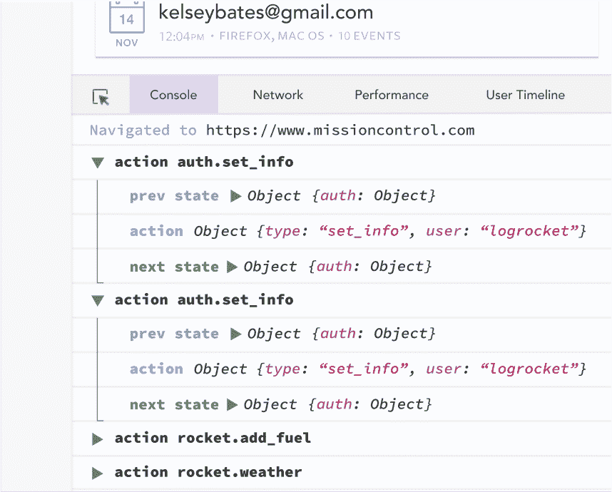

# 在 Angular + Redux 应用程序中处理副作用

> 原文：<https://blog.logrocket.com/handling-side-effects-angular-redux-application/>

## 介绍

随着 Redux 在前端生态系统中的广泛流行，Angular 和其他领先的前端框架已经将它作为一个可靠的状态管理库。

但不幸的是，Redux 架构没有提供任何内置功能来处理 Redux 状态树的异步数据更改(也称为副作用)。因此，当这些异步操作完成时，Redux 状态树将受到影响。

本文将介绍@ngrx/effects 库，这是一个用于处理 ngrx 应用程序中副作用的特殊包，以及如何使用它来处理 NgRx 应用程序中的副作用。

### 先决条件

1.  角度的知识
2.  NgRx 知识
3.  打字知识

## 有什么副作用？

副作用是从远程服务器获取数据、访问本地存储、记录分析事件以及访问通常在未来某个时间完成的文件等操作。

知道了副作用之后，假设我们想要向 API 端点发出请求，以获取应用程序中的用户列表。考虑到这种操作将是异步的，将考虑以下情况:

1.  `FETCHING_USERS`
2.  `USERS_FETCH_SUCCESSFUL`
3.  `ERROR_FETCHING_USERS`

让我们通过做一些练习弄脏我们的手。

## 环境设置

使用以下命令创建一个新的角度项目:

```
ng new side-effects

```

运行以下命令安装本练习所需的依赖项:

```
npm install --save @ngrx/effects @ngrx/store rxjs

```

接下来，我们将运行以下命令为用户创建一个功能模块:

```
ng generate module user

```

然后，我们将创建一个`constants.ts`文件来保存`FETCHING USERS`、`USERS FETCH SUCCESSFUL`和`ERROR FETCHING USERS`，如下所示:

```
//src/app/user/user.constants.ts
export const FETCHING_USERS = "FETCHING_USERS";
export const USERS_FETCH_SUCCESSFUL = "USERS_FETCH_SUCCESSFUL";
export const ERROR_FETCHING_USERS = "ERROR_FETCHING_USERS";

```

## 动作创建者

动作创建器是创建和返回动作的辅助函数。知道了这一点，让我们创建一个如下:

```
//src/app/user/user.actions.ts
import {
    USERS_FETCH_SUCCESSFUL,
    ERROR_FETCHING_USERS,
    FETCHING_USERS
} from "./user.constants";
export const usersFetchSuccessful = users => ({
    type: USERS_FETCH_SUCCESSFUL,
    payload: users
});
export const fetchError = error => ({
    type: ERROR_FETCHING_USERS,
    payload: error
});

export const fetchingUsers = () => ({ type: FETCHING_USERS });

```

这里我们导出了`usersFetchSuccessful`、`fetchError`和`fetchingUsers`，在组件中需要它们来与 NgRx 存储交互。

如果发生错误，将调用`fetchError()`动作创建器，一旦数据从端点成功返回，将调用`usersFetchSuccessful()`动作创建器，一旦发起 API 请求，将调用`fetchingUsers()`动作创建器。

## 创建减速器

Reducers 是不会改变状态的纯函数。相反，它们产生了一个新的状态。reducer 指定应用程序的状态如何改变以响应触发的动作。

让我们按如下方式创建我们的减速器:

```
//src/app/user/user.reducers.ts
import {
    USERS_FETCH_SUCCESSFUL,
    ERROR_FETCHING_USERS,
    FETCHING_USERS
} from "./user.constants";
import { User } from "./user.model";
import { ActionReducerMap } from "@ngrx/store/src/models";
const initialState = {
    loading: false,
    list: [],
    error: void 0
};
export interface UserState {
    loading: boolean;
    list: Array<User>;
    error: string;
}
export interface FeatureUsers {
    users: UserState;
}
export const UserReducers: ActionReducerMap<FeatureUsers> = {
    users: userReducer
};
export function userReducer(state = initialState, action) {
    switch (action.type) {
        case USERS_FETCH_SUCCESSFUL:
            return { ...state, list: action.payload, loading: false };
        case ERROR_FETCHING_USERS:
            return { ...state, error: action.payload, loading: false };
        case FETCHING_USERS:
            return { ...state, loading: true };
        default:
            return state;
    }
}

```

每次从连接到存储的任何组件调度一个动作时，reducer 都会接收该动作，并针对每种情况测试该动作的类型属性。如果测试不满足这些情况中的任何一个，它将返回当前状态。

## 创造效果

效果允许我们执行一个特定的任务，然后在任务完成后调度一个动作。

知道了这一点，让我们创建我们的效果，它将处理发送请求、接收请求以及在请求失败时接收错误响应的整个过程:

```
//src/app/user/user.effect.ts
import { Actions, Effect, ofType } from "@ngrx/effects";
import { HttpClient } from "@angular/common/http";
import { FETCHING_USERS } from "./product.constants";
import { Injectable } from "@angular/core";
import { Observable } from "rxjs/Observable";
import { delay, map, catchError, switchMap } from "rxjs/operators";
import { usersFetchSuccessful, fetchError } from "./user.actions";
import { Action } from "@ngrx/store";
import { of } from "rxjs/observable/of";
@Injectable()
export class UserEffects {
    @Effect()
    users$: Observable<Action> = this.actions$.pipe(
        ofType(FETCHING_USERS),
        switchMap(action =>
            this.http
                .get("https://jsonplaceholder.typicode.com/users")
                .pipe(
                    delay(3000),
                    map(usersFetchSuccessful),
                    catchError(err => of(fetchError(err)))
                )
         )
    );
    constructor(private actions$: Actions<Action>, private http: HttpClient) {
        console.log("user effects initialized");
    }
}

```

这里，`@Injectable`装饰器用于装饰`Effect`类。

`ofType()`方法允许我们监听特定的调度动作，在我们的例子中，`FETCHING_USERS`触发`switchMap()`方法允许我们将当前的可观察对象转换为 AJAX 服务。`delay()`方法允许我们显示一段时间的负载指示器。`map()`方法允许我们在 AJAX 响应成功时分派一个动作。

## 记录效果

有两种方法记录效果。我们可以在根模块或特征模块中这样做。前一种方法使效果可以在整个应用程序中全局访问，而后一种方法将其可访问性限制在特定的模块中。出于代码可重用性的考虑，后者是首选。

```
//src/app/user/user.module.ts
import { NgModule } from "@angular/core";
import { UserComponent } from "./user.component";
import { BrowserModule } from "@angular/platform-browser";
import { UserEffects } from "./user.effect";
import { EffectsModule } from "@ngrx/effects";
import { StoreModule, Action } from "@ngrx/store";
import { UserReducers } from "./user.reducers";
import { HttpClientModule } from "@angular/common/http";

@NgModule({
    imports: [
        BrowserModule,
        StoreModule.forFeature("featureUsers", UserReducers),
        EffectsModule.forFeature([UserEffects]),
        HttpClientModule
    ],
    exports: [UserComponent],
    declarations: [UserComponent],
    providers: []
})
export class UserModule {}

```

对于一个特性模块，我们将在`EffectsModule`上使用`forFeature()`方法。

现在我们已经完成了效果的创建和注册，让我们从组件中访问效果。

## 创建选择器

如果你以前用过 Vuex，你会很熟悉 getters，类似于[NgRx](https://blog.logrocket.com/angular-state-management-made-simple-with-ngrx/)T2s[选择者](https://blog.logrocket.com/angular-state-management-made-simple-with-ngrx/)。选择器用于从存储状态中获取计算信息。我们可以在动作和组件中多次调用 getters。

了解了这一点，让我们创建我们的选择器:

```
//src/app/user/user.selector.ts
import { AppState } from "../app-state";
export const getList = (state: AppState) => state.featureUsers.users.list;
export const getError = (state: AppState) =>
    state.featureUsers.users.error;
export const isLoading = (state: AppState) =>
    state.featureUsers.users.loading;

```

在等待 AJAX 请求完成时，我们需要一个组件来显示加载指示器。如果请求成功，该组件将显示我们的数据，否则将显示一条错误消息。

## 创建组件

当 AJAX 请求挂起时，让我们创建一个组件来显示数据和加载指示器:

```
//src/app/user/user.component.ts
import { Component, OnInit } from "@angular/core";
import { AppState } from "../app-state";
import { Store } from "@ngrx/store";
import { fetchingUsers } from "./user.actions";
import { getList, isLoading, getError } from "./user.selector";
@Component({
    selector: "users",
    template: `
        Users:
        <div *ngFor="let user of users$ | async">
            {{ user.email }}
        </div>
        <div *ngIf="loading$ | async; let loading">
            <div *ngIf="loading">
            fetching users...
            </div>
        </div>
        <div *ngIf="error$ | async; let error" >
            <div *ngIf="error">{{ error }}</div>
        </div>
`
})
export class UserComponent implements OnInit {
    users$;
    loading$;
    error$;
    constructor(private store: Store<AppState>) {
        this.users$ = this.store.select(getList);
        this.loading$ = this.store.select(isLoading);
        this.error$ = this.store.select(getError);
    }
    ngOnInit() {
        this.store.dispatch(fetchingUsers());
    }
}

```

这里存储是通过构造函数注入的，所以我们可以通过存储的`select()`方法从存储中访问状态对象的属性。商店的`select`方法返回一个使用异步管道在模板中呈现的可观察对象。

有了这个，我们来更新一下`AppState`:

```
//src/app/app-state.ts
import { FeatureUsers } from "./user/user.reducer";
export interface AppState {
    featureUsers: FeatureUsers;
}

```

因为`AppState`现在知道了结果用户对象的结构，所以我们的组件能够触发`store.select()`方法。

还有，我们来更新一下`appModule`:

```
import { BrowserModule } from "@angular/platform-browser";
import { NgModule } from "@angular/core";
import { EffectsModule } from "@ngrx/effects";
import { AppComponent } from "./app.component";
import { StoreModule } from "@ngrx/store";
import { UserModule } from "./user/user.module";
@NgModule({
    declarations: [AppComponent],
    imports: [
        BrowserModule,
        EffectsModule,
        StoreModule.forRoot({}),
        EffectsModule.forRoot([]),
        UserModule
    ],
    providers: [],
    bootstrap: [AppComponent]
})
export class AppModule {}

```

让我们用下面的命令来看看到目前为止我们在浏览器上构建了什么:

```
npm start

```

## 结论

在本文中，我们展示了如何使用`@ngrx/effects`库处理 NgRx 应用程序中的副作用，同时构建一些 [R](https://blog.logrocket.com/8-definitive-rules-building-apps-redux/) [edux 概念](https://blog.logrocket.com/8-definitive-rules-building-apps-redux/)，如动作、归约器和常数。此外，我们能够创建处理未决请求、AJAX 请求中的错误和成功的 AJAX 请求的效果。

关于 NgRx 的更多信息，你可以[在这里](https://ngrx.io/docs)查阅 NgRx 的官方文档。这里是本教程的 [GitHub repo](https://github.com/emmanuelhashy/ngrx-effect) 。

如果您有任何问题或建议，请在下面的评论区联系我们。

## 像用户一样体验 Angular 应用程序

调试 Angular 应用程序可能很困难，尤其是当用户遇到难以重现的问题时。如果您对监视和跟踪生产中所有用户的角度状态和动作感兴趣，

[try LogRocket](https://lp.logrocket.com/blg/angular-signup)

.

[](https://lp.logrocket.com/blg/angular-signup)[https://logrocket.com/signup/](https://lp.logrocket.com/blg/angular-signup)

LogRocket 就像是网络和移动应用程序的 DVR，记录你网站上发生的一切，包括网络请求、JavaScript 错误等等。您可以汇总并报告问题发生时应用程序的状态，而不是猜测问题发生的原因。

LogRocket NgRx 插件将角度状态和动作记录到 LogRocket 控制台，为您提供导致错误的环境，以及出现问题时应用程序的状态。

现代化调试 Angular 应用的方式- [开始免费监控](https://lp.logrocket.com/blg/angular-signup)。