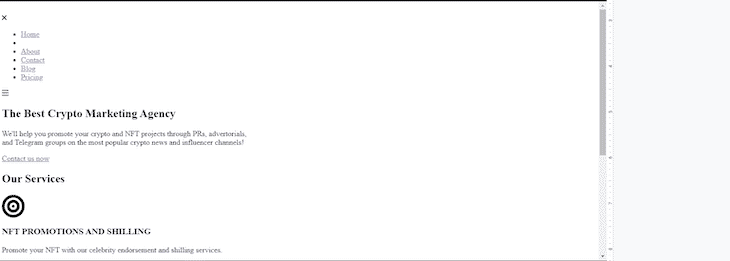

# 使用 CSS 隐藏滚动条而不影响滚动

> 原文：<https://blog.logrocket.com/hide-scrollbar-without-impacting-scrolling-css/>

滚动条可以让一个优雅的网站看起来像是 90 年代的，但是由于新的 CSS 属性，我们可以隐藏滚动条而不影响用户的滚动能力。

浏览器中的滚动条允许用户在页面上上下滚动，而不必将手从键盘或触控板上拿开，但为了让页面更光滑，一些网站选择完全隐藏滚动条。

本指南将向你展示如何利用现代 CSS 技术在几种流行的浏览器中隐藏滚动条。别再浪费时间了，让我们开始吧。

本文将涵盖:

***注意，**为了从这篇文章中得到最大的收获，你应该对 HTML 和 CSS 有一个基本的了解*

虽然出于可访问性的考虑，不去改变默认的浏览器样式是一种常见的做法，但是当涉及到滚动条时，有充分的理由让你隐藏它们。

滚动条为使用鼠标或键盘上下滚动提供了视觉提示。然而，许多布局和设计模式并不需要这种视觉提示，包括静态的，比如幻灯片或产品展示。隐藏滚动条将创建一个更平滑的滚动体验，并从你的网站整体布局中移除一些干扰。

隐藏滚动条还可以帮助您为页面上的其他内容节省空间，因为不同的操作系统可能不会以相同的方式呈现滚动条，所以它可以在不同的设备上提供更一致的用户体验。然而，隐藏滚动条最常见的原因是为了改善移动浏览体验。

当在手机上查看脸书这样的应用时，大多数用户希望滚动是垂直的，不需要水平移动，因为屏幕通常又高又窄。隐藏滚动条可以创建更自然的感觉，同时减少对浏览技术方面的关注。

如今，滚动条对大多数网站来说是不必要的；隐藏它们会给你的网站一个干净的外观和感觉，远比过时的酒吧复杂。将它们从你的站点中移除也有助于提高页面加载速度和浏览器窗口的实际空间。

现在你可能想知道，当这些讨厌的酒吧似乎不想自己离开的时候，你该如何摆脱它们。我们将在下面详细讨论。

由于浏览器之间的根本差异，没有用 CSS 隐藏滚动条的通用方法。每个浏览器都有自己的方法，我们将在下面一一介绍。

要在基于 WebKit 的浏览器中隐藏滚动条，您必须使用`::-webkit-scrollbar`伪选择器。`::-webkit-scrollbar`是 CSS 中的一个伪元素，开发者使用它来修改浏览器滚动条的外观。

使用`::-webkit-scrollbar`伪选择器，你可以对滚动条做很多事情。您可以修改上下箭头，更改轨道的颜色，更改背景，等等。但是我们只看如何隐藏滚动条而不影响滚动。

让我们看一个例子。

首先，我将添加我正在构建的一个随机网站的 HTML:

```
<html lang="en">
<head>
    <meta charset="UTF-8">
    <meta http-equiv="X-UA-Compatible" content="IE=edge">
    <meta name="viewport" content="width=device-width, initial-scale=1.0">
    <title>Fimber's template</title>
    <link rel="stylesheet" href="style.css">
    <link rel="preconnect" href="https://fonts.googleapis.com">
    <link rel="preconnect" href="https://fonts.gstatic.com" crossorigin>
    <link href="https://fonts.googleapis.com/css2?family=Poppins:[email protected]&family=Staatliches&family=Titan+One&display=swap" rel="stylesheet">
    <script src="https://kit.fontawesome.com/efbc88a111.js" crossorigin="anonymous"></script>
</head>
<body>
   <section class="header">
        <nav>
            <a href="http://index.html"></a>
            <div class="navlinks" id="navLinks">
                <i class="fa fa-times" onclick="hideMenu()"></i>
                    <ul>
                        <li> <a href="http://">Home</a></li><li>
                        <li> <a href="http://">About</a></li>
                        <li> <a href="http://">Contact</a></li>
                        <li> <a href="http://">Blog</a></li>
                        <li> <a href="http://">Pricing</a></li>
                    </ul>
            </div>
            <i class="fa fa-bars" onclick="showMenu()"></i>
        </nav>

        <div class="textbox">
            <h1>The Best Crypto Marketing Agency</h1>
            <p>We'll help you promote your crypto and NFT projects through PRs, advertorials, </br>and Telegram groups on the most popular crypto news and influencer channels!</p>
            <a href="" class="herobtn">Contact us now</a>
        </div>

   </section>

   <!--SERVICES START-->
    <section class="services">
        <h2>Our Services</h2>

        <div class="row">
            <div class="services-col">
                <i class="fa-solid fa-bullseye fa-3x"></i>
                <h3>NFT PROMOTIONS AND SHILLING</h3>
                <P>Promote your NFT with our celebrity endorsement and shilling services.</P>
            </div>

            <div class="services-col">
                <i class="fa-solid fa-person-chalkboard fa-3x"></i>
                <h3>MODERATION AND AMAs</h3>
                <P>Get quality moderators for your community, and get access to premium AMA channels</P>
            </div>

            <div class="services-col">
                <i class="fa-solid fa-business-time fa-3x"></i>
                <h3>INFLUENCER MARKETING AND PRESS RELEASES</h3>
                <P>Get celebrity influencer endorsement, and Get your PR instantly published on 100s of the biggest crypto and finance new sites! </P>
            </div>
        </div>
    </section>

</body>
</html>

```

有相当多的内容使它可以滚动。上面的代码是这样的:



如你所见，在下面的代码笔中，滚动条在右边可见。为了在不影响滚动的情况下使其不可见，您只需使用`::-webkit-scrollbar`伪选择器瞄准 body 元素，并将 display 设置为`none`:

```
body::-webkit-scrollbar{
    display: none;
  }

```

现在，滚动条不再可见，但是对于鼠标和键盘，页面仍然是可滚动的。

在 [CodePen](https://codepen.io) 上看到 fimber elems([@ fimbosky 1](https://codepen.io/Fimbosky1))
的 [使滚动条不可见](https://codepen.io/Fimbosky1/pen/jOxMxjY)。

同样的技术也可以用来定位包含可滚动内容的元素，并使滚动条不可见。例如，如果您需要使特定部分的滚动条不可见，您只需使用相同的代码来定位该部分:

```
section::-webkit-scrollbar{
    display: none;
  }

```

注意，这段代码只适用于基于 WebKit 的浏览器。

还有其他方法可以让滚动条消失。例如，您可以直接将滚动条作为目标，将其宽度减少到零:

```
  section::-webkit-scrollbar {
    width: 0 !important
    }

```

您将获得相同的结果，而不会影响可访问性和键盘滚动。

在 IE 和 Edge 中隐藏滚动条的语法与 Opera、Chrome 和 Safari 等基于 WebKit 的浏览器略有不同。这里，我们必须使用`-ms-overflow-style`属性。

根据 [CodeProject](https://reference.codeproject.com/css/-ms-overflow-style) 的说法，“`-ms-overflow-style`是一个专有的 CSS 属性，特定于 Internet Explorer 和 Microsoft Edge，它控制元素内容溢出时滚动条的行为。”

与`::-webkit-scrollbar`不同，你不能使用`-ms-overflow-style`来定制滚动条。要用它来隐藏滚动条，你只需要使用下面的代码。

如果您的目标是特定的元素或部分，请使用以下代码:

```
.element {
    -ms-overflow-style: none;
  }

```

如果您的目标是整个页面，请使用以下代码:

```
body {
    -ms-overflow-style: none;
  }

```

要在 Firefox 中成功隐藏滚动条，您只需使用`scrollbar-width:none`属性来定位这样一个部分:

```
section {
    scrollbar-width: none;
  }

```

要在 Firefox 中定位整个页面的滚动条，你必须更加小心。在上面的两个部分中，我们将滚动条代码应用到了`body`标签，并且成功了，但是在 Firefox 中，我们必须将目标指向`html`标签:

```
html {
    scrollbar-width: none;
  }

```

或者，您可以选择使用这种方法来隐藏 Firefox 中的滚动条。

* * *

### 更多来自 LogRocket 的精彩文章:

* * *

```
.element {
    overflow: -moz-scrollbars-none;
    }

```

如果你的网站的某个部分有可滚动的内容，保持滚动条可见对可用性和可访问性都有好处。但是，正如我们前面所说的，滚动条总是可见会破坏网站的美观。

幸运的是，有一个解决方法——我们可以让滚动条只在悬停时可见。这意味着如果目标部分不活动，滚动条将不会起作用。让我们创建一个测试`<``div``>`作为例子:

```
<div>"Lorem ipsum dolor sit amet, consectetur adipiscing elit, sed do eiusmod tempor incididunt ut labore et dolore magna aliqua. Ut enim ad minim veniam, quis nostrud exercitation ullamco laboris nisi ut aliquip ex ea commodo consequat. Duis aute irure dolor in reprehenderit in voluptate velit esse cillum dolore eu fugiat nulla pariatur. Excepteur sint occaecat cupidatat non proident, sunt in culpa qui officia deserunt mollit anim id est laborum. Sed ut perspiciatis unde omnis iste natus error sit voluptatem accusantium doloremque laudantium, totam rem aperiam, eaque ipsa quae ab illo inventore veritatis et quasi architecto beatae vitae dicta sunt explicabo. Nemo enim ipsam voluptatem quia voluptas sit aspernatur aut odit aut fugit, sed quia consequuntur magni dolores eos qui ratione voluptatem sequi nesciunt. Neque porro quisquam est, qui dolorem ipsum quia dolor sit amet, consectetur, adipisci velit, sed quia non numquam eius modi tempora incidunt ut labore et dolore magnam aliquam quaerat voluptatem. Ut enim ad minima veniam, quis nostrum exercitationem ullam corporis suscipit laboriosam, nisi ut aliquid ex ea commodi consequatur? Quis autem vel eum iure reprehenderit qui in ea voluptate velit esse quam nihil molestiae consequatur, vel illum qui dolorem eum fugiat quo voluptas nulla pariatur?"
</div>

```

现在，让我们来设计它:

```
div {
  height: 200px;
  width: 300px;
  margin: 0 auto;
  overflow: hidden;
}
div:hover {
  overflow-y: scroll;
}

```

使用上面的代码，滚动条对于特定的`<div>`是隐藏的，只有当我们悬停在它上面时才显示出来:

参见 [CodePen](https://codepen.io) 上 FIM ber elems([@ fimbosky 1](https://codepen.io/Fimbosky1))
悬停上的笔[】滚动条。](https://codepen.io/Fimbosky1/pen/oNMpBxx)

无障碍问题

## 在网站上隐藏滚动条会给依赖辅助技术的用户带来可访问性问题。一些例子是依赖屏幕阅读器、缺乏精细运动控制或有认知障碍的人。如果没有可见的滚动条，这些用户可能无法判断页面是否可以滚动，也不知道他们已经滚动了多远。

如果您正在实现隐藏滚动条，您应该考虑隐藏滚动条带来的潜在可访问性问题，并采取措施确保所有用户都可以访问和使用网站的内容和功能。这可能包括提供可选的滚动方法，比如键盘命令，或者提供一个开关来打开和关闭滚动条。

结论

## 如果你正在读这篇文章，那么到现在为止，你已经完全理解了用 CSS 隐藏滚动条而不影响滚动和可访问性的艺术。重要的是要注意，当定位具有可滚动内容的部分时，将滚动条作为视觉提示保持可见将有助于用户注意到该部分，而不是意外跳过它。

希望这篇文章对你有很大的帮助。下一集见。

你的前端是否占用了用户的 CPU？

## 随着 web 前端变得越来越复杂，资源贪婪的特性对浏览器的要求越来越高。如果您对监控和跟踪生产环境中所有用户的客户端 CPU 使用情况、内存使用情况等感兴趣，

.

[try LogRocket](https://lp.logrocket.com/blg/css-signup)

LogRocket 就像是网络和移动应用的 DVR，记录你的网络应用或网站上发生的一切。您可以汇总和报告关键的前端性能指标，重放用户会话和应用程序状态，记录网络请求，并自动显示所有错误，而不是猜测问题发生的原因。

[](https://lp.logrocket.com/blg/css-signup)[https://logrocket.com/signup/](https://lp.logrocket.com/blg/css-signup)

现代化您调试 web 和移动应用的方式— [开始免费监控](https://lp.logrocket.com/blg/css-signup)。

Modernize how you debug web and mobile apps — [Start monitoring for free](https://lp.logrocket.com/blg/css-signup).