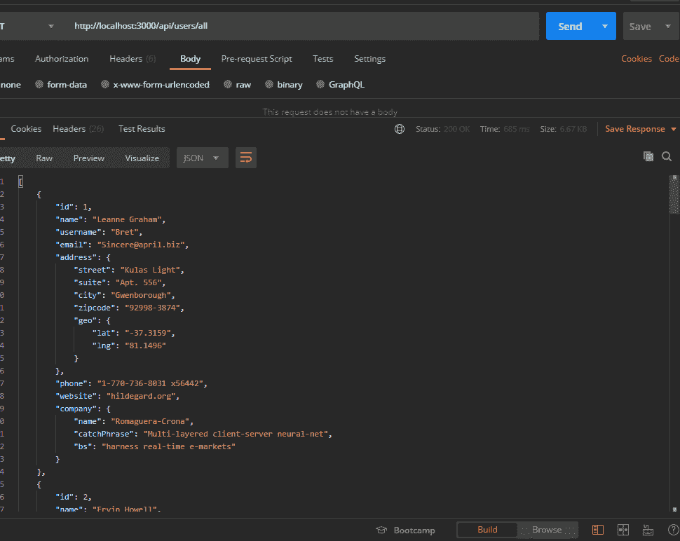

# 什么是代理，它在 Node.js 中是如何工作的？- LogRocket 博客

> 原文：<https://blog.logrocket.com/how-a-proxy-server-works-in-node-js/>

在本文中，我们将深入探讨代理服务器，包括它们是什么、它们的优点、可用的类型以及它们潜在的缺点。然后，我们将探索如何在 Node.js 中使用代理服务器来了解幕后发生的事情。

## 什么是代理服务器？

想象你在一家餐馆里。你想点一瓶赤霞珠，但你不想去吧台。相反，你打电话给服务员，给他们你的订单，他们去酒吧为你点一瓶酒。在这个场景中，你就是电脑，服务员就是代理服务器，吧台就是互联网。

代理服务器功能强大，因为它们充当中间人，传达您的需求和请求，而不将您的信息提供给互联网。代理还可以让您绕过某些安全块，并允许您访问可能被阻止的信息。这可以通过使用一个不会泄露你个人 IP 地址代理服务器来实现。

每台连接到互联网的计算机都已经有了一个互联网协议(IP)地址。对于个人用户来说，[一个 IP 地址就像你的计算机地址](https://blog.logrocket.com/detect-location-and-local-timezone-of-users-in-javascript-3d9523c011b9/)。就像服务员知道把你的酒端上哪张桌子一样，互联网知道把你请求的数据发送回你的 IP 地址。

另一方面，当代理服务器发送您的请求时，它有能力将您的 IP 地址更改为它自己的地址和“位置”，从而保护您的个人地址和数据。

那么为什么要使用代理服务器呢？是不是应该一直用一个来保护自己的 IP？这是搜索数据最安全的方法？您如何确保使用正确的服务器？这些都是重要的问题，我们将在下面的部分中回答它们。

## 为什么要使用代理服务器？

个人或组织使用代理有几个原因，其中最常见的是解除对其所在区域受限的网站的阻止，或者在浏览时保持匿名。下面是一些可能使用代理服务器的情况:

*   **访问受限制的网页内容:**到目前为止，大多数组织已经开始使用代理服务器，但在很长一段时间内，员工可以在工作中使用代理来访问受禁止的网页内容，如音乐、视频或游戏网站。Web 用户还可以使用代理服务器来绕过特定区域中被阻止的 web 内容。例如，如果你因为在国外旅行而无法通过流媒体服务观看电影，使用代理服务器可以“欺骗”流媒体网站，让它认为你仍然在美国。
*   **提供匿名:**使用代理可以保护网上冲浪者在浏览时不暴露自己的身份。代理还可以防止用户的网络活动被追踪，并保护他们的 IP 地址和个人信息的安全。
*   **提高安全性:**除了匿名之外，代理服务器还提供了额外的安全优势，包括加密 web 请求和设置为 web 过滤器或防火墙的能力。
*   **更快的性能:**虽然代理服务器不与互联网共享个人信息，但它们仍然能够缓存经常访问的网页内容。在我们的葡萄酒例子中，服务员可能没有告诉酒保你是谁，但下次你来到餐厅，他们会知道你更喜欢出租车。通过保存频繁访问的资源的副本，代理服务器可以减少带宽的使用，从而提高浏览速度。

## 正向和反向代理类型

有两种主要类型的代理服务器:正向和反向代理。代理的不同之处在于它们工作的方向:一些在客户机和服务器之间移动，而另一些在服务器和客户机之间移动。我们将在下面更详细地讨论。

**转发代理**
转发代理，通常被称为隧道或网关，是互联网上最常见和最容易访问的代理类型。

正向代理是一个开放的代理，它向组织或某个人提供服务，就像我们在上一节中讨论的用例一样。转发代理最常见的用途是存储和转发网页，通过减少带宽使用来提高性能。

转发代理位于互联网和客户端之间；如果代理归某个组织所有，则它被放在内部网络中。许多组织使用转发代理来监控 web 请求和响应、限制对某些 web 内容的访问、加密交易以及更改 IP 地址以保持匿名。

**反向代理**
与正向代理不同，反向代理是不开放的。相反，它们在后端运行，通常由内部网络中的组织使用。

反向代理作为中间服务器接收来自客户端的每个请求，然后将这些请求转发给应该处理请求的实际服务器。然后，来自服务器的响应通过代理发送到客户机，就像来自 web 服务器本身一样。

反向代理架构有很多好处，但最常见的是负载平衡。因为反向代理位于互联网和 web 服务器之间，所以它能够将请求和流量分发到不同的服务器，并管理内容的缓存以限制服务器过载。

在内部网络中安装反向代理的其他原因有:

*   **压缩**:通过压缩网页文件来增加加载时间。
*   **安全**:防止 DDoS 攻击。攻击不是到达实际的服务器，而是攻击代理服务器。
*   **外联网** **发布**:通过防火墙管理对内容的访问。
*   **填鸭式喂养**:缓存网页内容，限制过多的资源消耗。
*   **加密**:保护私人数据，管理 SSL。

## 在 Node.js 中使用代理

现在我们了解了什么是代理以及它们的用途，我们准备探索如何在 Node.js 中使用代理。下面，我们将使用 npm [包](http://http-proxy-middleware) **制作一个简单的代理。** **(** 查看这个 [Github 库](https://github.com/Vectormike/node-proxy-server)获取完整代码。)

我们将使用这个 npm 包来演示如何将客户端`GET`请求代理到目标主机。

首先，我们必须初始化项目以生成 package.json 和 index.js 文件:

```
npm init
```

接下来，我们必须安装两个依赖项:

*   我们的迷你节点框架
*   `http-proxy-middleware`:代理框架 npm 安装快速 http-代理-中间件

在 index.js 文件(或您希望代理您的请求的任何文件)中，添加以下必需的依赖项:

```
import { Router } from 'express';
import { createProxyMiddleware } from 'http-proxy-middleware'

```

最后，我们添加选项并定义路线:

```
const router = Router();

const options = {
    target: 'https://jsonplaceholder.typicode.com/users', // target host
    changeOrigin: true, // needed for virtual hosted sites
    pathRewrite: {
       [`^/api/users/all`]: '',
    }, // rewrites our endpoints to '' when forwarded to our target
}
router.get('/all', createProxyMiddleware(options));

```

通过使用`pathRewrite`，我们能够将我们的应用程序(具有端点`api/users/all`)代理给一个名为`jsonplaceholder`的 API。当我们的客户端从浏览器点击`api/users/all`时，他们将收到来自`[https://jsonplaceholder.typicode.com/users](https://jsonplaceholder.typicode.com/users)`的用户列表，如下所示:



example in Postman

## 使用代理人的潜在风险

正如使用代理有好处一样，也有一些风险和缺点:

*   免费代理是不安全的。它们一定是黑客为了窃取你的数据而创建的。
*   廉价的代理可能不会完全加密您的请求，从而使您的一些数据不安全。
*   如果你非常依赖代理，你的网络请求会变得很慢。
*   缓存的 web 内容仍然可以存储您的密码和安全数据，这意味着代理服务提供商可以查看私人信息。

也就是说，解决这些风险的方法很简单:找到一个可靠和可信的代理服务器。

## 结论

在本文中，我们了解到代理服务器就像是 web 请求的中间人，为我们的 web 事务提供了更多的安全性。在我们的 Node.js 示例中，我们能够从 JSONPlaceholder 代理我们的端点，并重写我们的 URL 以保持我们的身份对 API 屏蔽。

虽然正向和反向代理可以提供不同的功能，但总的来说，代理服务器可以降低安全风险，提高匿名性，甚至提高浏览速度。

## 200 只显示器出现故障，生产中网络请求缓慢

部署基于节点的 web 应用程序或网站是容易的部分。确保您的节点实例继续为您的应用程序提供资源是事情变得更加困难的地方。如果您对确保对后端或第三方服务的请求成功感兴趣，

[try LogRocket](https://lp.logrocket.com/blg/node-signup)

.

[](https://lp.logrocket.com/blg/node-signup)[https://logrocket.com/signup/](https://lp.logrocket.com/blg/node-signup)

LogRocket 就像是网络和移动应用程序的 DVR，记录下用户与你的应用程序交互时发生的一切。您可以汇总并报告有问题的网络请求，以快速了解根本原因，而不是猜测问题发生的原因。

LogRocket 检测您的应用程序以记录基线性能计时，如页面加载时间、到达第一个字节的时间、慢速网络请求，还记录 Redux、NgRx 和 Vuex 操作/状态。

[Start monitoring for free](https://lp.logrocket.com/blg/node-signup)

.