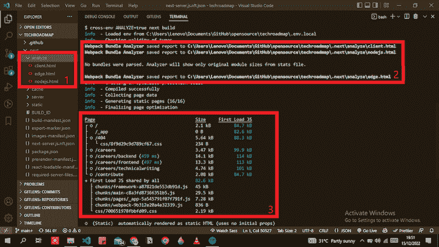
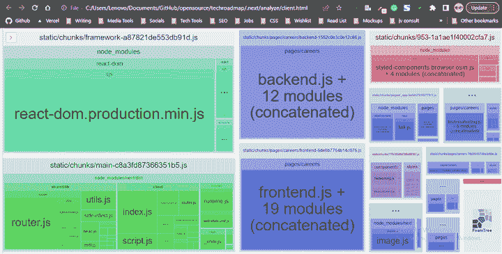
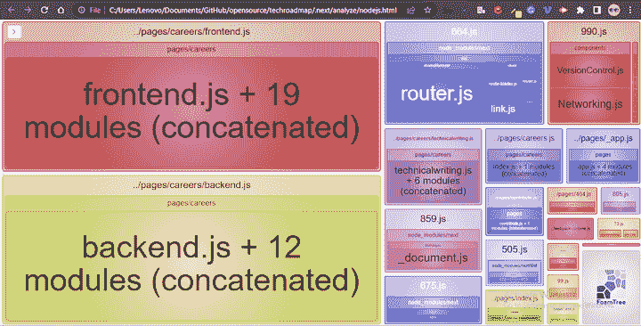
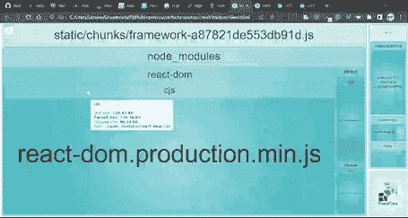
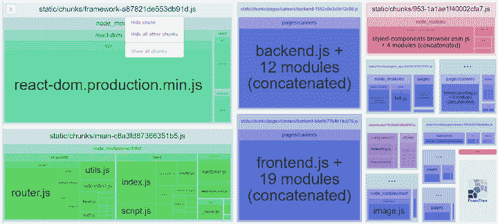
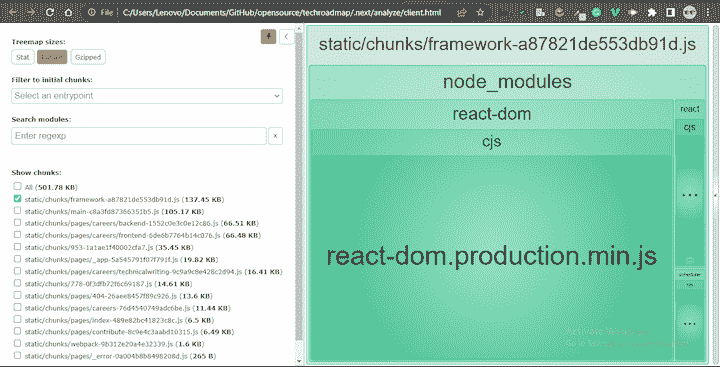
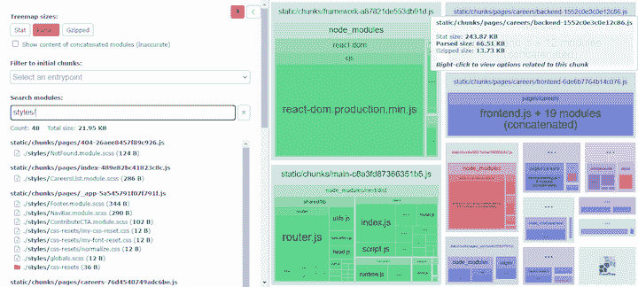
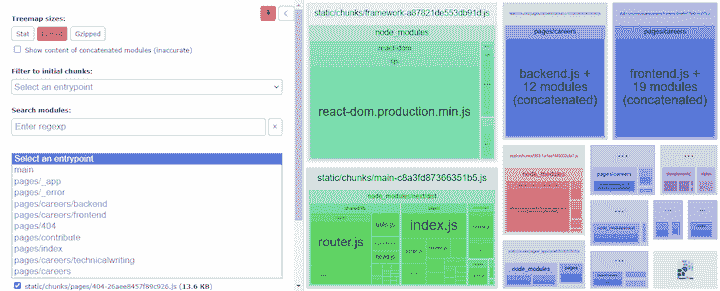
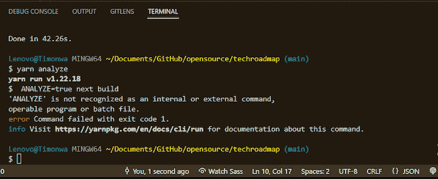

# 如何分析你的 Next.js 应用捆绑包

> 原文：<https://blog.logrocket.com/how-analyze-next-js-app-bundles/>

任何 web 应用程序的一个重要方面是其代码库的大小和性能。Next.js 是一个流行的 JavaScript 框架，用于构建服务器渲染和静态导出的 React 应用程序。

Next.js 提供了自动优化应用程序代码并最小化其包大小的能力。这可以减少需要传输到客户端的数据量，从而提高性能。然而，定期分析你的 Next.js 应用程序包有助于确保它尽可能优化，也有助于确定潜在的改进领域。

在本文中，我们将讨论什么是 Next.js 应用包，以及 bundle analyzer 工具是如何工作的。我们还将演示如何使用@next/bundle analyzer 包来检查您的 Next.js 应用程序包，并通过确保它们尽可能小且高效来提高它们的性能。

*向前跳转:*

## 什么是 Next.js 应用捆绑包？

当您构建 Next.js 应用程序时，代码被组织成称为模块的小单元。这些模块被流行的 JavaScript 模块捆绑器 webpack 捆绑在一起，形成一个称为 bundle 的文件。然后，这个包被提供给客户机的浏览器，执行浏览器来呈现应用程序。

随着 web 应用程序变得越来越复杂，功能越来越丰富，其代码库的规模会显著增长。这可能会导致加载速度变慢，这会让用户感到沮丧，并对应用程序的性能产生负面影响。

此外，较大的代码库通常更难维护，从而更难识别和修复错误。通过分析您的应用程序包，您可以确定可以优化代码的领域，以减少代码大小并提高性能。

[有几个捆绑器](https://blog.logrocket.com/benchmarking-bundlers-2020-rollup-parcel-webpack/)，但是本文将重点介绍使用最流行的捆绑工具之一，基于 webpack 的 [@next/bundle-analyzer 包](https://www.npmjs.com/package/@next/bundle-analyzer)。

## 什么是@next/bundle-analyzer？

@next/bundle-analyzer 包是 Next.js 框架的一个插件，允许您分析应用程序包的大小和组成。通过识别大的或不必要的代码块，您可以减少整体的包大小，这有助于优化您的 Next.js 应用程序的性能。

bundle-analyzer 插件会生成一个可视化报告，提供有关应用包的大小和内容的信息，从而更容易确定需要优化的区域。@next/bundle-analyzer 会生成一个静态 HTML 文件，其中包含有关您的应用程序代码库的详细报告，包括有关每个组件及其依赖项的大小的信息。

## 安装@next/bundle-analyzer 包

要使用@next/bundle-analyzer 包，必须将其安装到现有的 Next.js 项目中。对于本教程，我将使用我的开源项目 [Tech Career Roadmap](https://www.techroadmap.xyz/) 作为 Next.js 示例项目。

首先，用 npm 或 Yarn 安装软件包:

```
# npm
npm install --save-dev @next/bundle-analyzer cross-env
# Yarn
yarn add -D @next/bundle-analyzer cross-env

```

你会注意到我还安装了`cross-env`；我们将在本文的后面使用这个包来设置一个环境变量。`cross-env`包将允许我们在运行`package.json`文件中的脚本时设置环境变量，而不会出现任何错误，不管我们的平台特定的语法或操作系统如何。

## 配置 Next.js 应用程序

安装完软件包后，您可以通过将以下代码添加到您的`next.config.js`文件中来启用 bundle analyzer:

```
const withBundleAnalyzer = require('@next/bundle-analyzer')({
  enabled: process.env.ANALYZE === 'true',
})
module.exports = withBundleAnalyzer({
  // your Next.js configuration
})
```

## 分析 Next.js 应用包

要对您的应用程序包进行分析，您需要在开发模式下启动 Next.js 应用程序，将`ANALYZE`环境变量设置为`true`。然后，运行以下命令查看分析:

```
ANALYZE=true npm run build

```

该命令将自动:

1.  在根目录下的`.next`文件夹中创建一个`analyze`文件夹，并创建三个文件:`client.html`、`nodejs.html`和`edge.html`
2.  在浏览器中打开这三个文件；`client.html`文件代表客户端，`nodejs.html`文件代表服务器端。在撰写本文时，还没有为`Edge.html`页面提供数据。它可能会代表 edge APIs，但是我们无法从软件包的维护者那里得到确认
3.  在您的终端中提供捆绑包分析信息

在 bundle analyzer 运行之后，您可以开始检查您的 bundle:



## 检查 Next.js 应用程序包

@next/bundle-analyzer 包提供了几种检查包的方法:通过终端、通过浏览器和使用侧栏过滤器。让我们来看看。

### 通过终端

在上面显示终端输出的图像中，有一个显示页面、大小和首次加载 JS 的表格。页面标题下是 Next.js 应用程序中所有页面的列表，以及来自第一个 Load JS 包的块。

第一个加载 JS 包是应用程序页面在初始加载时共享或使用的所有代码。在 Size 标题下，包显示每个页面、包和组成包的块的文件大小。

在第一个加载 JS **，**下，你可以看到页面的最终尺寸或者在第一个加载 JS 被添加之后。第一次加载 JS 大小也是初始加载时页面的初始大小。

Next.js 也对这些尺寸进行颜色编码。绿色告诉我们尺寸小还可以，红色表示尺寸太大。如果您的第一个 Load JS 包的大小显示为红色，请尝试减小它，直到它显示为绿色，因为包的大小也会影响所有页面的大小和状态。

### 通过浏览器

要在浏览器中检查应用包，只需进入浏览器，查看分析器为您打开的两个页面。

第一页`client.html`显示了客户端的所有包:



第二页`nodejs.html`显示了服务器端的所有包:



如果您的应用程序页面没有自动加载，或者您已经关闭了浏览器，只需进入`analyze`文件夹，右键单击任何文件名，以便在浏览器中打开它们。

接下来，只需将鼠标悬停在任何一个包上即可查看其统计信息。您将能够看到每个包**、**的 Stat 大小、解析大小和 Gzipped 大小，以及包的文件路径。

以下是尺寸类型的更多细节:

*   Stat size:提供给客户机的 JavaScript 包的大小；这是客户端的网络浏览器为运行应用程序而必须下载和执行的 JavaScript 代码的大小
*   解析大小:在 web 浏览器对包进行解析后，包的大小；这是 JavaScript 代码在执行代码后在 web 浏览器中占用的内存量
*   Gzipped size:使用 Gzip 算法压缩时 JavaScript 包的大小；这是客户端的网络浏览器运行应用程序必须下载的数据量。Gzip 是一种常用的压缩算法，用于减小 JavaScript 文件等 web 资源的大小。它可以显著减少通过网络传输的数据量

通过浏览器中的 analyzer 页面，您将能够根据它们的大小类型看到哪些包占用了最多的空间。此外，这些包是根据它们的文件大小排列的:



您还可以右键单击根包来查看与该块相关的选项。您可以点击**隐藏块**隐藏该特定块并查看其余块，点击**隐藏所有其他块**隐藏除您点击的块之外的所有其他块，或者点击**显示所有块**显示当前隐藏的所有块:



与您的包进行交互和检查的另一种方式是使用侧边栏过滤器。在侧边栏中，您可以指定想要查看的特定包或一组包。

这种方法对于快速可视化和检查较小的包很有用。您还可以选择根据大小类型对它们进行排序:Stat、Parsed 或 Gzipped:



您可以使用应用程序中的特定文件、文件夹或短语来搜索模块；分析器将根据您的搜索输入显示结果:



或者，您可以选择初始块的入口点(即您的应用程序的任何页面):



## 创建分析命令/脚本

为了节省时间，您还可以创建一个快速命令/脚本，在 package.json 文件中运行。通过这样做，您可以避免在每次调用时设置环境变量。

在您的`package.json`文件中，添加以下脚本:

```
"scripts": {
    …
    "analyze": "cross-env ANALYZE=true next build"
},
```

正如我之前提到的，`cross-env`允许我们在`package.json` 文件中设置环境变量。在这种情况下，我们将`ANALYZE`设置为`true`。如果您使用的是 Windows 操作系统，并且没有安装`cross-env`，那么在运行上面的脚本时，您会得到如下所示的错误:



现在，让我们通过运行以下命令之一来测试我们的代码:

```
# npm
npm run analyze
# Yarn
yarn analyze

```

运行以上任一命令都会导致与运行以下命令相同的操作:

```
ANALYZE=true npm run build

```

## 结论

在本文中，我们讨论了什么是 Next.js 包，并研究了包的大小如何影响网站性能。我们还演示了如何使用@next/bundle-analyzer 包来分析和检查 Next.js 应用程序中的包。我们看到了如何在终端和浏览器中检查包，以及如何使用工具的侧边栏过滤器。

## [LogRocket](https://lp.logrocket.com/blg/nextjs-signup) :全面了解生产 Next.js 应用

调试下一个应用程序可能会很困难，尤其是当用户遇到难以重现的问题时。如果您对监视和跟踪状态、自动显示 JavaScript 错误、跟踪缓慢的网络请求和组件加载时间感兴趣，

[try LogRocket](https://lp.logrocket.com/blg/nextjs-signup)

.

[](https://lp.logrocket.com/blg/nextjs-signup)[](https://lp.logrocket.com/blg/nextjs-signup)

LogRocket 就像是网络和移动应用的 DVR，记录下你的 Next.js 应用上发生的一切。您可以汇总并报告问题发生时应用程序的状态，而不是猜测问题发生的原因。LogRocket 还可以监控应用程序的性能，报告客户端 CPU 负载、客户端内存使用等指标。

LogRocket Redux 中间件包为您的用户会话增加了一层额外的可见性。LogRocket 记录 Redux 存储中的所有操作和状态。

让您调试 Next.js 应用的方式现代化— [开始免费监控](https://lp.logrocket.com/blg/nextjs-signup)。